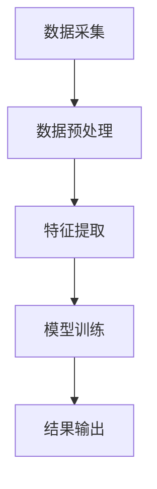
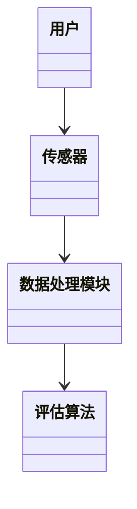

                 


# {{企业估值中的脑机接口远程操控系统评估}}

> 关键词：脑机接口, 企业估值, 远程操控, 系统评估, 人工智能, 神经科学, 技术应用

> 摘要：本文深入探讨了脑机接口技术在企业估值中的应用，特别是远程操控系统评估的方法和实现。通过系统化的分析和设计，结合实际案例和代码实现，详细阐述了脑机接口在企业估值中的潜力和挑战，为相关领域的研究和实践提供了理论依据和实践指导。

## 第一章: 脑机接口远程操控系统背景介绍

### 1.1 问题背景
#### 1.1.1 企业估值的传统方法与局限性
传统的企业估值方法如DCF模型、市盈率法等在实际应用中面临数据获取困难、模型假设过于理想化等问题，难以准确反映企业的实际价值。

#### 1.1.2 远程操控系统在企业估值中的应用需求
随着企业规模的扩大和业务的复杂化，远程监控和操控企业运营数据的需求日益增长，尤其是在实时监控财务指标、市场动态等方面。

#### 1.1.3 脑机接口技术的引入与潜力
脑机接口技术能够直接采集和分析大脑活动，为实时监控和操控企业数据提供了新的可能性。

### 1.2 问题描述
#### 1.2.1 远程操控系统评估的核心问题
如何利用脑机接口技术实现对企业关键指标的实时监控和干预，同时确保系统的准确性和可靠性。

#### 1.2.2 脑机接口技术在企业估值中的具体应用场景
通过脑机接口技术，可以实时监测企业管理者的决策过程，分析其对市场变化的反应，进而评估企业价值。

#### 1.2.3 系统评估的关键挑战与解决方案
数据采集的准确性、系统的实时性以及数据处理的复杂性是主要挑战，解决方案包括优化数据采集算法、提高处理速度等。

### 1.3 问题解决
#### 1.3.1 脑机接口技术如何解决企业估值问题
通过分析脑电活动，提取与企业估值相关的特征，辅助传统估值方法，提高评估的准确性和实时性。

#### 1.3.2 远程操控系统的实现路径
通过采集、处理、分析和反馈四个步骤，实现对企业关键指标的实时监控和干预。

#### 1.3.3 系统评估的实现方法与流程
包括数据采集、特征提取、模型训练、系统集成和效果评估等步骤，确保系统的实用性和可靠性。

### 1.4 边界与外延
#### 1.4.1 系统评估的边界条件
明确系统的适用范围和限制，如仅适用于特定类型的企业或特定的估值场景。

#### 1.4.2 系统外延与相关技术的关联
探讨脑机接口技术与其他相关技术（如大数据分析、人工智能）的结合，拓宽应用范围。

#### 1.4.3 系统评估的适用范围与限制
总结系统在不同企业规模、行业中的适用性及其局限性，为后续研究提供方向。

### 1.5 概念结构与核心要素
#### 1.5.1 系统评估的概念模型
构建包括数据采集、处理、分析和反馈的概念模型，明确各部分的相互关系。

#### 1.5.2 核心要素的定义与关系
详细定义脑机接口、远程操控系统、企业估值等核心要素，并分析它们之间的相互作用。

#### 1.5.3 系统评估的流程与步骤
系统地描述从数据采集到最终评估的整个流程，确保各步骤的逻辑性和可行性。

### 1.6 本章小结
总结本章内容，强调脑机接口技术在企业估值中的潜力和重要性，为后续章节的深入分析奠定基础。

---

## 第二章: 脑机接口远程操控系统的核心概念与联系

### 2.1 核心概念原理
#### 2.1.1 脑机接口的基本原理
介绍脑机接口的工作原理，包括信号采集、处理和解码的基本步骤。

#### 2.1.2 远程操控系统的实现原理
阐述远程操控系统的构成，包括硬件设备、数据传输和控制接口。

#### 2.1.3 系统评估的核心算法原理
分析评估算法的基本原理，如特征提取、分类器设计等。

### 2.2 概念属性特征对比表格
| 概念       | 特征1 | 特征2 | 特征3 |
|------------|-------|-------|-------|
| 脑机接口   | 非侵入性 | 实时性 | 高准确性 |
| 远程操控系统 | 可扩展性 | 易用性 | 高安全性 |

#### 2.2.1 脑机接口与传统操控方式的对比
从准确性、实时性、用户体验等方面比较脑机接口与传统操控方式的优劣。

#### 2.2.2 远程操控系统与本地操控系统的对比
分析远程操控在数据传输延迟、系统响应速度等方面的特点。

#### 2.2.3 系统评估方法的对比
比较基于脑机接口的评估方法与传统统计方法在数据来源、处理方式和评估结果等方面的差异。

### 2.3 ER实体关系图架构
```mermaid
erd
  脑机接口系统 <-----> 用户
  脑机接口系统 <-----> 传感器
  脑机接口系统 <-----> 数据处理模块
  脑机接口系统 <-----> 评估算法
```
#### 2.3.1 实体关系图的定义
解释各实体之间的关联关系，如用户通过传感器与系统交互，数据处理模块接收并处理传感器数据，评估算法基于处理后的数据生成评估结果。

#### 2.3.2 实体关系图的绘制
使用mermaid语法绘制实体关系图，明确各组件的交互流程。

#### 2.3.3 实体关系图的解释与应用
说明实体关系图在系统设计和优化中的应用价值，帮助理解系统的整体架构。

### 2.4 本章小结
总结核心概念及其相互关系，强调各部分在系统评估中的作用，为后续章节的算法实现和系统设计提供理论支持。

---

## 第三章: 脑机接口远程操控系统的算法原理

### 3.1 算法原理概述
#### 3.1.1 算法的基本原理
详细解释评估算法的工作流程，包括数据预处理、特征提取、模型训练和结果输出。

#### 3.1.2 算法的核心步骤
包括数据采集、去噪处理、特征选择、模型训练和结果分析等关键步骤。

#### 3.1.3 算法的实现流程
从数据输入到结果输出的完整流程，确保算法的逻辑清晰且易于实现。

### 3.2 算法流程图

#### 3.2.1 算法流程图的绘制
使用mermaid语法绘制算法流程图，直观展示各步骤之间的关系。

#### 3.2.2 算法流程图的解释
详细解释每个步骤的功能及其在整体流程中的作用。

#### 3.2.3 算法流程图的应用
说明流程图在算法优化和系统设计中的应用，帮助读者更好地理解和实现算法。

### 3.3 算法的数学模型与公式
#### 3.3.1 算法的数学模型
介绍评估算法的数学模型，如支持向量机（SVM）或神经网络模型。

#### 3.3.2 算法的公式推导
详细推导关键公式的来源和意义，例如：
$$ y = f(x) $$
其中，$x$ 是输入特征向量，$y$ 是输出的评估结果。

#### 3.3.3 算法的实现细节
结合具体代码示例，说明如何实现这些数学模型，例如使用Python的scikit-learn库进行模型训练。

### 3.4 本章小结
总结算法的基本原理和实现步骤，强调数学模型和流程图在算法实现中的重要性，为后续章节的系统设计提供支持。

---

## 第四章: 脑机接口远程操控系统的系统分析与架构设计

### 4.1 系统分析
#### 4.1.1 问题场景介绍
描述实际的应用场景，如企业高管在决策过程中的脑电活动监测。

#### 4.1.2 项目介绍
概述整个项目的背景、目标和主要任务。

### 4.2 系统功能设计
#### 4.2.1 领域模型类图

#### 4.2.2 系统功能模块的交互流程
描述各功能模块之间的交互流程，确保系统功能的完整性和逻辑性。

### 4.3 系统架构设计
#### 4.3.1 系统架构图

#### 4.3.2 系统架构设计图
详细描述系统架构的设计，包括各层的功能分配和交互方式。

### 4.4 系统接口设计
#### 4.4.1 系统接口的定义
明确系统各接口的功能和调用方式，确保系统的可扩展性和维护性。

#### 4.4.2 系统接口的实现
通过代码示例说明如何实现这些接口，例如使用RESTful API进行数据传输。

### 4.5 系统交互设计
#### 4.5.1 系统交互流程
绘制系统交互流程图，展示用户与系统之间的交互过程。

#### 4.5.2 交互设计的优化
通过优化交互流程，提升系统的用户体验和运行效率。

### 4.6 本章小结
总结系统分析与架构设计的主要内容，强调系统设计在实现脑机接口远程操控系统中的重要性。

---

## 第五章: 脑机接口远程操控系统的项目实战

### 5.1 项目实战环境安装
#### 5.1.1 环境要求
列出项目实战所需的硬件和软件环境，例如需要特定版本的Python和相关库。

#### 5.1.2 环境配置
详细说明如何配置开发环境，包括安装必要的库和工具。

### 5.2 系统核心实现
#### 5.2.1 核心功能模块实现
通过代码示例说明如何实现数据采集、处理和评估算法的核心功能。

#### 5.2.2 核心代码实现
提供关键代码片段，例如：
```python
def process_data(data):
    # 数据处理逻辑
    return processed_data
```
### 5.3 代码应用解读与分析
#### 5.3.1 代码功能分析
详细解读关键代码的功能和作用，帮助读者理解系统的实现细节。

#### 5.3.2 代码实现的优化
通过优化代码，提升系统的运行效率和可维护性。

### 5.4 实际案例分析
#### 5.4.1 实际案例介绍
选择一个实际案例，详细描述其背景和目标。

#### 5.4.2 案例分析与实现
通过代码实现案例的分析和评估，展示系统的实际应用价值。

### 5.5 项目小结
总结项目实战的主要成果和经验，强调实际操作中的关键点和注意事项。

---

## 第六章: 脑机接口远程操控系统的最佳实践

### 6.1 最佳实践 Tips
#### 6.1.1 系统设计的优化建议
提供系统设计和实现中的优化建议，如选择合适的算法和工具。

#### 6.1.2 系统维护与升级
讨论系统维护和升级的策略，确保系统的长期稳定运行。

### 6.2 小结
总结整个系统的优缺点，强调在实际应用中的注意事项和未来的发展方向。

### 6.3 注意事项
提醒读者在实际操作中需要注意的关键点，如数据隐私保护、系统稳定性等。

### 6.4 拓展阅读
推荐相关的阅读材料和资源，帮助读者进一步深入学习和研究。

---

## 第七章: 结语

### 7.1 总结
回顾全文，总结脑机接口技术在企业估值中的应用及其远程操控系统的评估方法。

### 7.2 展望
展望未来的研究方向和应用前景，激励读者进一步探索和实践。

---

## 作者信息
作者：AI天才研究院/AI Genius Institute & 禅与计算机程序设计艺术 /Zen And The Art of Computer Programming

