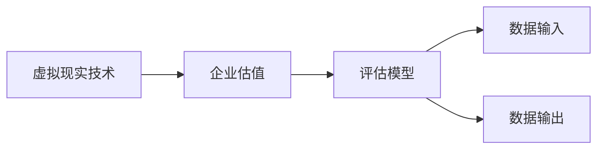

                 


# 企业估值中的虚拟现实技术评估

## 关键词：企业估值、虚拟现实、技术评估、算法原理、系统架构、项目实战

## 摘要：  
在现代企业估值中，虚拟现实技术的应用正在变得越来越重要。本文将从虚拟现实技术的基本概念出发，深入探讨其在企业估值中的应用场景、算法原理、系统架构设计以及实际案例分析。通过结合数学模型和系统设计，本文旨在为企业估值提供一种基于虚拟现实技术的新视角，同时为技术开发者和企业管理者提供实用的参考和指导。

---

# 第一部分：企业估值中的虚拟现实技术评估概述

## 第1章：虚拟现实技术与企业估值的背景介绍

### 1.1 虚拟现实技术的基本概念  
#### 1.1.1 虚拟现实技术的定义  
虚拟现实（Virtual Reality，VR）是一种通过计算机技术模拟三维环境的技术，用户可以通过特制的设备（如头戴显示器、手柄等）与虚拟环境进行交互。  

#### 1.1.2 虚拟现实技术的核心要素  
- **硬件设备**：如VR头显、手柄、追踪器等。  
- **软件平台**：如Unity、Unreal Engine等。  
- **交互方式**：包括视觉、听觉、触觉等多种感官的交互。  

#### 1.1.3 虚拟现实技术的演进历程  
从早期的军事应用到如今的游戏、教育、医疗等领域的广泛应用，虚拟现实技术经历了从简单到复杂的演变。  

### 1.2 企业估值的基本概念  
#### 1.2.1 企业估值的定义  
企业估值是指通过对企业的财务数据、市场环境、管理团队等因素进行综合分析，估算企业价值的过程。  

#### 1.2.2 企业估值的主要方法  
- **DCF模型**：现金流折现法。  
- **相对估值法**：基于可比公司的市盈率、市净率等指标进行估值。  
- **资产重置法**：基于企业资产的重置成本进行估值。  

#### 1.2.3 企业估值的挑战与机遇  
- **挑战**：数据的不确定性、模型的复杂性、市场的波动性。  
- **机遇**：技术的进步（如AI、大数据）为企业估值提供了新的工具和方法。  

### 1.3 虚拟现实技术在企业估值中的应用背景  
#### 1.3.1 虚拟现实技术与企业估值的结合点  
虚拟现实技术可以提供沉浸式的体验，帮助企业在虚拟环境中模拟经营场景，从而辅助估值。  

#### 1.3.2 虚拟现实技术在企业估值中的潜在价值  
- 提供直观的可视化工具，帮助理解复杂的财务数据。  
- 通过模拟不同场景，评估企业的潜在风险和收益。  

#### 1.3.3 企业估值中的虚拟现实技术应用现状  
目前，虚拟现实技术在企业估值中的应用还处于探索阶段，但已经有一些成功的案例。  

### 1.4 本章小结  
本章介绍了虚拟现实技术的基本概念和企业估值的主要方法，分析了两者结合的可能性和潜在价值。

---

## 第2章：虚拟现实技术与企业估值的核心概念与联系

### 2.1 虚拟现实技术的核心原理  
#### 2.1.1 虚拟现实技术的实现原理  
虚拟现实技术通过计算机生成虚拟环境，并通过硬件设备实现人与虚拟环境的交互。  

#### 2.1.2 虚拟现实技术的关键技术  
- **图形渲染技术**：如光栅化和光线追踪。  
- **交互技术**：如手势识别、语音识别。  
- **定位追踪技术**：如惯性测量单元（IMU）、激光定位。  

#### 2.1.3 虚拟现实技术的分类与特点  
- **沉浸式VR**：完全沉浸于虚拟环境。  
- **桌面式VR**：非沉浸式体验。  
- **增强现实（AR）**：将虚拟元素叠加在真实环境中。  

### 2.2 企业估值中的虚拟现实技术评估模型  
#### 2.2.1 评估模型的构建逻辑  
- 确定评估目标：如企业盈利能力、市场竞争力。  
- 收集数据：如财务数据、市场数据、用户反馈。  
- 构建模型：通过算法将数据转化为可量化的评估结果。  

#### 2.2.2 评估模型的核心要素  
- **输入数据**：如企业财务数据、市场数据。  
- **算法选择**：如机器学习算法、统计模型。  
- **输出结果**：如企业估值、风险评估。  

#### 2.2.3 评估模型的数学表达式  
$$ V = \alpha \cdot EBITDA + \beta \cdot (EV/EBITDA) + \gamma \cdot (EV/Sales) $$  
其中，$\alpha$、$\beta$、$\gamma$为权重系数，$EBITDA$为息税折旧及摊销前利润，$EV$为企业价值。  

### 2.3 虚拟现实技术与企业估值的实体关系图  


### 2.4 本章小结  
本章分析了虚拟现实技术的核心原理，并提出了基于虚拟现实技术的企业估值模型，构建了实体关系图。

---

## 第3章：虚拟现实技术评估的算法原理讲解

### 3.1 虚拟现实技术评估的核心算法  
#### 3.1.1 算法的输入与输出  
- **输入**：企业的财务数据、市场数据、用户反馈。  
- **输出**：企业估值、风险评估、优化建议。  

#### 3.1.2 算法的实现步骤  
1. 数据预处理：清洗和归一化。  
2. 模型训练：使用机器学习算法（如随机森林、神经网络）。  
3. 模型评估：通过交叉验证评估模型性能。  
4. 模型优化：调整参数以提高预测精度。  

#### 3.1.3 算法的优化方法  
- **参数调优**：如网格搜索、随机搜索。  
- **特征选择**：如Lasso回归、主成分分析（PCA）。  
- **集成学习**：如梯度提升树（GBDT）、堆叠模型。  

### 3.2 算法的数学模型与公式  
#### 3.2.1 评估模型的数学表达式  
$$ V = \sum_{i=1}^{n} w_i x_i $$  
其中，$w_i$为特征$x_i$的权重，$n$为特征总数。  

#### 3.2.2 算法的收敛性分析  
- **收敛性**：算法在多次迭代后趋于稳定。  
- **收敛速度**：与算法的优化策略和学习率相关。  

#### 3.2.3 算法的复杂度分析  
- **时间复杂度**：模型训练的时间与数据量和特征数成正比。  
- **空间复杂度**：与数据存储需求和模型参数数量相关。  

### 3.3 算法的实现与代码示例  
#### 3.3.1 代码实现  
```python
import pandas as pd
from sklearn.ensemble import RandomForestRegressor
from sklearn.metrics import mean_squared_error

# 数据加载
data = pd.read_csv('entreprise.csv')

# 特征与标签分离
X = data.drop('value', axis=1)
y = data['value']

# 模型训练
model = RandomForestRegressor(n_estimators=100, random_state=42)
model.fit(X, y)

# 模型预测
y_pred = model.predict(X)

# 模型评估
 mse = mean_squared_error(y, y_pred)
 print(f"均方误差：{mse}")
```

#### 3.3.2 代码解读  
- 数据加载：从CSV文件中读取企业数据。  
- 特征与标签分离：将数据分为特征矩阵和目标变量。  
- 模型训练：使用随机森林算法训练模型。  
- 模型预测：对训练数据进行预测。  
- 模型评估：计算均方误差，评估模型性能。  

### 3.4 本章小结  
本章详细讲解了虚拟现实技术评估的核心算法，并通过代码示例展示了算法的实现过程。

---

## 第4章：虚拟现实技术评估的系统分析与架构设计方案

### 4.1 系统分析与需求分析  
#### 4.1.1 系统目标  
构建一个基于虚拟现实技术的企业估值系统，实现对企业价值的沉浸式评估。  

#### 4.1.2 系统功能需求  
- 数据输入与处理：支持多种数据格式的导入。  
- 模型训练：支持多种算法的训练与优化。  
- 可视化展示：提供沉浸式虚拟环境的展示界面。  

#### 4.1.3 系统性能需求  
- 响应时间：秒级响应。  
- 处理能力：支持大规模数据处理。  

### 4.2 系统架构设计  
#### 4.2.1 系统架构图  


#### 4.2.2 系统功能模块划分  
- **前端界面**：用户交互界面，支持VR设备的接入。  
- **数据处理层**：数据清洗、归一化处理。  
- **算法引擎**：模型训练、预测与优化。  
- **数据库**：存储企业数据和评估结果。  

### 4.3 系统功能设计  
#### 4.3.1 功能模块划分  
- 数据输入模块：用户上传企业数据。  
- 模型训练模块：训练企业估值模型。  
- 结果展示模块：显示评估结果和可视化界面。  

#### 4.3.2 功能模块的交互流程  
1. 用户上传数据。  
2. 系统对数据进行预处理。  
3. 算法引擎训练模型。  
4. 系统生成评估结果并展示。  

#### 4.3.3 功能模块的实现细节  
- 数据预处理：使用Pandas库进行数据清洗和归一化。  
- 模型训练：使用Scikit-learn库训练机器学习模型。  
- 结果展示：使用WebGL技术在虚拟环境中展示评估结果。  

### 4.4 本章小结  
本章分析了基于虚拟现实技术的企业估值系统的架构设计，并详细描述了系统的功能模块和交互流程。

---

## 第5章：虚拟现实技术评估的项目实战

### 5.1 项目介绍  
#### 5.1.1 项目背景  
某科技公司希望通过虚拟现实技术评估其市场竞争力和企业价值。  

#### 5.1.2 项目目标  
构建一个基于虚拟现实技术的企业估值系统，帮助企业进行精准估值。  

### 5.2 系统核心实现  
#### 5.2.1 环境安装  
- **开发环境**：Python 3.8+、Jupyter Notebook。  
- **依赖库安装**：Pandas、Scikit-learn、WebGL库。  

#### 5.2.2 核心代码实现  
```python
import pandas as pd
from sklearn.ensemble import RandomForestRegressor
from sklearn.metrics import mean_squared_error

# 数据加载
data = pd.read_csv('entreprise.csv')

# 特征与标签分离
X = data.drop('value', axis=1)
y = data['value']

# 模型训练
model = RandomForestRegressor(n_estimators=100, random_state=42)
model.fit(X, y)

# 模型预测
y_pred = model.predict(X)

# 模型评估
mse = mean_squared_error(y, y_pred)
print(f"均方误差：{mse}")
```

#### 5.2.3 代码应用解读  
- 数据加载：从CSV文件中读取企业数据。  
- 特征与标签分离：将数据分为特征矩阵和目标变量。  
- 模型训练：使用随机森林算法训练模型。  
- 模型预测：对训练数据进行预测。  
- 模型评估：计算均方误差，评估模型性能。  

### 5.3 实际案例分析  
#### 5.3.1 案例背景  
某科技公司希望评估其市场竞争力和企业价值。  

#### 5.3.2 案例分析  
- 数据收集：包括财务数据、市场数据、用户反馈。  
- 模型训练：使用随机森林算法训练企业估值模型。  
- 结果展示：在虚拟环境中展示评估结果。  

#### 5.3.3 案例小结  
通过虚拟现实技术，企业可以更直观地理解其估值结果，并根据结果制定战略决策。  

### 5.4 本章小结  
本章通过实际案例展示了虚拟现实技术在企业估值中的应用，并详细解读了系统的实现过程。

---

## 第6章：虚拟现实技术评估中的最佳实践与注意事项

### 6.1 最佳实践  
#### 6.1.1 数据质量管理  
- 数据清洗：确保数据的准确性和完整性。  
- 数据标注：为数据添加必要的标签和注释。  

#### 6.1.2 模型优化策略  
- 参数调优：通过网格搜索优化模型参数。  
- 特征选择：使用Lasso回归或PCA进行特征选择。  

#### 6.1.3 系统设计建议  
- 系统模块化设计：便于后续的扩展和维护。  
- 系统安全性设计：保护企业数据的安全。  

### 6.2 注意事项  
#### 6.2.1 数据隐私问题  
- 确保企业数据的隐私和安全。  
- 遵守相关法律法规。  

#### 6.2.2 系统兼容性问题  
- 确保系统兼容多种硬件设备。  
- 支持多种操作系统和浏览器。  

#### 6.2.3 用户体验优化  
- 提供直观的用户界面。  
- 提供详细的使用说明和培训。  

### 6.3 拓展阅读  
- 推荐阅读《企业估值的高级方法》和《虚拟现实技术的最新发展》。  

### 6.4 本章小结  
本章总结了虚拟现实技术评估中的最佳实践和注意事项，为读者提供了实用的指导。

---

## 作者：AI天才研究院/AI Genius Institute & 禅与计算机程序设计艺术 /Zen And The Art of Computer Programming

---

**注**：以上目录大纲和文章内容仅为示例，具体内容可根据实际需求进行调整和补充。

