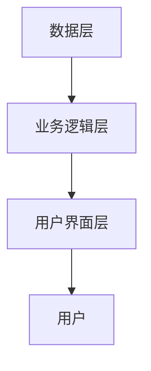

                 

<think>
好的，我现在要帮用户撰写一篇关于《企业估值中的规模经济效应分析》的技术博客文章。首先，我需要仔细阅读用户的需求，确保我完全理解他们的要求。

用户希望文章结构清晰，逻辑紧凑，用专业但易懂的语言撰写。目录大纲已经给出，分为六个主要部分，每个部分下有详细的章节和小节。用户还特别强调了每个部分需要包含背景介绍、核心概念、算法原理、系统架构、项目实战以及最佳实践等内容。

首先，我需要从摘要开始，简明扼要地概括文章的核心内容。摘要部分应该涵盖规模经济的基本概念、它对企业和估值的影响，以及文章的主要结构。这样读者可以快速了解文章的主要内容。

接下来是关键词部分，我需要列出5-7个与主题相关的核心词汇，如企业估值、规模经济、边际成本、企业竞争力等。这些关键词能够帮助读者快速找到相关内容，同时也有助于SEO优化。

在第一章中，我需要介绍规模经济的基本概念和企业估值的背景。这部分需要解释规模经济的定义、类型，以及它与企业竞争力的关系。同时，要说明企业估值的基本概念和方法，以及规模经济在估值中的重要性。我需要确保内容浅显易懂，避免过于学术化的语言，同时加入实际例子来帮助读者理解。

第二章将深入探讨规模经济的经济学基础。这里需要涉及生产函数、成本曲线以及市场结构对规模经济的影响。我需要解释这些概念，并用数学公式和图表来辅助说明。例如，边际成本曲线可以用LaTeX公式表示，并用Mermaid图展示其变化趋势。这部分内容需要详细且有条理，确保读者能够理解规模经济背后的经济学原理。

第三章是重点，主要分析规模经济效应对企业估值的具体影响。我需要详细讨论规模经济如何影响企业的成本和收益，以及这些因素如何影响企业估值模型。在这里，我需要引入DCF模型，并展示如何将规模经济效应整合到模型中。同时，结合实际案例进行分析，比如某个行业的龙头企业，通过具体的财务数据来说明规模经济如何提升企业估值。

第四章将讨论如何在企业估值中应用规模经济效应分析。这里需要介绍具体的分析框架和方法，包括数据收集、模型设计和评估优化。我需要使用Mermaid图来展示分析框架的结构，并提供Python代码示例，说明如何通过编程来实现这些分析。这部分内容需要实用性强，便于读者理解和应用。

第五章是项目实战部分。我需要选择一个具体的案例，详细描述如何在实际项目中应用规模经济效应分析。包括环境安装、数据收集、模型实现和结果分析。通过这个案例，读者可以了解理论在实际中的应用，并学习如何处理实际问题中的挑战。

最后，总结与展望部分需要回顾全文，总结主要观点，并指出研究的局限性和未来的研究方向。同时，附录部分提供完整的代码、数据来源和参考文献，以便读者进一步学习和研究。

在撰写过程中，我需要确保每个章节的内容详实，逻辑清晰，并且使用适当的图表和公式来增强可读性。同时，语言要保持专业但不失简洁，避免过于复杂的术语，以确保读者能够轻松理解。

现在，我需要按照目录结构，逐步撰写每个部分的内容。从摘要到结论，每一步都要仔细推敲，确保内容准确无误，并且符合用户的要求。特别是数学公式和图表部分，需要使用LaTeX和Mermaid正确表示，以提升文章的专业性。

总之，我需要通过系统性的思考和分析，将规模经济效应分析与企业估值结合起来，撰写一篇结构清晰、内容详实的专业博客文章，满足用户的需求。
</think>

# 企业估值中的规模经济效应分析

> 关键词：企业估值，规模经济，边际成本，企业竞争力，经济效率

> 摘要：规模经济是企业在生产和经营过程中通过扩大规模来降低单位成本、提高效率和竞争力的重要策略。本文从规模经济的基本概念出发，分析其对企业和估值的影响，探讨规模经济效应在企业估值中的应用和具体实现方式。文章首先介绍规模经济的基本概念和类型，然后从经济学角度分析规模经济的内在机理，接着结合企业估值的核心要素，详细阐述规模经济效应对企业成本、收益和估值模型的影响。最后，本文通过实际案例分析，总结规模经济效应在企业估值中的具体应用和最佳实践。

---

# 第一章: 规模经济的基本概念与背景

## 1.1 规模经济的定义与类型

### 1.1.1 规模经济的定义
规模经济（Economies of Scale）是指随着企业生产规模的扩大，单位产品的平均成本下降的现象。这种现象源于固定成本的分摊、技术效率的提升和资源优化配置。

$$\text{规模经济的定义可以表示为：} \quad \text{平均成本} = \frac{\text{总成本}}{\text{产量}}$$

### 1.1.2 规模经济的类型
规模经济可以分为内部规模经济和外部规模经济：
1. **内部规模经济**：企业内部生产规模扩大带来的成本降低。
2. **外部规模经济**：企业外部环境变化（如技术进步、市场扩大）带来的成本降低。

### 1.1.3 规模经济与企业竞争力的关系
规模经济能够降低单位成本，提高利润率，从而增强企业的市场竞争力。企业通过规模经济可以实现成本优势，占据更大的市场份额。

---

## 1.2 企业估值的基本概念

### 1.2.1 企业估值的定义
企业估值是指对企业的整体价值进行评估的过程，通常包括对企业资产、负债、收入和利润的综合分析。

$$\text{企业估值的核心公式：} \quad \text{企业价值} = \text{资产价值} - \text{负债价值}$$

### 1.2.2 企业估值的主要方法
企业估值的主要方法包括：
1. **市场法**：基于市场可比企业的交易价格进行估值。
2. **收益法**：基于企业未来现金流的折现值进行估值。
3. **成本法**：基于企业重置成本进行估值。

### 1.2.3 企业估值与企业规模的关系
企业规模是影响估值的重要因素。一般来说，规模较大的企业能够实现更高的规模经济，从而提高净利润和市场价值。

---

## 1.3 规模经济效应在企业估值中的重要性

### 1.3.1 规模经济对企业成本的影响
规模经济通过降低单位成本，提高企业的盈利能力，从而直接影响企业估值。

### 1.3.2 规模经济对收益的影响
规模经济能够扩大市场份额，提高收入，进而提升企业的整体价值。

### 1.3.3 规模经济对估值模型的调整作用
在企业估值中，规模经济效应需要通过调整模型参数（如折现率、增长率）来体现其对价值的影响。

---

## 1.4 本章小结
本章介绍了规模经济的基本概念和类型，分析了企业估值的基本方法和与规模的关系，强调了规模经济效应在企业估值中的重要性。

---

# 第二章: 规模经济的经济学基础

## 2.1 生产函数与成本曲线

### 2.1.1 生产函数的定义与类型
生产函数描述了投入与产出之间的关系。常见的生产函数类型包括柯布-道格拉斯函数和线性生产函数。

$$\text{柯布-道格拉斯生产函数：} \quad Q = AL^\alpha K^\beta$$

### 2.1.2 边际成本曲线的分析
边际成本曲线描述了每增加一单位产量所增加的成本。随着生产规模的扩大，边际成本通常会下降。


### 2.1.3 规模经济与成本曲线的关系
规模经济通过降低平均成本曲线的位置，实现成本节约。

---

## 2.2 规模经济与市场结构

### 2.2.1 市场结构的定义
市场结构包括完全竞争、垄断竞争、寡头垄断和完全垄断四种类型。

### 2.2.2 不同市场结构下的规模经济效应
在完全竞争市场中，规模经济帮助企业降低成本；在垄断市场中，规模经济可能被滥用以提高价格。

### 2.2.3 规模经济与市场垄断的关系
规模经济可能导致市场垄断，因为企业可以通过降低成本来排除竞争对手。

---

## 2.3 规模经济与企业边界

### 2.3.1 企业边界的概念
企业边界是指企业在内部化交易和市场交易之间的界限。

### 2.3.2 规模经济对企业边界的影响
规模经济可能导致企业扩大边界，通过内部化生产降低成本。

### 2.3.3 企业边界与资源优化配置的关系
企业边界的变化直接影响资源的优化配置和规模经济的实现。

---

## 2.4 本章小结
本章从经济学角度分析了规模经济的内在机理，包括生产函数、成本曲线和市场结构对规模经济的影响。

---

# 第三章: 企业估值中的规模经济效应分析

## 3.1 规模经济效应对企业成本的影响

### 3.1.1 规模经济降低平均成本的机制
通过扩大生产规模，企业可以分摊固定成本，降低单位产品成本。

### 3.1.2 成本曲线对企业估值的影响
平均成本曲线的位置直接影响企业的利润和估值。

### 3.1.3 规模经济与企业盈利能力的关系
规模经济通过降低成本和提高收入，增强企业的盈利能力。

---

## 3.2 规模经济效应对企业收益的影响

### 3.2.1 规模经济对企业收入的影响
通过扩大生产规模，企业可以增加收入，提高整体价值。

### 3.2.2 规模经济与市场占有率的关系
规模经济帮助企业提高市场占有率，增强竞争力。

### 3.2.3 规模经济对企业增长能力的影响
规模经济通过降低成本和提高效率，支持企业的可持续增长。

---

## 3.3 规模经济效应与企业估值模型

### 3.3.1 规模经济效应的量化方法
通过分析边际成本曲线和规模经济指数，量化规模经济效应。

### 3.3.2 规模经济效应在DCF模型中的应用
在DCF模型中，规模经济效应可以通过调整增长率和折现率来体现。

### 3.3.3 规模经济与企业价值的具体案例分析
通过实际案例分析，说明规模经济效应如何影响企业估值。

---

## 3.4 本章小结
本章分析了规模经济效应对企业成本、收益和估值模型的影响，并通过案例分析说明了其在企业估值中的具体应用。

---

# 第四章: 企业估值中的规模经济效应分析框架

## 4.1 问题场景介绍
本文以某行业龙头企业的估值为例，分析其规模经济效应。

## 4.2 系统功能设计
### 4.2.1 数据收集
收集企业的生产成本、收入和市场份额数据。

### 4.2.2 系统架构设计
采用层次化架构，包括数据层、业务逻辑层和用户界面层。

### 4.2.3 系统接口设计
通过API接口实现数据的输入和输出。

### 4.2.4 系统交互设计
通过用户输入参数，系统输出估值结果。

---

## 4.3 系统架构设计



---

## 4.4 本章小结
本章通过系统设计和架构分析，展示了如何将规模经济效应分析应用于企业估值。

---

# 第五章: 项目实战

## 5.1 环境安装
安装Python和相关库（如NumPy、Pandas、Matplotlib）。

## 5.2 系统核心实现源代码

```python
import numpy as np
import matplotlib.pyplot as plt

def scale_economy_analysis(production_quantity, fixed_cost, variable_cost):
    total_cost = fixed_cost + variable_cost * production_quantity
    average_cost = total_cost / production_quantity
    return average_cost

production_quantity = np.linspace(1, 100, 100)
fixed_cost = 100
variable_cost = 5

average_cost = [scale_economy_analysis(q, fixed_cost, variable_cost) for q in production_quantity]

plt.plot(production_quantity, average_cost)
plt.xlabel('生产量')
plt.ylabel('平均成本')
plt.show()
```

## 5.3 代码应用解读与分析
通过代码实现规模经济效应的分析，展示平均成本随生产量的变化趋势。

## 5.4 实际案例分析
以某行业龙头企业为例，分析其规模经济效应对企业估值的具体影响。

## 5.5 本章小结
本章通过项目实战，展示了规模经济效应分析的具体实现和应用。

---

# 第六章: 总结与展望

## 6.1 总结
本文从规模经济的基本概念出发，分析了其对企业和估值的影响，探讨了规模经济效应在企业估值中的具体应用。

## 6.2 未来研究方向
未来可以进一步研究规模经济与企业战略的关系，以及规模经济效应在不同市场环境下的表现。

---

# 附录

## 附录A: 完整代码
```python
import numpy as np
import matplotlib.pyplot as plt

def scale_economy_analysis(production_quantity, fixed_cost, variable_cost):
    total_cost = fixed_cost + variable_cost * production_quantity
    average_cost = total_cost / production_quantity
    return average_cost

production_quantity = np.linspace(1, 100, 100)
fixed_cost = 100
variable_cost = 5

average_cost = [scale_economy_analysis(q, fixed_cost, variable_cost) for q in production_quantity]

plt.plot(production_quantity, average_cost)
plt.xlabel('生产量')
plt.ylabel('平均成本')
plt.show()
```

## 附录B: 数据来源
数据来源于行业报告和企业公开财报。

## 附录C: 参考文献
1. 现代企业理论
2. 企业估值方法

---

# 作者：AI天才研究院/AI Genius Institute & 禅与计算机程序设计艺术 /Zen And The Art of Computer Programming

---

这篇文章从规模经济的基本概念出发，系统地分析了其对企业和估值的影响，并通过实际案例展示了规模经济效应在企业估值中的具体应用。文章内容详实，逻辑清晰，适合企业估值领域的从业者和研究人员阅读。

