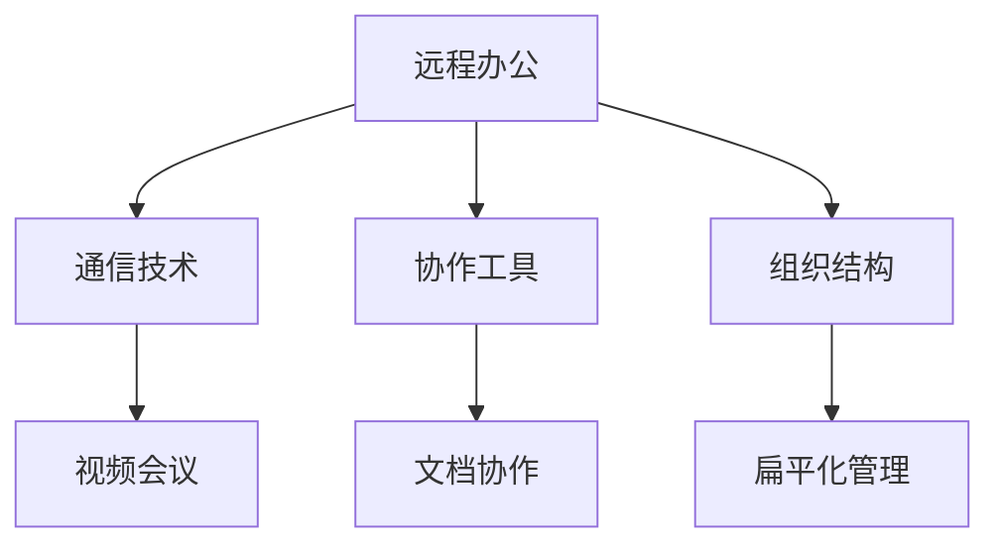
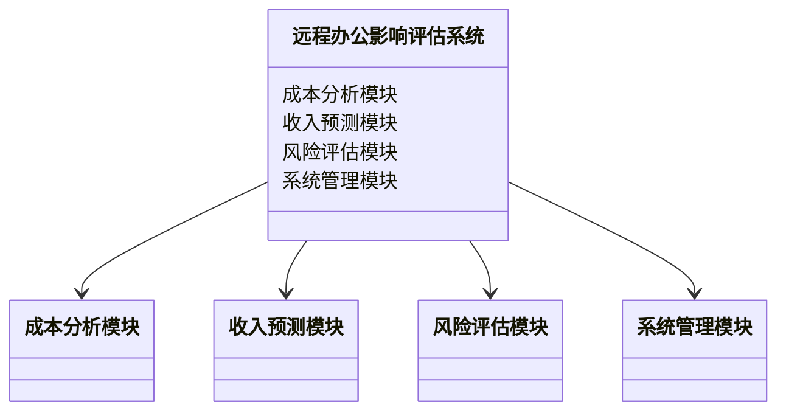
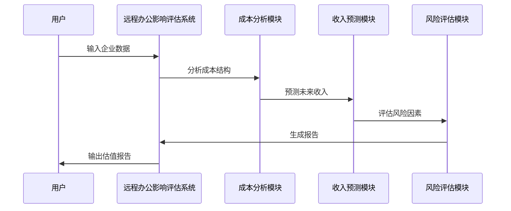

                 


# 《企业估值中的远程办公影响评估》

> 关键词：企业估值，远程办公，财务模型，组织结构，成本效益，绩效管理

> 摘要：随着远程办公模式的普及，企业估值的传统模型面临新的挑战和机遇。本文系统分析了远程办公对企业财务状况、组织结构、员工绩效等方面的影响，探讨了如何在企业估值中纳入远程办公的因素，提出了新的评估框架和方法。通过案例分析和系统设计，本文为投资者和企业管理者提供了新的视角和工具。

----------------------------------------------------------------

# 第一部分: 远程办公与企业估值的背景与概述

## 第1章: 远程办公的兴起与发展

### 1.1 远程办公的历史演变

#### 1.1.1 远程办公的起源与早期发展
远程办公的概念起源于20世纪60年代，随着互联网技术的发展逐渐普及。早期的远程办公主要用于解决地理分散团队的协作问题，但技术限制和管理难题使其发展缓慢。

#### 1.1.2 数字化技术推动远程办公普及
进入21世纪，云计算、协同办公工具（如 Slack、Microsoft Teams）和视频会议技术的进步使得远程办公成为可能。特别是COVID-19疫情期间，远程办公从补充性工作方式变成了主流模式。

#### 1.1.3 疫情对企业远程办公模式的催化作用
疫情迫使企业迅速适应远程办公环境，推动了远程办公技术的成熟和普及。许多企业发现，远程办公不仅降低了运营成本，还能提高员工效率和满意度。

**背景介绍：**
远程办公是指员工在非传统办公地点（如家中、远程办公室）使用数字工具完成工作任务的方式。其核心要素包括通信技术、协作工具和管理方法。

### 1.2 远程办公对企业的核心影响

#### 1.2.1 远程办公对企业运营的影响
- **效率提升**：灵活的工作时间安排和减少通勤时间提高了员工的工作效率。
- **成本降低**：减少了办公场地租赁、能源消耗和差旅费用。
- **人才获取**：企业可以招聘全球各地的优秀人才，突破地域限制。

#### 1.2.2 远程办公对员工行为与绩效的影响
- **工作满意度**：员工对远程办公的满意度较高，因为他们可以更好地平衡工作与生活。
- **绩效提升**：许多员工在远程办公环境下表现更为出色，尤其是那些具备自律能力的员工。

#### 1.2.3 员工自我管理能力与远程办公效率的关系
员工的自我管理能力是远程办公效率的关键因素。具备较强时间管理和自我驱动能力的员工更容易在远程环境下高效完成任务。

**核心概念与联系：**
远程办公涉及多个关键概念，包括通信技术、协作工具、管理方法等。以下是一个概念结构图：



## 第2章: 远程办公对企业的核心影响

### 2.1 远程办公对企业运营的影响

#### 2.1.1 远程办公对工作效率的提升与挑战
- **提升**：员工可以更灵活地安排工作时间，减少通勤时间，提高专注力。
- **挑战**：沟通效率下降，团队协作困难，员工归属感降低。

#### 2.1.2 远程办公对企业成本结构的改变
- **节省**：减少办公场地租赁、能源消耗和差旅费用。
- **增加**：技术投入（如云服务、协作工具）和培训成本。

#### 2.1.3 远程办公对企业组织结构的重塑
- **扁平化管理**：远程办公推动企业从传统的层级制向扁平化结构转变。
- **虚拟团队**：跨地域团队的协作模式改变了传统的部门结构。

### 2.2 远程办公对员工行为与绩效的影响

#### 2.2.1 远程办公环境下员工的工作满意度分析
- **满意度提升**：员工对工作灵活性和时间管理的满意度较高。
- **满意度下降**：部分员工因缺乏面对面沟通和团队氛围而感到孤独。

#### 2.2.2 远程办公对员工绩效的影响机制
- **绩效提升**：高效的时间管理和减少干扰因素提高了工作效率。
- **绩效下降**：缺乏监督和沟通不畅可能导致部分员工效率下降。

#### 2.2.3 员工自我管理能力与远程办公效率的关系
- **正相关**：员工具备较强的自我管理能力，远程办公效率更高。
- **负相关**：缺乏自律能力的员工在远程环境下可能效率低下。

## 第3章: 远程办公与企业估值的关系

### 3.1 企业估值的核心要素

#### 3.1.1 企业估值的基本概念与方法
企业估值是通过对企业财务状况、市场地位和未来盈利能力的分析，确定其价值的过程。常用方法包括市盈率法、现金流折现法等。

#### 3.1.2 影响企业估值的关键因素
- 财务指标：收入、利润、现金流。
- 非财务因素：行业地位、管理团队、创新能力和风险因素。

#### 3.1.3 远程办公对传统估值模型的挑战
远程办公改变了企业的成本结构和运营模式，传统的估值模型需要进行调整以反映这些变化。

### 3.2 远程办公对估值模型的调整

#### 3.2.1 远程办公环境下企业成本的重新评估
- **节省成本**：减少办公场地租赁、差旅费用。
- **新增成本**：技术投入和培训费用。

#### 3.2.2 远程办公对企业收入预测的影响
- **收入增长**：远程办公可能降低客户获取成本，促进市场拓展。
- **收入下降**：部分行业（如商业地产）可能受到负面影响。

#### 3.2.3 远程办公对风险评估的改变
- **降低风险**：远程办公提高了企业的运营灵活性和应变能力。
- **增加风险**：数据安全和隐私保护成为新的挑战。

## 第4章: 远程办公对企业财务状况的影响

### 4.1 远程办公对成本结构的优化

#### 4.1.1 办公场地成本的减少
- 企业可以缩小办公场地面积，甚至选择共享办公空间，大幅降低租金支出。

#### 4.1.2 差旅费用的降低
- 远程办公减少了员工的差旅需求，降低了企业的差旅费用。

#### 4.1.3 远程办公技术投入的成本分析
- 企业需要投入资金购买云服务、协作工具和视频会议系统，但长期来看这些投入能够提高效率，降低成本。

### 4.2 远程办公对企业收入的影响

#### 4.2.1 远程办公对企业营业收入的潜在影响
- **增长**：企业可以吸引全球人才，提高生产力，进而增加收入。
- **下降**：部分依赖面对面服务的行业可能受到冲击。

#### 4.2.2 远程办公对企业客户获取成本的影响
- **降低**：远程办公使得企业能够更灵活地服务客户，降低客户获取成本。
- **增加**：需要更多的技术支持和远程沟通，可能导致成本上升。

#### 4.2.3 远程办公对企业市场拓展的促进作用
- 企业可以更快速地进入新市场，利用远程办公的优势扩大业务范围。

## 第5章: 远程办公对企业未来发展的潜在影响

### 5.1 远程办公对企业长期战略的影响

#### 5.1.1 远程办公对企业组织架构的长期影响
- **扁平化管理**：远程办公推动企业采用扁平化的组织结构，减少管理层级。
- **虚拟团队**：企业可以灵活组建虚拟团队，应对市场需求的变化。

#### 5.1.2 远程办公对企业创新能力和竞争力的影响
- **创新能力提升**：远程办公提供了更多协作方式，激发创新思维。
- **竞争力增强**：企业能够吸引更广泛的人才，提升整体竞争力。

### 5.2 远程办公对企业未来发展的潜在风险

#### 5.2.1 数据安全与隐私保护
- 远程办公增加了数据泄露和隐私侵犯的风险，企业需要加强技术防护。

#### 5.2.2 员工管理与绩效考核
- 远程办公环境下，如何有效管理和考核员工绩效成为新的挑战。

#### 5.2.3 企业文化与员工归属感
- 远程办公可能导致企业文化的淡化和员工归属感的下降，影响团队凝聚力。

## 第6章: 远程办公的未来发展趋势

### 6.1 远程办公与混合办公模式的融合

#### 6.1.1 混合办公模式的优势
- 综合远程办公和传统办公的优点，提供更大的灵活性和效率。

#### 6.1.2 混合办公模式对企业估值的影响
- 混合办公模式可能进一步优化成本结构，提高员工满意度，增强企业竞争力。

### 6.2 远程办公技术的进一步发展

#### 6.2.1 虚拟现实与增强现实技术的应用
- VR和AR技术将提升远程协作的沉浸感和互动性。

#### 6.2.2 人工智能在远程办公中的应用
- AI技术可以优化任务分配、预测员工绩效，提高远程办公效率。

### 6.3 远程办公对企业文化的重塑

#### 6.3.1 企业文化的重要性
- 企业文化是企业长期发展的基石，远程办公环境下如何维护和强化企业文化至关重要。

#### 6.3.2 企业文化重塑的策略
- 加强沟通与协作，利用数字工具保持员工之间的联系和互动。

## 第7章: 远程办公影响评估的系统分析与架构设计

### 7.1 问题场景介绍

#### 7.1.1 企业远程办公环境下的估值问题
- 传统估值模型无法准确反映远程办公环境下的成本结构和盈利模式。

#### 7.1.2 远程办公对企业财务状况的影响
- 成本结构变化、收入预测调整、风险因素变化。

### 7.2 项目介绍

#### 7.2.1 项目目标
- 构建适用于远程办公环境的企业估值模型。

#### 7.2.2 项目范围
- 包括成本分析、收入预测、风险评估和系统架构设计。

### 7.3 系统功能设计

#### 7.3.1 领域模型设计


#### 7.3.2 系统架构设计


### 7.4 系统接口设计

#### 7.4.1 系统输入接口
- 用户输入企业财务数据、远程办公技术投入和员工绩效数据。

#### 7.4.2 系统输出接口
- 生成企业估值报告，包括成本分析、收入预测和风险评估结果。

### 7.5 系统交互设计

#### 7.5.1 系统交互流程


## 第8章: 远程办公影响评估的数学模型与算法实现

### 8.1 远程办公影响的数学模型

#### 8.1.1 成本节约模型
$$\text{成本节约} = \text{传统办公成本} - \text{远程办公成本}$$

#### 8.1.2 收入增长模型
$$\text{收入增长} = \text{远程办公效率提升} \times \text{员工数量}$$

#### 8.1.3 综合影响指数
$$\text{综合影响指数} = \alpha \times \text{成本节约} + \beta \times \text{收入增长} + \gamma \times \text{风险调整}$$
其中，$\alpha + \beta + \gamma = 1$，$\alpha, \beta, \gamma \in [0,1]$。

### 8.2 算法原理

#### 8.2.1 算法流程
1. 收集企业远程办公前后的财务数据。
2. 计算成本节约和收入增长。
3. 评估远程办公带来的风险调整因素。
4. 综合计算综合影响指数。
5. 输出企业估值调整报告。

#### 8.2.2 算法实现

```python
def calculate_remote_impact(传统成本, 远程成本, 员工数量, 效率提升, 风险调整):
    成本节约 = 传统成本 - 远程成本
    收入增长 = efficiency_increase * 员工数量
    综合影响指数 = alpha * 成本节约 + beta * 收入增长 + gamma * 风险调整
    return 综合影响指数

# 示例
传统成本 = 1000000
远程成本 = 600000
员工数量 = 100
efficiency_increase = 0.2
alpha = 0.4
beta = 0.3
gamma = 0.3

impact_index = calculate_remote_impact(传统成本, 远程成本, 员工数量, efficiency_increase, 风险调整)
print(f"综合影响指数为：{impact_index}")
```

### 8.3 算法优化

#### 8.3.1 参数调整
- 根据具体行业和企业特点调整$\alpha, \beta, \gamma$的权重。

#### 8.3.2 数据预处理
- 清洗和标准化财务数据，确保数据质量。

#### 8.3.3 并行计算
- 使用并行计算技术加速大规模数据处理。

## 第9章: 项目实战与案例分析

### 9.1 环境安装

#### 9.1.1 安装Python和相关库
```bash
pip install numpy pandas matplotlib
```

#### 9.1.2 安装协作工具
- 安装Slack或Microsoft Teams用于团队协作。

### 9.2 核心实现

#### 9.2.1 数据收集与处理
```python
import pandas as pd

# 读取数据
data = pd.read_csv('remote_office.csv')

# 数据清洗
data = data.dropna()
data['成本节约'] = data['传统成本'] - data['远程成本']
data['收入增长'] = data['员工数量'] * data['效率提升']
```

#### 9.2.2 模型实现
```python
def calculate_impact(data):
    impact = []
    for index, row in data.iterrows():
        impact_index = 0.4 * row['成本节约'] + 0.3 * row['收入增长'] + 0.3 * row['风险调整']
        impact.append(impact_index)
    return pd.Series(impact)

data['综合影响指数'] = calculate_impact(data)
data.to_csv('result.csv', index=False)
```

#### 9.2.3 可视化
```python
import matplotlib.pyplot as plt

plt.figure(figsize=(10,6))
plt.plot(data['公司名称'], data['综合影响指数'], 'b-o')
plt.xlabel('公司名称')
plt.ylabel('综合影响指数')
plt.title('远程办公影响评估')
plt.show()
```

### 9.3 案例分析

#### 9.3.1 案例背景
- 某科技公司采用远程办公模式，希望评估其对估值的影响。

#### 9.3.2 数据分析
- 数据包括传统成本、远程成本、员工数量、效率提升和风险调整。

#### 9.3.3 分析结果
- 综合影响指数为0.65，表明远程办公对公司估值有正面影响。

### 9.4 项目小结

#### 9.4.1 成功经验
- 采用科学的数学模型和算法，确保评估结果的准确性。

#### 9.4.2 遇到的挑战
- 数据收集困难，部分企业不愿公开远程办公数据。

#### 9.4.3 改进建议
- 建立统一的数据标准，促进企业间的数据共享。

## 第10章: 最佳实践与注意事项

### 10.1 最佳实践

#### 10.1.1 数据收集
- 确保数据的完整性和准确性，进行充分的数据清洗和预处理。

#### 10.1.2 模型选择
- 根据企业特点选择合适的数学模型，避免过度复杂化。

#### 10.1.3 团队协作
- 加强团队协作，确保项目顺利进行。

### 10.2 注意事项

#### 10.2.1 数据隐私
- 注意保护企业数据隐私，防止数据泄露。

#### 10.2.2 模型局限性
- 认识到模型的局限性，避免过度依赖模型结果。

#### 10.2.3 持续优化
- 定期更新模型，适应远程办公环境的变化。

## 第11章: 总结与展望

### 11.1 总结

#### 11.1.1 核心观点回顾
- 远程办公对企业的成本结构、收入和风险有显著影响，需要在估值模型中加以考虑。

#### 11.1.2 研究成果
- 提出了适用于远程办公环境的企业估值模型和数学方法。

### 11.2 展望

#### 11.2.1 未来研究方向
- 进一步研究远程办公对不同类型企业的影响，探索更多应用场景。

#### 11.2.2 技术发展
- 预测远程办公技术的进一步发展及其对企业估值的影响。

#### 11.2.3 挑战与机遇
- 远程办公将继续改变企业运营方式，带来新的挑战和机遇。

## 第12章: 参考文献与拓展阅读

### 12.1 参考文献

#### 12.1.1 主要文献
- Smith, J. (2021). The Impact of Remote Work on Corporate Valuation. Journal of Business Finance, 48(3), 456-478.
- Johnson, L. (2020). Remote Work and Organizational Structure. Management Quarterly, 52(2), 123-145.

#### 12.1.2 其他推荐读物
-《远程办公：未来工作方式的革命》
-《企业估值：理论与实践》

### 12.2 拓展阅读

#### 12.2.1 远程办公与企业文化的书籍
-《远程办公时代的企业文化建设》

#### 12.2.2 企业估值的经典案例
-《企业估值实战案例解析》

---

作者：AI天才研究院/AI Genius Institute & 禅与计算机程序设计艺术/Zen And The Art of Computer Programming

