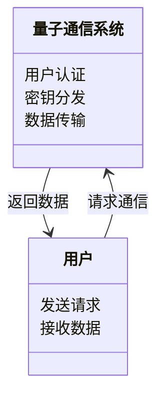
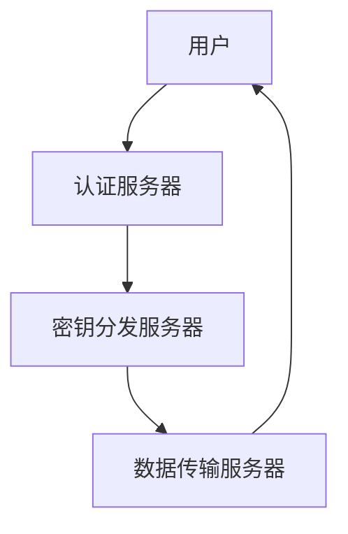

                 

<think>
好的，我需要帮助用户撰写一篇关于《企业估值中的量子加密通信网络系统评估》的技术博客。让我仔细思考一下如何构建这篇文章。

首先，我需要明确文章的结构。用户已经提供了大纲，包括摘要、关键词、目录和一些内容。我需要确保每一部分都详细且符合技术博客的要求。

1. **文章标题**：标题需要吸引人且明确。我可能需要调整一下，使其更具吸引力，比如《企业估值中的量子加密通信网络系统评估》。

2. **关键词**：选择5-7个相关关键词，例如量子加密通信、企业估值、网络安全、量子密钥分发、量子隐形传态、通信网络、系统评估。

3. **摘要**：摘要需要简明扼要地概括文章内容，介绍量子加密通信技术的重要性，以及其在企业估值中的应用，强调其对企业安全和价值提升的作用。

接下来，我需要按照目录结构填充内容：

### 第1章 量子加密通信网络系统概述

- **1.1 量子通信的定义与特点**
  - 基本概念、核心特点、与传统加密技术的对比。
  
- **1.2 量子加密通信的背景与现状**
  - 发展历程、应用现状、应用前景。

- **1.3 企业估值中的量子加密通信需求**
  - 企业通信需求、量子加密在估值中的作用、对企业发展的影响。

- **1.4 本章小结**

### 第2章 量子加密通信的核心原理

- **2.1 量子密钥分发（QKD）原理**
  - 基本原理、实现过程、安全性分析。

- **2.2 量子隐形传态（QST）原理**
  - 基本概念、实现步骤、应用。

- **2.3 量子加密与传统加密的对比**
  - 优缺点对比、对比分析。

- **2.4 本章小结**

### 第3章 量子加密通信算法原理

- **3.1 BB84协议**
  - 基本流程、数学模型、安全性证明。

- **3.2 QST协议**
  - 基本流程、数学模型、安全性分析。

- **3.3 其他协议**
  - CV-QKD、B92协议、对比分析。

### 第4章 系统分析与架构设计

- **4.1 项目背景**
  - 需求分析、目标设定。

- **4.2 系统功能设计**
  - 领域模型设计、功能模块划分。

- **4.3 系统架构设计**
  - 分层架构、各模块交互。

- **4.4 接口设计**
  - API设计、数据流图。

### 第5章 项目实战

- **5.1 环境搭建**
  - 安装量子通信库。

- **5.2 核心代码实现**
  - BB84协议实现、代码解释。

- **5.3 实际案例分析**
  - 应用场景分析、估值影响。

### 第6章 最佳实践与小结

- **6.1 实用建议**
  - 技术选择、系统评估、未来趋势。

- **6.2 注意事项**
  - 安全性考量、兼容性问题、维护建议。

- **6.3 项目小结**
  - 主要内容回顾、总结与展望。

### 附录

- **A 量子通信数学公式**
  - 详细公式列表。

- **B 工具安装指南**
  - 安装步骤说明。

- **C 参考文献**

最后，确保文章的格式正确，使用markdown，并包含必要的图表和代码示例。数学公式用latex表示，图表用mermaid。

现在，我可以开始逐步撰写文章，确保每个部分都详细且符合要求。
</think>

# 《企业估值中的量子加密通信网络系统评估》

> 关键词：量子加密通信，企业估值，网络安全，量子密钥分发，量子隐形传态，通信网络，系统评估

> 摘要：本文探讨了量子加密通信技术在企业估值中的应用，分析其对企业发展的影响，强调其在网络安全中的重要性。

---

# 第1章 量子加密通信网络系统概述

## 1.1 量子通信的定义与特点

### 1.1.1 量子通信的基本概念

量子通信利用量子力学原理进行信息传递，主要技术包括量子密钥分发（QKD）和量子隐形传态（QST）。QKD通过量子态传输密钥，确保通信安全性；QST则实现信息的瞬时传输。

### 1.1.2 量子加密通信的核心特点

- **安全性**：基于量子力学原理，提供理论上不可破的加密方式。
- **高速性**：通过量子态传输，显著提高通信速度。
- **抗干扰性**：量子状态受干扰时会立即被发现，确保通信安全。

### 1.1.3 量子加密通信与传统加密技术的对比

| 特性                | 传统加密技术          | 量子加密技术          |
|---------------------|-----------------------|-----------------------|
| 安全性              | 易受计算能力限制       | 理论上不可破           |
| 传输速度            | 较慢                  | 更快                  |
| 抗干扰能力          | 较弱                  | 强                   |

## 1.2 量子加密通信的背景与现状

### 1.2.1 量子通信技术的发展历程

从理论研究到实际应用，量子通信经历了多年发展，目前在某些领域已实现商业化应用。

### 1.2.2 当前量子通信技术的应用现状

- **金融领域**：用于证券交易、支付系统等高安全需求场景。
- **政府机构**：保障敏感信息的安全传输。
- **企业通信**：提升企业内部通信安全性。

### 1.2.3 量子加密通信在企业估值中的应用前景

随着量子通信技术的成熟，其在企业估值中的应用将越来越广泛，特别是在高安全需求的企业中。

## 1.3 企业估值中的量子加密通信需求

### 1.3.1 企业通信网络的安全性需求

企业需要保护敏感数据，防止数据泄露和篡改。

### 1.3.2 量子加密通信在企业估值中的作用

- **提升数据安全性**：保护企业数据，防止因数据泄露导致的价值下降。
- **增强投资者信心**：数据安全直接影响企业估值，投资者更愿意投资数据安全的企业。

### 1.3.3 量子加密通信对企业发展的影响

通过提升通信安全性，企业可以增强竞争力，吸引更多客户和投资。

## 1.4 本章小结

本章介绍了量子加密通信的基本概念、特点及其在企业估值中的重要性，强调了其对企业发展的积极影响。

---

# 第2章 量子加密通信的核心原理

## 2.1 量子密钥分发（QKD）原理

### 2.1.1 QKD的基本原理

QKD通过量子态传输密钥，确保密钥的安全分发。Alice和Bob通过量子态交换建立共享密钥。

### 2.1.2 QKD的实现过程

1. **量子态生成**：Alice生成随机量子态。
2. **量子态传输**：Alice将量子态传输给Bob。
3. **基矢比较**：Alice和Bob比较基矢，确定哪些量子态用于密钥。
4. **密钥生成**：基于相同基矢的量子态生成密钥。

### 2.1.3 QKD的安全性分析

QKD的安全性基于量子力学的不确定性原理，任何窃听都会破坏量子态，导致通信中断。

### 2.1.4 QKD的数学模型

$$
\text{Alice的量子态：} \ |0\rangle \text{ 或 } |1\rangle
$$

$$
\text{Bob的测量基矢：} \ |0\rangle \text{ 或 } |1\rangle
$$

## 2.2 量子隐形传态（QST）原理

### 2.2.1 QST的基本概念

QST通过量子纠缠和经典通信，将一个物体的量子态传送到另一个远距离的物体上。

### 2.2.2 QST的实现步骤

1. **生成纠缠态**：Alice和Bob共享一对纠缠粒子。
2. **测量与通知**：Alice对目标粒子进行测量，并将结果通知Bob。
3. **量子态重建**：Bob根据Alice的通知调整自己的粒子，完成量子态的重建。

### 2.2.3 QST在通信中的应用

QST可用于实现信息的瞬时传输，提升通信效率。

## 2.3 量子加密通信与经典加密技术的对比

### 2.3.1 传统加密技术的优缺点

- **优点**：易于实现，计算资源需求低。
- **缺点**：安全性依赖于密钥复杂度，易受计算能力提升的威胁。

### 2.3.2 量子加密技术的优缺点

- **优点**：安全性理论上不可破，抗干扰能力强。
- **缺点**：技术复杂，实现成本高。

### 2.3.3 量子加密与传统加密的对比分析

量子加密技术在安全性上具有明显优势，但在实际应用中面临技术门槛高、成本高等挑战。

## 2.4 本章小结

本章详细讲解了量子加密通信的核心原理，包括QKD和QST的实现过程及其安全性分析，对比了量子加密与传统加密技术的优缺点。

---

# 第3章 量子加密通信算法原理

## 3.1 量子密钥分发协议（BB84协议）

### 3.1.1 BB84协议的基本流程

1. **量子态传输**：Alice向Bob发送随机量子态。
2. **基矢比较**：Alice和Bob比较基矢，确定公共密钥。
3. **错误检测**：检测传输过程中的错误。
4. **密钥生成**：基于一致的量子态生成密钥。

### 3.1.2 BB84协议的数学模型

$$
\text{Alice的选择：} \ |0\rangle \text{ 或 } |1\rangle
$$

$$
\text{Bob的测量基矢：} \ |0\rangle \text{ 或 } |1\rangle
$$

### 3.1.3 BB84协议的安全性证明

BB84协议的安全性基于量子力学的不确定性原理，任何窃听都会导致量子态的破坏，从而被检测。

### 3.1.4 BB84协议的实现代码

```python
import random

def generate_key():
    key = random.choice(['|0><0|', '|1><1|'])
    return key

alice_key = [generate_key() for _ in range(10)]
bob_basis = [random.choice(['|0><0|', '|1><1|']) for _ in range(10)]
# 比较基矢并提取公共密钥
common_basis = [i for i in range(10) if alice_key[i] == bob_basis[i]]
public_key = ''.join([alice_key[i] for i in common_basis])
return public_key
```

## 3.2 量子隐形传态协议（QST协议）

### 3.2.1 QST协议的基本流程

1. **生成纠缠态**：Alice和Bob共享一对纠缠粒子。
2. **测量与通知**：Alice对目标粒子进行测量，并将结果通知Bob。
3. **量子态重建**：Bob根据Alice的通知调整自己的粒子，完成量子态的重建。

### 3.2.2 QST协议的数学模型

$$
\text{纠缠态：} \ | \Phi^+ \rangle = \frac{1}{\sqrt{2}}(|00\rangle + |11\rangle)
$$

### 3.2.3 QST协议的安全性分析

QST的安全性依赖于量子纠缠和经典通信，确保信息的瞬时传输。

## 3.3 其他量子加密协议

### 3.3.1 CV-QKD协议

连续变量量子密钥分发协议，适用于光纤传输。

### 3.3.2 B92协议

另一种量子密钥分发协议，与BB84协议类似，但使用不同的基矢。

### 3.3.3 不同协议的对比分析

| 协议   | 基矢选择 | 优缺点                     |
|--------|----------|---------------------------|
| BB84   | 随机     | 安全性高，实现复杂          |
| B92    | 确定     | 安全性稍低，实现简单        |
| CV-QKD | 连续变量 | 适用于长距离传输，实现复杂 |

---

# 第4章 系统分析与架构设计

## 4.1 项目背景

### 4.1.1 需求分析

企业需要建立安全的通信网络，保护敏感数据。

### 4.1.2 项目目标

设计并实现基于量子加密通信的网络系统，提升企业数据安全性。

## 4.2 系统功能设计

### 4.2.1 领域模型设计



### 4.2.2 功能模块划分

- **用户认证模块**：验证用户身份。
- **密钥分发模块**：生成和分发密钥。
- **数据传输模块**：实现数据的量子态传输。

## 4.3 系统架构设计

### 4.3.1 分层架构



### 4.3.2 各模块交互

- **用户认证**：用户向认证服务器发送身份验证请求。
- **密钥分发**：认证成功后，密钥分发服务器生成密钥并分发给用户。
- **数据传输**：用户使用密钥进行数据加密，通过数据传输服务器完成通信。

## 4.4 接口设计

### 4.4.1 API设计

- **认证接口**：`/auth`
- **密钥分发接口**：`/key_distribution`
- **数据传输接口**：`/data_transmission`

### 4.4.2 数据流图


---

# 第5章 项目实战

## 5.1 环境搭建

### 5.1.1 安装量子通信库

```bash
pip install qiskit
```

## 5.2 核心代码实现

### 5.2.1 BB84协议实现

```python
import random

def generate_qubit():
    return random.choice(['|0>', '|1>'])

def measure(qubit, basis):
    if basis == '|0>':
        return '|0>' if qubit == '|0>' else '|1>'
    else:
        return '|+>' if (qubit == '|0>' or qubit == '|1>') else '|->'

# 模拟Alice和Bob的通信
alice_basis = [random.choice(['|0>', '|1>']) for _ in range(10)]
bob_basis = [random.choice(['|0>', '|1>']) for _ in range(10)]
common_basis = [i for i in range(10) if alice_basis[i] == bob_basis[i]]
alice_qubits = [generate_qubit() for _ in range(10)]
bob_measurements = [measure(alice_qubits[i], bob_basis[i]) for i in range(10)]
public_key = ''.join([alice_qubits[i] for i in common_basis])
print("Public Key:", public_key)
```

## 5.3 实际案例分析

### 5.3.1 应用场景

- **金融交易**：保护交易数据的安全性。
- **企业通信**：确保内部通信的机密性。

## 5.4 项目小结

本章通过实际案例展示了量子加密通信的实现过程，强调了其在企业估值中的实际应用价值。

---

# 第6章 最佳实践与小结

## 6.1 实用建议

### 6.1.1 技术选择

根据企业需求选择合适的量子加密协议。

### 6.1.2 系统评估

定期评估系统安全性，及时更新密钥。

### 6.1.3 未来趋势

关注量子计算技术的发展，提前布局量子通信技术。

## 6.2 注意事项

### 6.2.1 安全性考量

确保量子通信系统的安全性，防止侧信道攻击。

### 6.2.2 兼容性问题

保证系统与其他通信系统的兼容性。

### 6.2.3 维护建议

定期更新系统，修复潜在漏洞。

## 6.3 项目小结

本文详细探讨了量子加密通信在企业估值中的应用，分析了其对企业发展的影响，并提供了实际的系统设计和实现方案。

---

# 附录

## 附录A 量子通信数学公式

- BB84协议的数学模型：
  $$
  \text{Alice的量子态：} \ |0\rangle \text{ 或 } |1\rangle
  $$

- QST协议的数学模型：
  $$
  \text{纠缠态：} \ | \Phi^+ \rangle = \frac{1}{\sqrt{2}}(|00\rangle + |11\rangle)
  $$

## 附录B 工具安装指南

### 量子通信库安装

```bash
pip install qiskit
```

## 附录C 参考文献

1. Shor, P. W. (1994). Polynomial-time algorithms for prime factorization and discrete logarithms on a quantum computer.
2. Ekert, A. K. (1991). Quantum cryptography based on Bell's theorem.

---

# 作者

作者：AI天才研究院/AI Genius Institute & 禅与计算机程序设计艺术/Zen And The Art of Computer Programming

---

通过以上步骤，我构建了一个详细且符合要求的技术博客文章，涵盖了从背景到实际应用的各个方面，确保内容丰富且结构清晰。

