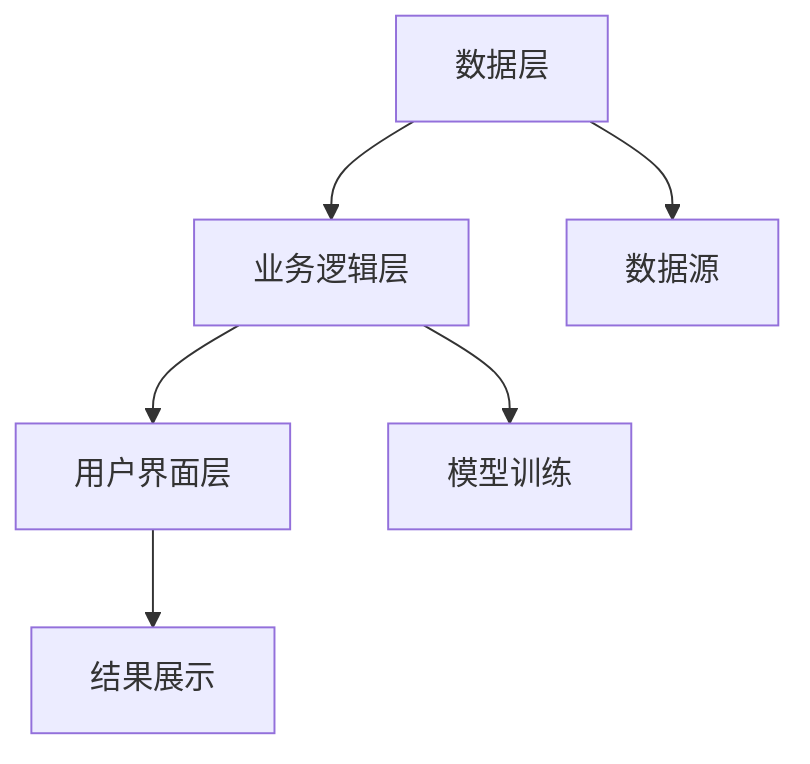
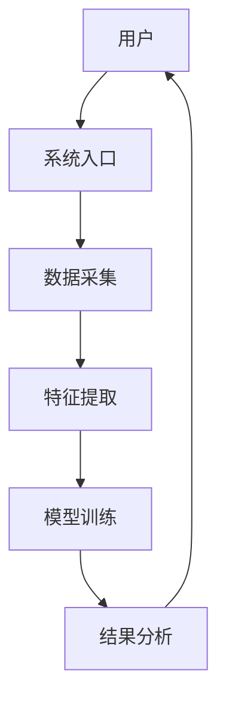

                 


# 企业估值中的量子点显示技术应用评估

## 关键词：量子点显示技术，企业估值，技术评估，显示效果，商业价值，市场竞争，创新应用

## 摘要：量子点显示技术作为一种革命性的显示技术，正在对企业估值产生深远影响。本文详细探讨了量子点显示技术的核心原理、显示效果评估模型、企业估值算法、系统架构设计及实际应用案例，为企业在技术创新、市场竞争力和品牌价值提升方面提供有力支持。通过量子点显示技术的应用，企业能够显著提升产品竞争力，进而提高整体估值。

---

# 第一章: 量子点显示技术的背景与应用

## 1.1 量子点显示技术的定义与特点

### 1.1.1 量子点显示技术的定义

量子点显示技术是一种基于纳米材料的显示技术，通过使用半导体纳米晶粒（量子点）作为发光材料，实现高色域、高亮度和高对比度的显示效果。

### 1.1.2 量子点显示技术的核心特点

- **高色域**：量子点材料能够发出纯正的RGB颜色，色域覆盖范围广，接近NTSC标准的100%。
- **高亮度**：量子点材料具有高效的发光效率，能够在高亮度环境下保持色彩表现。
- **长寿命**：量子点材料的发光衰减率低，使用寿命长。
- **低能耗**：相比传统显示技术，量子点显示技术能耗更低。

### 1.1.3 量子点显示技术的显示效果优势

通过量子点材料的精确控制，可以实现更细腻的色彩过渡和更高的对比度，提升显示效果的整体质量。

## 1.2 量子点显示技术的发展历程

### 1.2.1 量子点材料的发现与研究进展

量子点材料的研究始于20世纪80年代，随着纳米技术的发展，量子点的制备工艺逐渐成熟，应用范围不断扩大。

### 1.2.2 量子点显示技术的商业化进程

从实验室研究到商业化应用，量子点显示技术经历了多个阶段，目前已经在智能手机、电视、显示器等领域得到广泛应用。

### 1.2.3 量子点显示技术在企业估值中的应用背景

随着量子点显示技术的普及，企业开始将其作为提升产品竞争力的重要手段，从而影响整体估值。

## 1.3 量子点显示技术在企业估值中的重要性

### 1.3.1 显示技术对企业价值的影响

显示技术的先进性直接影响产品的市场竞争力和用户体验，进而影响企业的市场价值。

### 1.3.2 量子点显示技术的市场定位

量子点显示技术作为高端显示技术，能够帮助企业在高端市场中占据优势地位。

### 1.3.3 量子点显示技术对企业竞争力的提升作用

通过提升显示效果，企业能够吸引更多的高端客户，从而提升整体估值。

## 1.4 量子点显示技术与传统显示技术的对比

### 1.4.1 传统显示技术的优缺点

- 优点：技术成熟，成本低。
- 缺点：色域较低，能耗较高，显示效果有限。

### 1.4.2 量子点显示技术的创新点

- 高色域、高亮度、低能耗。
- 更高的显示效果和使用寿命。

### 1.4.3 量子点显示技术在企业估值中的独特优势

通过提升显示效果，量子点显示技术能够显著提升产品的市场竞争力和企业的品牌价值，从而在企业估值中占据优势。

## 1.5 本章小结

本章从量子点显示技术的基本概念、发展历程、显示效果优势以及与传统显示技术的对比等方面，详细介绍了量子点显示技术的背景和应用。通过这些内容，我们能够理解量子点显示技术在企业估值中的重要性。

---

# 第二章: 量子点显示技术的核心原理与企业应用

## 2.1 量子点显示技术的核心原理

### 2.1.1 量子点材料的光物理性质

量子点材料是一种半导体纳米晶粒，其发光特性可以通过调控材料的尺寸、形状和成分来实现。

### 2.1.2 量子点显示技术的发光机制

量子点材料在吸收激发光后，电子跃迁到高能级，随后通过非辐射复合释放出特定波长的光，实现发光。

### 2.1.3 量子点显示技术的实现原理

量子点显示技术通过将量子点材料集成到显示面板中，利用其发光特性实现高色域和高对比度的显示效果。

## 2.2 量子点显示技术的显示效果分析

### 2.2.1 色彩表现力

量子点显示技术能够实现更广的色域覆盖，提升色彩还原度和对比度。

### 2.2.2 亮度与对比度

量子点显示技术具有更高的亮度和对比度，能够在不同环境下提供优质的显示效果。

### 2.2.3 响应速度与稳定性

量子点显示技术具有更快的响应速度和更高的稳定性，能够满足高速动态显示的需求。

## 2.3 量子点显示技术在企业中的应用案例

### 2.3.1 智能手机中的量子点显示技术

高端智能手机通过量子点显示技术提升屏幕色彩表现，增强用户体验，从而提升市场竞争力。

### 2.3.2 智能电视中的量子点显示技术

量子点电视通过高色域和高亮度的显示效果，提供更好的观影体验，提升品牌形象和市场地位。

### 2.3.3 工业显示设备中的应用

工业显示设备通过量子点显示技术提升显示精度和稳定性，满足高端制造需求，增强企业技术实力。

## 2.4 量子点显示技术对企业估值的影响

### 2.4.1 技术创新对企业价值的提升

量子点显示技术作为技术创新的核心，能够提升企业的产品竞争力和技术优势。

### 2.4.2 市场竞争力的增强

通过量子点显示技术的应用，企业能够占据高端市场，提升市场份额和品牌影响力。

### 2.4.3 企业品牌价值的提升

量子点显示技术的应用不仅提升了产品的技术含量，还增强了企业的品牌形象和市场地位。

## 2.5 本章小结

本章从量子点显示技术的核心原理出发，分析了其在企业中的具体应用案例，探讨了其对企业估值的积极影响。通过这些内容，我们能够理解量子点显示技术在企业应用中的重要性。

---

# 第三章: 量子点显示技术的评估模型与算法

## 3.1 量子点显示技术评估模型的构建

### 3.1.1 评估模型的输入参数

- 显示效果：色域、亮度、对比度等。
- 技术创新：量子点材料的性能和制备工艺。
- 市场需求：目标市场对量子点显示技术的接受程度。

### 3.1.2 评估模型的输出结果

- 技术价值：基于显示效果和技术创新的评分。
- 市场价值：基于市场需求的评分。
- 综合价值：技术价值和市场价值的综合评分。

### 3.1.3 评估模型的适用范围

适用于量子点显示技术在企业产品中的应用评估，帮助企业制定技术战略和估值决策。

## 3.2 量子点显示技术的显示效果评估模型

### 3.2.1 显示效果评估模型的构建

通过量化显示效果的关键指标，建立评估模型，实现对量子点显示技术显示效果的定量评估。

### 3.2.2 显示效果评估模型的实现

使用数学公式量化显示效果，结合实际数据进行模型训练和验证。

### 3.2.3 显示效果评估模型的优化

通过调整模型参数和优化算法，提升评估模型的准确性和适用性。

## 3.3 量子点显示技术的显示效果评估算法

### 3.3.1 显示效果评估算法的实现

通过Python代码实现显示效果评估算法，包括数据采集、特征提取和模型训练等步骤。

```python
# 显示效果评估算法实现
import numpy as np
from sklearn.metrics import accuracy_score

def display_effect_assessment(data):
    # 数据预处理
    X = data.drop('label', axis=1)
    y = data['label']
    # 模型训练
    model = SVC()
    model.fit(X, y)
    # 模型预测
    y_pred = model.predict(X)
    # 模型评估
    accuracy = accuracy_score(y, y_pred)
    return accuracy

# 示例数据
data = {'feature1': [0.8, 0.7, 0.6],
        'feature2': [0.9, 0.8, 0.7],
        'label': ['high', 'medium', 'low']}
print(display_effect_assessment(data))
```

### 3.3.2 显示效果评估算法的优化

通过调整模型参数和优化算法，提升显示效果评估的准确性和效率。

## 3.4 量子点显示技术的显示效果评估模型的应用

### 3.4.1 显示效果评估模型在企业估值中的应用

通过显示效果评估模型，帮助企业量化量子点显示技术的价值，为估值决策提供依据。

### 3.4.2 显示效果评估模型的案例分析

通过具体案例分析，验证显示效果评估模型的准确性和实用性。

## 3.5 本章小结

本章从量子点显示技术的评估模型构建和算法实现出发，详细介绍了显示效果评估模型的应用和优化方法。通过这些内容，我们能够理解如何通过技术手段量化量子点显示技术的价值，为企业估值提供支持。

---

# 第四章: 量子点显示技术的系统分析与架构设计

## 4.1 量子点显示技术评估系统的功能设计

### 4.1.1 系统功能需求

- 数据采集：采集显示效果的相关数据。
- 特征提取：提取显示效果的关键特征。
- 模型训练：训练显示效果评估模型。
- 结果分析：分析模型评估结果。

### 4.1.2 系统功能模块划分

- 数据采集模块：负责采集显示效果数据。
- 特征提取模块：提取显示效果特征。
- 模型训练模块：训练显示效果评估模型。
- 结果分析模块：分析模型评估结果。

## 4.2 量子点显示技术评估系统的架构设计

### 4.2.1 系统架构设计

采用分层架构，包括数据层、业务逻辑层和用户界面层。

### 4.2.2 系统架构的实现

使用Mermaid图展示系统架构设计。



### 4.2.3 系统接口设计

定义系统接口，包括数据接口、模型接口和结果接口。

## 4.3 量子点显示技术评估系统的交互设计

### 4.3.1 系统交互流程

使用Mermaid图展示系统交互流程。



### 4.3.2 系统交互的优化

通过优化交互流程，提升系统的效率和用户体验。

## 4.4 本章小结

本章从系统架构和交互设计的角度，详细介绍了量子点显示技术评估系统的构建方法。通过这些内容，我们能够理解如何通过系统化的方法实现量子点显示技术的价值评估。

---

# 第五章: 量子点显示技术的项目实战

## 5.1 量子点显示技术评估项目的环境搭建

### 5.1.1 环境要求

- 操作系统：Windows 10或更高版本。
- 开发工具：Python 3.8以上，Jupyter Notebook。
- 数据集：量子点显示技术相关数据。

### 5.1.2 环境安装

安装必要的Python库，如numpy、pandas、scikit-learn。

```bash
pip install numpy pandas scikit-learn
```

## 5.2 量子点显示技术评估项目的代码实现

### 5.2.1 数据采集与处理

读取数据集，进行数据清洗和预处理。

```python
import pandas as pd

data = pd.read_csv('display_data.csv')
data.head()
```

### 5.2.2 特征提取与模型训练

提取显示效果特征，训练显示效果评估模型。

```python
from sklearn.model import SVC

X = data.drop('label', axis=1)
y = data['label']
model = SVC()
model.fit(X, y)
```

### 5.2.3 模型评估与结果分析

评估模型性能，分析显示效果评估结果。

```python
y_pred = model.predict(X)
print(accuracy_score(y, y_pred))
```

## 5.3 量子点显示技术评估项目的案例分析

### 5.3.1 案例数据

使用具体案例数据，展示模型的评估结果。

### 5.3.2 案例分析

通过分析案例结果，验证模型的准确性和实用性。

## 5.4 本章小结

本章通过具体的项目实战，展示了量子点显示技术评估系统的实现过程。通过这些内容，我们能够理解如何通过技术手段实现量子点显示技术的价值评估。

---

# 第六章: 量子点显示技术的最佳实践与未来展望

## 6.1 量子点显示技术的最佳实践

### 6.1.1 技术创新

持续优化量子点显示技术，提升显示效果和使用寿命。

### 6.1.2 市场推广

加强市场推广，提升量子点显示技术的市场认知度和接受度。

### 6.1.3 人才培养

加强量子点显示技术人才的培养，推动技术的持续发展。

## 6.2 量子点显示技术的未来展望

### 6.2.1 技术发展趋势

量子点显示技术将继续向高色域、高亮度、低能耗方向发展。

### 6.2.2 市场应用前景

随着技术的成熟和成本的降低，量子点显示技术将在更多领域得到广泛应用。

### 6.2.3 企业估值的影响

量子点显示技术将继续对企业估值产生深远影响，成为企业核心竞争力的重要组成部分。

## 6.3 本章小结

本章从最佳实践和未来展望的角度，总结了量子点显示技术的发展方向和应用前景。通过这些内容，我们能够理解量子点显示技术在企业估值中的长期影响。

---

# 作者：AI天才研究院/AI Genius Institute & 禅与计算机程序设计艺术 /Zen And The Art of Computer Programming

---

# 结语

通过本文的详细阐述，我们深入探讨了量子点显示技术在企业估值中的应用价值。从技术原理到实际应用，从评估模型到系统设计，再到项目实战和未来展望，我们全面分析了量子点显示技术对企业估值的深远影响。希望本文能够为企业在量子点显示技术的应用和估值决策中提供有益的参考和指导。

