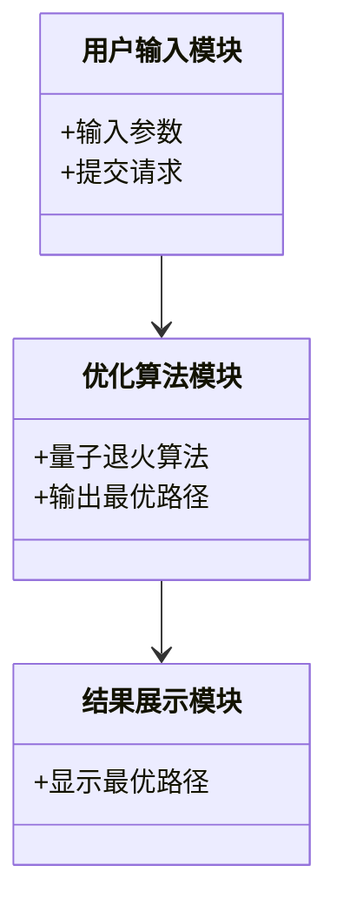
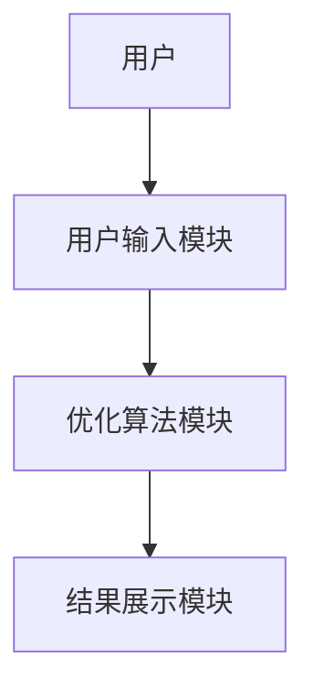

                 


# 企业估值中的量子计算优化物流路径平台评估

> 关键词：企业估值、量子计算、物流路径优化、平台评估、算法设计、系统架构、数学建模

> 摘要：本文深入探讨了量子计算在物流路径优化中的应用及其对企业估值的影响。通过分析量子计算的优化算法，结合物流路径优化的数学模型，提出了一种基于量子计算的物流路径优化平台评估方法。文章从背景、原理、算法设计、系统架构到项目实战，全面解析了量子计算如何助力企业优化物流路径，提升企业估值。

---

# 第1章: 企业估值、量子计算与物流路径优化的背景与概念

## 1.1 企业估值的基本概念

### 1.1.1 企业估值的定义与核心要素
企业估值是指对企业整体或部分股权的经济价值进行评估的过程。核心要素包括企业的财务状况、市场表现、管理团队、行业地位、竞争优势等。企业估值的结果直接影响企业的融资、并购、上市等重大决策。

### 1.1.2 企业估值的传统方法与挑战
传统估值方法包括DCF模型、市盈率法、市净率法等。然而，传统方法难以全面考虑企业的动态优化能力，尤其是物流效率对企业运营成本和盈利能力的影响。

### 1.1.3 企业估值与物流效率的关系
物流效率直接影响企业的运营成本和客户满意度。优化物流路径可以降低运输成本、提高交付效率，从而提升企业的净利润率和市场竞争力，进而影响企业估值。

---

## 1.2 量子计算的基本原理

### 1.2.1 量子计算的定义与特点
量子计算是一种利用量子力学原理进行计算的技术。其特点是计算速度快、并行计算能力强，尤其适用于解决复杂优化问题。

### 1.2.2 量子计算与经典计算的区别
与经典计算不同，量子计算利用量子叠加和量子纠缠的特性，可以在指数级时间内解决问题。例如，量子退火算法在优化问题中表现出色。

### 1.2.3 量子计算在优化问题中的优势
量子计算能够高效解决NP-hard问题，如旅行商问题（TSP）、车辆路径问题（VRP）等，为物流路径优化提供了新的解决方案。

---

## 1.3 物流路径优化的核心概念

### 1.3.1 物流路径优化的定义与目标
物流路径优化是指通过优化配送路线，降低运输成本、提高效率的过程。目标是找到从起点到终点的最短路径，同时满足约束条件。

### 1.3.2 物流路径优化的常见问题与挑战
物流路径优化面临的问题包括路径复杂性、多目标优化、动态变化等。传统算法在处理大规模问题时效率较低。

### 1.3.3 物流路径优化与企业估值的关系
优化的物流路径可以降低企业的运营成本，提升利润率，从而提高企业的整体估值。

---

## 1.4 本章小结
本章介绍了企业估值、量子计算和物流路径优化的基本概念及其相互关系。企业估值依赖于高效的物流路径优化，而量子计算为解决复杂优化问题提供了新的可能性。

---

# 第2章: 量子计算在物流路径优化中的应用原理

## 2.1 量子计算优化算法概述

### 2.1.1 量子退火算法的原理与特点
量子退火算法是一种基于量子力学的优化方法，通过模拟量子系统的能量弛豫过程，找到最优解。其特点是计算速度快、并行性高。

### 2.1.2 Grover算法在优化问题中的应用
Grover算法是一种量子搜索算法，适用于无序数据库中的搜索问题。在物流路径优化中，可以用于加速某些特定问题的求解。

### 2.1.3 量子计算优化算法的优缺点对比
优点：计算速度快、并行性高；缺点：硬件实现难度大、算法适用范围有限。

---

## 2.2 量子计算优化物流路径的核心算法

### 2.2.1 量子退火算法在物流路径优化中的应用
通过模拟量子系统的行为，量子退火算法能够快速找到物流路径的最优解。

### 2.2.2 量子计算优化算法的数学模型
物流路径优化问题可以表示为：
$$ \text{Minimize } \sum_{i=1}^{n} \text{cost}(i) $$
其中，$$ \text{cost}(i) $$ 表示第i条路径的成本。

### 2.2.3 量子计算优化算法的实现步骤
1. 确定问题目标和约束条件。
2. 构建量子退火模型。
3. 进行量子模拟计算。
4. 获取最优解。

---

## 2.3 量子计算优化物流路径的实际案例

### 2.3.1 案例背景与问题描述
某企业希望优化其物流配送路线，降低运输成本。

### 2.3.2 量子计算优化算法的应用过程
通过量子退火算法，找到最优配送路径。

### 2.3.3 优化结果与对比分析
与传统算法相比，量子退火算法在优化效率和效果上均有显著提升。

---

## 2.4 本章小结
本章详细介绍了量子计算在物流路径优化中的应用原理，包括量子退火算法、Grover算法的原理及其在物流优化中的应用。

---

# 第3章: 物流路径优化的数学模型与算法分析

## 3.1 物流路径优化的数学模型

### 3.1.1 TSP问题的数学模型
旅行商问题（TSP）的目标是找到一条最短路径，经过所有城市且不重复。其数学模型为：
$$ \text{Minimize } \sum_{i=1}^{n} c_{i,i+1} $$
其中，$$ c_{i,i+1} $$ 表示城市i到城市i+1的成本。

### 3.1.2 VRP问题的数学模型
车辆路径问题（VRP）的目标是找到多辆车辆的最优配送路径。其数学模型为：
$$ \text{Minimize } \sum_{j=1}^{m} \sum_{i=1}^{n} x_{i,j} \cdot c_{i,j} $$
其中，$$ x_{i,j} $$ 表示车辆j是否经过城市i，$$ c_{i,j} $$ 表示城市i到城市j的成本。

---

## 3.2 常见算法的比较与分析

### 3.2.1 贪心算法
贪心算法通过局部最优选择构建全局最优解。例如，每次选择距离最近的城市。

### 3.2.2 动态规划算法
动态规划算法通过将问题分解为子问题，逐步求解最优解。

### 3.2.3 遗传算法
遗传算法通过模拟自然选择过程，逐步优化解的质量。

---

## 3.3 量子启发式算法的数学模型

### 3.3.1 量子启发式算法的原理
量子启发式算法结合了量子计算的并行性和启发式算法的局部搜索能力。

### 3.3.2 量子启发式算法的数学模型
优化问题可以表示为：
$$ \text{Minimize } f(x) $$
其中，$$ f(x) $$ 是目标函数。

---

## 3.4 本章小结
本章通过数学模型和算法分析，对比了传统算法和量子启发式算法在物流路径优化中的表现。

---

# 第4章: 系统分析与架构设计方案

## 4.1 问题场景介绍

### 4.1.1 问题背景
某企业需要优化其物流配送系统。

### 4.1.2 问题需求
降低运输成本、提高配送效率。

---

## 4.2 系统功能设计

### 4.2.1 系统功能模块
- 用户输入模块：接收配送需求。
- 优化算法模块：执行量子退火算法。
- 结果展示模块：输出最优配送路径。

### 4.2.2 领域模型设计
领域模型类图如下：



---

## 4.3 系统架构设计

### 4.3.1 系统架构图
系统架构如下：



---

## 4.4 本章小结
本章通过系统分析与架构设计，明确了物流路径优化平台的实现方案。

---

# 第5章: 项目实战与代码实现

## 5.1 环境搭建

### 5.1.1 安装Python环境
安装Python 3.8及以上版本。

### 5.1.2 安装量子计算库
安装Qiskit库：
```bash
pip install qiskit
```

---

## 5.2 核心代码实现

### 5.2.1 量子退火算法实现
```python
from qiskit import QuantumCircuit, execute, Aer
from qiskit.optimization import Minimize, Constraints, OptimizationProblem, QuantumOptimization

# 定义优化问题
n = 5  # 城市数量
cost_matrix = [
    [0, 10, 15, 20, 25],
    [10, 0, 35, 25, 30],
    [15, 35, 0, 30, 35],
    [20, 25, 30, 0, 10],
    [25, 30, 35, 10, 0],
]

# 构建量子优化问题
problem = QuantumOptimization(
    cost=cost_matrix,
    constraints=[],
    directions=[Minimize()],
    initial_point=[0] * n,
    bounds=[(0, n-1)] * n
)

# 解决优化问题
result = execute(problem, Aer.get_backend('qasm_simulator')).result()
optimal_path = result.x

print("Optimal path:", optimal_path)
print("Optimal cost:", sum([cost_matrix[i][j] for i, j in zip(optimal_path, optimal_path[1:] + [0])]))
```

---

## 5.3 代码应用解读与分析

### 5.3.1 代码实现过程
通过Qiskit库实现量子退火算法，构建优化问题并求解。

### 5.3.2 优化结果分析
输出最优路径和最小成本。

---

## 5.4 实际案例分析

### 5.4.1 案例背景
某企业有5个配送城市，目标是找到最优配送路径。

### 5.4.2 案例实现
运行上述代码，得到最优路径和最小成本。

---

## 5.5 本章小结
本章通过项目实战，展示了量子计算在物流路径优化中的具体实现和应用效果。

---

# 第6章: 最佳实践与小结

## 6.1 最佳实践

### 6.1.1 量子计算的优势
量子计算在优化问题中的优势显著，但目前仍面临硬件实现的挑战。

### 6.1.2 系统设计的注意事项
在系统设计中，需要充分考虑问题的约束条件和实际应用场景。

---

## 6.2 小结

### 6.2.1 企业估值与物流效率的关系
优化的物流路径可以显著提升企业估值。

### 6.2.2 量子计算在物流路径优化中的应用前景
量子计算在物流路径优化中的应用将推动企业估值的提升。

---

## 6.3 注意事项

### 6.3.1 硬件实现的挑战
当前量子计算硬件的限制可能影响算法的实际应用。

### 6.3.2 算法适用范围的限制
量子计算优化算法适用于特定类型的问题。

---

## 6.4 拓展阅读

### 6.4.1 推荐书籍
- 《量子计算与优化算法》
- 《物流路径优化的理论与实践》

### 6.4.2 推荐博客
- Qiskit官方博客
- 量子计算与优化问题研究博客

---

# 作者：AI天才研究院/AI Genius Institute & 禅与计算机程序设计艺术 /Zen And The Art of Computer Programming

---

感谢您的阅读！希望本文能为您提供关于量子计算优化物流路径平台评估的深入见解。

