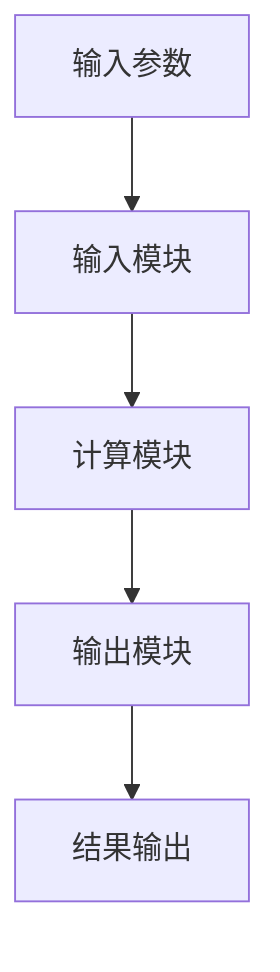
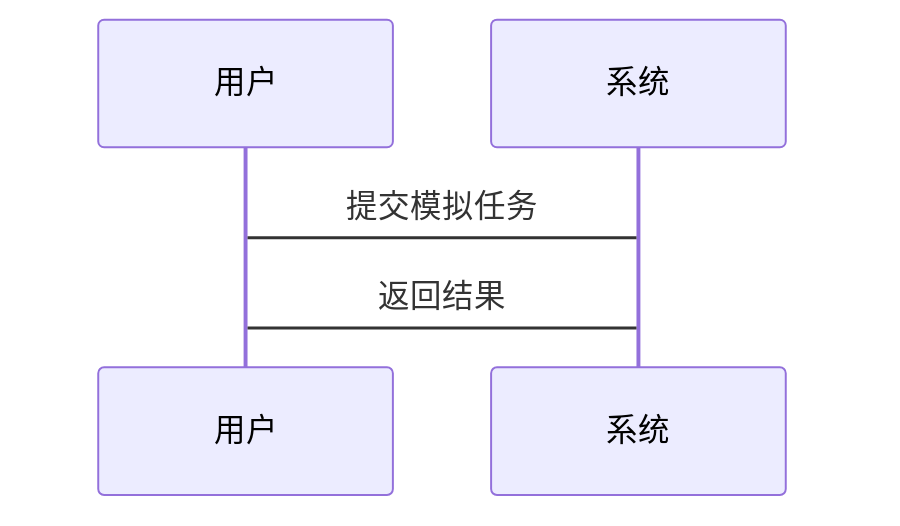

                 


# 企业估值中的量子计算化学模拟平台评估

> 关键词：量子计算，化学模拟，企业估值，平台评估，技术分析

> 摘要：随着量子计算技术的快速发展，其在化学模拟领域的应用为企业估值提供了全新的视角。本文详细探讨了量子计算化学模拟平台在企业估值中的评估方法，涵盖了平台背景、核心概念、算法原理、系统架构及项目实战等方面，为企业估值提供了一种高效、精确的新思路。

---

## 第一部分: 企业估值中的量子计算化学模拟平台评估基础

### 第1章: 企业估值与量子计算化学模拟平台的背景介绍

#### 1.1 问题背景与定义
##### 1.1.1 企业估值的传统方法与局限性
传统的企业估值方法主要依赖于财务指标分析、市场比较法和DCF模型等。然而，这些方法在处理复杂化学反应模拟时显得力不从心，尤其是在涉及量子效应的情况下，传统方法无法提供足够的精度和效率。

##### 1.1.2 量子计算与化学模拟的结合
量子计算作为一种新兴的计算范式，能够处理复杂的化学模拟问题，如分子结构计算和化学反应动力学分析。通过量子计算，企业估值可以更准确地预测材料性能、优化化学工艺，从而提高估值的准确性。

##### 1.1.3 平台评估的核心要素与边界
量子计算化学模拟平台的评估需要考虑硬件性能、算法效率、模拟精度和用户界面等因素。评估的边界包括平台的适用范围、计算资源需求以及用户的技术背景。

#### 1.2 核心概念与属性
##### 1.2.1 量子计算化学模拟的定义
量子计算化学模拟是指利用量子计算机进行化学系统的建模和模拟，以解决传统计算机难以处理的复杂问题。

##### 1.2.2 平台评估的关键属性对比
| 属性 | 描述 |
|------|------|
| 硬件需求 | 是否支持量子计算硬件 |
| 软件功能 | 是否提供量子化学算法 |
| 计算效率 | 是否优于经典计算方法 |
| 模拟精度 | 是否能够准确模拟量子效应 |

##### 1.2.3 核心要素的结构化分析
- **硬件**：量子计算芯片的性能直接影响模拟的精度和速度。
- **软件**：量子化学算法的设计决定了平台的适用范围和效率。
- **数据**：化学模拟数据的质量影响最终的估值结果。

#### 1.3 本章小结
本章介绍了企业估值中量子计算化学模拟平台的背景、核心概念和评估要素，为后续的详细分析奠定了基础。

---

### 第2章: 量子计算与化学模拟的基本原理

#### 2.1 量子计算的基本原理
##### 2.1.1 量子位与量子叠加
量子位（qubit）是量子计算的基本单位，具有叠加态，即可以同时处于多个状态的线性组合。

##### 2.1.2 量子纠缠与量子算法
量子纠缠是量子计算的核心资源，使得量子算法能够在某些情况下显著优于经典算法。

##### 2.1.3 量子计算的优势与挑战
- **优势**：并行计算能力强，适用于复杂问题。
- **挑战**：量子纠错困难，硬件实现复杂。

#### 2.2 化学模拟的数学模型
##### 2.2.1 哈密顿量与量子态
化学系统的哈密顿量描述了系统的能量状态，量子态的叠加和纠缠决定了系统的性质。

##### 2.2.2 变分法与近似计算
变分法是一种常用的近似计算方法，用于处理复杂的量子系统。

##### 2.2.3 模拟化学反应的基本步骤
1. 建立化学系统的哈密顿量。
2. 选择适当的量子算法。
3. 进行量子计算并获得结果。

#### 2.3 量子计算在化学模拟中的应用
##### 2.3.1 分子结构的量子模拟
通过量子计算可以精确模拟分子的电子结构，从而预测其化学性质。

##### 2.3.2 材料性质的预测
量子计算可以预测材料的强度、导电性等物理性质，为材料科学提供支持。

##### 2.3.3 化学反应动力学的计算
量子计算能够模拟化学反应的动态过程，帮助理解反应机理。

#### 2.4 本章小结
本章详细介绍了量子计算和化学模拟的基本原理及其在企业估值中的应用，为后续的平台评估提供了理论基础。

---

## 第三部分: 量子计算化学模拟平台的评估方法论

### 第3章: 量子计算化学模拟平台的评估方法

#### 3.1 评估指标与框架
##### 3.1.1 平台性能评估指标
- **计算速度**：完成模拟所需的时间。
- **模拟精度**：结果与实际值的接近程度。
- **硬件利用率**：量子计算资源的使用效率。

##### 3.1.2 评估框架的设计原则
- **全面性**：覆盖硬件、软件和数据等多个方面。
- **可操作性**：便于实际应用和测量。

##### 3.1.3 评估流程的标准化
1. 明确评估目标。
2. 收集相关数据。
3. 进行指标计算。
4. 分析结果并提出建议。

#### 3.2 核心算法与实现
##### 3.2.1 变分量子算法的实现
变分量子算法是一种常用的量子优化算法，适用于化学模拟问题。

##### 3.2.2 量子化学计算的优化方法
通过优化量子算法的参数设置，可以提高计算效率。

##### 3.2.3 平台实现的代码示例
```python
import numpy as np
from qiskit import QuantumCircuit, Aer

def quantum_chemistry_algorithm(hamiltonian):
    circuit = QuantumCircuit(...)
    # Implement quantum algorithm
    result = Aer.get_backend('statevector_simulator').run(circuit).result()
    return result
```

#### 3.3 评估案例与分析
##### 3.3.1 案例背景与目标
以某个化学反应的模拟为例，评估平台的性能。

##### 3.3.2 评估过程与结果
通过实际测试，计算平台的模拟精度和计算速度。

##### 3.3.3 案例总结与启示
总结案例经验，提出改进建议。

#### 3.4 本章小结
本章通过实际案例分析，详细探讨了量子计算化学模拟平台的评估方法，为企业估值提供了实用的指导。

---

## 第四部分: 平台系统架构与设计

### 第4章: 平台系统架构与设计

#### 4.1 系统架构概述
##### 4.1.1 平台模块划分
- **输入模块**：接收化学模拟的参数。
- **计算模块**：执行量子算法。
- **输出模块**：显示结果。

##### 4.1.2 数据流与交互流程
使用mermaid图展示数据流。



##### 4.1.3 架构设计的优缺点
优点：模块化设计便于维护；缺点：需要高性能的量子计算硬件。

#### 4.2 系统功能设计
##### 4.2.1 用户界面设计
用户友好的界面便于操作。

##### 4.2.2 计算引擎实现
实现量子算法的核心部分。

##### 4.2.3 数据存储与管理
有效管理模拟数据。

#### 4.3 系统接口与交互
##### 4.3.1 API设计规范
定义清晰的API接口。

##### 4.3.2 用户与系统的交互流程
使用mermaid图展示交互流程。



##### 4.3.3 系统容错与纠错机制
确保系统稳定运行。

#### 4.4 本章小结
本章详细讨论了平台的系统架构与设计，为后续的项目实施提供了指导。

---

## 第五部分: 项目实战

### 第5章: 项目实战与总结

#### 5.1 项目环境与安装
##### 5.1.1 环境搭建
安装必要的软件和库。

##### 5.1.2 软件依赖
列出项目所需的依赖项。

#### 5.2 核心代码实现
##### 5.2.1 量子化学算法的实现
实现变分量子算法。

##### 5.2.2 代码解读与分析
详细解释代码的功能。

##### 5.2.3 代码优化建议
提出优化建议。

#### 5.3 项目案例分析
##### 5.3.1 案例背景
介绍案例的具体情况。

##### 5.3.2 评估过程
详细描述评估过程。

##### 5.3.3 结果分析
分析评估结果并提出建议。

#### 5.4 项目总结
总结项目的成果与经验。

#### 5.5 注意事项与建议
提出在实际应用中需要注意的问题。

#### 5.6 本章小结
本章通过项目实战，验证了量子计算化学模拟平台在企业估值中的应用效果。

---

## 第六部分: 总结与展望

### 第6章: 总结与展望

#### 6.1 全文总结
总结全文的主要内容和研究成果。

#### 6.2 未来展望
展望量子计算化学模拟平台在企业估值中的进一步应用。

#### 6.3 本章小结
全文总结，强调研究的重要性和未来发展方向。

---

## 参考文献

（此处列出相关文献和资料）

---

## 作者信息

作者：AI天才研究院 & 禅与计算机程序设计艺术

