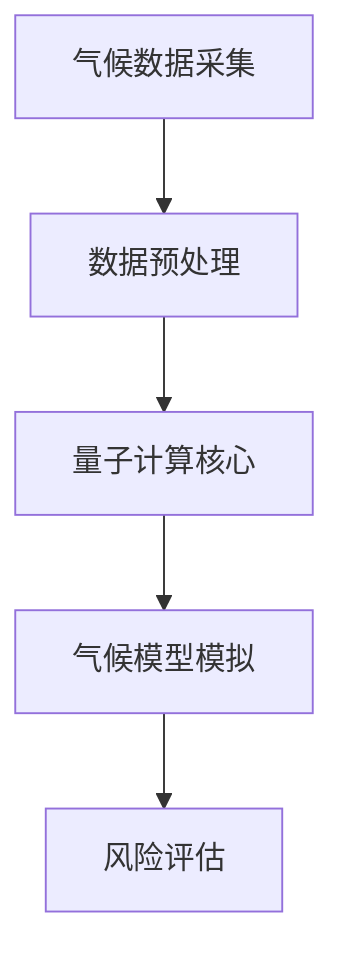

                 


# 企业估值中的量子计算气候模型模拟评估

## 关键词：企业估值、量子计算、气候模型、模拟评估、风险管理

## 摘要

随着全球气候变化的加剧，企业估值面临着前所未有的挑战。传统的估值方法难以准确评估气候变化带来的风险。量子计算的出现，为气候建模和风险评估提供了新的可能性。本文将深入探讨量子计算在气候建模中的应用，并展示如何利用这些模型改进企业估值。通过详细分析量子计算的核心原理、气候模型的构建以及它们在企业估值中的应用，本文为读者提供了一个全新的视角来理解气候变化对企业价值的影响。

---

## 第一部分: 企业估值与量子计算气候模型的背景

### 第1章: 企业估值的传统方法与挑战

#### 1.1 企业估值的传统方法

企业估值的传统方法主要包括资产基础法、收益法和市场法。这些方法依赖于历史数据和市场假设，但在面对气候变化等复杂外部因素时，往往显得力不从心。

- 资产基础法：基于企业的物理资产进行估值，忽略了气候风险对无形资产的影响。
- 收益法：依赖于未来的现金流预测，但在气候变化的不确定性下，预测变得极其困难。
- 市场法：基于市场可比公司进行估值，但市场波动和气候风险使得这种方法的准确性大打折扣。

#### 1.2 气候变化对企业估值的影响

气候变化对企业的财务表现和估值有着深远的影响。极端天气事件、政策变化和供应链中断都可能对企业造成重大损失。

- **极端天气事件**：如飓风、洪水等，可能导致企业的直接损失，影响其盈利能力。
- **政策变化**：碳中和目标和环保法规的加强，迫使企业投入更多资源进行可持续发展。
- **供应链中断**：气候变化可能导致原材料供应不稳定，增加企业的运营成本。

#### 1.3 量子计算在复杂系统模拟中的优势

量子计算在处理复杂系统模拟方面具有显著优势。其并行计算能力和强大的处理能力使得量子计算能够处理传统计算机无法应对的复杂问题。

- **并行计算能力**：量子计算机可以在同一时间处理大量数据，非常适合处理气候建模中的复杂问题。
- **强大的处理能力**：量子计算能够在短时间内处理海量数据，提高气候模型的计算效率和准确性。

---

## 第二部分: 量子计算与气候模型的核心概念

### 第2章: 量子计算的核心原理

#### 2.1 量子位与量子叠加

量子位（Qubit）是量子计算的基本单位，与经典计算机中的比特（Bit）不同，它可以同时处于多个状态的叠加态。

- **量子叠加**：$|q\rangle = \alpha|0\rangle + \beta|1\rangle$，其中$\alpha$和$\beta$是概率幅，满足$|\alpha|^2 + |\beta|^2 = 1$。
- **应用**：在气候建模中，量子叠加可以用于同时模拟多种气候变量，如温度、湿度和气压的变化。

#### 2.2 量子纠缠与量子通信

量子纠缠是量子力学中的一个重要现象，两个或多个粒子之间可以产生纠缠态，无论距离多远。

- **量子纠缠**：$| \psi \rangle = \frac{1}{\sqrt{2}}(|0\rangle \otimes |1\rangle + |1\rangle \otimes |0\rangle)$，展示了两个粒子之间的高度相关性。
- **应用**：在气候模型中，量子纠缠可以用于模拟气候系统中变量之间的相互作用和依赖关系。

#### 2.3 量子计算的算法与应用

量子算法是量子计算的核心，它们能够在某些特定问题上显著优于经典算法。

- **Shor算法**：用于大数分解，适用于密码学和气候模型的优化。
- **Grover算法**：用于无序数据库搜索，可以提高气候模型的参数优化效率。

---

## 第三部分: 量子计算气候模型的数学模型与算法

### 第3章: 气候模型的构建与模拟

#### 3.1 气候模型的基本结构

气候模型是一个复杂的系统，包含大气、海洋、陆地和冰冻圈等多个子系统。

- **大气动力学方程**：描述大气流动和能量交换。
- **辐射传输方程**：计算地球表面和大气层之间的辐射平衡。

#### 3.2 量子计算在气候建模中的应用

量子计算可以显著提高气候模型的计算效率和准确性。

- **量子模拟**：利用量子计算机模拟气候系统中的量子态，提高模型的精度。
- **优化算法**：使用量子优化算法改进气候模型的参数选择和优化。

---

## 第四部分: 量子计算气候模型在企业估值中的应用

### 第4章: 企业估值中的气候风险评估

#### 4.1 气候风险对企业估值的影响

气候风险可以通过多种方式影响企业估值，包括直接损失、政策风险和市场波动。

- **直接损失**：极端天气事件可能导致企业的物理资产损失。
- **政策风险**：环保法规的加强可能增加企业的合规成本。
- **市场波动**：气候变化可能导致市场价格的剧烈波动，影响企业的市值。

#### 4.2 量子计算在气候风险量化中的应用

量子计算可以通过模拟气候系统的量子态，量化气候风险对企业估值的影响。

- **量子蒙特卡洛模拟**：利用量子计算机进行气候风险的蒙特卡洛模拟，提高计算效率。
- **量子回归分析**：使用量子回归模型分析气候变量与企业估值之间的关系。

---

## 第五部分: 量子计算气候模型的系统架构与实现

### 第5章: 系统架构设计

#### 5.1 系统功能设计

气候模型系统需要具备数据采集、模型模拟和风险评估三大功能。

- **数据采集**：收集气候数据，包括温度、湿度、气压等。
- **模型模拟**：利用量子计算机模拟气候系统，生成气候预测结果。
- **风险评估**：根据气候预测结果，评估气候风险对企业估值的影响。

#### 5.2 系统架构图



### 第6章: 系统实现

#### 6.1 环境安装

安装量子计算环境和相关工具，如Qiskit（IBM的量子计算库）。

```bash
pip install qiskit
```

#### 6.2 核心代码实现

以下是量子计算气候模型的核心代码示例：

```python
from qiskit import QuantumCircuit, Aer, execute
from qiskit.visualization import plot_bloch_vector

# 创建量子电路
qc = QuantumCircuit(2, 2)

# 应用哈达玛门
qc.h(0)
qc.cx(0, 1)

# 测量
qc.measure(0, 0)
qc.measure(1, 1)

# 执行量子计算
simulator = Aer.get_backend('qasm_simulator')
job = execute(qc, simulator)
result = job.result()

# 输出结果
print(result.get_counts())
```

#### 6.3 案例分析

以某企业为例，分析气候变化对其估值的影响。通过量子计算模拟气候数据，评估企业的气候风险，并提出相应的风险管理策略。

---

## 第六部分: 总结与展望

### 6.1 本章小结

本文详细探讨了量子计算在气候建模中的应用，并展示了如何利用这些模型改进企业估值。通过量子计算的并行计算能力和强大的处理能力，我们可以更准确地评估气候变化带来的风险。

### 6.2 注意事项

- 量子计算目前仍处于发展阶段，实际应用中可能面临技术和成本的挑战。
- 气候模型的准确性依赖于数据质量和算法设计，需要持续优化和改进。

### 6.3 拓展阅读

- 《量子计算入门》
- 《气候建模与模拟》
- 《企业风险管理与估值》

---

## 作者

**作者：AI天才研究院/AI Genius Institute & 禅与计算机程序设计艺术 /Zen And The Art of Computer Programming**

---

通过本文的详细分析，读者可以全面了解量子计算在气候建模中的应用，并掌握如何利用这些模型改进企业估值。希望本文能够为相关领域的研究和实践提供有价值的参考。

