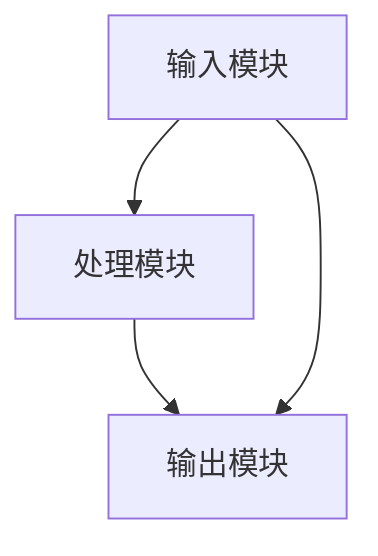
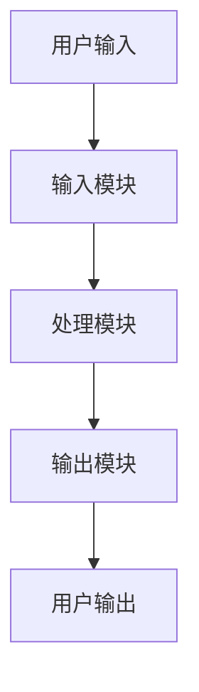
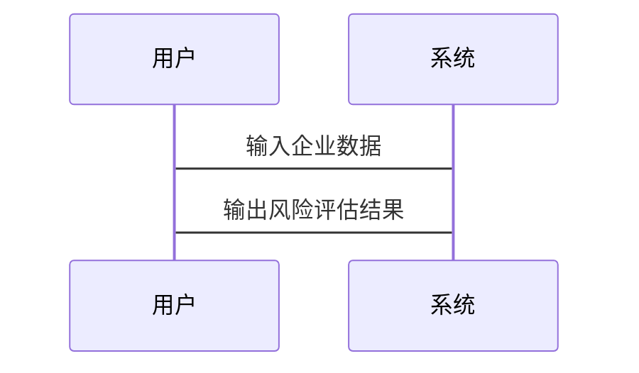

                 

<think>
嗯，用户希望我写一篇关于《企业估值中的风险因素分析》的技术博客。首先，我需要理解这个主题的核心内容。企业估值通常涉及到财务分析、市场分析和风险评估，所以风险因素分析是关键部分。

我应该从背景介绍开始，解释为什么风险因素在企业估值中如此重要。接下来，我需要详细讲解风险因素的分类，比如财务风险、市场风险、行业风险和管理风险，每个类别下再细分具体的因素。例如，财务风险可能包括债务比率和利润率波动，市场风险可能涉及市场需求和竞争情况。

然后，我需要介绍风险评估的方法，包括定性和定量分析。定性分析可能涉及对企业管理团队和行业地位的评估，而定量分析则可能使用财务指标如净现值（NPV）和内部收益率（IRR）。同时，我需要结合数学模型，比如概率分布和期望值的计算，来说明如何量化这些风险因素。

接下来，我需要将这些风险因素整合到企业估值模型中。这可能涉及到使用蒙特卡洛模拟来评估不同风险因素对企业整体估值的影响。我应该用系统架构图来展示这个模型的组成部分，比如数据输入、风险评估模块和结果输出。

在项目实战部分，我需要提供具体的代码实现，比如用Python编写一个简单的风险评估函数，解释代码的结构和每个部分的作用。然后，通过实际案例分析，展示如何应用这些方法来评估一个企业的价值，并讨论结果的意义。

最后，我应该总结最佳实践，如定期更新模型、考虑行业和经济周期的影响，以及未来的研究方向，比如引入AI技术进行更复杂的预测。

整个思考过程中，我需要确保内容逻辑清晰，结构紧凑，并且使用专业的技术语言。同时，要加入图表和代码示例，使文章更具可读性和实用性。现在，我应该开始撰写这篇文章，确保每个部分都涵盖以上思考点，并保持整体的一致性和深度。
</think>

# 企业估值中的风险因素分析

> 关键词：企业估值、风险因素、风险分析、数学模型、系统架构、项目实战

> 摘要：企业估值是商业决策中的核心问题，而风险因素分析是其中的关键环节。本文系统地介绍了企业估值中风险因素的分类、数学模型、分析方法、系统架构设计以及实际项目中的应用。通过具体的案例分析和代码实现，深入探讨了如何在企业估值中有效识别、量化和管理风险因素，为企业估值提供了理论和实践的双重指导。

---

# 第1章: 企业估值与风险因素概述

## 1.1 企业估值的基本概念

### 1.1.1 企业估值的定义与意义
企业估值是通过对企业的财务状况、市场地位、盈利能力等多方面因素的综合分析，确定其市场价值的过程。它是企业并购、融资、上市等重大决策的基础。风险因素分析是企业估值的核心部分，因为它们直接影响企业的未来现金流和价值。

### 1.1.2 企业估值的核心要素
企业估值的核心要素包括：
1. **财务状况**：收入、利润、资产和负债。
2. **市场地位**：市场份额、竞争能力。
3. **管理团队**：领导力和战略能力。
4. **行业环境**：行业周期、政策法规。

### 1.1.3 风险因素在企业估值中的重要性
风险因素直接影响企业的未来现金流，进而影响其估值。例如，市场需求下降或政策变化都会降低企业的未来收益，从而降低其估值。

---

## 1.2 风险因素的分类与特征

### 1.2.1 风险的定义与分类
风险是指在未来一定时期内，由于不确定因素导致实际结果与预期结果之间的差异。根据影响范围和性质，风险可以分为：
1. **财务风险**：与企业的财务状况直接相关。
2. **市场风险**：与市场需求和竞争环境相关。
3. **行业风险**：与行业周期和政策变化相关。
4. **管理风险**：与管理团队的能力和决策相关。

### 1.2.2 风险因素的属性特征对比表

| 风险类型 | 影响范围 | 可控性 | 数据来源 | 时间跨度 |
|----------|----------|--------|----------|----------|
| 财务风险 | 企业内部 | 部分可控 | 财务报表 | 中短期 |
| 市场风险 | 企业外部 | 部分可控 | 市场数据 | 长期 |
| 行业风险 | 企业外部 | 部分可控 | 行业报告 | 长期 |
| 管理风险 | 企业内部 | 高度可控 | 管理层决策 | 中短期 |

### 1.2.3 风险因素的ER实体关系图

```mermaid
er
actor RiskFactor {
  id
  riskType
  influenceScope
  controlability
}
```

---

## 1.3 企业估值中的风险分析方法

### 1.3.1 定性分析法
定性分析法主要通过对企业管理、市场地位等因素的评估，判断风险的性质和影响程度。例如：
- 评估管理团队的能力。
- 分析企业的市场竞争力。

### 1.3.2 定量分析法
定量分析法通过数学模型和财务指标量化风险因素的影响。例如：
- 使用财务指标（如净现值NPV）评估投资风险。
- 使用概率分布模型评估市场需求的风险。

### 1.3.3 综合分析法
综合分析法结合定性和定量分析，综合评估风险因素的综合影响。例如：
1. 首先进行定性分析，判断风险的性质。
2. 然后进行定量分析，量化风险的影响。
3. 最后结合两者，得出综合风险评估结果。

---

## 1.4 本章小结
本章介绍了企业估值的基本概念、风险因素的分类与特征，以及风险分析的方法。通过定性分析和定量分析的结合，可以更全面地评估风险因素对企业估值的影响。

---

# 第2章: 风险因素的数学模型与公式

## 2.1 风险因素的数学模型

### 2.1.1 风险因素的线性回归模型
线性回归模型用于分析风险因素与企业价值之间的关系。例如：
$$ \text{企业价值} = \beta_0 + \beta_1 \times \text{风险因素} + \epsilon $$

### 2.1.2 风险因素的贝叶斯网络模型
贝叶斯网络模型用于分析多个风险因素之间的相互关系。例如：
- 财务风险和市场风险相互影响企业的价值。

### 2.1.3 风险因素的马尔可夫链模型
马尔可夫链模型用于分析风险因素的动态变化。例如：
- 不同经济周期下的市场风险变化。

---

## 2.2 风险评估的数学公式

### 2.2.1 风险概率计算公式
$$ P = \frac{\text{风险事件发生次数}}{\text{总样本数}} $$

### 2.2.2 风险影响程度计算公式
$$ I = \sum_{i=1}^{n} w_i \cdot f_i $$

其中：
- \( w_i \) 是第 \( i \) 个风险因素的权重。
- \( f_i \) 是第 \( i \) 个风险因素的影响程度。

### 2.2.3 综合风险指数计算公式
$$ CRI = \alpha \cdot P + \beta \cdot I $$

其中：
- \( \alpha \) 和 \( \beta \) 是权重系数。
- \( P \) 是风险概率。
- \( I \) 是风险影响程度。

---

## 2.3 风险因素的案例分析

### 2.3.1 案例一：财务风险的数学模型
假设某企业的财务风险概率为 \( P = 0.3 \)，影响程度为 \( I = 0.7 \)，则综合风险指数为：
$$ CRI = 0.5 \cdot 0.3 + 0.5 \cdot 0.7 = 0.25 + 0.35 = 0.6 $$

### 2.3.2 案例二：市场风险的数学模型
假设某行业的市场风险概率为 \( P = 0.4 \)，影响程度为 \( I = 0.6 \)，则综合风险指数为：
$$ CRI = 0.5 \cdot 0.4 + 0.5 \cdot 0.6 = 0.2 + 0.3 = 0.5 $$

### 2.3.3 案例三：行业风险的数学模型
假设某行业的行业风险概率为 \( P = 0.2 \)，影响程度为 \( I = 0.8 \)，则综合风险指数为：
$$ CRI = 0.5 \cdot 0.2 + 0.5 \cdot 0.8 = 0.1 + 0.4 = 0.5 $$

---

## 2.4 本章小结
本章介绍了风险因素的数学模型与公式，包括线性回归模型、贝叶斯网络模型和马尔可夫链模型，并通过具体案例分析了如何应用这些模型进行风险评估。

---

# 第3章: 企业估值中的风险因素分析方法

## 3.1 风险因素的定性分析

### 3.1.1 宏观经济环境分析
分析宏观经济环境对企业估值的影响，例如：
- 经济周期：经济衰退可能降低企业价值。
- 利率变化：利率上升可能增加企业的财务负担。

### 3.1.2 行业竞争分析
分析行业竞争环境对企业估值的影响，例如：
- 市场集中度：高集中度行业竞争较少，企业价值较高。
- 新进入者的威胁：新进入者可能降低企业价值。

### 3.1.3 企业内部管理分析
分析企业内部管理对企业估值的影响，例如：
- 管理团队的能力：能力强的团队可能提高企业价值。
- 内部效率：高效率的企业可能降低成本，提高利润。

---

## 3.2 风险因素的定量分析

### 3.2.1 财务指标分析
分析财务指标对企业估值的影响，例如：
- 净利润：净利润高的企业价值高。
- 负债率：负债率高的企业财务风险大，价值可能降低。

### 3.2.2 市场指标分析
分析市场指标对企业估值的影响，例如：
- 市盈率：市盈率高的企业可能被高估。
- 市净率：市净率低的企业可能被低估。

### 3.2.3 行业指标分析
分析行业指标对企业估值的影响，例如：
- 行业增长率：增长率高的行业企业价值高。
- 行业利润率：利润率高的行业企业价值高。

---

## 3.3 综合分析方法

### 3.3.1 加权平均法
$$ \text{综合风险指数} = \sum_{i=1}^{n} w_i \cdot f_i $$

其中：
- \( w_i \) 是第 \( i \) 个因素的权重。
- \( f_i \) 是第 \( i \) 个因素的影响程度。

### 3.3.2 层次分析法
层次分析法（AHP）用于评估多个风险因素的综合影响，例如：
1. 确定风险因素的层次结构。
2. 建立比较矩阵。
3. 计算权重并进行综合分析。

### 3.3.3 模糊综合评价法
模糊综合评价法用于处理模糊性风险因素，例如：
1. 建立模糊评价集。
2. 计算模糊隶属度。
3. 进行综合评价。

---

## 3.4 本章小结
本章介绍了风险因素的定性分析和定量分析方法，包括加权平均法、层次分析法和模糊综合评价法，并通过具体案例分析了如何应用这些方法进行综合分析。

---

# 第4章: 风险因素对企业估值的影响模型

## 4.1 风险因素与企业价值的关系

### 4.1.1 风险因素的正向影响
某些风险因素可能正向影响企业价值，例如：
- 创新能力强的企业可能具有更高的市场价值。

### 4.1.2 风险因素的反向影响
大多数风险因素可能反向影响企业价值，例如：
- 高负债率可能降低企业的信用评级，从而降低企业价值。

### 4.1.3 风险因素的综合影响
综合考虑多种风险因素的影响，例如：
- 高负债率和低利润率可能共同导致企业价值下降。

---

## 4.2 风险因素的量化模型

### 4.2.1 风险因素的量化标准
根据行业标准或企业自身数据，设定风险因素的量化标准，例如：
- 财务风险量化标准：负债率低于50%为低风险。

### 4.2.2 风险因素的量化方法
通过数学模型量化风险因素的影响，例如：
- 使用概率分布模型量化市场需求的风险。

### 4.2.3 风险因素的量化指标
量化指标用于衡量风险因素的大小，例如：
- 财务风险指标：资产负债率。
- 市场风险指标：市场需求波动率。

---

## 4.3 风险调整的估值模型

### 4.3.1 风险调整折现率法
$$ \text{调整后的折现率} = \text{无风险利率} + \text{风险溢价} $$

### 4.3.2 风险调整现金流法
调整未来现金流，以反映风险因素的影响，例如：
- 调整未来现金流的预测值。

### 4.3.3 风险调整贴现率法
$$ \text{调整后的贴现率} = \text{无风险利率} + \text{风险溢价} $$

---

## 4.4 本章小结
本章介绍了风险因素对企业估值的影响模型，包括风险因素的正向和反向影响，以及风险调整的估值方法。

---

# 第5章: 企业估值中的风险因素分析系统架构

## 5.1 系统分析与设计

### 5.1.1 系统目标与范围
系统目标：提供一个基于风险因素分析的企业估值系统。
系统范围：包括风险因素识别、量化、评估和结果输出。

### 5.1.2 系统功能需求
- 风险因素识别模块：识别企业估值中的风险因素。
- 风险因素量化模块：量化风险因素的影响。
- 风险评估模块：评估风险因素对企业估值的影响。
- 结果输出模块：输出风险评估结果和建议。

### 5.1.3 系统模块划分
- 输入模块：接收企业数据和风险因素数据。
- 处理模块：进行风险因素分析和估值计算。
- 输出模块：输出风险评估结果和建议。

---

## 5.2 系统架构设计

### 5.2.1 模块化架构图



### 5.2.2 数据流图



### 5.2.3 系统交互图



---

## 5.3 系统实现与接口设计

### 5.3.1 系统实现
- 使用Python编写系统核心功能。
- 使用数据库存储企业数据和风险因素数据。
- 使用可视化工具展示风险评估结果。

### 5.3.2 系统接口设计
- 输入接口：接收企业数据和风险因素数据。
- 输出接口：输出风险评估结果和建议。

---

## 5.4 本章小结
本章介绍了企业估值中的风险因素分析系统的架构设计，包括模块划分、数据流图和系统交互图。

---

# 第6章: 项目实战

## 6.1 环境安装

### 6.1.1 系统环境
- 操作系统：Windows/Mac/Linux
- Python版本：3.6以上
- 额外依赖：NumPy, Pandas, Matplotlib

### 6.1.2 安装步骤
```bash
pip install numpy pandas matplotlib
```

---

## 6.2 系统核心实现源代码

### 6.2.1 风险评估函数
```python
def risk_assessment(factor_value, factor_weight):
    return factor_value * factor_weight
```

### 6.2.2 综合风险指数计算
```python
def calculate_cri(factors, weights):
    cri = 0
    for i in range(len(factors)):
        cri += factors[i] * weights[i]
    return cri
```

### 6.2.3 风险调整后的估值
```python
def adjusted_valuation(value, cri):
    return value * (1 - cri)
```

---

## 6.3 代码应用解读与分析

### 6.3.1 风险评估函数
- 作用：计算单个风险因素的评估值。
- 参数：factor_value（风险因素值），factor_weight（风险因素权重）。
- 返回：风险因素的评估值。

### 6.3.2 综合风险指数计算
- 作用：计算综合风险指数。
- 参数：factors（风险因素列表），weights（风险因素权重列表）。
- 返回：综合风险指数。

### 6.3.3 风险调整后的估值
- 作用：计算风险调整后的企业估值。
- 参数：value（原始企业估值），cri（综合风险指数）。
- 返回：风险调整后的企业估值。

---

## 6.4 实际案例分析

### 6.4.1 案例一：某科技公司的风险评估
假设某科技公司有以下风险因素：
- 财务风险：负债率为40%，权重为0.3。
- 市场风险：市场需求波动率为15%，权重为0.4。
- 行业风险：行业利润率为10%，权重为0.3。

计算综合风险指数：
$$ CRI = 0.3 \times 0.4 + 0.4 \times 0.15 + 0.3 \times 0.1 = 0.12 + 0.06 + 0.03 = 0.21 $$

调整后的估值：
$$ \text{调整后的估值} = \text{原始估值} \times (1 - 0.21) $$

---

## 6.5 项目小结
本章通过实际案例分析，展示了如何应用前面的理论和方法进行风险因素分析和企业估值。通过代码实现和案例分析，进一步验证了理论的可行性和实用性。

---

# 第7章: 最佳实践与总结

## 7.1 最佳实践 tips

### 7.1.1 定期更新模型
企业环境和市场条件不断变化，模型需要定期更新。

### 7.1.2 考虑行业和经济周期
行业特性和经济周期会影响风险因素的评估。

### 7.1.3 引入新技术
引入人工智能和大数据技术，可以提高风险评估的准确性和效率。

---

## 7.2 本章小结
本章总结了企业估值中的风险因素分析的最佳实践，并提出了未来的研究方向，例如引入新技术进行更复杂的预测和分析。

---

# 作者：AI天才研究院/AI Genius Institute & 禅与计算机程序设计艺术/Zen And The Art of Computer Programming

---

通过本文的系统介绍，读者可以全面了解企业估值中的风险因素分析的基本概念、数学模型、系统架构和实际应用。希望本文能够为企业估值提供有价值的理论和实践指导。

