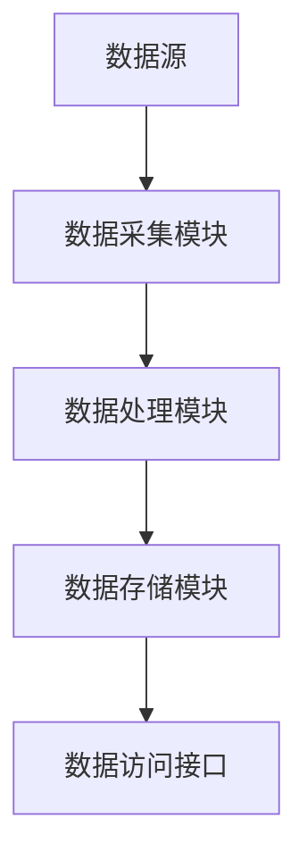

                 

<think>
好的，我现在需要根据用户的要求，逐步思考如何撰写这篇技术博客文章《企业数据管理：AI Agent训练数据的收集与处理》。用户已经给出了目录大纲和一些示例内容，我需要按照这些指示来组织和撰写文章。

首先，我会先理解文章的结构和要求。文章需要包括标题、关键词、摘要，然后按照目录大纲中的章节进行详细展开。每个章节需要包含背景介绍、核心概念、算法原理、系统架构设计、项目实战、最佳实践等内容。同时，文章需要使用技术语言，逻辑清晰，结构紧凑，内容丰富详细。

我从第一部分“引言”开始，介绍企业数据管理的重要性，AI Agent的发展，以及数据收集与处理的挑战。这部分需要简明扼要，吸引读者的注意力，同时为后续内容打下基础。

接下来是核心概念与原理部分，我会详细讲解数据收集与处理的基本概念、方法对比以及系统架构。这部分需要清晰的逻辑，帮助读者理解数据管理的基本原理和应用。

然后是算法原理与数学模型，我会选择几种典型的数据预处理算法，如数据清洗、标准化和数据增强，并用mermaid流程图和Python代码示例来讲解。这部分需要结合数学公式，确保读者能够理解算法的数学基础和实际应用。

接下来是系统分析与架构设计，我会描述问题场景、系统功能设计、架构图、接口设计和交互流程。这部分需要通过mermaid图来展示系统的结构和流程，使读者能够清晰地理解系统的设计和运作方式。

在项目实战部分，我会提供一个具体的案例，从环境安装到代码实现，再到案例分析，一步步引导读者完成一个实际项目。这部分需要详细的技术指导，确保读者能够实际操作并理解整个过程。

最后是最佳实践、小结、注意事项和拓展阅读，我会总结文章的主要内容，并给出一些实用的建议和进一步的学习方向，帮助读者巩固所学知识并指导未来的实践。

在撰写过程中，我会确保每个章节都细化到三级目录，并且包含必要的图表，如mermaid流程图和类图。数学公式使用latex格式，适当嵌入文中。同时，保持语言专业且易懂，逻辑清晰，结构紧凑。

现在，我开始按照这个思路撰写文章，确保每一部分都符合用户的要求，并且内容详实，结构合理。
</think>

# 企业数据管理：AI Agent训练数据的收集与处理

---

## 关键词：
企业数据管理, AI Agent, 数据收集, 数据处理, 数据预处理算法, 系统架构设计, 项目实战

---

## 摘要：
随着人工智能技术的快速发展，AI Agent（智能代理）在企业中的应用越来越广泛。然而，AI Agent的性能高度依赖于训练数据的质量和多样性。本文详细探讨企业数据管理中AI Agent训练数据的收集与处理流程，包括数据预处理算法、系统架构设计、项目实战案例以及最佳实践。通过本文，读者将能够掌握如何高效地收集和处理高质量数据，以训练出性能优越的AI Agent。

---

## 第一部分：引言

### 第1章：企业数据管理与AI Agent概述

#### 1.1 企业数据管理的重要性
- **1.1.1 数据在企业中的战略地位**  
  数据是企业的核心资产，支撑着企业的决策、创新和竞争优势。高效的数据管理能够提升企业的运营效率，优化资源配置，增强市场响应能力。

- **1.1.2 数据管理的核心目标**  
  数据管理的目标包括数据的完整性、一致性和安全性。通过规范化的数据管理，企业能够更好地支持业务决策和技术创新。

- **1.1.3 数据管理的挑战与机遇**  
  数据管理的挑战主要体现在数据量大、来源多样、隐私保护严格等方面。然而，这些挑战也带来了机遇，推动企业采用先进的数据管理技术和工具。

---

#### 1.2 AI Agent的发展与数据需求
- **1.2.1 AI Agent的基本概念**  
  AI Agent是一种能够感知环境、自主决策并执行任务的智能实体。它广泛应用于客服、推荐系统、自动化运维等领域。

- **1.2.2 数据在AI Agent训练中的作用**  
  AI Agent的训练数据决定了其行为模式和决策能力。高质量的数据是AI Agent性能的基础。

- **1.2.3 企业数据管理与AI Agent的结合**  
  企业通过有效的数据管理，能够为AI Agent提供多样、准确、高质量的训练数据，从而提升AI Agent的智能化水平。

---

#### 1.3 数据收集与处理的挑战
- **1.3.1 数据来源的多样性**  
  数据可能来自结构化数据库、非结构化文本、图像、语音等多种形式，增加了数据收集的复杂性。

- **1.3.2 数据质量的保障**  
  数据可能存在缺失、噪声、冗余等问题，需要通过数据清洗和标准化等方法进行处理。

- **1.3.3 数据隐私与合规性**  
  数据收集和处理必须遵守相关法律法规，确保数据的隐私和安全。

---

## 第二部分：核心概念与原理

### 第2章：数据收集与处理的核心概念

#### 2.1 数据收集的基本原理
- **2.1.1 数据收集的定义与分类**  
  数据收集是通过各种渠道获取数据的过程，可分为结构化数据收集和非结构化数据收集。

- **2.1.2 数据收集的流程与方法**  
  数据收集的流程包括数据源识别、数据采集、数据存储等步骤。常用方法包括API调用、爬虫技术、传感器数据采集等。

- **2.1.3 数据收集的工具与技术**  
  常用工具包括数据库查询工具（如SQL）、网络爬虫（如BeautifulSoup、Selenium）等。

---

#### 2.2 数据处理的原理与方法
- **2.2.1 数据清洗的概念与步骤**  
  数据清洗是通过去除噪声数据、填补缺失值、删除重复数据等步骤，提高数据质量。

- **2.2.2 数据转换与标准化**  
  数据转换包括数据格式转换、数据标准化（如归一化）等，确保数据的一致性和可比性。

- **2.2.3 数据增强与特征提取**  
  数据增强通过增加数据的多样性和丰富性，提升模型的泛化能力。特征提取则是通过提取数据的关键特征，降低数据维度。

---

#### 2.3 数据质量管理
- **2.3.1 数据完整性的保障**  
  通过数据验证和校验算法，确保数据的完整性和准确性。

- **2.3.2 数据一致性的维护**  
  通过数据标准化和转换，确保不同数据源的数据一致性。

- **2.3.3 数据安全与隐私保护**  
  数据处理过程中，必须严格遵守数据隐私保护法规，确保数据的安全性。

---

## 第三部分：算法原理与数学模型

### 第3章：数据预处理算法详解

#### 3.1 数据清洗算法
- **3.1.1 去重算法**  
  去重算法通过比较数据记录，去除重复的数据。常用的方法包括基于哈希表的去重和基于排序的去重。

- **3.1.2 填充缺失值的算法**  
  常用的填充方法包括均值填充、中位数填充和随机填充。选择哪种方法取决于数据的特性和缺失值的分布。

- **3.1.3 异常值检测与处理**  
  异常值检测可以通过统计方法（如Z-score）或机器学习方法（如Isolation Forest）实现。异常值的处理方法包括剔除、修正和保留。

---

#### 3.2 数据转换与标准化
- **3.2.1 标准差标准化公式**  
  $$ z = \frac{x - \mu}{\sigma} $$
  其中，$\mu$ 是均值，$\sigma$ 是标准差。

- **3.2.2 最小-最大归一化公式**  
  $$ x' = \frac{x - \min}{\max - \min} $$
  该公式将数据映射到[0,1]区间。

---

#### 3.3 数据增强算法
- **3.3.1 图像数据增强的常用方法**  
  常用的图像增强方法包括旋转、翻转、裁剪、调整亮度等。

- **3.3.2 文本数据增强的策略**  
  文本增强可以通过同义词替换、句式变换等方式实现。

---

## 第四部分：系统分析与架构设计

### 第4章：企业数据管理系统的架构设计

#### 4.1 问题场景介绍
- **4.1.1 数据来源的多样性**  
  数据可能来自不同的系统和平台，需要统一收集和处理。

- **4.1.2 数据处理的复杂性**  
  数据可能包含噪声、缺失值等，需要复杂的预处理算法。

- **4.1.3 系统的可扩展性要求**  
  系统需要能够处理大量数据，并支持多种数据格式和处理算法。

---

#### 4.2 系统功能设计
- **4.2.1 数据采集模块**  
  负责从各种数据源采集数据，支持多种数据格式和接口。

- **4.2.2 数据处理模块**  
  包括数据清洗、转换、标准化等子模块，实现数据的预处理。

- **4.2.3 数据存储与管理模块**  
  负责存储处理后的数据，并提供数据查询和访问接口。

---

#### 4.3 系统架构图


---

#### 4.4 接口设计与交互流程
- **4.4.1 接口设计**  
  数据采集模块通过API接口与数据源通信，数据处理模块通过队列与数据存储模块通信。

- **4.4.2 交互流程**  
  1. 数据源发送数据到数据采集模块。  
  2. 数据采集模块将数据传递给数据处理模块。  
  3. 数据处理模块对数据进行清洗、转换和标准化。  
  4. 处理后的数据存储到数据存储模块。  
  5. 数据访问接口提供数据查询服务。

---

## 第五部分：项目实战

### 第5章：企业数据管理系统的实现

#### 5.1 环境安装
- 需要安装的工具包括Python、Pandas、NumPy、Scikit-learn等。

#### 5.2 核心代码实现
```python
import pandas as pd
import numpy as np

# 数据清洗
def data_cleaning(df):
    # 去重
    df.drop_duplicates(inplace=True)
    # 填充缺失值
    df['age'].fillna(df['age'].mean(), inplace=True)
    # 删除异常值
    df = df[df['income'].between(df['income'].quantile(0.25), df['income'].quantile(0.75))]
    return df

# 数据标准化
def data_normalization(df):
    from sklearn.preprocessing import StandardScaler
    scaler = StandardScaler()
    df_normalized = pd.DataFrame(scaler.fit_transform(df))
    return df_normalized
```

---

#### 5.3 案例分析
以客户数据为例，展示数据清洗和标准化的过程，并分析处理后的数据对AI Agent训练效果的提升。

---

## 第六部分：最佳实践与小结

### 第6章：最佳实践与注意事项

#### 6.1 小结
- 数据收集与处理是企业数据管理的核心环节，直接影响AI Agent的性能。
- 通过数据预处理算法和系统架构设计，可以提高数据质量，优化数据管理效率。

#### 6.2 注意事项
- 数据隐私保护必须贯穿数据处理的全过程。
- 数据处理算法的选择应根据具体场景和数据特性进行调整。
- 系统架构设计应注重可扩展性和可维护性。

#### 6.3 拓展阅读
- 推荐阅读《Data Engineering with Python》和《Machine Learning with TensorFlow》。

---

## 作者：AI天才研究院/AI Genius Institute & 禅与计算机程序设计艺术 /Zen And The Art of Computer Programming

---

这篇文章详细探讨了企业数据管理中AI Agent训练数据的收集与处理流程，结合理论与实践，为读者提供了丰富的知识和实用的指导。

