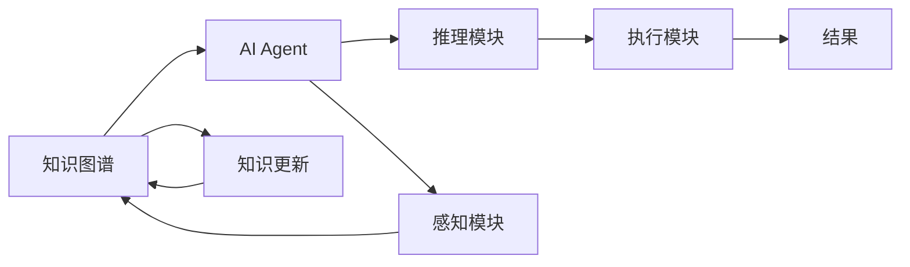
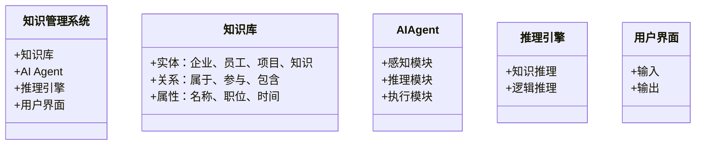
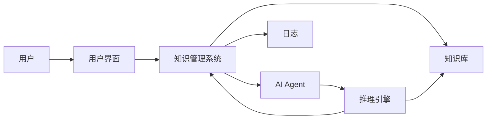
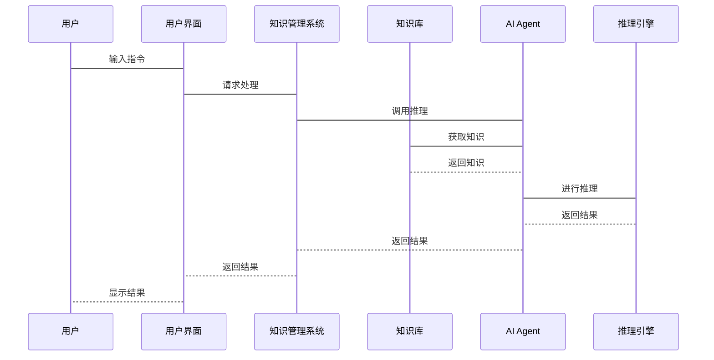

                 


# 企业知识图谱与AI Agent的深度融合应用

> 关键词：知识图谱，AI Agent，企业智能化，知识表示，智能推理

> 摘要：本文深入探讨了企业知识图谱与AI Agent的深度融合应用，从背景、核心概念、算法原理、系统架构到项目实战，全面分析了知识图谱与AI Agent的结合对企业智能化的推动作用，为企业应用提供理论支持与实践指导。

---

# 第一部分: 企业知识图谱与AI Agent的背景与概念

## 第1章: 企业知识图谱与AI Agent的背景介绍

### 1.1 问题背景

#### 1.1.1 企业信息化与智能化的需求
企业在信息化建设中积累了大量数据，但这些数据分散在不同的系统中，难以形成有效的知识关联。企业需要通过智能化手段，将这些数据转化为可理解、可推理的知识，以提升决策效率和业务自动化水平。

#### 1.1.2 知识图谱与AI Agent的提出
知识图谱通过构建语义网络，将企业数据转化为结构化的知识表示；AI Agent通过智能推理和自主决策，为企业提供个性化的服务和解决方案。两者的结合能够实现企业知识的动态更新和智能应用。

#### 1.1.3 当前企业应用中的主要挑战
- 数据孤岛问题：企业内部数据分散，缺乏统一的知识表示。
- 知识更新困难：知识图谱需要动态更新，但手动维护成本高。
- AI Agent的能力受限：AI Agent需要依赖外部知识库，无法充分理解企业内部复杂场景。

### 1.2 问题描述

#### 1.2.1 传统企业知识管理的局限性
传统知识管理主要依赖文档管理和数据库，难以实现知识的语义理解与推理，无法满足企业智能化需求。

#### 1.2.2 AI Agent在企业中的应用现状
AI Agent在企业中的应用主要集中在流程自动化和简单任务执行上，缺乏对复杂业务场景的深度理解和决策能力。

#### 1.2.3 知识图谱与AI Agent融合的必要性
通过知识图谱构建企业知识网络，AI Agent可以基于知识图谱进行智能推理和决策，从而实现企业智能化转型。

### 1.3 问题解决

#### 1.3.1 知识图谱构建的核心目标
- 实现企业数据的结构化表示。
- 建立企业知识的语义网络，支持智能推理。

#### 1.3.2 AI Agent的任务与功能
- 感知企业环境。
- 理解企业知识。
- 推理解决方案。
- 执行任务并反馈结果。

#### 1.3.3 融合后的应用价值
- 提升企业决策效率。
- 实现业务流程自动化。
- 提供个性化服务。

### 1.4 边界与外延

#### 1.4.1 知识图谱的边界
知识图谱仅关注企业的显性知识，不涉及隐性知识和员工技能。

#### 1.4.2 AI Agent的能力边界
AI Agent的决策能力依赖知识图谱的质量，无法处理完全未知的业务场景。

#### 1.4.3 融合应用的范围与限制
融合应用主要集中在企业内部知识管理和业务流程优化，目前难以应对完全动态和不可预测的业务需求。

### 1.5 概念结构与核心要素

#### 1.5.1 知识图谱的核心要素
- 实体：企业中的核心业务概念。
- 关系：实体之间的关联。
- 属性：实体的描述信息。

#### 1.5.2 AI Agent的核心要素
- 感知模块：获取环境信息。
- 推理模块：基于知识图谱进行推理。
- 执行模块：执行任务并反馈结果。

#### 1.5.3 融合后的系统架构
- 知识图谱提供知识基础。
- AI Agent提供动态推理能力。
- 融合系统具备知识表示、推理、执行的闭环能力。

---

## 第2章: 知识图谱与AI Agent的核心概念

### 2.1 知识图谱的原理

#### 2.1.1 知识抽取与表示
- 知识抽取：从企业文档中提取实体、关系和属性。
- 知识表示：使用图结构表示实体之间的关系。

#### 2.1.2 知识融合与推理
- 知识融合：将多个数据源中的知识整合到统一的知识图谱中。
- 知识推理：基于知识图谱进行逻辑推理，获取隐性知识。

#### 2.1.3 知识存储与管理
- 使用图数据库（如Neo4j）存储知识图谱。
- 定期更新知识图谱以反映企业动态变化。

### 2.2 AI Agent的原理

#### 2.2.1 感知与理解
- 通过自然语言处理技术理解用户指令。
- 通过知识图谱理解企业知识。

#### 2.2.2 决策与推理
- 基于知识图谱进行推理，生成解决方案。
- 结合上下文信息进行决策。

#### 2.2.3 执行与反馈
- 执行任务并返回结果。
- 根据反馈优化知识图谱和决策策略。

### 2.3 知识图谱与AI Agent的关系

#### 2.3.1 知识图谱为AI Agent提供知识基础
- 知识图谱是AI Agent进行推理和决策的基础。
- 通过知识图谱，AI Agent能够理解企业的复杂场景。

#### 2.3.2 AI Agent为知识图谱提供动态更新能力
- AI Agent可以通过执行任务获取新的知识，动态更新知识图谱。
- 知识图谱的动态更新使AI Agent能够适应企业变化。

#### 2.3.3 融合后的系统优势
- 知识图谱提供结构化的知识表示。
- AI Agent提供动态推理和执行能力。
- 融合系统具备知识表示、推理、执行的闭环能力。

## 第3章: 核心概念的属性对比与ER实体关系图

### 3.1 知识图谱与AI Agent的属性对比

| 属性 | 知识图谱 | AI Agent |
|------|----------|-----------|
| 核心目标 | 表示企业知识 | 执行企业任务 |
| 输入 | 文本、数据 | 用户指令、环境反馈 |
| 输出 | 知识图谱结构 | 行为、结果 |
| 依赖 | 大数据处理能力 | 知识图谱支持 |

### 3.2 ER实体关系图

```mermaid
erDiagram
    actor 顾客
    actor 系统管理员
    actor 开发者
    database 知识库
    database 用户数据
    database 日志
    system 知识图谱构建系统
    system AI Agent系统
    system 知识图谱更新系统
    system 用户界面
    system 日志分析系统
    system 知识图谱推理系统
    system 知识图谱执行系统
```



### 3.3 知识图谱与AI Agent的关系图



---

## 第4章: 算法原理讲解

### 4.1 知识图谱构建算法

#### 4.1.1 知识抽取算法
- 使用自然语言处理技术（如分词、实体识别）提取文本中的实体、关系和属性。
- 示例代码：
  ```python
  import spacy
  nlp = spacy.load("en_core_web_sm")
  text = "The company's revenue increased by 10% last year."
  doc = nlp(text)
  entities = [(ent.text, ent.label_) for ent in doc.ents]
  print(entities)
  ```

#### 4.1.2 知识融合算法
- 使用图嵌入算法（如Word2Vec、GraphSAGE）将多个数据源中的知识整合到统一的知识图谱中。
- 示例代码：
  ```python
  import tensorflow as tf
  from tensorflow.keras.layers import Embedding, Dense
  model = tf.keras.Sequential([
      Embedding(input_dim=1000, output_dim=100),
      Dense(10, activation='relu')
  ])
  ```

#### 4.1.3 知识推理算法
- 使用基于规则的推理（如RDF推理）或基于逻辑的推理（如一阶逻辑推理）进行知识推理。
- 示例代码：
  ```python
  from owlapy import OWLGraphWrapper
  graph = OWLGraphWrapper("http://example.org/ontology.owl")
  result = graph.query(axioms=[...])
  ```

### 4.2 AI Agent训练算法

#### 4.2.1 知识表示学习
- 使用图嵌入算法（如Node2Vec）将知识图谱中的节点表示为向量。
- 示例代码：
  ```python
  import node2vec
  model = node2vec.Node2Vec(graph, walks_per_node=10, embedding_size=100)
  ```

#### 4.2.2 智能推理算法
- 使用基于知识图谱的推理算法（如路径推理、规则推理）进行智能推理。
- 示例代码：
  ```python
  from kgpedia import inference
  result = inference.run_reasoning(knowledge_graph, query)
  ```

#### 4.2.3 强化学习优化
- 使用强化学习算法（如DQN）优化AI Agent的决策策略。
- 示例代码：
  ```python
  import numpy as np
  import gym
  env = gym.make('CartPole-v0')
  model = tf.keras.Sequential([...])
  ```

---

## 第5章: 系统分析与架构设计方案

### 5.1 问题场景介绍

#### 5.1.1 问题描述
企业希望构建一个智能化的知识管理系统，能够自动处理业务数据，提供智能决策支持。

#### 5.1.2 项目介绍
本项目旨在通过知识图谱和AI Agent的深度融合，构建一个智能化的知识管理系统，实现企业知识的动态更新和智能应用。

### 5.2 系统功能设计

#### 5.2.1 领域模型设计
- 实体：企业、员工、项目、知识。
- 关系：属于、参与、包含。
- 属性：名称、职位、时间。



### 5.3 系统架构设计

#### 5.3.1 系统架构图


#### 5.3.2 接口设计
- 用户接口：HTTP API。
- 系统内部接口：RPC或消息队列。

### 5.4 系统交互设计

#### 5.4.1 系统交互流程
1. 用户通过界面输入指令。
2. 系统调用AI Agent进行推理。
3. AI Agent从知识库获取知识。
4. 推理引擎进行推理。
5. 返回结果。

#### 5.4.2 交互序列图


---

## 第6章: 项目实战

### 6.1 环境安装

#### 6.1.1 知识图谱构建工具
- 使用Neo4j构建知识图谱。
- 安装Neo4j社区版：`brew install neo4j`

#### 6.1.2 AI Agent开发框架
- 使用Rasa框架开发AI Agent。
- 安装Rasa：`pip install rasa`

### 6.2 系统核心实现源代码

#### 6.2.1 知识图谱构建代码
```python
from neo4j import GraphDatabase
from neo4j.exceptions import ServiceUnavailable

def create_knowledge_graph(driver):
    with driver.session() as session:
        session.run("CREATE (a:Entity {name: '企业'})")
        session.run("CREATE (b:Entity {name: '员工'})")
        session.run("MATCH (a:Entity {name: '企业'}), (b:Entity {name: '员工'}) CREATE (a)-[r:关系 {type: '包含'}]->(b)")
```

#### 6.2.2 AI Agent推理代码
```python
from rasa.core.agent import Agent
from rasa.core.policies.rule_policy import RulePolicy
from rasa.core.policies.mdvd_policy import MDVDPolicy

def train_agent():
    agent = Agent("domain.yml", policies=[RulePolicy(), MDVDPolicy()])
    agent.train("train_stories.md", out="models")
```

### 6.3 代码应用解读与分析

#### 6.3.1 知识图谱构建
- 使用Neo4j图数据库构建企业知识图谱。
- 通过Cypher查询语言进行数据操作。

#### 6.3.2 AI Agent开发
- 使用Rasa框架开发对话式AI Agent。
- 定义领域模型（domain.yml）和训练数据（train_stories.md）。

### 6.4 实际案例分析

#### 6.4.1 案例介绍
企业希望构建一个智能问答系统，能够基于知识图谱回答员工的问题。

#### 6.4.2 案例实现
1. 构建企业知识图谱。
2. 开发AI Agent，集成知识图谱推理能力。
3. 部署系统并进行测试。

### 6.5 项目小结

#### 6.5.1 项目成果
- 成功构建企业知识图谱。
- 开发并部署智能问答系统。

#### 6.5.2 经验总结
- 知识图谱构建需要充分理解企业知识结构。
- AI Agent开发需要结合具体业务场景。

---

## 第7章: 总结与展望

### 7.1 核心内容回顾

- 知识图谱与AI Agent的深度融合能够提升企业的智能化水平。
- 知识图谱提供结构化的知识表示，AI Agent提供动态推理和执行能力。

### 7.2 未来展望

- 知识图谱的动态更新能力将更加重要。
- AI Agent的推理能力将更加智能化和个性化。

### 7.3 最佳实践 Tips

- 知识图谱的构建需要结合企业实际业务需求。
- AI Agent的开发需要充分理解企业知识结构。
- 系统的维护和优化需要持续关注知识图谱的质量和AI Agent的推理能力。

---

# 结语

企业知识图谱与AI Agent的深度融合是企业智能化转型的重要方向。通过知识图谱构建企业知识网络，AI Agent能够基于知识图谱进行智能推理和决策，从而实现企业知识的动态更新和智能应用。未来，随着人工智能技术的不断发展，知识图谱与AI Agent的结合将在企业中发挥更大的作用。

---

# 作者

作者：AI天才研究院/AI Genius Institute & 禅与计算机程序设计艺术 /Zen And The Art of Computer Programming

