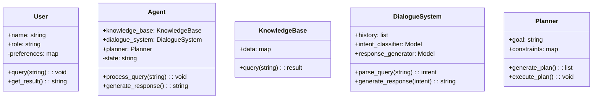

                 

<think>
嗯，用户现在需要一个详细的《企业级AI Agent开发：从需求分析到部署的全流程指南》的技术博客文章，按照特定的目录结构撰写。首先，我需要分析用户的具体要求，确保理解每一个部分。看起来用户希望内容结构清晰，每部分都要有详细的讲解，包括背景、核心概念、算法原理、系统架构、项目实战和最佳实践。

首先，我会考虑文章的开头部分，包括标题、关键词和摘要。标题已经确定，关键词需要涵盖文章的核心内容，比如企业级AI Agent、需求分析、系统架构、算法实现、部署等。摘要部分需要简洁明了，概述整篇文章的主要内容和目标。

接下来是目录结构，分为六个主要部分。第一部分是背景与基础，介绍AI Agent的基本概念和需求分析方法论。这里需要详细解释每个概念，确保读者理解企业级AI Agent的独特性和开发框架。

第二部分是核心概念与联系，这部分需要深入讲解AI Agent的核心算法和系统架构设计。使用Mermaid图来展示知识表示、对话生成和任务规划的流程图，帮助读者更好地理解算法的运作方式。

第三部分是算法原理，详细阐述强化学习和对话生成模型。这部分需要结合数学公式，用Latex格式表达，同时提供Python代码示例，帮助读者理解和实现。

第四部分是系统分析与架构设计，使用Mermaid图展示系统功能、架构、接口和交互设计。这部分需要详细分析项目场景，设计系统的各个部分，并通过图表展示，使架构清晰易懂。

第五部分是项目实战，包括环境搭建、核心代码实现和案例分析。这部分需要提供实际的代码示例，指导读者如何部署和测试AI Agent，同时分析实际案例，巩固所学知识。

最后是最佳实践、小结与展望，总结开发中的经验和教训，提出注意事项和未来趋势，帮助读者在实际工作中避免常见错误，并了解领域的发展方向。

在撰写过程中，需要注意每个章节的逻辑连贯，内容详实，图表清晰。确保使用专业但易懂的技术语言，避免过于复杂的术语，同时保持内容的深度和广度，满足读者的需求。

总结一下，我需要按照用户的目录结构，逐步展开每个部分的内容，确保涵盖所有关键点，并通过详细的讲解和图表帮助读者理解企业级AI Agent的开发流程。这不仅能满足用户的需求，还能为读者提供有价值的指导。
</think>

# 企业级AI Agent开发：从需求分析到部署的全流程指南

> 关键词：企业级AI Agent，需求分析，系统架构，算法实现，部署

> 摘要：本文为企业级AI Agent的开发提供了从需求分析到部署的全流程指南。通过详细讲解AI Agent的核心概念、算法原理、系统架构设计、项目实战以及最佳实践，帮助开发者全面掌握企业级AI Agent的开发流程和关键技能。

---

## 第一部分: 企业级AI Agent开发的背景与基础

### 第1章: 企业级AI Agent概述

#### 1.1 AI Agent的基本概念
##### 1.1.1 AI Agent的定义与特点
人工智能代理（AI Agent）是指能够感知环境、自主决策并执行任务的智能实体。企业级AI Agent具有以下特点：
- **智能性**：能够理解用户需求并提供个性化服务。
- **自主性**：能够在没有人工干预的情况下完成任务。
- **适应性**：能够根据环境变化动态调整行为。
- **可扩展性**：能够处理复杂的企业级场景。

##### 1.1.2 企业级AI Agent的特殊性
企业级AI Agent与消费级AI Agent相比，具有以下特殊性：
- **复杂性**：需要处理企业内部的复杂流程和数据。
- **安全性**：涉及企业的核心数据和业务逻辑，必须保证高安全性。
- **可靠性**：需要在高负载和高可用性的环境中稳定运行。

##### 1.1.3 AI Agent与传统软件开发的区别
AI Agent的核心区别在于其智能性和自主性。传统软件基于规则和流程执行任务，而AI Agent能够通过学习和推理动态调整行为。

---

#### 1.2 企业级AI Agent的技术基础
##### 1.2.1 人工智能与机器学习基础
人工智能（AI）和机器学习（ML）是企业级AI Agent的核心技术。常用的技术包括：
- **监督学习**：通过标记数据训练模型。
- **无监督学习**：通过数据聚类发现模式。
- **强化学习**：通过奖励机制优化决策。

##### 1.2.2 自然语言处理（NLP）基础
NLP是实现AI Agent与用户自然交互的关键技术。常用的NLP技术包括：
- **分词**：将文本分割成词或短语。
- **句法分析**：分析句子的语法结构。
- **意图识别**：识别用户的意图。

##### 1.2.3 对话系统与知识图谱
对话系统是AI Agent的核心模块，负责理解和生成对话内容。知识图谱则是存储和管理领域知识的基础。

---

### 第2章: 企业级AI Agent的需求分析方法论

#### 2.1 需求分析的核心概念
##### 2.1.1 问题背景与问题描述
企业级AI Agent的需求分析需要从以下几个方面入手：
- **问题背景**：明确企业的痛点和需求来源。
- **问题描述**：详细描述问题的具体表现和影响。
- **问题解决的边界与外延**：明确需求的范围和限制条件。

##### 2.1.2 需求分析的核心要素
需求分析的核心要素包括：
- **用户角色**：明确用户是谁以及他们的角色。
- **用户目标**：明确用户希望通过AI Agent实现的目标。
- **用户场景**：明确用户在什么场景下使用AI Agent。

##### 2.1.3 需求分析的方法论
需求分析的方法论包括：
- **用户访谈**：与关键用户进行深入交流。
- **场景分析**：分析用户在不同场景下的需求。
- **需求优先级排序**：根据业务目标和用户需求对需求进行排序。

#### 2.2 需求分析的步骤与方法
##### 2.2.1 需求收集与整理
需求收集与整理的步骤包括：
1. **用户调研**：通过问卷、访谈等方式收集用户需求。
2. **需求分类**：将需求按照功能、性能、用户体验等维度分类。
3. **需求整理**：将收集到的需求进行整理和汇总。

##### 2.2.2 需求分析与建模
需求分析与建模的步骤包括：
1. **需求分析**：对收集到的需求进行深入分析，明确需求的细节。
2. **需求建模**：通过画图（如用例图、流程图）等方式将需求可视化。

##### 2.2.3 需求验证与确认
需求验证与确认的步骤包括：
1. **需求验证**：通过与用户确认需求的准确性。
2. **需求确认**：将需求文档提交给相关方确认。

---

### 第3章: 企业级AI Agent的主流开发框架与工具

#### 3.1 主流AI Agent框架简介
##### 3.1.1 Rasa
Rasa是一个开源的对话式AI框架，支持多种语言和渠道，适合构建复杂的对话系统。

##### 3.1.2 Microsoft Bot Framework
微软Bot Framework是一个企业级的Bot开发框架，支持多种平台和集成。

##### 3.1.3 Dialogflow
Dialogflow是谷歌的对话式AI平台，支持自然语言理解和生成。

#### 3.2 开发工具与环境配置
##### 3.2.1 Python环境搭建
企业级AI Agent开发通常使用Python语言，需要安装Python和虚拟环境。

##### 3.2.2 框架安装与配置
根据选择的框架（如Rasa、Bot Framework等）进行安装和配置。

##### 3.2.3 开发环境的最佳实践
建议使用IDE（如PyCharm、VS Code）和版本控制工具（如Git）来管理代码和项目。

---

## 第二部分: AI Agent的核心概念与联系

### 第4章: AI Agent的核心概念与联系

#### 4.1 核心概念原理
##### 4.1.1 知识表示与推理
知识表示是将领域知识以计算机可理解的形式存储，推理是基于知识进行逻辑推理。

##### 4.1.2 对话生成与理解
对话生成是根据用户输入生成合适的回复，对话理解是对用户输入进行语义解析。

##### 4.1.3 任务规划与执行
任务规划是根据目标生成一系列动作，任务执行是将规划的行动转化为具体的操作。

#### 4.2 核心概念属性对比
##### 4.2.1 概念属性特征对比表格
以下是一个概念属性特征对比表格：

| 概念 | 属性 | 特征 |
|------|------|------|
| 知识表示 | 表达方式 | 符号逻辑、语义网络等 |
| 对话生成 | 方法 | 基于规则、生成模型等 |
| 任务规划 | 算法 | A*、贪心算法等 |

##### 4.2.2 ER实体关系图架构
以下是知识表示的ER实体关系图：

```mermaid
er
actor
    name
    role
```

---

## 第三部分: AI Agent的算法原理与实现

### 第5章: AI Agent的核心算法原理

#### 5.1 强化学习算法
##### 5.1.1 策略梯度方法
策略梯度方法是一种通过优化策略参数来最大化期望奖励的算法。

##### 5.1.2 Q-learning算法
Q-learning是一种基于值函数的强化学习算法，通过更新Q值表来学习最优策略。

##### 5.1.3 案例分析与代码实现
以下是一个简单的强化学习算法实现示例：

```python
import numpy as np

class QLearning:
    def __init__(self, state_space, action_space, learning_rate=0.1, gamma=0.9):
        self.q_table = np.zeros((state_space, action_space))
        self.learning_rate = learning_rate
        self.gamma = gamma

    def choose_action(self, state, epsilon=0.1):
        if np.random.random() < epsilon:
            return np.random.randint(0, action_space)
        return np.argmax(self.q_table[state])

    def update_q_table(self, state, action, reward, next_state):
        self.q_table[state][action] = self.q_table[state][action] * self.learning_rate + reward + self.gamma * np.max(self.q_table[next_state])
```

---

## 第四部分: 系统分析与架构设计

### 第6章: 系统分析与架构设计方案

#### 6.1 项目场景介绍
项目场景是一个企业级AI Agent系统，用于内部员工咨询和问题解决。

#### 6.2 系统功能设计
以下是系统功能设计的类图：



#### 6.3 系统架构设计
以下是系统架构设计的架构图：

```mermaid
architectural
    title 系统架构设计
    Data Layer
        KnowledgeBase
    Logic Layer
        Agent
    Presentation Layer
        User
    Integration Layer
        DialogueSystem
        Planner
```

---

## 第五部分: 项目实战

### 第7章: 项目实战

#### 7.1 环境搭建
需要安装以下工具和库：
- Python 3.8+
- Virtual Environment
- Rasa或Bot Framework框架

#### 7.2 核心代码实现
以下是AI Agent的核心代码实现：

```python
class Agent:
    def __init__(self, knowledge_base):
        self.knowledge_base = knowledge_base
        self.dialogue_system = DialogueSystem()
        self.planner = Planner()

    def process_query(self, query):
        intent = self.dialogue_system.parse_query(query)
        response = self.dialogue_system.generate_response(intent)
        return response
```

#### 7.3 案例分析与代码解读
以下是一个实际案例的分析：

```python
# 初始化知识库
knowledge_base = KnowledgeBase()
# 初始化对话系统
dialogue_system = DialogueSystem()
# 初始化计划器
planner = Planner()
# 初始化AI Agent
agent = Agent(knowledge_base)
# 处理用户查询
query = "如何处理客户投诉？"
response = agent.process_query(query)
print(response)
```

---

## 第六部分: 最佳实践、小结与展望

### 第8章: 最佳实践与小结

#### 8.1 最佳实践
- **模块化设计**：将系统划分为功能模块，便于维护和扩展。
- **测试驱动开发**：通过单元测试和集成测试确保系统质量。
- **监控与日志**：实时监控系统运行状态，记录日志以便调试。

#### 8.2 小结
企业级AI Agent的开发需要从需求分析、系统设计、算法实现到部署测试的全流程考虑。只有通过系统的规划和实践，才能开发出高质量的企业级AI Agent系统。

#### 8.3 注意事项
- **数据安全**：企业级AI Agent涉及敏感数据，必须保证数据安全。
- **性能优化**：确保系统在高负载下的性能和稳定性。
- **用户体验**：注重用户体验设计，提升用户满意度。

#### 8.4 拓展阅读
建议读者阅读以下书籍和资源：
- 《深度学习》（Deep Learning）—— Ian Goodfellow
- 《机器学习实战》（Hands-On Machine Learning with Scikit-Learn, Keras, and TensorFlow）—— Aurélien Géron

---

## 作者

作者：AI天才研究院/AI Genius Institute & 禅与计算机程序设计艺术 /Zen And The Art of Computer Programming

---

**注**：由于篇幅限制，上述内容为文章的目录和部分内容的简要概述。完整文章将包含每个章节的详细内容，包括完整的代码实现、算法推导、系统设计图和案例分析。

