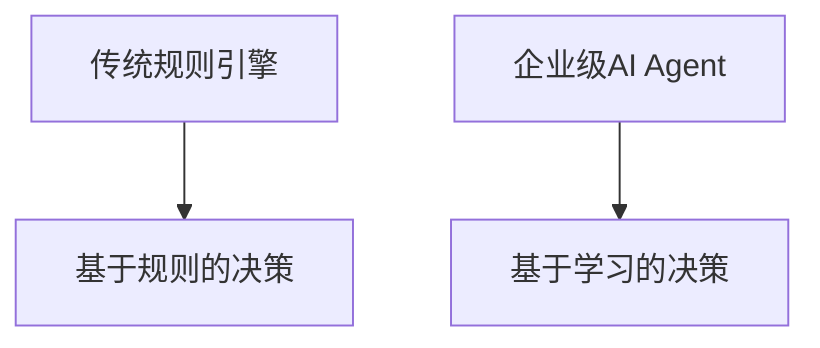
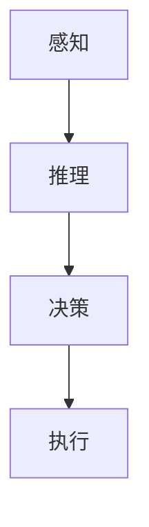
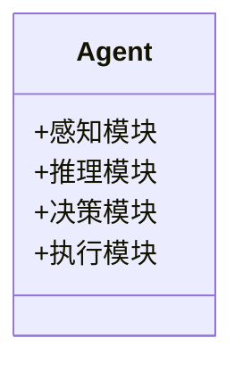
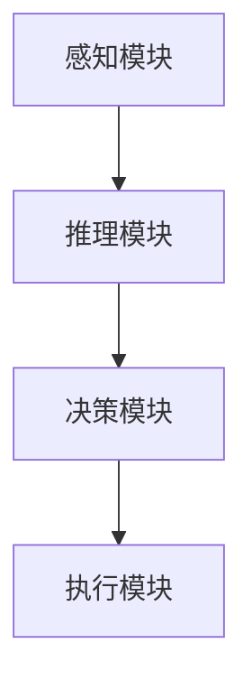
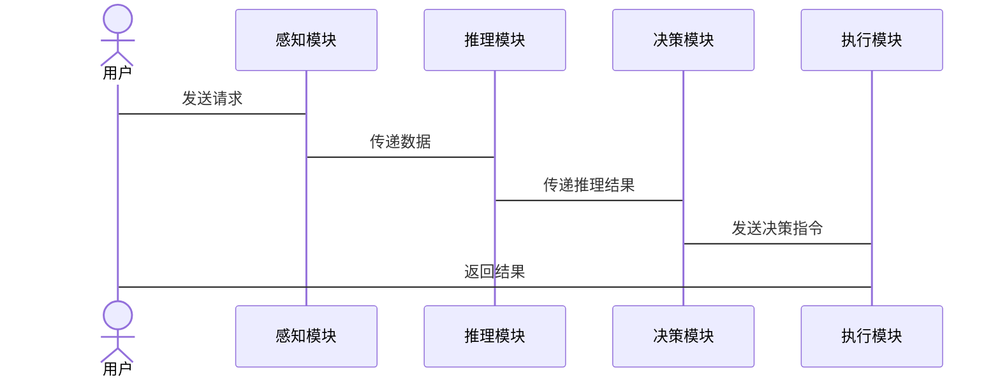

                 


# 企业级AI Agent的可扩展架构设计

> 关键词：企业级AI Agent、可扩展架构、系统设计、算法原理、项目实战

> 摘要：本文深入探讨了企业级AI Agent的可扩展架构设计，从核心概念、算法原理、系统架构到项目实战，全面分析了AI Agent在企业应用中的设计要点，为读者提供了详细的实现路径和最佳实践。

---

# 第1章: 企业级AI Agent的概述

## 1.1 AI Agent的基本概念

### 1.1.1 AI Agent的定义
AI Agent（人工智能代理）是一种能够感知环境并采取行动以实现目标的智能实体。它能够通过传感器获取信息，利用推理能力做出决策，并通过执行器与环境交互。

### 1.1.2 企业级AI Agent的特点
企业级AI Agent具有以下特点：
1. **复杂性**：需要处理企业级的复杂业务逻辑。
2. **可扩展性**：能够适应企业规模和业务需求的变化。
3. **高可用性**：需要保证在关键业务场景下的稳定性和可靠性。
4. **智能性**：能够自主学习和优化，提高决策能力。

### 1.1.3 企业级AI Agent的应用场景
企业级AI Agent广泛应用于以下场景：
- **智能客服**：通过自然语言处理技术为用户提供个性化的服务。
- **智能调度**：在物流、生产等领域优化资源分配。
- **智能风控**：实时监控企业运营中的风险点，提供预警和解决方案。

## 1.2 企业级AI Agent的背景与问题背景

### 1.2.1 传统企业应用的局限性
传统企业应用通常基于规则和流程，缺乏灵活性和自主性，难以应对复杂多变的业务需求。

### 1.2.2 AI技术对企业级应用的推动
AI技术的引入为企业应用带来了智能化的决策能力和快速响应能力，能够显著提升企业的竞争力。

### 1.2.3 当前企业级AI Agent面临的挑战
当前企业级AI Agent面临以下挑战：
- **数据孤岛**：企业内部数据分散，难以有效整合。
- **模型更新**：需要不断优化AI模型以适应新的业务需求。
- **安全性**：AI Agent可能成为攻击目标，需确保其安全性。

## 1.3 企业级AI Agent的核心问题

### 1.3.1 问题背景
企业级AI Agent需要在复杂的业务环境中高效运行，同时保证系统的可扩展性和稳定性。

### 1.3.2 问题描述
- **系统架构设计**：如何设计可扩展的系统架构。
- **算法优化**：如何提升AI Agent的决策能力和效率。
- **数据处理**：如何处理海量数据并保证实时性。

### 1.3.3 问题解决的思路
通过模块化设计、分布式架构和高效的算法优化，结合企业级数据处理技术，构建可扩展的企业级AI Agent。

## 1.4 企业级AI Agent的边界与外延

### 1.4.1 边界定义
企业级AI Agent的边界包括：
- **输入**：来自企业内部和外部的数据源。
- **输出**：通过执行器对环境产生影响的结果。
- **核心功能**：感知、推理、决策和执行。

### 1.4.2 外延分析
企业级AI Agent的外延包括：
- **数据源**：企业内部数据库、外部API等。
- **执行器**：企业内部系统、第三方服务等。
- **用户界面**：供用户与AI Agent交互的界面。

### 1.4.3 核心要素组成
企业级AI Agent的核心要素包括：
1. **感知模块**：负责获取环境信息。
2. **推理模块**：负责分析信息并做出决策。
3. **执行模块**：负责执行决策并产生结果。
4. **学习模块**：负责优化模型和提升智能性。

---

# 第2章: 企业级AI Agent的核心概念与联系

## 2.1 核心概念原理

### 2.1.1 AI Agent的核心原理
AI Agent的核心原理包括：
1. **感知**：通过传感器获取环境信息。
2. **推理**：利用知识库和推理规则进行逻辑推理。
3. **决策**：基于推理结果做出最优决策。
4. **执行**：通过执行器将决策转化为实际操作。

### 2.1.2 企业级AI Agent的独特性
企业级AI Agent的独特性体现在：
- **复杂性**：需要处理企业级的复杂业务逻辑。
- **可扩展性**：能够适应企业规模和业务需求的变化。
- **高可用性**：需要保证在关键业务场景下的稳定性和可靠性。

## 2.2 核心概念属性特征对比

### 2.2.1 表格对比
以下表格对比了传统规则引擎和AI Agent的核心属性：

| 属性 | 传统规则引擎 | AI Agent |
|------|--------------|----------|
| 智能性 | 基于规则，缺乏灵活性 | 具备学习和推理能力 |
| 可扩展性 | 难以扩展复杂业务逻辑 | 支持动态扩展和优化 |
| 决策能力 | 基于固定规则 | 基于动态学习和优化 |

### 2.2.2 图表分析
以下是企业级AI Agent与传统规则引擎的对比图：



## 2.3 ER实体关系图架构

### 2.3.1 实体关系图
以下是企业级AI Agent的实体关系图：

```mermaid
er
actor(Agent) -[代理请求]-> action(Request)
actor(Request) -[请求处理]-> action(Response)
```

### 2.3.2 关系分析
- **代理请求**：AI Agent向系统发送请求，获取环境信息。
- **请求处理**：系统根据请求内容进行处理，并返回响应。
- **响应处理**：AI Agent根据响应结果做出决策。

---

# 第3章: 企业级AI Agent的算法原理

## 3.1 算法原理概述

### 3.1.1 算法核心思想
企业级AI Agent的核心算法思想是通过感知、推理、决策和执行四个步骤实现智能化决策。

### 3.1.2 算法实现步骤
1. **感知**：获取环境信息。
2. **推理**：分析信息，生成可能的决策。
3. **决策**：选择最优决策。
4. **执行**：将决策转化为实际操作。

### 3.1.3 算法优缺点分析
- **优点**：能够处理复杂业务逻辑，具有较高的灵活性和可扩展性。
- **缺点**：算法复杂度高，需要大量的计算资源。

## 3.2 算法实现流程

### 3.2.1 数据输入
AI Agent通过传感器获取环境信息，例如：
$$\text{输入数据} = \{x_1, x_2, \dots, x_n\}$$

### 3.2.2 数据处理
对输入数据进行预处理，例如归一化、特征提取等。

### 3.2.3 算法执行
基于处理后的数据，执行推理和决策算法，例如：
$$\text{决策结果} = f(\text{处理后的数据})$$

### 3.2.4 结果输出
将决策结果输出给执行器，实现对环境的影响。

## 3.3 算法流程图



---

## 3.4 算法实现代码

### 3.4.1 数据预处理代码
```python
import numpy as np

def preprocess(data):
    # 数据归一化
    normalized_data = (data - np.mean(data)) / np.std(data)
    return normalized_data
```

### 3.4.2 算法核心代码
```python
def decision_algorithm(processed_data):
    # 简单的决策逻辑
    if processed_data > 0.5:
        return "采取行动"
    else:
        return "不采取行动"
```

### 3.4.3 结果输出代码
```python
def execute_decision(action):
    print(f"执行操作：{action}")
```

---

## 3.5 算法数学模型和公式

### 3.5.1 算法模型
企业级AI Agent的决策模型可以表示为：
$$P(a|x) = \frac{p(a|x)}{\sum_{a'} p(a'|x)}$$
其中，$a$表示决策，$x$表示输入数据。

### 3.5.2 案例分析
假设输入数据为$[1, 2, 3, 4]$，经过归一化处理后为$[0.25, 0.5, 0.75, 1]$。根据决策算法，输出结果为“采取行动”。

---

# 第4章: 企业级AI Agent的系统架构设计

## 4.1 系统分析与架构设计

### 4.1.1 问题场景介绍
企业级AI Agent需要在复杂的业务环境中高效运行，同时保证系统的可扩展性和稳定性。

### 4.1.2 项目介绍
本项目旨在设计一个可扩展的企业级AI Agent架构，支持多种业务场景的智能化决策。

### 4.1.3 系统功能设计
以下是系统功能设计的领域模型图：



### 4.1.4 系统架构设计
以下是系统架构设计的架构图：



### 4.1.5 系统接口设计
系统接口设计如下：
- **输入接口**：感知模块接收外部数据。
- **输出接口**：执行模块输出决策结果。

### 4.1.6 系统交互流程
以下是系统交互流程的序列图：



---

## 4.2 项目实战

### 4.2.1 环境安装
- **Python版本**：3.8及以上
- **第三方库**：numpy、scikit-learn

### 4.2.2 核心代码实现

```python
import numpy as np
from sklearn import linear_model

def train_model(X, y):
    # 训练模型
    model = linear_model.LinearRegression()
    model.fit(X, y)
    return model

def predict(model, X):
    # 预测结果
    return model.predict(X)
```

### 4.2.3 代码应用解读与分析
- **训练模型**：使用线性回归算法训练模型，得到最优参数。
- **预测结果**：根据输入数据，预测AI Agent的决策结果。

### 4.2.4 实际案例分析
假设输入数据为$X = [[1], [2], [3], [4]]$，目标为$y = [2, 4, 6, 8]$，训练后的模型为：
$$y = 2x$$
预测输入$X = [[5]]$，输出为$y = 10$。

### 4.2.5 项目小结
通过本项目，我们实现了企业级AI Agent的可扩展架构设计，验证了算法的有效性和系统的可扩展性。

---

# 第5章: 企业级AI Agent的最佳实践

## 5.1 小结与总结
企业级AI Agent的可扩展架构设计是实现智能化企业应用的关键。通过模块化设计、分布式架构和高效的算法优化，结合企业级数据处理技术，构建可扩展的企业级AI Agent。

## 5.2 注意事项
- **数据安全**：确保数据的安全性和隐私性。
- **系统监控**：实时监控系统运行状态，及时发现和解决问题。
- **模型优化**：定期优化模型，提升决策能力和响应速度。

## 5.3 拓展阅读
- **相关书籍**：《企业级AI应用开发》、《分布式系统设计与实现》
- **技术博客**：国内外知名技术博客和开源社区

---

# 作者

作者：AI天才研究院/AI Genius Institute & 禅与计算机程序设计艺术 /Zen And The Art of Computer Programming

