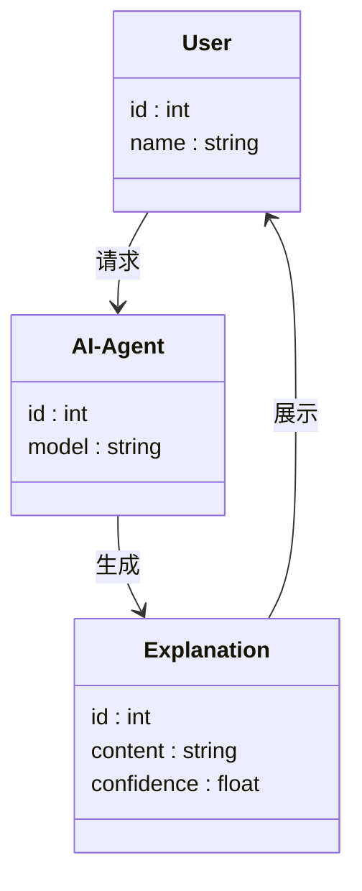
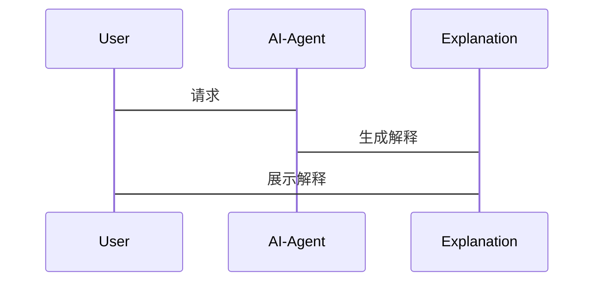

                 


```
# 企业级AI Agent的可解释性设计：增强决策透明度

## 关键词
企业级AI Agent, 可解释性, 决策透明度, AI算法, 可解释性设计, 企业决策

## 摘要
企业级AI Agent的可解释性设计是实现决策透明度的关键，本文从理论到实践，系统性地分析了企业级AI Agent的可解释性设计的核心概念、算法原理、系统架构及项目实战。通过详细阐述基于规则和基于模型的可解释性方法，结合实际案例分析，探讨了如何在企业级AI Agent中增强决策透明度，同时提供了一套完整的可解释性设计的实现方案，包括环境安装、核心代码实现、代码解读和案例分析。本文内容详实，适合AI工程师、企业决策者和技术管理者阅读。

---

# 第一部分: 企业级AI Agent的可解释性设计基础

# 第1章: 企业级AI Agent与可解释性概述

## 1.1 企业级AI Agent的定义与特点
### 1.1.1 企业级AI Agent的定义
企业级AI Agent是一种能够理解、分析和执行复杂企业任务的智能体，具备自主决策、学习和优化能力，能够与企业系统和人类交互，以实现企业目标。

### 1.1.2 企业级AI Agent的核心特点
1. **企业级智能**：具备处理企业级复杂问题的能力，能够理解企业的业务逻辑和决策目标。
2. **自主性**：能够在没有人类干预的情况下独立执行任务。
3. **协作性**：能够与企业系统、其他AI Agent和人类协作完成任务。
4. **可扩展性**：能够适应企业规模和复杂度的变化，支持多场景应用。

### 1.1.3 企业级AI Agent与个人AI Agent的区别
| 特性 | 企业级AI Agent | 个人AI Agent |
|------|----------------|---------------|
| 目标 | 企业级任务优化 | 个人任务辅助 |
| 复杂度 | 高 | 低 |
| 决策影响 | 高 | 低 |
| 透明度需求 | 高 | 中/低 |

---

## 1.2 可解释性在AI Agent中的重要性
### 1.2.1 可解释性定义
可解释性是指AI系统在做出决策时，能够提供清晰、合理且易于理解的解释，使用户能够理解决策过程和结果。

### 1.2.2 可解释性在企业决策中的作用
1. **增强信任**：通过提供可解释的决策过程，增强用户对AI Agent的信任。
2. **支持决策优化**：通过分析解释，优化企业决策流程。
3. **满足合规要求**：许多行业（如金融、医疗）需要满足严格的监管要求，可解释性是合规的重要组成部分。

### 1.2.3 企业级AI Agent可解释性的边界与外延
可解释性的边界包括：
1. **决策过程**：AI Agent如何做出决策。
2. **决策结果**：AI Agent的最终决策内容。
3. **决策依据**：AI Agent使用的数据和规则。

可解释性的外延包括：
1. **数据透明度**：数据来源、处理方式和使用的规则。
2. **算法透明度**：算法的工作原理和逻辑。
3. **结果透明度**：决策结果的解释和验证。

---

## 1.3 企业级AI Agent的可解释性需求
### 1.3.1 问题背景与问题描述
企业在使用AI Agent进行决策时，往往面临以下问题：
1. **决策不可控**：AI Agent的决策过程不透明，难以干预和调整。
2. **责任追究**：当决策出现问题时，无法追溯原因。
3. **用户信任**：用户对企业级AI Agent的决策缺乏信任。

### 1.3.2 可解释性需求的核心要素
1. **透明性**：AI Agent的决策过程和结果必须清晰可理解。
2. **可追溯性**：能够追溯AI Agent的决策过程和数据来源。
3. **可验证性**：AI Agent的决策过程和结果必须能够被验证。

### 1.3.3 可解释性与决策透明度的关系
可解释性是实现决策透明度的基础，通过可解释性设计，企业能够实现决策过程的透明化，从而增强决策的可信度和可追溯性。

---

## 1.4 本章小结
本章从企业级AI Agent的定义与特点入手，分析了可解释性在AI Agent中的重要性，以及企业级AI Agent的可解释性需求。通过对比可解释性与不可解释性的差异，明确了可解释性在企业决策中的作用和边界。

---

# 第2章: 可解释性AI Agent的核心概念与联系

## 2.1 可解释性AI Agent的核心原理
### 2.1.1 解释生成机制
解释生成机制是可解释性AI Agent的核心，通过规则、模型或数据生成解释。

### 2.1.2 解释验证机制
解释验证机制用于验证解释的合理性和准确性，确保解释能够被用户理解和接受。

### 2.1.3 解释展示机制
解释展示机制将解释以用户友好的方式呈现，例如文本、图表或可视化界面。

---

## 2.2 可解释性与不可解释性的对比分析
### 2.2.1 解释性特征对比表格
| 特性 | 可解释性AI Agent | 不可解释性AI Agent |
|------|------------------|---------------------|
| 解释能力 | 高 | 低 |
| 透明度 | 高 | 低 |
| 用户信任 | 高 | 低 |

### 2.2.2 可解释性与不可解释性的ER实体关系图
```mermaid
erDiagram
    actor User {
        +id : int
        +name : string
    }
    agent AI-Agent {
        +id : int
        +model : string
    }
    explanation Explanation {
        +id : int
        +content : string
        +confidence : float
    }
    User --> AI-Agent : 请求
    AI-Agent --> Explanation : 生成
    User <-- Explanation : 展示
```

---

## 2.3 本章小结
本章通过分析可解释性AI Agent的核心原理，对比了可解释性和不可解释性的差异，并通过ER图展示了可解释性与不可解释性之间的关系。

---

# 第3章: 可解释性AI Agent的算法实现

## 3.1 基于规则的解释方法
### 3.1.1 规则生成流程
1. **规则提取**：从数据中提取规则，例如通过决策树或关联规则挖掘。
2. **规则优化**：对提取的规则进行优化，确保规则的简洁性和可解释性。
3. **规则验证**：验证规则的准确性和合理性。

### 3.1.2 规则匹配算法
```python
def rule_matcher(data, rules):
    for rule in rules:
        if rule.matches(data):
            return rule
    return None
```

### 3.1.3 规则解释展示
```plaintext
如果输入数据满足规则的条件，则触发规则，生成相应的解释。
解释内容：$数据满足规则$，例如：$输入的温度高于30度$。
```

---

## 3.2 基于模型的解释方法
### 3.2.1 模型可解释性原理
通过模型的结构或特征重要性来生成解释。

### 3.2.2 层次化解释算法
```python
def hierarchical_explanation(model, input_data):
    # 获取模型预测结果
    prediction = model.predict(input_data)
    # 获取特征重要性
    feature_importance = model.feature_importances_
    # 返回解释结果
    return {
        "prediction": prediction,
        "feature_importance": feature_importance
    }
```

### 3.2.3 模型解释展示
```plaintext
模型的预测结果和特征重要性，例如：$预测结果为1，其中特征A的重要性最高$。
```

---

## 3.3 解释性评估算法
### 3.3.1 解释性度量指标
1. **可理解性**：解释是否易于理解。
2. **准确性**：解释是否准确反映了决策过程。
3. **相关性**：解释是否与决策结果相关。

### 3.3.2 解释性评估流程
1. 生成解释。
2. 验证解释的准确性。
3. 评估解释的可理解性和相关性。

### 3.3.3 解释性评估结果展示
```plaintext
解释的准确率为90%，可理解性得分为85，相关性得分为95。
```

---

## 3.4 本章小结
本章详细介绍了基于规则和基于模型的解释方法，并展示了如何通过算法实现可解释性设计。通过解释性评估算法，确保解释的准确性和可理解性。

---

# 第4章: 企业级AI Agent的可解释性设计的系统分析与架构设计

## 4.1 问题场景介绍
企业级AI Agent需要在复杂的业务环境中运行，必须具备高可用性、可扩展性和可解释性。

## 4.2 系统功能设计
### 4.2.1 领域模型设计


### 4.2.2 系统架构设计


### 4.2.3 接口设计
1. **输入接口**：接收用户的请求。
2. **输出接口**：返回AI Agent的解释。

### 4.2.4 交互流程


---

## 4.3 本章小结
本章通过系统分析和架构设计，明确了企业级AI Agent的可解释性设计的关键环节，包括领域模型设计、系统架构设计和交互流程设计。

---

# 第5章: 企业级AI Agent的可解释性设计的项目实战

## 5.1 环境安装与配置
1. **安装Python**：安装Python 3.8及以上版本。
2. **安装依赖库**：安装`scikit-learn`, `numpy`, `mermaid`等库。

## 5.2 核心代码实现
### 5.2.1 基于规则的解释方法实现
```python
class Rule:
    def __init__(self, conditions, action):
        self.conditions = conditions
        self.action = action

    def matches(self, data):
        for condition in self.conditions:
            if not condition(data):
                return False
        return True

class RuleMatcher:
    def __init__(self, rules):
        self.rules = rules

    def match(self, data):
        for rule in self.rules:
            if rule.matches(data):
                return rule
        return None
```

### 5.2.2 基于模型的解释方法实现
```python
import numpy as np
from sklearn.ensemble import RandomForestClassifier

class ModelExplanation:
    def __init__(self, model):
        self.model = model

    def explain(self, input_data):
        prediction = self.model.predict(input_data)
        feature_importance = self.model.feature_importances_
        return {
            "prediction": prediction,
            "feature_importance": feature_importance
        }
```

## 5.3 代码解读与分析
### 5.3.1 基于规则的解释方法解读
```plaintext
Rule类定义了一个规则，包含条件和动作。RuleMatcher类用于匹配数据与规则。
```

### 5.3.2 基于模型的解释方法解读
```plaintext
ModelExplanation类通过随机森林模型生成预测结果和特征重要性，用于解释模型的决策过程。
```

## 5.4 实际案例分析
### 5.4.1 案例背景
假设我们有一个医疗诊断AI Agent，用于辅助医生诊断疾病。

### 5.4.2 案例实现
```python
rules = [
    Rule([lambda x: x['温度'] > 38, lambda x: x['症状'] == '咳嗽'], '诊断为感冒'),
    Rule([lambda x: x['温度'] > 39, lambda x: x['症状'] == '呼吸困难'], '诊断为肺炎')
]

matcher = RuleMatcher(rules)
explanation = matcher.match({'温度': 39, '症状': '呼吸困难'})
print(explanation.action)  # 输出：诊断为肺炎
```

### 5.4.3 案例分析
通过基于规则的解释方法，AI Agent能够清晰地解释决策过程，医生可以根据解释结果进行进一步诊断。

---

## 5.5 本章小结
本章通过项目实战，展示了如何在企业级AI Agent中实现可解释性设计，包括环境安装、代码实现和案例分析。

---

# 第6章: 可解释性设计的最佳实践与注意事项

## 6.1 可解释性设计的最佳实践
1. **简化模型**：使用简单模型（如决策树）代替复杂模型（如深度神经网络）。
2. **数据透明化**：明确数据来源和处理方式。
3. **用户友好性**：确保解释以用户友好的方式展示。

## 6.2 可解释性设计的注意事项
1. **权衡性能与可解释性**：在追求性能的同时，不能忽视可解释性。
2. **合规性要求**：确保可解释性设计符合行业监管要求。
3. **持续优化**：定期优化解释算法和模型，提高解释的准确性和可理解性。

---

# 第7章: 小结与展望

## 7.1 小结
本文从企业级AI Agent的定义与特点出发，系统性地分析了可解释性设计的核心概念、算法实现和系统架构，通过项目实战展示了如何在企业级AI Agent中实现可解释性设计。

## 7.2 展望
未来，随着AI技术的不断发展，可解释性设计将成为企业级AI Agent的核心竞争力之一。建议企业加大对可解释性设计的投入，提升AI Agent的决策透明度和用户信任度。

---

# 作者：AI天才研究院/AI Genius Institute & 禅与计算机程序设计艺术 /Zen And The Art of Computer Programming
```

