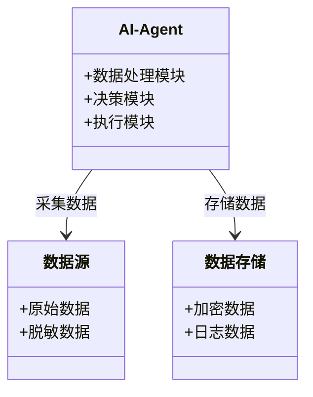
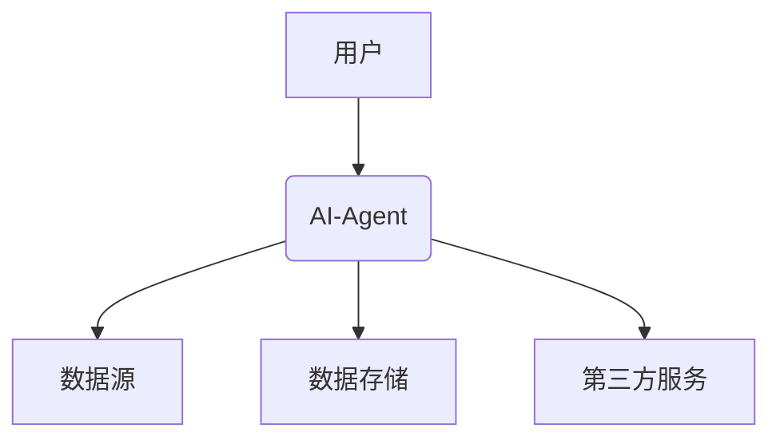
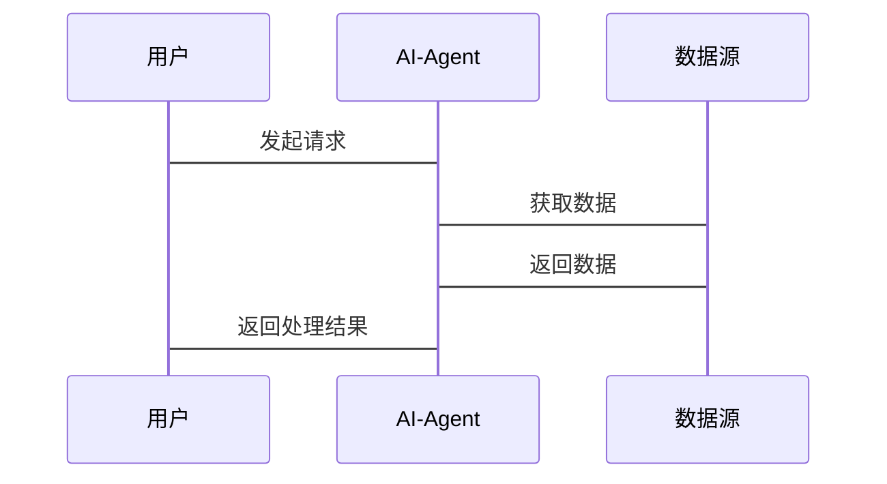

                 


# 《企业级AI Agent的隐私保护与合规性考虑》

## 关键词：企业级AI Agent，隐私保护，数据合规性，AI安全，数据脱敏，联邦学习，同态加密

## 摘要：随着企业级AI Agent的广泛应用，隐私保护和合规性问题日益突出。本文系统地分析了企业级AI Agent在隐私保护和合规性方面的挑战，探讨了相关的技术和方法，包括数据脱敏、联邦学习、同态加密等技术，以及如何构建合规性框架。通过实际案例分析，本文为读者提供了全面的解决方案和最佳实践。

---

## 第一章：企业级AI Agent的背景与问题背景

### 1.1 企业级AI Agent的定义与特点

#### 1.1.1 企业级AI Agent的定义
- 企业级AI Agent是为企业内部系统提供智能化决策支持的智能体，具备自主决策、学习和执行任务的能力。
- 其特点包括高可用性、强实时性、数据密集型和复杂性。

#### 1.1.2 企业级AI Agent的核心特点
- 高可用性：需要7×24小时稳定运行。
- 强实时性：对实时数据处理能力要求高。
- 数据密集型：依赖海量数据进行决策。
- 复杂性：涉及多领域知识和复杂业务逻辑。

#### 1.1.3 企业级AI Agent与个人AI Agent的区别
| **特性**         | **企业级AI Agent**          | **个人AI Agent**            |
|------------------|-----------------------------|-----------------------------|
| 数据范围         | 处理企业级数据，涉及敏感信息 | 处理个人数据，范围较小      |
| 安全要求         | 高，需符合企业安全政策      | 较低，主要满足个人隐私需求 |
| 合规性要求       | 高，需符合法律法规          | 较低，主要遵循个人隐私保护 |
| 计算资源         | 强大，依赖企业级计算资源    | 依赖个人设备资源            |

---

### 1.2 问题背景与问题描述

#### 1.2.1 当前AI Agent的广泛应用现状
- AI Agent已广泛应用于企业级系统，如智能客服、供应链管理、金融交易等。
- 隐私泄露和合规性问题频发，成为企业数字化转型的主要挑战。

#### 1.2.2 隐私泄露与合规性问题的现状
- 数据泄露事件频发，企业面临高额罚款和声誉损失。
- 各国法规日益严格，如GDPR（通用数据保护条例）对企业数据处理提出更高要求。

#### 1.2.3 企业级AI Agent面临的独特挑战
- 数据来源多样，涉及多个部门和外部合作伙伴，增加了隐私保护的复杂性。
- AI Agent需要实时处理数据，导致数据在传输和存储过程中面临更多风险。
- 不同地区的法规差异使得合规性管理更加复杂。

---

### 1.3 问题解决与边界外延

#### 1.3.1 隐私保护与合规性的核心目标
- 确保数据在采集、处理和存储过程中的隐私安全。
- 遵守相关法律法规，确保企业数据处理的合法性。

#### 1.3.2 企业级AI Agent的边界与外延
- 数据边界：明确数据的来源、使用范围和访问权限。
- 系统边界：定义AI Agent与其他系统的交互接口和数据流。
- 合规性边界：确定企业内部和外部的合规性要求。

#### 1.3.3 隐私保护与合规性的关键要素
- 数据分类与分级：根据数据的重要性进行分类管理。
- 访问控制：基于角色的访问控制（RBAC）。
- 审计与监控：实时监控数据操作，记录日志。

---

### 1.4 核心概念结构与组成

#### 1.4.1 AI Agent的组成要素
- 感知模块：负责数据的采集和处理。
- 决策模块：基于数据进行智能决策。
- 执行模块：将决策结果转化为具体行动。

#### 1.4.2 隐私保护的核心机制
- 数据脱敏：对敏感数据进行处理，使其不可逆。
- 数据加密：在传输和存储过程中对数据进行加密。
- 数据匿名化：通过技术手段去除数据中的个人标识信息。

#### 1.4.3 合规性框架的构成
- 数据处理合规：符合GDPR等法规要求。
- 数据存储合规：确保数据存储的安全性。
- 数据共享合规：在数据共享过程中遵循相关法律法规。

---

## 第二章：隐私保护与合规性的核心概念

### 2.1 隐私保护的原理与实现

#### 2.1.1 数据脱敏的原理
- 数据脱敏通过技术手段将敏感数据转化为不可逆的格式，确保数据在处理过程中无法还原原始信息。

#### 2.1.2 数据加密的实现
- 使用加密算法（如AES）对数据进行加密，确保数据在传输和存储过程中的安全性。

#### 2.1.3 数据匿名化的机制
- 通过去除、替换或加密等方式，去除数据中的个人标识信息，降低隐私泄露风险。

---

### 2.2 合规性框架的构建

#### 2.2.1 数据保护法规的解读
- GDPR要求企业对个人数据进行严格保护，确保数据处理的合法性。
- CCPA（加州消费者隐私法案）赋予消费者更多数据控制权。

#### 2.2.2 企业合规性框架的设计
- 设计企业内部的数据处理流程，确保符合相关法规要求。
- 建立数据分类分级制度，明确数据的使用权限。

#### 2.2.3 合规性评估的流程
- 定期进行合规性审计，检查数据处理是否符合法规要求。
- 对不符合要求的部分进行整改，确保企业持续合规。

---

### 2.3 隐私保护与合规性的联系与区别

#### 2.3.1 隐私保护与合规性的联系
- 隐私保护是合规性的基础，合规性要求企业必须采取有效的隐私保护措施。

#### 2.3.2 隐私保护与合规性的区别
- 隐私保护关注数据的使用方式，而合规性关注数据处理的合法性。
- 隐私保护侧重于技术实现，而合规性侧重于法律层面的要求。

#### 2.3.3 企业级AI Agent中的综合应用
- 在企业级AI Agent中，隐私保护与合规性需要结合技术手段和法律要求，共同确保数据的安全性和合法性。

---

## 第三章：隐私保护与合规性的技术实现

### 3.1 数据脱敏技术

#### 3.1.1 数据脱敏的实现流程
- 数据分类与分级
- 确定脱敏规则
- 数据处理与脱敏
- 脱敏后数据验证

#### 3.1.2 数据脱敏的实现示例
```python
def data_anonymization(data):
    # 假设data是一个包含个人信息的数据集
    # 这里以脱敏身份证号为例
    anonymized_data = []
    for item in data:
        anonymized_item = item.copy()
        anonymized_item['身份证号'] = '****' * 4  # 脱敏处理
        anonymized_data.append(anonymized_item)
    return anonymized_data
```

---

### 3.2 数据加密技术

#### 3.2.1 加密算法的选择与应用
- 对称加密算法（如AES）适用于数据传输过程中的加密。
- 非对称加密算法（如RSA）适用于数据签名和认证。

#### 3.2.2 数据加密的实现示例
```python
from cryptography.hazmat.primitives.asymmetric import padding
from cryptography.hazmat.primitives.asymmetric.rsa import *
import os

# 生成RSA密钥对
key = RSA.generate(2048)
private_key = key.private_key()
public_key = key.public_key()

# 加密数据
def encrypt_data(data, public_key):
    cipher = Cipher_pkcs1_v1_5.new(public_key)
    encrypted_data = cipher.encrypt(data)
    return encrypted_data

# 解密数据
def decrypt_data(encrypted_data, private_key):
    cipher = Cipher_pkcs1_v1_5.new(private_key)
    decrypted_data = cipher.decrypt(encrypted_data)
    return decrypted_data
```

---

### 3.3 合规性框架的实现

#### 3.3.1 数据分类与分级
- 根据数据的重要性进行分类，如核心数据、重要数据和普通数据。

#### 3.3.2 访问控制策略
- 基于角色的访问控制（RBAC）：根据用户角色分配数据访问权限。
- 最小权限原则：确保用户只能访问其职责所需的最小权限。

#### 3.3.3 数据共享与第三方合规性
- 在数据共享过程中，确保第三方也符合相关的数据保护法规。

---

## 第四章：企业级AI Agent的系统设计与实现

### 4.1 系统功能设计

#### 4.1.1 领域模型设计


#### 4.1.2 系统架构设计


---

### 4.2 接口设计与交互

#### 4.2.1 API接口设计
- RESTful API设计：提供标准的HTTP接口，支持数据查询、处理和反馈。
- 数据脱敏接口：对敏感数据进行处理，返回脱敏后的数据。

#### 4.2.2 交互序列图


---

## 第五章：企业级AI Agent的合规性与隐私保护的最佳实践

### 5.1 隐私保护的最佳实践

#### 5.1.1 数据最小化原则
- 仅收集实现功能所需的最少数据。

#### 5.1.2 数据匿名化与脱敏
- 在数据处理过程中，采用匿名化和脱敏技术，降低隐私泄露风险。

#### 5.1.3 数据加密与安全传输
- 使用SSL/TLS等协议，确保数据在传输过程中的安全性。

---

### 5.2 合规性管理的最佳实践

#### 5.2.1 定期合规性审计
- 定期检查数据处理流程，确保符合相关法规要求。

#### 5.2.2 建立合规性团队
- 设立专业的合规性团队，负责企业数据的合规性管理。

#### 5.2.3 培训与意识提升
- 定期对员工进行隐私保护和合规性培训，提高全员的合规意识。

---

### 5.3 项目小结

#### 5.3.1 项目总结
- 通过数据脱敏、加密和匿名化技术，有效保护了企业级AI Agent的隐私。
- 建立了合规性框架，确保数据处理的合法性。

#### 5.3.2 经验与教训
- 数据脱敏和加密技术的应用需要根据具体场景进行调整。
- 合规性管理需要企业内部各团队的协同合作。

---

## 第六章：总结与展望

### 6.1 本章总结
- 本文系统地分析了企业级AI Agent在隐私保护和合规性方面的挑战。
- 提出了基于数据脱敏、加密和匿名化技术的解决方案。
- 探讨了合规性框架的构建方法，并提供了实际案例分析。

### 6.2 未来展望
- 随着AI技术的不断发展，隐私保护和合规性问题将更加复杂。
- 未来需要进一步研究更先进的隐私保护技术，如联邦学习和同态加密，以满足企业级AI Agent的需求。

---

## 作者：AI天才研究院/AI Genius Institute & 禅与计算机程序设计艺术 /Zen And The Art of Computer Programming

