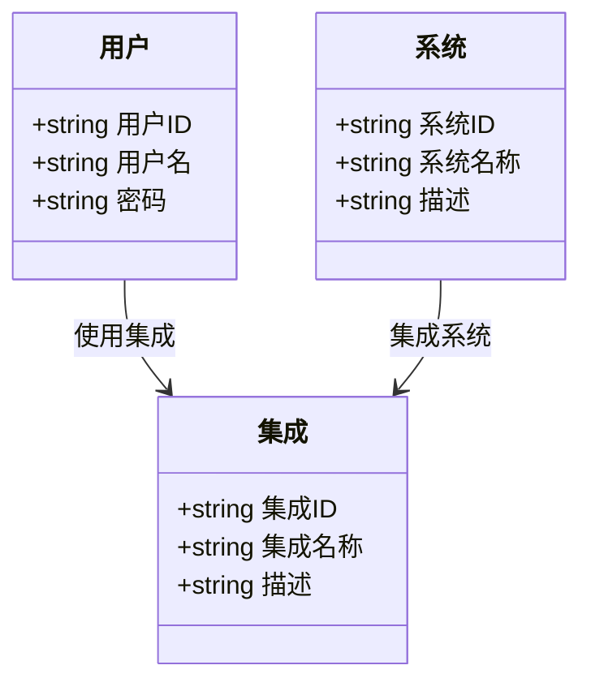

                 


# 企业级AI模型的集成策略：无缝对接现有系统

## 关键词：
企业级AI、模型集成、系统对接、无缝集成、技术策略

## 摘要：
本文深入探讨了企业级AI模型的集成策略，通过分层方法解决模型与现有系统的对接问题，强调如何将AI模型无缝集成到企业现有的技术架构中，同时保持系统性能和数据安全。文章结合实际案例和系统架构图，详细阐述了从问题分析到解决方案的全过程，为技术架构师和企业决策者提供了实用的指导和建议。

---

# 第1章: 企业级AI模型集成的背景与问题背景

## 1.1 企业级AI模型集成的背景

### 1.1.1 企业AI应用的现状
企业AI应用的快速发展带来了更高的期望和挑战，但现有系统中AI模型的集成仍存在诸多障碍。企业级AI模型需要在复杂的生产环境中运行，如何保证其稳定性和高效性是关键。

### 1.1.2 当前AI模型集成的必要性
随着企业数字化转型的推进，AI模型的应用越来越广泛。然而，不同部门和系统的数据孤岛问题限制了AI模型的效果。通过集成策略，可以实现数据共享和流程优化。

### 1.1.3 企业级AI模型集成的核心目标
企业级AI模型集成的核心目标是将多个AI模型无缝对接到现有系统中，实现数据高效流通和业务流程自动化，提升整体系统的智能化水平。

## 1.2 问题背景与问题描述

### 1.2.1 现有AI模型的局限性
- 数据孤岛：不同系统之间的数据无法有效共享。
- 性能瓶颈：单点故障可能导致系统崩溃。
- 安全性问题：数据泄露风险增加。

### 1.2.2 系统集成中的主要问题
- 系统异构性：不同系统的技术架构差异大。
- 数据兼容性：数据格式和接口不统一。
- 可扩展性：系统难以适应业务变化。

### 1.2.3 企业级AI模型集成的边界与外延
企业级AI模型集成的边界是企业内部系统，外延则包括与外部合作伙伴的数据接口。

## 1.3 问题解决与核心要素

### 1.3.1 集成策略的核心要素
- 数据转换层：解决数据格式差异。
- API网关：统一接口调用。
- 负载均衡：保证系统性能。

### 1.3.2 系统集成的关键问题
- 数据一致性：确保数据准确传输。
- 系统兼容性：支持多种技术架构。
- 安全性保障：防止数据泄露。

### 1.3.3 核心概念结构与组成
- 数据层：数据存储与转换。
- API层：接口定义与调用。
- 业务逻辑层：逻辑处理与流程控制。

## 1.4 本章小结
本章从企业AI应用的现状出发，分析了集成的必要性和目标，详细阐述了系统集成中的主要问题及解决方案，为后续章节奠定了基础。

---

# 第2章: 企业级AI模型集成的核心概念与联系

## 2.1 核心概念原理

### 2.1.1 模型集成的基本原理
模型集成是将多个AI模型的结果进行融合，利用互补性提升整体性能。常见的集成方法包括投票、加权平均和堆叠。

### 2.1.2 系统集成的关键流程
系统集成包括需求分析、设计、开发、测试和部署五个阶段。

### 2.1.3 核心概念的属性特征对比
| 属性 | 集成方式 |
|------|---------|
| 数据格式 | JSON/XML/数据库表 |
| 接口类型 | RESTful API/FastAPI |
| 调度机制 | 异步/同步 |

## 2.2 核心概念的ER实体关系图
```mermaid
erDiagram
    user 用户 {
        +string 用户ID
        +string 用户名
        +string 密码
    }
    system 系统 {
        +string 系统ID
        +string 系统名称
        +string 描述
    }
    integration 集成 {
        +string 集成ID
        +string 集成名称
        +string 描述
    }
    用户 --> 集成 : 使用集成
    系统 --> 集成 : 集成系统
```

## 2.3 本章小结
本章通过分析核心概念的原理和属性特征，构建了系统的ER实体关系图，为后续章节的系统架构设计提供了基础。

---

# 第3章: 企业级AI模型集成的算法原理

## 3.1 算法原理概述

### 3.1.1 模型融合的基本概念
模型融合是将多个模型的输出结果进行融合，常见的融合方法包括平均、加权和投票。

### 3.1.2 算法选择的依据
算法选择需要考虑数据类型、模型复杂度和性能要求。

### 3.1.3 常见的模型融合方法
- 线性融合：$$ y = w_1y_1 + w_2y_2 + ... + w_ny_n $$
- 多层感知机：$$ y = f(x_1, x_2, ..., x_n) $$

## 3.2 算法实现与优化

### 3.2.1 模型融合的实现步骤
1. 数据预处理：标准化和归一化。
2. 模型训练：训练多个基模型。
3. 结果融合：计算权重并融合结果。

### 3.2.2 模型优化的数学公式
$$ w_i = \frac{1}{\sum_{j=1}^n (y_j - y_{true})^2} $$

## 3.3 算法的性能评估

### 3.3.1 性能指标
- 准确率
- 召回率
- F1分数

### 3.3.2 性能优化策略
- 调整权重
- 增加训练数据
- 使用更复杂的模型

## 3.4 本章小结
本章详细讲解了模型融合的算法原理和实现步骤，分析了性能优化策略，为系统集成提供了理论基础。

---

# 第4章: 企业级AI模型集成的系统分析与架构设计

## 4.1 系统分析

### 4.1.1 项目背景
本项目旨在将多个AI模型集成到企业现有系统中，提升业务流程的智能化水平。

### 4.1.2 系统功能设计
- 数据接口：提供API供其他系统调用。
- 模型管理：管理多个AI模型。
- 结果展示：展示融合结果。



### 4.1.3 系统架构设计


## 4.2 系统接口设计

### 4.2.1 API设计
- GET /api/data
- POST /api/model

### 4.2.2 接口交互流程
1. 用户发送请求。
2. API网关接收请求。
3. 数据库查询数据。
4. 模型服务处理数据。
5. 返回结果。

## 4.3 本章小结
本章通过系统分析和架构设计，明确了系统的功能模块和接口设计，为后续的项目实施奠定了基础。

---

# 第5章: 企业级AI模型集成的项目实战

## 5.1 环境安装

### 5.1.1 安装Python
```bash
python --version
```

### 5.1.2 安装依赖库
```bash
pip install numpy pandas scikit-learn fastapi uvicorn
```

## 5.2 系统核心实现

### 5.2.1 API接口实现
```python
from fastapi import FastAPI
app = FastAPI()

@app.get("/api/data")
async def get_data():
    return {"data": "test"}
```

### 5.2.2 模型融合实现
```python
def fuse_models(models, weights):
    result = 0
    for i in range(len(models)):
        result += weights[i] * models[i].predict(data)
    return result
```

## 5.3 代码应用解读与分析

### 5.3.1 代码结构
```python
class ModelIntegration:
    def __init__(self, models):
        self.models = models

    def fuse(self, weights):
        return sum([w * m.predict() for m, w in zip(self.models, weights)])
```

### 5.3.2 实际案例分析
案例：融合两个分类模型的输出。
$$ y = 0.6y_1 + 0.4y_2 $$

## 5.4 项目小结
本章通过实际案例展示了系统集成的实现过程，详细解读了代码结构和接口设计。

---

# 第6章: 企业级AI模型集成的最佳实践与总结

## 6.1 最佳实践

### 6.1.1 数据处理
- 确保数据一致性。
- 处理缺失值和异常值。

### 6.1.2 系统设计
- 采用微服务架构。
- 使用异步通信机制。

## 6.2 总结与展望

### 6.2.1 核心总结
企业级AI模型集成的关键在于数据处理、系统架构和模型融合。

### 6.2.2 展望
未来，随着AI技术的发展，企业级AI模型的集成将更加智能化和自动化。

## 6.3 注意事项

### 6.3.1 数据安全
- 加强数据加密。
- 定期进行安全审计。

### 6.3.2 系统维护
- 定期更新模型。
- 监控系统性能。

## 6.4 拓展阅读
推荐书籍：《企业架构实战》、《微服务设计》。

## 6.5 本章小结
本章总结了企业级AI模型集成的经验和教训，提出了未来的改进方向。

---

# 作者：AI天才研究院 & 禅与计算机程序设计艺术

---

本文通过系统分析和实际案例，详细讲解了企业级AI模型的集成策略，为技术架构师和企业提供了实用的指导。希望读者能够通过本文，深入了解AI模型集成的核心概念和实现方法，为企业的智能化转型提供支持。

