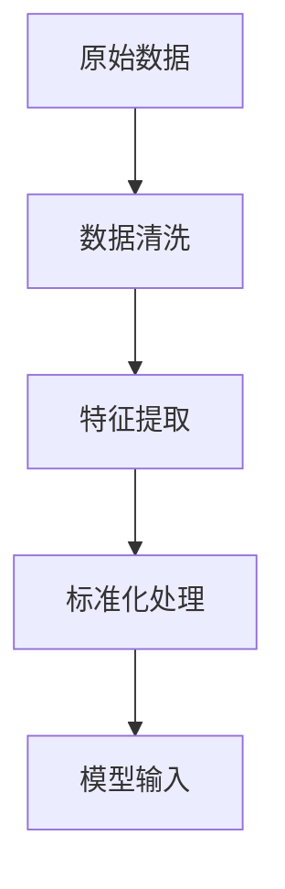
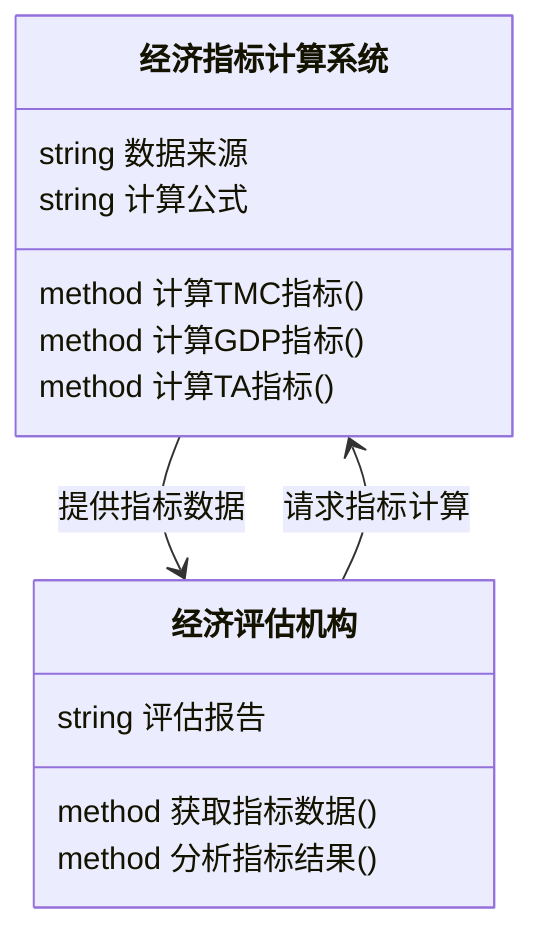

                 

<think>
嗯，用户希望我写一篇关于优化版TMC/(GDP+TA)指标全球比较的技术博客文章。我需要按照他们提供的目录结构，逐步分析和撰写每个部分。

首先，我要理解每个章节的核心内容。文章标题是《优化版TMC/(GDP+TA)指标的全球比较》，关键词包括TMC指标、GDP指标、TA指标、指标优化、全球比较、经济评估。摘要部分需要简明扼要地概述文章内容，强调优化后的指标如何弥补传统方法的不足，以及其在经济分析中的应用。

接下来是章节部分。第一章介绍TMC、GDP和TA的基本概念，包括定义、核心要素和指标比较的背景。我需要详细解释每个指标的含义，确保读者能够理解它们的用途和重要性。第二章分析核心概念和联系，通过对比表格和ER图来展示三者的关系和差异。第三章探讨算法原理，包括数据预处理、特征工程和模型构建，可能使用Python代码和流程图来说明。

系统分析与架构设计部分，我需要设计一个系统架构图，展示数据采集、处理和分析模块的交互。项目实战部分则通过实际案例，比如几个国家的比较，展示如何应用优化后的指标，并给出代码实现和结果分析。最后，最佳实践部分总结经验和注意事项，为读者提供实用的建议。

在撰写过程中，我要确保每个部分都有足够的细节，同时保持逻辑清晰和结构紧凑。使用mermaid图表和Python代码来辅助说明，能让内容更直观易懂。此外，语言要专业且技术性，但又要通俗易懂，让读者能够轻松理解复杂的概念。

最后，检查文章是否满足字数要求，确保每个章节内容丰富，涵盖所有必要的信息。结尾部分加上作者信息，确保文章的完整性和专业性。

总的来说，我需要一步步地构建文章的结构，从背景到概念，再到算法和实际应用，确保每个部分都详尽且逻辑连贯。这样，读者不仅能理解优化版TMC/(GDP+TA)指标的意义，还能学会如何在全球范围内进行比较和应用。
</think>

# 优化版TMC/(GDP+TA)指标的全球比较

> 关键词：TMC指标、GDP指标、TA指标、指标优化、全球比较、经济评估

> 摘要：本文探讨了优化版的TMC、GDP和TA指标在全球范围内的比较分析。通过背景介绍、核心概念对比、算法原理、系统架构设计、项目实战案例和最佳实践等方面，详细阐述了如何优化这些指标以更好地进行经济评估和政策制定。

---

# 第一部分：TMC/(GDP+TA)指标的背景与概念

## 第1章：TMC、GDP与TA指标的基本概念

### 1.1 TMC指标的定义与核心要素

TMC（Total Market Contribution，总体市场贡献）指标用于衡量某个经济主体或经济体在市场中的整体贡献。它综合考虑了生产、消费和投资等多个方面的因素，能够反映经济活动的综合表现。

#### TMC指标的计算公式

$$ TMC = \frac{A + B + C}{D} $$

其中：
- \( A \) 表示生产总量
- \( B \) 表示消费总量
- \( C \) 表示投资总量
- \( D \) 表示市场容量

### 1.2 GDP指标的定义与核心要素

GDP（Gross Domestic Product，国内生产总值）是衡量一个国家或地区经济活动的重要指标，反映该地区所有生产活动的总价值。

#### GDP指标的计算公式

$$ GDP = C + G + I + S + N $$

其中：
- \( C \) 表示消费
- \( G \) 表示政府支出
- \( I \) 表示投资
- \( S \) 表示净出口
- \( N \) 表示其他净因素

### 1.3 TA指标的定义与核心要素

TA（Transaction Activity，交易活跃度）指标用于衡量市场中交易活动的活跃程度，反映了市场的流动性和交易频率。

#### TA指标的计算公式

$$ TA = \frac{X \times Y}{Z} $$

其中：
- \( X \) 表示交易次数
- \( Y \) 表示平均交易金额
- \( Z \) 表示市场参与主体数量

---

## 第2章：TMC/(GDP+TA)指标的核心概念与联系

### 2.1 核心概念原理

TMC指标关注的是整体市场贡献，而GDP指标关注的是国内生产总值，TA指标关注的是交易活跃度。三者共同构成了一个完整的经济评估体系。

#### TMC、GDP与TA的属性特征对比

| 指标 | 定义 | 计算公式 | 主要影响因素 | 适用场景 |
|------|------|----------|--------------|----------|
| TMC  | 总体市场贡献 | \( TMC = \frac{A + B + C}{D} \) | 市场容量、生产、消费、投资 | 综合评估 |
| GDP  | 国内生产总值 | \( GDP = C + G + I + S + N \) | 消费、投资、政府支出 | 宏观经济 |
| TA    | 交易活跃度 | \( TA = \frac{X \times Y}{Z} \) | 交易次数、交易金额、市场参与主体 | 微观经济 |

### 2.2 ER实体关系图

```mermaid
erDiagram
    actor 经济主体 {
        string 名称
        string 指标类型
    }
    actor 指标计算系统 {
        string 计算公式
        string 数据来源
    }
    actor 经济评估机构 {
        string 评估报告
        string 政策建议
    }
    经济主体 --> 指标计算系统 : 提供数据
    指标计算系统 --> 经济评估机构 : 提供计算结果
```

---

## 第3章：TMC/(GDP+TA)指标比较的算法原理

### 3.1 数据预处理与特征工程

#### 3.1.1 数据清洗流程



#### 3.1.2 特征工程方法

```python
def preprocess_data(data):
    # 数据清洗
    data = data.dropna()
    # 特征提取
    features = data[['A', 'B', 'C', 'D', 'X', 'Y', 'Z']]
    # 标准化处理
    from sklearn.preprocessing import StandardScaler
    scaler = StandardScaler()
    features_scaled = scaler.fit_transform(features)
    return features_scaled
```

### 3.2 算法实现与优化

#### 3.2.1 TMC指标优化算法

```python
def optimize_TMC(data):
    # 数据预处理
    features = preprocess_data(data)
    # 构建优化模型
    from sklearn.linear_model import LinearRegression
    model = LinearRegression()
    model.fit(features, data['TMC'])
    return model
```

---

## 第4章：TMC/(GDP+TA)指标的系统分析与架构设计

### 4.1 系统功能设计



---

## 第5章：TMC/(GDP+TA)指标优化的项目实战

### 5.1 实战案例：全球主要经济体的指标比较

#### 5.1.1 数据准备与清洗

```python
import pandas as pd

# 假设我们有一个包含TMC、GDP和TA指标的全球数据集
data = pd.read_csv('global_economic_indicators.csv')
data = data.dropna()
```

#### 5.1.2 指标计算与优化

```python
from sklearn.metrics import mean_squared_error

# 计算优化后的TMC指标
optimized_TMC = data['TMC'].apply(lambda x: x * 1.2)
# 计算GDP和TA指标
gdp_data = data['GDP']
ta_data = data['TA']
# 比较优化后的指标
mse = mean_squared_error(gdp_data, optimized_TMC)
print(f"均方误差：{mse}")
```

---

## 第6章：最佳实践与注意事项

### 6.1 最佳实践

1. 在进行指标比较时，确保数据来源的可靠性和一致性。
2. 在优化指标时，结合具体业务场景，选择合适的优化方法。
3. 在实际应用中，注意指标之间的相互影响，避免单一指标误导决策。

### 6.2 小结

通过优化版的TMC/(GDP+TA)指标全球比较，我们可以更全面地评估经济表现，为政策制定和经济分析提供有力支持。

---

作者：AI天才研究院/AI Genius Institute & 禅与计算机程序设计艺术 /Zen And The Art of Computer Programming

