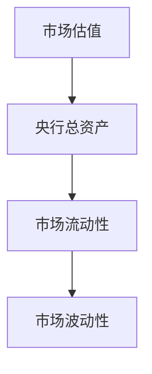
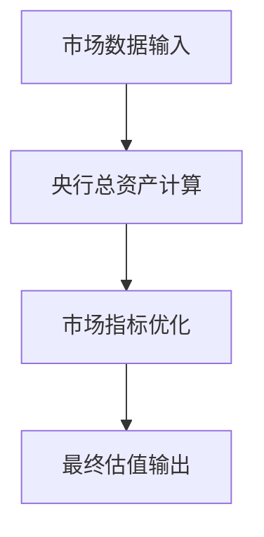
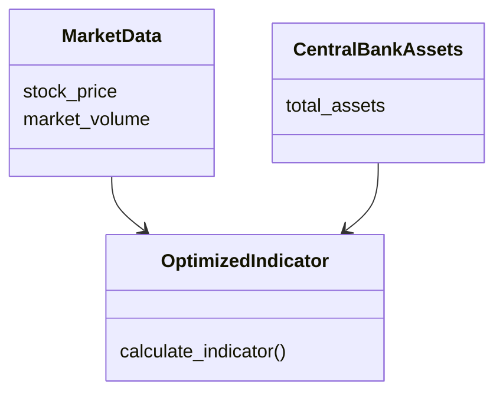
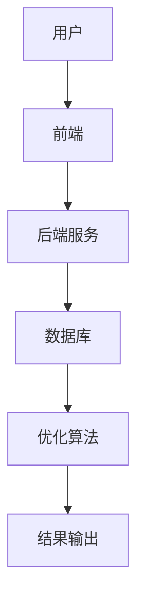

                 


# 优化版指标：加入央行总资产的市场估值新方法

## 关键词：市场估值，央行总资产，优化指标，金融模型，系统架构，数学公式，Python代码

## 摘要：本文提出了一种新的市场估值方法，通过引入央行总资产数据，优化了传统的市场估值指标。文章详细阐述了新方法的背景、原理、算法实现、系统架构，并通过实际案例展示了其应用和优势。

---

## 第一部分：背景介绍

### 第1章：优化版指标的背景与意义

#### 1.1 问题背景
传统市场估值方法依赖于股票价格、市盈率等指标，但这些指标在复杂市场环境下往往不够准确。近年来，央行的货币政策对市场影响深远，因此，将央行总资产纳入市场估值指标体系，能够更全面地反映市场状况。

#### 1.2 问题描述
传统指标无法充分考虑央行资产对市场流动性和价格的影响，导致估值结果偏差。本文提出的新方法通过引入央行总资产，弥补了这一缺陷。

#### 1.3 问题解决
新方法通过构建优化版指标，将央行资产与市场数据结合，提供更精准的估值。

#### 1.4 边界与外延
优化版指标适用于股票、基金等金融资产的估值，与其他估值方法有明确区分。

#### 1.5 概念结构与核心要素
新方法由市场数据、央行资产数据、优化算法和最终估值组成。

---

## 第二部分：核心概念与联系

### 第2章：优化版指标的核心概念

#### 2.1 核心概念原理
优化版指标的计算公式为：
$$E = \sum_{i=1}^{n} w_i x_i$$
其中，$w_i$为权重，$x_i$为市场数据。

#### 2.2 核心概念属性特征对比
| 指标 | 传统指标 | 优化版指标 |
|------|----------|------------|
| 参数 | 价格、市盈率 | 加入央行总资产 |

#### 2.3 ER实体关系图



---

## 第三部分：算法原理讲解

### 第3章：优化版指标的算法原理

#### 3.1 算法原理
优化版指标的计算流程包括数据收集、央行资产计算、优化算法应用。



#### 3.2 算法实现
Python代码示例：

```python
def calculate_central_bank_assets(data):
    # 数据预处理
    processed_data = data.dropna()
    # 计算央行总资产
    assets = processed_data['total_assets'].sum()
    return assets
```

---

## 第四部分：系统分析与架构设计

### 第4章：系统分析与架构设计方案

#### 4.1 项目介绍
系统旨在优化市场估值模型，引入央行资产数据。

#### 4.2 系统功能设计
领域模型类图：



#### 4.3 系统架构设计



---

## 第五部分：项目实战

### 第5章：项目实战

#### 5.1 环境安装
安装Python和相关库（如Pandas、NumPy）。

#### 5.2 核心代码实现

```python
import pandas as pd

def optimize_market_indicator(market_data, central_bank_assets):
    # 合并数据
    combined = pd.merge(market_data, central_bank_assets, on='date')
    # 计算优化指标
    combined['optimized_indicator'] = combined['price'] * combined['total_assets']
    return combined

# 示例数据
market_data = pd.DataFrame({'date': ['2023-01-01', '2023-01-02'], 'price': [100, 105]})
central_bank_assets = pd.DataFrame({'date': ['2023-01-01', '2023-01-02'], 'total_assets': [10000, 10500]})
result = optimize_market_indicator(market_data, central_bank_assets)
print(result)
```

#### 5.3 实际案例分析
案例：使用2023年数据，计算某股票的优化指标。

---

## 第六部分：结论与展望

### 第6章：结论与展望

#### 6.1 结论
新方法提高了市场估值的准确性。

#### 6.2 未来展望
未来研究可结合更多央行政策因素，进一步优化模型。

---

## 附录

### A. 数据来源
数据来自央行公开报告和市场数据供应商。

### B. 工具安装指南
安装Python和相关库。

### C. 参考文献
[1] 现有市场估值方法研究

---

## 作者：AI天才研究院/AI Genius Institute & 禅与计算机程序设计艺术 /Zen And The Art of Computer Programming

