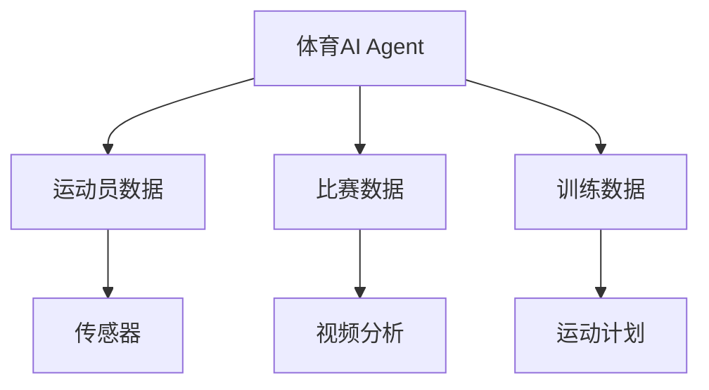
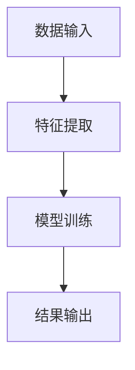
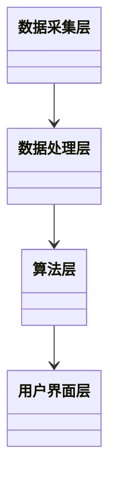
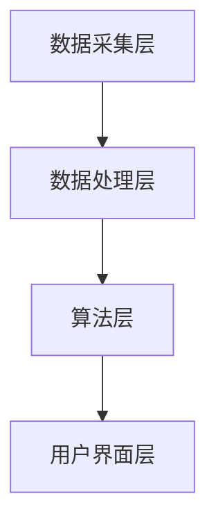
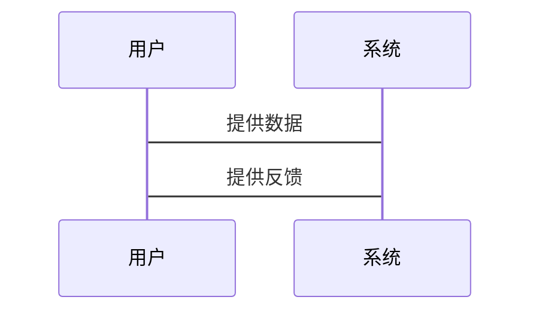

                 


# 体育AI Agent：赛事分析与训练辅助

> 关键词：体育AI Agent, 赛事分析, 训练辅助, 人工智能, 算法原理, 系统架构

> 摘要：本文系统介绍了体育AI Agent在赛事分析与训练辅助中的应用，从核心概念、算法原理到系统架构和项目实战，全面解析了体育AI Agent的技术实现与实践应用。通过详细的技术分析和实际案例，展示了如何利用AI技术提升体育赛事的分析能力与训练效率。

---

# 第一部分: 体育AI Agent的背景与概念

## 第1章: 体育AI Agent的背景与问题背景

### 1.1 体育AI Agent的背景介绍
#### 1.1.1 人工智能在体育领域的应用背景
人工智能（AI）技术在体育领域的应用日益广泛，从赛事分析到运动员训练，AI正在改变传统的体育模式。通过机器学习、深度学习和自然语言处理等技术，AI可以帮助教练和运动员更好地理解比赛数据、优化训练计划并制定策略。

#### 1.1.2 体育AI Agent的核心概念
体育AI Agent是一种智能系统，能够通过分析体育数据（如比赛视频、传感器数据、运动员表现等）来辅助教练和运动员做出决策。它能够实时处理大量数据，并提供个性化的反馈和建议。

#### 1.1.3 体育AI Agent的定义与特点
- **定义**：体育AI Agent是一种基于AI的智能辅助工具，用于分析体育赛事数据并提供实时反馈和建议。
- **特点**：
  - 数据驱动：依赖大量体育数据进行分析。
  - 实时性：能够快速处理数据并提供实时反馈。
  - 个性化：根据运动员或团队的特定需求提供定制化建议。

### 1.2 体育AI Agent的问题背景
#### 1.2.1 传统体育分析的局限性
传统体育分析主要依赖人工观察和经验，这种方法存在效率低、主观性强、难以量化等问题。例如，教练通过肉眼观察比赛视频，难以捕捉到所有细节，且分析结果受到主观因素的影响。

#### 1.2.2 体育训练辅助的痛点
运动员的训练计划通常基于经验制定，缺乏科学性和个性化。AI可以通过分析运动员的生物数据（如心率、步频、动作姿势等）和环境数据（如天气、场地状况等），帮助制定更科学、个性化的训练计划。

#### 1.2.3 体育AI Agent的应用场景与边界
- **应用场景**：
  - 赛事分析：分析比赛视频，识别战术问题，预测对手策略。
  - 训练辅助：实时监控运动员表现，提供个性化反馈。
  - 数据挖掘：从历史数据中提取规律，优化训练计划。
- **边界**：
  - 数据隐私：处理运动员和团队的敏感数据时需注意隐私保护。
  - 实时性限制：部分AI算法可能在实时性方面存在瓶颈。

### 1.3 体育AI Agent的核心要素与概念结构
#### 1.3.1 核心要素分析
体育AI Agent的核心要素包括：
- 数据源：比赛视频、传感器数据、运动员生物数据等。
- AI算法：机器学习、深度学习、自然语言处理等。
- 输出结果：实时反馈、个性化建议、战术优化等。

#### 1.3.2 概念结构与组成
体育AI Agent的组成可以分为数据采集层、数据处理层、算法层和用户界面层。

#### 1.3.3 核心概念的外延与边界
- **外延**：体育AI Agent不仅用于职业体育，也可以应用于业余体育和学校体育。
- **边界**：AI Agent无法完全替代人类的决策，只能提供辅助建议。

---

## 第2章: 体育AI Agent的核心概念与联系

### 2.1 核心概念原理
#### 2.1.1 AI Agent的基本原理
AI Agent通过感知环境、分析数据、做出决策并执行动作来实现其功能。在体育领域，AI Agent的核心任务是分析比赛数据并提供反馈。

#### 2.1.2 体育AI Agent的核心算法
体育AI Agent的核心算法包括：
- 机器学习：用于模式识别和预测。
- 深度学习：用于处理图像和视频数据。
- 强化学习：用于优化训练计划和策略。

#### 2.1.3 多模态数据处理机制
体育AI Agent需要处理多种类型的数据，如图像、文本、传感器数据等。多模态数据处理机制能够整合不同数据源的信息，提供更全面的分析结果。

### 2.2 核心概念属性特征对比
#### 2.2.1 与传统AI分析的对比
| 对比维度 | 传统AI分析 | 体育AI Agent |
|----------|------------|---------------|
| 数据源   | 单一数据源 | 多模态数据源   |
| 实时性   | 较低       | 较高           |
| 个性化   | 较差       | 较强           |

#### 2.2.2 与机器学习模型的对比
| 对比维度 | 机器学习模型 | 体育AI Agent |
|----------|--------------|---------------|
| 功能     | 数据分析     | 数据分析 + 决策 |
| 实时性   | 较低         | 较高           |
| 交互性   | 无           | 有             |

#### 2.2.3 与规则引擎的对比
| 对比维度 | 规则引擎 | 体育AI Agent |
|----------|----------|---------------|
| 灵活性   | 较低     | 较高           |
| 可扩展性 | 有限     | 较强           |
| 决策能力 | 基于规则 | 基于数据驱动 |

### 2.3 实体关系图与ER架构


---

## 第3章: 体育AI Agent的算法原理

### 3.1 算法原理概述
#### 3.1.1 机器学习在体育分析中的应用
机器学习用于分析运动员的表现数据，如动作识别、疲劳预测等。例如，可以通过训练一个分类模型来识别运动员的动作是否符合技术要求。

#### 3.1.2 深度学习在体育训练中的应用
深度学习在处理图像和视频数据方面具有优势，可以用于比赛视频的实时分析。例如，可以通过卷积神经网络（CNN）识别比赛中的关键动作。

#### 3.1.3 强化学习在体育策略中的应用
强化学习可以用于优化训练计划和比赛策略。例如，可以通过强化学习算法训练一个AI Agent来模拟运动员的动作，从而优化训练计划。

### 3.2 算法流程图


### 3.3 算法实现代码
```python
# 示例代码：基于机器学习的运动员表现分析
import numpy as np
from sklearn.linear_model import LinearRegression

# 示例数据：运动员的训练数据
X = np.array([[1, 2], [3, 4], [5, 6], [7, 8], [9, 10]])
y = np.array([2, 3, 5, 7, 11])

# 训练线性回归模型
model = LinearRegression()
model.fit(X, y)

# 预测新数据
new_X = np.array([[11, 12]])
predicted_y = model.predict(new_X)
print(predicted_y)
```

### 3.4 数学模型与公式
#### 3.4.1 线性回归模型
$$ y = \beta_0 + \beta_1x + \epsilon $$

#### 3.4.2 卷积神经网络（CNN）
$$ \text{激活函数} = \sigma(w \cdot x + b) $$

---

## 第4章: 体育AI Agent的系统分析与架构设计

### 4.1 问题场景介绍
体育AI Agent需要处理复杂的数据流，包括来自传感器、摄像头和数据库的多种数据类型。系统需要在实时环境下高效运行，因此对计算能力和数据处理能力要求较高。

### 4.2 系统功能设计
#### 4.2.1 领域模型类图


#### 4.2.2 系统架构设计


#### 4.2.3 系统接口设计
- 数据输入接口：接收传感器数据和视频数据。
- 数据输出接口：提供实时反馈和个性化建议。

#### 4.2.4 系统交互流程


---

## 第5章: 体育AI Agent的项目实战

### 5.1 项目环境安装
需要安装以下工具和库：
- Python 3.x
- NumPy
- scikit-learn
- OpenCV
- TensorFlow

### 5.2 核心代码实现
#### 5.2.1 数据处理代码
```python
import numpy as np
import pandas as pd

# 示例数据处理代码
data = pd.read_csv('training_data.csv')
X = data.iloc[:, :-1].values
y = data.iloc[:, -1].values

# 数据标准化
from sklearn.preprocessing import StandardScaler
scaler = StandardScaler()
X_scaled = scaler.fit_transform(X)
```

#### 5.2.2 训练代码
```python
from sklearn.model_selection import train_test_split
from sklearn.linear_model import LinearRegression

X_train, X_test, y_train, y_test = train_test_split(X_scaled, y, test_size=0.2, random_state=42)

model = LinearRegression()
model.fit(X_train, y_train)
```

### 5.3 实际案例分析
以足球比赛为例，分析AI Agent如何通过视频数据识别球员的动作并优化训练计划。

### 5.4 项目小结
通过实际案例，我们可以看到体育AI Agent在数据分析和决策支持方面具有强大的潜力。

---

## 第6章: 体育AI Agent的最佳实践

### 6.1 小结
体育AI Agent的应用前景广阔，但仍需克服数据隐私和实时性等方面的挑战。

### 6.2 注意事项
- 数据隐私：确保运动员数据的安全性和隐私性。
- 系统稳定性：确保AI Agent在实时环境下稳定运行。

### 6.3 拓展阅读
建议进一步学习以下内容：
- 体育数据科学
- AI在运动医学中的应用
- 多模态数据处理技术

---

# 作者

作者：AI天才研究院/AI Genius Institute & 禅与计算机程序设计艺术 /Zen And The Art of Computer Programming

