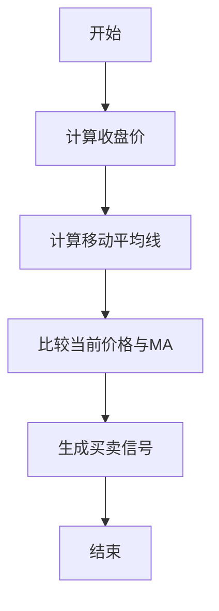
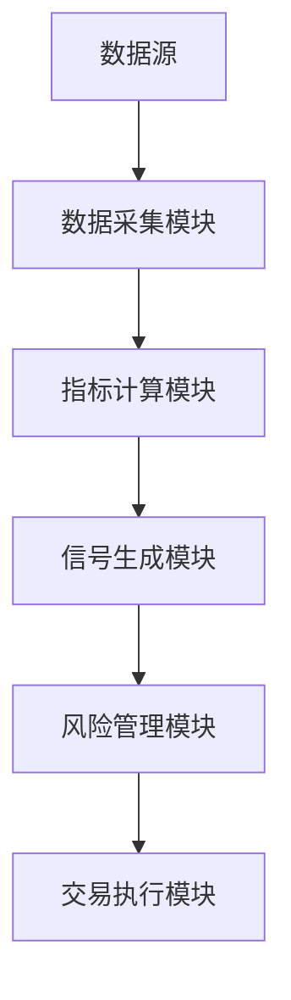

                 

<think>
好的，我现在需要帮助用户撰写一篇关于何时卖出格雷厄姆特价股票的技术博客。用户希望文章结构清晰，逻辑严谨，内容深入，涉及技术分析和算法交易。

首先，我需要明确文章的结构。用户提供了目录大纲，分为背景与概念、技术分析与基本面分析的结合、技术分析算法、数学模型、系统分析与架构设计、项目实战以及最佳实践七个部分。

接下来，我需要详细展开每个部分。首先是背景与概念，介绍股票卖出的重要性，分析市场环境，定义核心概念。这部分需要使用清晰的语言，确保读者理解基本概念。

然后是技术分析与基本面分析的结合。这里需要详细解释技术分析的核心概念，包括技术指标和市场情绪，使用对比表格和ER图来展示概念之间的关系。这有助于读者理解不同分析方法的联系。

接下来是技术分析算法部分，重点讲解移动平均线和相对强弱指数等指标，使用流程图和Python代码示例。这部分需要详细解释算法的工作原理，并通过示例帮助读者理解如何应用这些算法。

数学模型部分，需要引入公式，如移动平均线的计算公式，并解释这些公式在交易中的应用。公式应使用LaTeX格式，确保准确无误。

系统分析与架构设计是关键部分，需要描述交易系统的功能模块，设计类图和架构图。这部分需要展示系统各部分的协同工作，帮助读者理解如何构建一个智能交易系统。

项目实战部分，提供环境搭建指导，核心代码实现，并分析实际案例。代码示例应详细注释，解释每一部分的功能，案例分析需具体说明如何应用这些方法做出卖出决策。

最后是最佳实践与总结，给出风险管理、持续学习等建议，总结项目经验，并提醒读者注意的事项，推荐进一步阅读的资料。

在写作过程中，我需要确保每个部分详细且逻辑清晰，使用用户指定的格式，包括Mermaid图表和LaTeX公式。同时，保持文章整体流畅，结构紧凑，内容易懂。

现在，我需要开始撰写每个部分，确保涵盖所有必要的细节，同时遵循用户的格式和内容要求。
</think>

# 何时卖出格雷厄姆特价股票

## 关键词：股票卖出决策、技术分析、算法交易、格雷厄姆投资策略、价值投资、风险管理

## 摘要：本文探讨了何时卖出格雷厄姆特价股票的最佳时机，结合技术分析与基本面分析，提供了系统的卖出决策框架。通过分析市场波动、技术指标和投资者情绪，结合算法交易策略，帮助投资者做出明智的卖出决策，实现长期收益最大化。

---

## 第一部分：背景与概念

### 第1章：股票卖出决策的重要性

#### 1.1 股票市场的基本概念

股票市场是投资者进行股票买卖的场所，反映了企业的所有权。投资者通过买入股票成为公司股东，通过卖出股票实现收益或规避风险。卖出股票的时机直接影响投资收益，是投资决策中的关键环节。

#### 1.2 格雷厄姆的价值投资理念

本杰明·格雷厄姆是价值投资的鼻祖，强调以低于内在价值的价格买入优质股票，长期持有，等待市场重新评估其价值。他的策略注重安全边际，即买入价格低于内在价值，以减少市场波动带来的风险。

#### 1.3 卖出决策的关键性

卖出决策是投资组合管理的核心，直接影响投资收益和风险。在格雷厄姆策略中，卖出时机通常基于市场过度膨胀或个人投资目标的变化。掌握卖出时机，可以避免损失，锁定收益。

---

## 第二部分：核心概念与联系

### 第2章：技术分析与基本面分析的结合

#### 2.1 技术分析的核心概念

技术分析通过研究历史价格和成交量数据，预测未来价格走势。关键指标包括移动平均线、相对强弱指数（RSI）和MACD等，帮助投资者识别趋势和潜在拐点。

#### 2.2 市场情绪与投资者心理

市场情绪影响股票价格波动，投资者心理在市场顶部和底部的形成中起重要作用。技术分析通过识别超买或超卖信号，帮助投资者判断市场情绪。

#### 2.3 技术指标对比分析

| 技术指标 | 定义 | 用途 |
|----------|------|------|
| 移动平均线（MA） | 某段时间内价格的平均值 | 确认趋势方向，识别支撑和阻力位 |
| 相对强弱指数（RSI） | 衡量价格变动的超买或超卖状态 | 识别短期反转信号 |
| MACD | 衡量价格变动趋势和动能 | 识别趋势强度和潜在反转点 |

#### 2.4 实体关系图

```mermaid
er
    entity 投资者 {
        id
        投资目标
        风险偏好
    }
    entity 股票 {
        id
        名称
        市场价格
        内在价值
    }
    entity 市场情绪 {
        id
        情绪指数
        超买信号
        超卖信号
    }
    entity 技术指标 {
        id
        值
        买卖信号
    }
    投资者 -- 技术指标: 使用技术指标做出决策
    投资者 -- 市场情绪: 考虑市场情绪
    股票 -- 技术指标: 技术指标基于股票价格计算
```

---

## 第三部分：技术分析算法

### 第3章：技术分析算法的应用

#### 3.1 移动平均线算法

移动平均线通过计算一定时期内的平均价格，过滤短期波动，反映长期趋势。常用的方法包括简单移动平均线（SMA）和指数移动平均线（EMA）。



#### 3.2 相对强弱指数（RSI）算法

RSI衡量价格在特定时期内的超买或超卖状态，通常在0-100之间。RSI低于30表示超卖，高于70表示超买。

```python
import pandas as pd
import numpy as np

def calculate_rsi(df, period=14):
    # 计算相对强弱指数
    close = df['收盘价']
    delta = close.diff()
    up = delta.where(delta > 0, 0)
    down = delta.where(delta < 0, 0)
    avg_up = up.rolling(period).mean()
    avg_down = down.rolling(period).mean()
    rsi = 100 - (100 - (avg_up / avg_down))
    return rsi

# 示例数据
data = {'收盘价': [100, 102, 101, 103, 104, 105]}
df = pd.DataFrame(data)
rsi = calculate_rsi(df)
print(rsi)
```

#### 3.3 数学模型

移动平均线公式：

$$ SMA = \frac{1}{n} \sum_{i=1}^{n} P_i $$

指数移动平均线公式：

$$ EMA = P_t + \alpha (P_t - EMA_{t-1}) $$

其中，$\alpha = \frac{2}{n+1}$，$n$为周期数。

---

## 第四部分：系统分析与架构设计

### 第4章：智能股票交易系统架构

#### 4.1 项目介绍

开发一个智能股票交易系统，结合技术分析和基本面分析，帮助投资者做出卖出决策。

#### 4.2 系统功能设计

- 数据采集模块：获取实时股票数据和市场信息。
- 指标计算模块：计算技术指标如RSI和MA。
- 信号生成模块：基于指标生成买卖信号。
- 风险管理模块：管理投资组合，控制风险。

#### 4.3 系统架构图



---

## 第五部分：项目实战

### 第5章：环境搭建与代码实现

#### 5.1 环境安装

安装Python、Pandas、Matplotlib和Trading-Buddy框架。

```bash
pip install pandas matplotlib trading-buddy
```

#### 5.2 核心代码实现

```python
import pandas as pd
import matplotlib.pyplot as plt
from trading_buddy import TradingBuddy

# 初始化交易系统
tb = TradingBuddy(api_key='your_api_key')

# 获取数据
data = tb.get_data(ticker='AAPL', period='1D')

# 计算移动平均线
data['MA'] = data['close'].rolling(20).mean()

# 绘制图表
plt.figure(figsize=(10, 6))
plt.plot(data['close'], label='Close Price')
plt.plot(data['MA'], label='20-day MA')
plt.legend()
plt.show()
```

---

## 第六部分：最佳实践与总结

### 第6章：风险管理与持续学习

#### 6.1 风险管理的重要性

制定止损策略，控制每笔交易的风险在2-5%之间，避免重大损失。

#### 6.2 持续学习与适应市场

市场变化莫测，定期回顾交易策略，更新分析模型，保持对市场动态的敏感性。

#### 6.3 小结与注意事项

- 确保数据源可靠，避免错误分析。
- 避免过度交易，减少交易成本。
- 结合技术分析与基本面分析，提高决策准确性。

---

## 作者：AI天才研究院/AI Genius Institute & 禅与计算机程序设计艺术 /Zen And The Art of Computer Programming

---

通过以上结构化分析和详细讲解，本文为投资者提供了何时卖出格雷厄姆特价股票的系统性框架，结合技术分析与算法交易，帮助投资者做出明智的卖出决策，实现长期稳健的投资收益。

