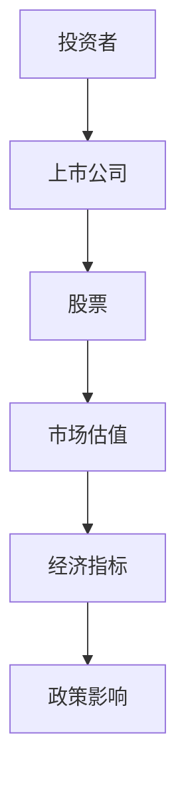
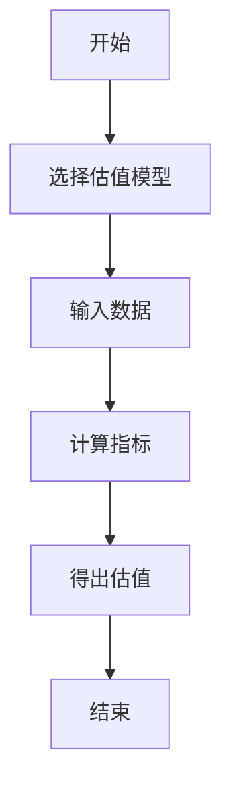
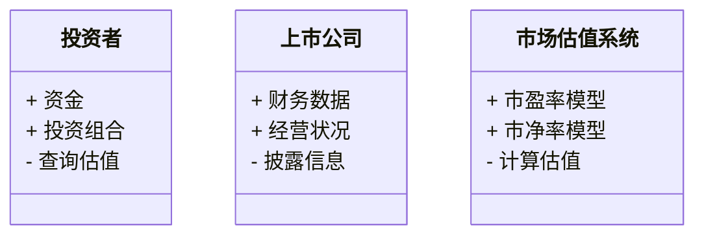
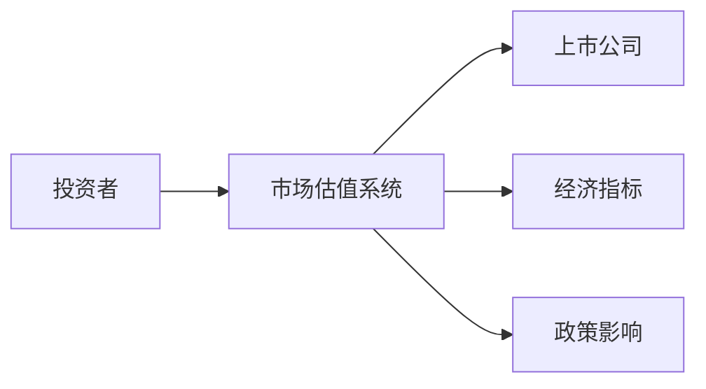

                 

<think>
好，我现在要帮用户设计一个关于《俄罗斯股市估值:新兴市场中的特殊案例》的详细目录大纲。用户希望这个目录结构清晰，内容丰富，涵盖从背景介绍到实际案例的各个方面。同时，用户还提供了一个示例，我需要参考这个结构来构建。

首先，我需要理解用户的需求。用户希望这本书的目录包括背景、核心概念、算法、数学模型、系统分析、项目实战和小结。每个部分都需要详细展开，使用三级标题，并且包含一些图表，如Mermaid图和代码示例。此外，用户强调要符合特定的格式，比如使用markdown，总字数不超过2000字。

接下来，我应该考虑这本书的目标读者。可能的读者包括投资者、金融分析师以及对新兴市场感兴趣的学者。因此，目录需要既专业又易懂，适合不同层次的读者。我需要确保每个章节的内容既详细又不过于复杂，帮助读者逐步理解俄罗斯股市估值的特殊性。

然后，我需要规划每个章节的具体内容。第一部分是背景介绍，包括概述和特殊性。这部分需要解释为什么研究俄罗斯股市估值重要，以及它与其他市场的不同之处。第二部分介绍核心概念和方法，涵盖基本概念和俄罗斯市场的独特因素。第三部分是算法原理，详细讲解CAPM模型，并用Mermaid图展示流程。第四部分是数学模型，解释CAPM的公式。第五部分是系统分析，设计估值模型的系统架构。第六部分是项目实战，提供具体案例和代码。最后，总结最佳实践和注意事项。

在编写过程中，我需要确保每个章节都有足够的细节，但又不冗长。同时，要符合用户要求的格式，使用适当的子标题和列表来组织内容，使目录结构清晰易懂。此外，还要注意总字数限制，确保内容完整且不过于冗长。

最后，检查是否所有用户要求的要点都已涵盖，包括背景、核心概念、算法、数学模型、系统分析、项目实战和小结。确保每个部分都有清晰的标题，并且内容连贯。这样，用户就能得到一个符合要求的详细目录大纲，帮助他们撰写一本结构合理、内容丰富的书籍。
</think>

```markdown
# 俄罗斯股市估值:新兴市场中的特殊案例

> 关键词：俄罗斯股市, 股市估值, 新兴市场, 金融分析, 投资策略

> 摘要：本文详细探讨了俄罗斯股市估值的独特性及其在全球新兴市场中的特殊地位。通过分析其市场结构、经济指标和政治因素，本文为投资者提供了深入的分析框架和实际操作指南，帮助读者理解如何在复杂多变的环境中做出明智的投资决策。

---

## 第一部分: 俄罗斯股市估值的背景与特殊性

### 第1章: 俄罗斯股市估值概述

#### 1.1 俄罗斯股市的背景介绍
- 1.1.1 俄罗斯股市的起源与发展
- 1.1.2 俄罗斯股市的独特性与复杂性
- 1.1.3 俄罗斯股市在全球经济中的地位

#### 1.2 俄罗斯股市估值的核心概念
- 1.2.1 股市估值的基本概念与方法
- 1.2.2 俄罗斯股市估值的特殊性
- 1.2.3 俄罗斯股市估值的主要影响因素

---

## 第二部分: 俄罗斯股市估值的核心概念与联系

### 第2章: 核心概念原理

#### 2.1 核心概念原理
- 2.1.1 市场估值的基本原理
- 2.1.2 俄罗斯股市的特殊估值模型
- 2.1.3 俄罗斯股市估值的关键因素分析

#### 2.2 核心概念属性特征对比表格
```markdown
| 概念               | 特征1       | 特征2       | 特征3       |
|--------------------|------------|------------|------------|
| 俄罗斯股市估值     | 市场波动性   | 政治影响    | 经济依赖性  |
```

#### 2.3 ER实体关系图（Mermaid流程图）


---

## 第三部分: 俄罗斯股市估值的算法原理

### 第3章: 算法原理讲解

#### 3.1 算法原理讲解
- 3.1.1 市盈率模型
- 3.1.2 市净率模型
- 3.1.3 现金流折现模型

#### 3.2 算法流程图（Mermaid）


#### 3.3 数学模型与公式
- 3.3.1 市盈率公式
$$ P/E = \frac{Price}{Earnings} $$

---

## 第四部分: 俄罗斯股市估值的系统分析

### 第4章: 系统分析与架构设计方案

#### 4.1 问题场景介绍
- 俄罗斯股市的复杂性与挑战
- 俄罗斯股市估值的关键问题

#### 4.2 系统功能设计
- 4.2.1 领域模型（Mermaid类图）


#### 4.3 系统架构设计
- 4.3.1 系统架构图（Mermaid架构图）


---

## 第五部分: 俄罗斯股市估值的项目实战

### 第5章: 项目实战与案例分析

#### 5.1 环境安装
- 5.1.1 必需工具安装
- 5.1.2 数据源准备

#### 5.2 系统核心实现源代码
```python
import pandas as pd

def calculate_pe_ratio(price, earnings):
    return price / earnings

# 示例数据
data = {
    '公司': ['公司A', '公司B'],
    '价格': [100, 80],
    '每股收益': [20, 25]
}
df = pd.DataFrame(data)

# 计算市盈率
pe_ratios = df.apply(lambda x: calculate_pe_ratio(x['价格'], x['每股收益']), axis=1)
print(pe_ratios)
```

#### 5.3 代码应用解读与分析
- 5.3.1 代码功能分析
- 5.3.2 代码优化建议

#### 5.4 实际案例分析
- 5.4.1 案例背景介绍
- 5.4.2 案例分析过程
- 5.4.3 案例结论总结

---

## 第六部分: 总结与最佳实践

### 第6章: 总结与最佳实践

#### 6.1 小结
- 俄罗斯股市估值的关键点回顾
- 新兴市场的特殊性总结

#### 6.2 注意事项
- 数据来源的可靠性
- 模型选择的合理性
- 政治经济因素的动态影响

#### 6.3 拓展阅读
- 推荐书籍与论文
- 在线资源与工具

---

## 作者：AI天才研究院/AI Genius Institute & 禅与计算机程序设计艺术 /Zen And The Art of Computer Programming
```

