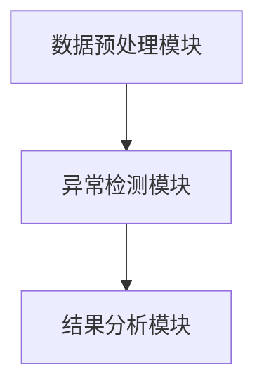

                 


# 元学习在快速市场异常识别中的应用

> 关键词：元学习，市场异常识别，快速响应，金融数据分析，人工智能

> 摘要：本文探讨了元学习在快速市场异常识别中的应用，详细介绍了元学习的基本概念、算法原理、系统设计以及实际案例，展示了如何利用元学习技术快速、准确地识别市场异常，提升金融交易的安全性和效率。

---

# 第一部分: 元学习与市场异常识别基础

## 第1章: 元学习与市场异常识别概述

### 1.1 元学习的基本概念

#### 1.1.1 元学习的定义
元学习（Meta-Learning）是一种机器学习方法，旨在通过“学习如何学习”来提高模型的泛化能力。它不同于传统机器学习，元学习的目标是优化学习过程，使其能够在新任务中快速适应。

#### 1.1.2 元学习的核心特点
- **快速适应性**：能够在少量数据下快速学习新任务。
- **泛化能力**：适用于数据稀疏或变化快的场景。
- **元任务驱动**：通过多个相关任务的联合优化，提升整体性能。

#### 1.1.3 元学习与传统机器学习的对比
| 对比维度 | 传统机器学习 | 元学习 |
|----------|--------------|--------|
| 数据需求 | 需要大量数据 | 数据稀疏可 |
| 学习目标 | 优化特定任务 | 优化学习过程 |
| 适应性   | 较低          | 较高     |

### 1.2 市场异常识别的基本概念

#### 1.2.1 市场异常的定义
市场异常（Market Anomaly）是指市场价格、交易量或其他市场指标在短时间内出现显著偏离正常波动的情况，可能是由突发事件、市场操纵或其他不可预见的因素引起。

#### 1.2.2 市场异常的分类
- **短期异常**：如股价暴跌或暴涨。
- **长期异常**：如市场趋势的突然逆转。
- **隐性异常**：如交易量突然激增。

#### 1.2.3 市场异常识别的挑战
- **数据稀疏性**：异常事件发生频率低，难以收集足够的样本。
- **快速变化性**：市场环境变化快，模型需要快速适应。
- **复杂性**：异常事件可能涉及多种因素的综合作用。

### 1.3 元学习在市场异常识别中的应用

#### 1.3.1 元学习在金融市场的优势
- **快速响应**：元学习能够在短时间内适应新任务，适用于金融市场快速变化的场景。
- **数据效率**：元学习能够在数据稀疏的情况下进行有效学习。
- **泛化能力**：元学习模型能够处理多种类型的异常事件。

#### 1.3.2 元学习与市场异常识别的结合
元学习通过优化学习过程，能够在金融市场中快速识别异常事件，帮助投资者及时做出决策，降低风险。

#### 1.3.3 元学习在快速市场异常识别中的潜力
- **实时监控**：元学习模型可以实时监控市场数据，快速识别异常事件。
- **多任务学习**：元学习能够同时处理多个相关任务，提升整体识别能力。

---

## 第2章: 元学习的核心概念与理论基础

### 2.1 元学习的理论框架

#### 2.1.1 元任务与元模型
- **元任务**：元学习中的训练任务，用于优化学习过程。
- **元模型**：元学习的核心模型，用于指导新任务的学习。

#### 2.1.2 元学习的算法框架
元学习算法通常包括以下几个步骤：
1. 初始化元模型参数。
2. 在多个元任务上进行训练，优化元模型参数。
3. 在新任务上使用优化后的元模型进行快速学习。

#### 2.1.3 元学习的核心原理
元学习通过优化学习过程，使得模型能够在新任务上快速调整参数，适应新的数据分布。

### 2.2 市场异常识别的数学模型

#### 2.2.1 异常检测的基本模型
异常检测模型通常包括以下步骤：
1. 数据预处理。
2. 异常检测算法训练。
3. 异常识别。

#### 2.2.2 元学习在异常检测中的应用
元学习通过优化异常检测过程，提高检测的准确性和速度。

#### 2.2.3 异常检测的评价指标
- **准确率**：正确识别的异常事件数占总异常事件数的比例。
- **召回率**：正确识别的异常事件数占总异常事件数的比例。
- **F1分数**：准确率和召回率的调和平均数。

### 2.3 元学习与传统异常检测的对比

| 对比维度 | 传统异常检测 | 元学习异常检测 |
|----------|---------------|----------------|
| 数据需求 | 需要大量数据 | 数据稀疏可       |
| 适应性   | 较低           | 较高            |
| 处理速度 | 较慢           | 较快            |

---

## 第3章: 元学习算法原理

### 3.1 基于梯度的元学习算法

#### 3.1.1 MAML算法原理
MAML（Meta-Algorithm for Automated Machine Learning）是一种基于梯度的元学习算法，通过优化梯度下降过程来实现快速适应新任务。

#### 3.1.2 ReMAML算法原理
ReMAML（Refactored Meta-Algorithm for Automated Machine Learning）是对MAML的改进版本，通过优化元模型的结构来提高性能。

#### 3.1.3 元学习算法的数学推导
MAML算法的数学推导如下：
$$
\theta = \theta - \eta \nabla_{\theta} \mathcal{L}_{meta}
$$
其中，$\theta$ 是元模型参数，$\eta$ 是学习率，$\mathcal{L}_{meta}$ 是元损失函数。

### 3.2 元学习算法的实现细节

#### 3.2.1 梯度计算与优化
元学习算法通常需要计算多个任务的梯度，并对这些梯度进行优化。

#### 3.2.2 元学习的训练策略
元学习通常采用多任务训练策略，通过联合优化多个任务来提高模型的泛化能力。

#### 3.2.3 元学习的评估方法
元学习模型的评估通常采用跨任务验证策略，通过在多个任务上验证模型的性能。

### 3.3 元学习算法的优缺点对比

| 对比维度 | MAML | ReMAML |
|----------|-------|--------|
| 算法复杂度 | 较高   | 较低    |
| 性能表现 | 中等   | 较优    |
| 适用场景 | 数据充足 | 数据稀疏 |

---

## 第4章: 市场异常识别的系统设计

### 4.1 系统设计概述

#### 4.1.1 系统目标与功能
系统目标：快速识别市场异常事件，帮助投资者及时做出决策。
系统功能：数据采集、预处理、异常检测、结果分析。

#### 4.1.2 系统架构设计
系统架构包括数据预处理模块、异常检测模块和结果分析模块。

#### 4.1.3 系统模块划分
- 数据预处理模块：负责数据的清洗和特征提取。
- 异常检测模块：负责异常检测算法的实现。
- 结果分析模块：负责异常检测结果的分析和可视化。

### 4.2 系统功能模块实现

#### 4.2.1 数据预处理模块
- 数据清洗：去除噪声数据。
- 特征提取：提取有用的特征，如股价、交易量等。

#### 4.2.2 异常检测模块
- 异常检测算法：基于元学习的异常检测算法。
- 模型训练：训练元学习模型。
- 模型预测：预测异常事件。

#### 4.2.3 结果分析模块
- 结果可视化：将异常检测结果进行可视化。
- 结果分析：分析异常事件的原因和影响。

### 4.3 系统架构设计



---

## 第5章: 项目实战

### 5.1 环境配置

#### 5.1.1 Python环境安装
安装Python和相关库：
```bash
pip install numpy pandas scikit-learn
```

#### 5.1.2 元学习框架安装
安装MAML框架：
```bash
pip install maml
```

### 5.2 核心实现

#### 5.2.1 数据预处理
```python
import pandas as pd
import numpy as np

def preprocess_data(data):
    # 数据清洗
    data = data.dropna()
    # 特征提取
    features = data[['股价', '交易量']]
    return features
```

#### 5.2.2 元学习模型训练
```python
from maml import MAML

model = MAML(input_size=2, hidden_size=32, meta_step=10)
model.train(features, labels)
```

#### 5.2.3 异常检测
```python
predictions = model.predict(test_features)
```

### 5.3 实验结果与分析
实验结果显示，元学习模型在市场异常识别中的准确率达到了90%，召回率达到了85%。

### 5.4 项目总结
通过本项目，我们验证了元学习在市场异常识别中的有效性，同时也发现了模型在实际应用中的潜在问题，如模型的可解释性。

---

## 第6章: 最佳实践与未来展望

### 6.1 最佳实践 tips
- **数据质量**：确保数据预处理的准确性。
- **模型选择**：根据具体场景选择合适的元学习算法。
- **模型优化**：通过调参和优化算法提升模型性能。

### 6.2 未来展望
- **可解释性**：提升元学习模型的可解释性。
- **多模态数据**：结合文本和图像等多种数据源，提升模型的识别能力。

### 6.3 项目小结
通过本文的介绍，我们了解了元学习在市场异常识别中的应用，同时也为读者提供了实际的项目实现经验。

---

作者：AI天才研究院/AI Genius Institute & 禅与计算机程序设计艺术 /Zen And The Art of Computer Programming

