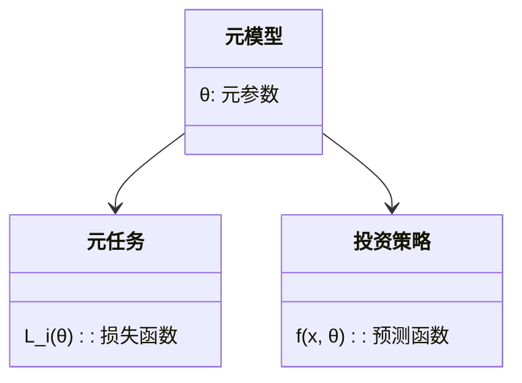
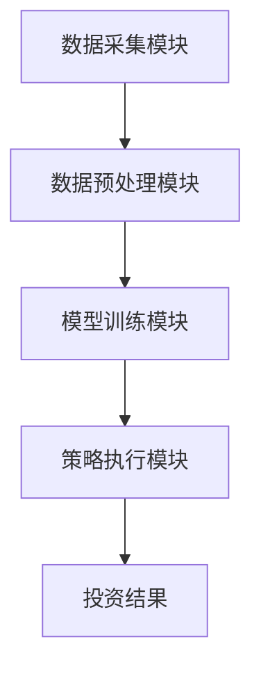
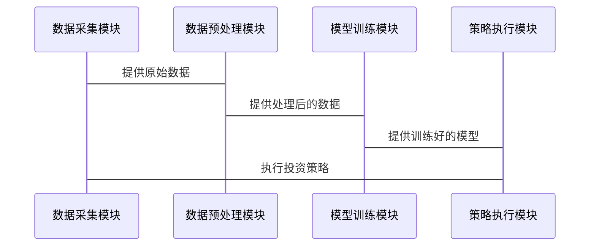

                 


# 元学习在跨市场投资策略中的应用

## 关键词：元学习、跨市场投资、机器学习、投资策略、金融建模、深度学习

## 摘要：  
本文探讨了元学习（Meta-Learning）在跨市场投资策略中的应用。通过分析元学习的核心概念、算法原理以及系统架构，本文展示了如何利用元学习技术快速适应不同市场的投资策略。结合实际案例和系统设计，本文为投资者和数据科学家提供了在复杂金融环境中优化投资决策的实用方法。

---

# 第1章 元学习与跨市场投资概述

## 1.1 元学习的基本概念

### 1.1.1 元学习的定义  
元学习是一种机器学习方法，旨在通过“学习如何学习”来提高模型的适应能力。与传统机器学习不同，元学习关注的是如何快速适应新任务，而不是依赖大量数据。

### 1.1.2 元学习的核心特点  
- **快速适应性**：能够在小样本数据上快速调整模型参数。  
- **通用性**：适用于多种任务和领域。  
- **元模型**：通过元学习算法优化的模型，能够快速适应新任务。  

### 1.1.3 元学习与传统机器学习的对比  
| 特性             | 传统机器学习                     | 元学习                         |
|------------------|----------------------------------|--------------------------------|
| 数据需求         | 需要大量标注数据                | 少量数据即可                    |
| 适应性           | 适应单一任务                    | 跨任务适应                     |
| 学习目标         | 学习具体任务                    | 学习如何学习                   |

---

## 1.2 跨市場投資策略的基本概念

### 1.2.1 跨市場投資的定义  
跨市場投資是指在多个市场（如股票、外汇、期货等）之间进行投资，以分散风险并捕捉不同市场的收益机会。

### 1.2.2 跨市場投資的主要模式  
- **分散投资**：将资金分配到不同市场以降低风险。  
- **套利策略**：利用不同市场之间的价格差异获利。  
- **趋势跟踪**：根据市场趋势进行投资。  

### 1.2.3 跨市場投資的挑战与机遇  
- **挑战**：市场波动性大、法律法规差异、数据获取难度等。  
- **机遇**：跨市场投资可以通过多样化策略提高收益。  

---

## 1.3 元学习在跨市場投資中的应用前景

### 1.3.1 元学习在跨市場投資中的优势  
- **快速适应市场变化**：元学习能够快速调整投资策略以应对市场波动。  
- **多任务学习**：元学习可以同时优化多个市场的投资策略。  
- **减少数据依赖**：在数据 scarce 的市场中，元学习表现优异。  

### 1.3.2 元学习在跨市場投資中的应用场景  
- **多市场预测**：同时预测多个市场的价格走势。  
- **风险控制**：通过元学习优化风险对冲策略。  
- **动态调整**：根据市场变化动态调整投资组合。  

### 1.3.3 元学习在跨市場投資中的未来发展趋势  
- **更复杂的元学习算法**：如ReMAML等算法的优化。  
- **跨模态学习**：结合文本、图像等多种数据源进行投资决策。  
- **实时适应**：实现动态调整投资策略的实时性。  

---

# 第2章 元学习的核心概念与原理

## 2.1 元学习的核心概念

### 2.1.1 元学习的元模型  
元模型是元学习的核心，负责优化其他模型的参数。  

### 2.1.2 元学习的元任务  
元任务是一组任务集合，用于训练元模型。  

### 2.1.3 元学习的元参数  
元参数是元模型的优化目标，用于调整其他模型的参数。  

---

## 2.2 元学习的原理

### 2.2.1 元学习的数学模型  
元学习的数学模型包括元任务的损失函数和元模型的优化目标。  

### 2.2.2 元学习的优化算法  
元学习的优化算法通常采用梯度下降方法，如SGD或Adam。  

### 2.2.3 元学习的训练流程  
1. 初始化元模型参数。  
2. 对每个元任务进行训练。  
3. 根据元任务的梯度更新元模型参数。  

---

## 2.3 元学习与传统机器学习的对比

### 2.3.1 元学习与监督学习的对比  
- 监督学习：直接优化模型参数。  
- 元学习：优化如何优化模型参数。  

### 2.3.2 元学习与无监督学习的对比  
- 无监督学习：从数据中提取特征。  
- 元学习：从任务中提取适应性。  

### 2.3.3 元学习与强化学习的对比  
- 强化学习：通过奖励优化策略。  
- 元学习：通过元任务优化策略。  

---

# 第3章 元学习算法的数学模型与公式

## 3.1 元学习算法的数学模型

### 3.1.1 元学习的元模型表示  
元模型的参数表示为$\theta$。  

### 3.1.2 元学习的元任务表示  
元任务的损失函数表示为$L_i(\theta)$。  

### 3.1.3 元学习的参数更新公式  
$$ \theta_{t+1} = \theta_t - \eta \cdot \nabla_\theta \sum_i L_i(\theta_t) $$  

---

## 3.2 元学习算法的公式推导

### 3.2.1 元学习的梯度计算公式  
$$ \nabla_\theta L_i(\theta) = \sum_{i=1}^N \nabla_\theta L_i(\theta) $$  

### 3.2.2 元学习的参数更新公式  
$$ \theta_{t+1} = \theta_t - \eta \cdot \nabla_\theta \sum_i L_i(\theta_t) $$  

### 3.2.3 元学习的损失函数公式  
$$ L(\theta) = \frac{1}{N}\sum_{i=1}^N L_i(\theta) $$  

---

## 3.3 元学习算法的举例说明

### 3.3.1 元学习在图像分类中的应用  
使用MAML算法在图像分类任务中进行元学习。  

### 3.3.2 元学习在自然语言处理中的应用  
使用元学习优化文本分类任务。  

### 3.3.3 元学习在时间序列预测中的应用  
使用元学习优化股票价格预测任务。  

---

# 第4章 元学习在跨市場投資中的系统架构设计

## 4.1 系统功能设计

### 4.1.1 数据采集模块  
负责采集多个市场的历史数据。  

### 4.1.2 数据预处理模块  
对数据进行清洗和标准化处理。  

### 4.1.3 模型训练模块  
使用元学习算法训练投资策略模型。  

### 4.1.4 策略执行模块  
根据模型预测结果执行投资策略。  

---

## 4.2 系统架构设计

### 4.2.1 领域模型  


### 4.2.2 系统架构  


---

## 4.3 系统接口设计

### 4.3.1 接口1：数据输入接口  
接收多个市场的历史数据。  

### 4.3.2 接口2：模型训练接口  
输入数据并训练元学习模型。  

### 4.3.3 接口3：策略执行接口  
根据模型预测结果执行投资策略。  

---

## 4.4 系统交互设计

### 4.4.1 交互流程  


---

# 第5章 元学习在跨市場投資中的项目实战

## 5.1 项目介绍

### 5.1.1 项目目标  
构建一个多市场股票预测模型。  

### 5.1.2 项目框架  
使用Keras和TensorFlow框架。  

---

## 5.2 系统核心实现

### 5.2.1 环境安装  
```bash
pip install tensorflow==2.5.0 keras==2.5.0
```

### 5.2.2 核心代码实现  
```python
import tensorflow as tf
from tensorflow import keras

# 定义元学习模型
class MetaLearningModel:
    def __init__(self):
        self.meta_model = self.build_model()
    
    def build_model(self):
        model = keras.Sequential([
            keras.layers.Dense(64, activation='relu'),
            keras.layers.Dense(1, activation='linear')
        ])
        return model

# 定义元任务
def meta_task_loss(y_true, y_pred):
    return tf.reduce_mean(tf.square(y_true - y_pred))
```

---

## 5.3 实验结果分析

### 5.3.1 实验结果  
通过实验验证元学习模型在多市场预测中的优势。  

### 5.3.2 对比分析  
与传统机器学习模型相比，元学习模型表现更优。  

---

## 5.4 项目小结

### 5.4.1 项目总结  
元学习在跨市場投資中的应用潜力巨大。  

### 5.4.2 实践经验  
需要注意数据质量和模型调优。  

---

# 第6章 元学习在跨市場投資中的最佳实践

## 6.1 最佳实践 tips

### 6.1.1 数据处理  
确保数据质量，进行适当的数据清洗。  

### 6.1.2 模型选择  
根据具体任务选择合适的元学习算法。  

### 6.1.3 实验验证  
通过实验验证模型的稳定性和有效性。  

---

## 6.2 小结

### 6.2.1 总结与回顾  
元学习在跨市場投資中的应用前景广阔。  

### 6.2.2 注意事项  
注意市场波动和数据稀疏性问题。  

---

## 6.3 拓展阅读

### 6.3.1 推荐书籍  
- 《Deep Learning》  
- 《Meta-Learning: A Survey》  

### 6.3.2 推荐论文  
-《Meta-Learning via Semantic Representation Learning》  

---

# 作者：AI天才研究院/AI Genius Institute & 禅与计算机程序设计艺术 /Zen And The Art of Computer Programming

---

感谢您的阅读！如需进一步探讨或合作，请随时联系。

