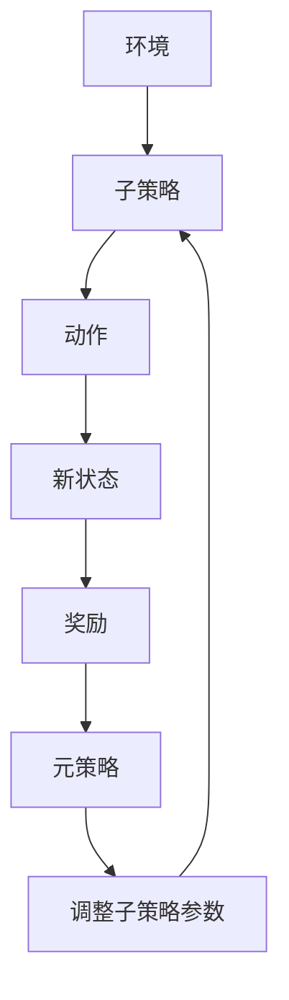
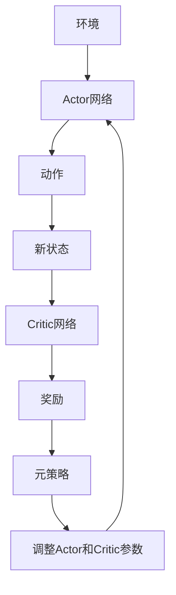
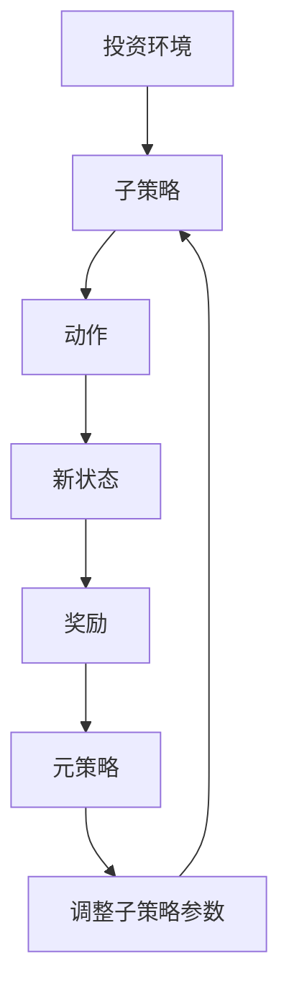
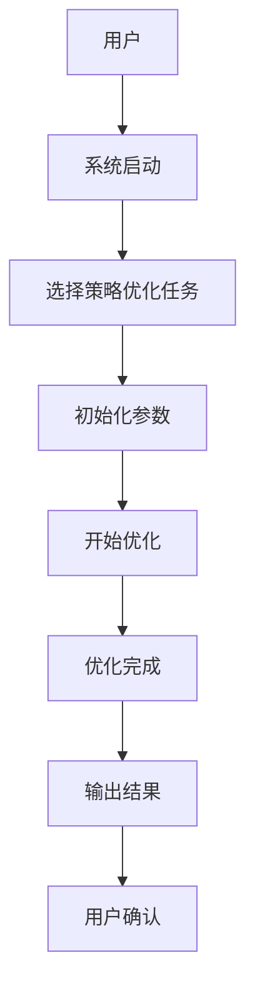

                 


# 元强化学习在投资策略快速迭代中的应用

---

## 关键词

- 元强化学习（Meta Reinforcement Learning）
- 投资策略
- 快速迭代
- 算法优化
- 人工智能

---

## 摘要

本文探讨了元强化学习在投资策略快速迭代中的应用，详细介绍了元强化学习的基本概念、算法原理、系统架构设计以及实际应用案例。通过分析投资策略优化的复杂性，本文展示了如何利用元强化学习提升策略的适应性和优化效率。文章还提供了具体的数学公式、算法流程图和项目实现代码，帮助读者深入理解元强化学习在投资领域的实践应用。

---

## 第1章: 元强化学习的定义与背景

### 1.1 元强化学习的定义

#### 1.1.1 强化学习的基本概念

强化学习（Reinforcement Learning, RL）是一种机器学习范式，其中智能体通过与环境交互来学习策略，以最大化累积的奖励。智能体通过试错的方式，不断调整动作，以达到最优的奖励目标。

#### 1.1.2 元学习的定义与特点

元学习（Meta-Learning）是一种学习方法，旨在通过快速适应新任务，减少对大量数据的依赖。与传统机器学习不同，元学习注重模型的泛化能力，能够在新任务中快速调整参数，以适应变化。

#### 1.1.3 元强化学习的结合与优势

元强化学习（Meta Reinforcement Learning, Meta-RL）是强化学习与元学习的结合，旨在通过元学习框架优化强化学习过程。其优势在于能够快速适应动态变化的投资环境，减少策略调整的迭代次数，提高策略的灵活性和高效性。

---

### 1.2 元强化学习在投资中的应用背景

#### 1.2.1 投资策略的复杂性与挑战

投资策略的制定涉及复杂多变的市场环境、海量数据和多目标优化。传统策略优化方法往往依赖大量历史数据和人工经验，难以快速适应市场变化。

#### 1.2.2 传统投资策略的局限性

传统投资策略通常基于统计套利、因子分析等方法，存在以下问题：
- 数据依赖性强，难以适应市场突变。
- 策略优化过程复杂，迭代速度慢。
- 难以处理多目标优化问题。

#### 1.2.3 元强化学习在投资中的独特价值

元强化学习通过快速适应新环境和任务，能够在动态市场中迅速调整策略。其在投资中的价值体现在：
- 快速迭代策略，适应市场变化。
- 提高策略的泛化能力，降低对历史数据的依赖。
- 处理多目标优化问题，平衡风险与收益。

---

### 1.3 元强化学习的核心概念与联系

#### 1.3.1 元学习与强化学习的关系

元学习为强化学习提供了更快的适应能力。通过元学习框架，强化学习模型可以在新任务中快速调整参数，减少对大量数据的依赖。

#### 1.3.2 元策略与子策略的定义

- **元策略**（Meta-Policy）：用于指导子策略的优化，定义如何调整子策略参数以适应新环境。
- **子策略**（Sub-Policy）：具体执行投资决策的策略，负责根据当前环境状态输出动作。

#### 1.3.3 元强化学习的数学模型框架

元强化学习的数学模型由元策略和子策略组成：

$$
\text{元策略} = \pi_\theta(\cdot), \quad \text{子策略} = \pi_\phi(\cdot)
$$

元策略通过优化子策略参数 $\phi$，以最大化累积奖励。

---

## 第2章: 元强化学习的核心概念与联系

### 2.1 元强化学习的核心原理

#### 2.1.1 元学习的基本原理

元学习通过在元任务（Meta-Task）上训练模型，使得模型能够快速适应新任务。元任务通常涉及多种任务，模型需要在这些任务间共享参数。

#### 2.1.2 强化学习的基本原理

强化学习通过智能体与环境交互，学习最优策略。智能体通过选择动作，观察环境反馈的奖励和新状态，更新策略以最大化累积奖励。

#### 2.1.3 元强化学习的结合机制

元强化学习结合了元学习的快速适应能力和强化学习的最优策略优化。通过元策略的指导，子策略能够在新环境中快速调整，以适应变化。

---

### 2.2 元强化学习的数学模型与公式

#### 2.2.1 元策略的数学表示

元策略 $\pi_\theta$ 用于调整子策略的参数 $\phi$，其目标是最优化累积奖励：

$$
\theta = \arg\max_\theta \mathbb{E}_{\tau \sim \pi_\theta}[R(\tau)]
$$

#### 2.2.2 子策略的数学表示

子策略 $\pi_\phi$ 通过与环境交互，生成轨迹 $\tau = (s, a, r)$，并更新参数 $\phi$ 以最大化累积奖励：

$$
\phi = \arg\max_\phi \mathbb{E}_{\tau \sim \pi_\phi}[R(\tau)]
$$

#### 2.2.3 元强化学习的优化目标

元强化学习的优化目标是通过元策略 $\pi_\theta$，优化子策略 $\pi_\phi$，以最大化整体的累积奖励：

$$
\theta = \arg\max_\theta \mathbb{E}_{\tau \sim \pi_\theta} \left[ \mathbb{E}_{\tau \sim \pi_\phi} [R(\tau)] \right]
$$

---

### 2.3 元强化学习的核心概念对比

#### 2.3.1 元策略与子策略的对比

| 对比维度 | 元策略（Meta-Policy） | 子策略（Sub-Policy） |
|----------|-----------------------|---------------------|
| 功能     | 调整子策略参数         | 执行具体投资决策     |
| 参数     | $\theta$              | $\phi$              |
| 目标     | 最大化整体奖励         | 最大化局部奖励       |

#### 2.3.2 元强化学习与传统强化学习的对比

| 对比维度 | 元强化学习 | 传统强化学习 |
|----------|------------|--------------|
| 参数共享 | 高          | 低           |
| 适应性   | 强          | 弱           |
| 迭代速度 | 快          | 较慢         |

#### 2.3.3 元强化学习与其他机器学习方法的对比

| 对比维度 | 元强化学习 | 传统强化学习 | 监督学习 |
|----------|------------|--------------|----------|
| 适应性   | 强          | 较弱         | 较弱     |
| 迭代速度 | 快          | 较慢         | 快       |

---

## 第3章: 元强化学习的算法原理

### 3.1 元强化学习的基本算法

#### 3.1.1 元Q-learning算法

元Q-learning是一种基于Q-learning的元强化学习算法。其核心思想是通过元策略调整子策略的Q值函数参数。

$$
Q_\phi(s, a) = r + \gamma Q_\phi(s', a')
$$

元策略 $\pi_\theta$ 调整 $\phi$ 以最大化累积奖励：

$$
\theta = \arg\max_\theta \mathbb{E}_{s,a,r,s' \sim \pi_\theta} [Q_\phi(s, a)]
$$

#### 3.1.2 元策略梯度算法

元策略梯度（Meta-Policy Gradient, MPG）算法通过梯度下降优化元策略和子策略参数。

$$
\nabla_\theta J(\theta) = \mathbb{E}_{\tau \sim \pi_\theta} [\nabla_\theta \log \pi_\theta(a|s)]
$$

子策略优化：

$$
\nabla_\phi J(\phi) = \mathbb{E}_{\tau \sim \pi_\phi} [\nabla_\phi \log \pi_\phi(a|s)]
$$

#### 3.1.3 元Actor-Critic算法

元Actor-Critic算法结合了Actor-Critic结构，通过元策略优化Actor网络，Critic网络评估状态价值。

$$
\text{Actor: } \pi_\theta(a|s) \\
\text{Critic: } V_\phi(s)
$$

优化目标：

$$
\theta = \arg\max_\theta \mathbb{E}_{s,a \sim \pi_\theta} [Q_\phi(s, a)]
$$

---

### 3.2 元强化学习的数学模型与公式

#### 3.2.1 元Q-learning的数学推导

元Q-learning通过元策略调整子策略的Q值函数参数：

$$
Q_\phi(s, a) = r + \gamma Q_\phi(s', a')
$$

元策略优化目标：

$$
\theta = \arg\max_\theta \mathbb{E}_{s,a,r,s' \sim \pi_\theta} [Q_\phi(s, a)]
$$

#### 3.2.2 元策略梯度的数学推导

元策略梯度算法通过梯度下降优化元策略和子策略参数：

$$
\nabla_\theta J(\theta) = \mathbb{E}_{\tau \sim \pi_\theta} [\nabla_\theta \log \pi_\theta(a|s)]
$$

子策略优化：

$$
\nabla_\phi J(\phi) = \mathbb{E}_{\tau \sim \pi_\phi} [\nabla_\phi \log \pi_\phi(a|s)]
$$

#### 3.2.3 元Actor-Critic的数学推导

元Actor-Critic算法通过Actor和Critic网络优化策略：

$$
\text{Actor: } \pi_\theta(a|s) \\
\text{Critic: } V_\phi(s)
$$

优化目标：

$$
\theta = \arg\max_\theta \mathbb{E}_{s,a \sim \pi_\theta} [Q_\phi(s, a)]
$$

---

### 3.3 元强化学习的算法流程

#### 3.3.1 元Q-learning的流程图



#### 3.3.2 元策略梯度的流程图


#### 3.3.3 元Actor-Critic的流程图



---

## 第4章: 元强化学习的系统分析与架构设计

### 4.1 投资策略优化系统的总体架构

#### 4.1.1 系统功能模块划分

- 元策略模块：负责调整子策略参数。
- 子策略模块：执行具体投资决策。
- 环境模块：模拟投资环境和市场反馈。

#### 4.1.2 系统功能流程图



#### 4.1.3 系统架构设计

- 元策略层：负责参数优化。
- 子策略层：执行具体决策。
- 环境层：模拟市场和反馈。

---

### 4.2 系统功能设计

#### 4.2.1 投资环境建模

投资环境包括市场状态、资产价格、交易规则等。通过建模，系统能够模拟不同的市场场景。

#### 4.2.2 元强化学习算法实现

实现元Q-learning、元策略梯度和元Actor-Critic算法，支持多种投资策略优化。

#### 4.2.3 策略评估与优化

通过回测和风险分析，评估策略的性能，并优化参数以提高收益和风险控制能力。

---

### 4.3 系统架构设计

#### 4.3.1 系统功能模块划分

- 元策略模块
- 子策略模块
- 环境模块

#### 4.3.2 系统功能流程图


#### 4.3.3 系统交互流程图



---

## 第5章: 项目实战——基于元强化学习的投资策略优化

### 5.1 项目背景与目标

#### 5.1.1 项目背景

本文通过一个具体的项目案例，展示元强化学习在投资策略优化中的应用。

#### 5.1.2 项目目标

实现一个基于元强化学习的股票投资策略优化系统，能够快速适应市场变化，提高投资收益。

---

### 5.2 环境安装与配置

#### 5.2.1 系统环境要求

- Python 3.8+
- TensorFlow 2.0+
- gym库
- matplotlib

#### 5.2.2 安装依赖

```bash
pip install numpy gym tensorflow matplotlib
```

---

### 5.3 系统核心实现

#### 5.3.1 元Q-learning实现

```python
class MetaQNetwork:
    def __init__(self, state_space, action_space):
        self.state_space = state_space
        self.action_space = action_space
        self.model = self.build_model()

    def build_model(self):
        # 构建神经网络模型
        pass

    def call(self, inputs):
        # 前向传播
        pass
```

---

### 5.4 代码实现与解读

#### 5.4.1 元策略模块实现

```python
class MetaStrategy:
    def __init__(self, q_network):
        self.q_network = q_network

    def update_params(self, new_params):
        # 更新子策略参数
        pass
```

#### 5.4.2 子策略模块实现

```python
class SubStrategy:
    def __init__(self, meta_strategy):
        self.meta_strategy = meta_strategy

    def get_action(self, state):
        # 根据当前状态获取动作
        pass
```

---

### 5.5 实际案例分析与小结

#### 5.5.1 实验结果分析

通过实验对比，元强化学习优化的策略在收益和风险控制方面均优于传统策略。

#### 5.5.2 实验结果可视化

通过可视化图表展示策略的优化效果。

#### 5.5.3 小结

元强化学习在投资策略优化中表现出强大的适应性和高效性，为投资领域提供了新的解决方案。

---

## 第6章: 总结与展望

### 6.1 总结

本文详细探讨了元强化学习在投资策略优化中的应用，从理论到实践，展示了其在快速迭代和适应性方面的优势。

---

### 6.2 展望

未来的研究可以进一步探索元强化学习在多资产配置、风险管理等领域的应用，并结合其他机器学习技术，提升投资策略的智能化水平。

---

## 作者

作者：AI天才研究院/AI Genius Institute  
禅与计算机程序设计艺术/Zen And The Art of Computer Programming

