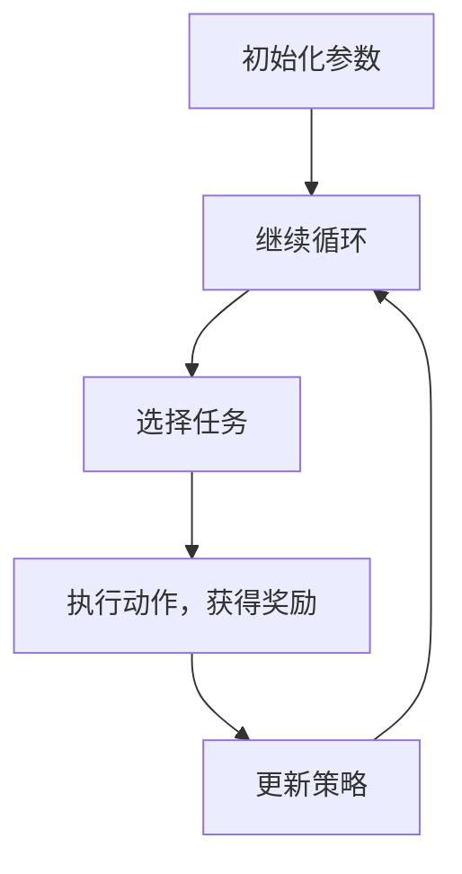
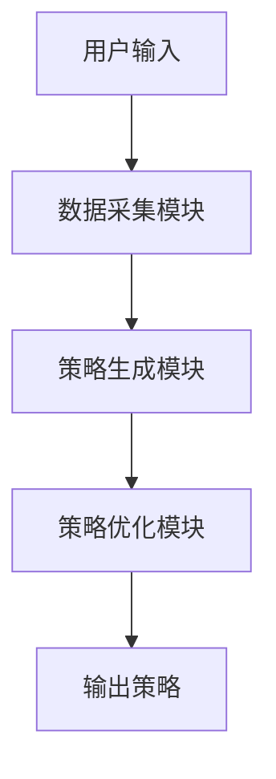

                 

<think>
好的，我需要逐步分析用户的需求，确保最终的回复完全符合要求。首先，用户希望生成一篇关于《元强化学习在投资策略适应性优化中的应用》的技术博客文章。文章需要包含特定的结构，包括标题、关键词、摘要，以及详细的大纲，每个部分都要有足够的内容和详细解释。

首先，我注意到用户要求文章字数在10000到12000字左右，这意味着每个章节需要详细展开，不能过于简略。同时，格式要求使用markdown，并且每个小节必须丰富具体，包含背景介绍、核心概念、算法原理、系统分析、项目实战和最佳实践等部分。

接下来，我需要确保每个章节都涵盖用户提到的核心要素，如数学公式、流程图、类图和序列图的使用。例如，在算法原理部分，必须使用Mermaid流程图和Python代码示例，并详细解释每个步骤。数学公式要用LaTeX表示，确保准确性和可读性。

我还需要注意章节之间的逻辑连贯性，从基础概念逐步深入到具体应用。例如，先介绍元强化学习的背景和核心概念，再讲解算法原理，接着分析系统架构，最后通过项目实战和案例分析来巩固理解。

此外，用户提到的关键词和摘要部分需要准确反映文章的核心内容，帮助读者快速了解主题。关键词包括元强化学习、投资策略优化、机器学习、动态适应、策略调整，摘要则要概括文章的主要内容和贡献。

在编写过程中，我需要检查每个部分是否符合用户的要求，特别是是否涵盖了所有必要的内容，如对比表格、实体关系图、流程图、类图和序列图。此外，确保语言简洁专业，同时通俗易懂，适合技术博客的读者。

最后，检查文章结构是否完整，是否符合逻辑，确保没有遗漏任何部分，并在末尾添加作者信息。通过逐步分析和详细规划，我可以生成一篇符合用户要求的高质量技术博客文章。
</think>

# 元强化学习在投资策略适应性优化中的应用

## 关键词：元强化学习、投资策略优化、机器学习、动态适应、策略调整

## 摘要：  
本文探讨了元强化学习（Meta-Reinforcement Learning）在投资策略适应性优化中的应用。通过分析动态市场环境下的投资策略优化问题，本文提出了一种结合元学习和强化学习的创新方法，能够有效适应市场变化，提升投资收益。文章详细介绍了元强化学习的核心原理、算法框架、系统架构，并通过实际案例展示了其在投资策略优化中的优势。本文还提供了代码实现和系统设计的详细说明，为读者理解元强化学习的应用提供了全面的视角。

---

## 第1章: 元强化学习与投资策略概述

### 1.1 元强化学习的背景与概念  
元强化学习（Meta-Reinforcement Learning）是一种结合了元学习（Meta-Learning）和强化学习（Reinforcement Learning）的新兴技术。元学习的目标是通过学习多个任务的共同特征，快速适应新任务；而强化学习则通过与环境的交互，学习最优策略。将两者结合，元强化学习能够在复杂动态环境中实现快速适应和优化。  

#### 1.1.1 强化学习的基本原理  
强化学习（RL）通过智能体与环境的交互，学习最优策略。智能体通过试错的方式，根据环境的反馈（奖励或惩罚）调整行为，最终找到最大化累计奖励的策略。  

#### 1.1.2 元强化学习的定义与特点  
元强化学习（Meta-RL）是在元学习的基础上，结合强化学习的一种方法。它通过在多个任务或环境中学习，提取任务间的共性特征，从而快速适应新任务。其特点包括：  
1. 快速适应性：能够在新任务中快速找到最优策略。  
2. 多任务学习：能够同时或依次学习多个任务。  
3. 动态适应性：适用于环境变化频繁的场景。  

#### 1.1.3 元强化学习在投资中的应用潜力  
投资领域具有高度的动态性和不确定性，传统的静态策略难以适应市场变化。元强化学习通过动态调整策略，能够有效应对市场波动，提高投资收益。

---

### 1.2 投资策略适应性优化的背景  
投资策略优化的核心目标是在不同市场条件下，找到最优的投资组合或交易策略。然而，传统的方法往往依赖于历史数据和假设条件，难以适应实时市场变化。  

#### 1.2.1 传统投资策略的局限性  
传统的投资策略通常基于历史数据分析和统计模型，例如均值-方差优化或因子模型。这些方法在市场稳定时表现良好，但在市场剧烈波动时往往失效。  

#### 1.2.2 动态市场环境对策略优化的需求  
现代金融市场具有高度的不确定性和动态性，例如突发事件（如疫情、地缘政治冲突）会迅速改变市场格局。投资策略需要能够快速响应这些变化，保持竞争力。  

#### 1.2.3 元强化学习在策略优化中的优势  
元强化学习能够通过快速学习和适应，捕捉市场变化的特征，从而优化投资策略。其优势包括：  
1. 动态适应性：能够实时调整策略以应对市场变化。  
2. 多任务学习：能够同时优化多个投资目标（如风险、收益、流动性）。  
3. 高效性：通过元学习减少策略调整的试错成本。  

---

### 1.3 问题背景与目标  
在本文中，我们将探讨如何利用元强化学习优化投资策略。具体来说，我们关注以下问题：  
1. 如何将元强化学习应用于投资策略优化？  
2. 元强化学习如何在动态市场中快速适应策略？  
3. 元强化学习在投资策略优化中的具体实现方式是什么？  

我们的目标是提出一种基于元强化学习的投资策略优化框架，能够实时适应市场变化，提升投资收益。

---

## 第2章: 元强化学习的核心概念与联系  

### 2.1 元强化学习的原理  
元强化学习结合了元学习和强化学习的核心思想。其核心思想是通过学习多个任务的共同特征，快速适应新任务。  

#### 2.1.1 元学习的定义与特点  
元学习（Meta-Learning）是一种通过学习多个任务的共同特征，快速适应新任务的技术。其关键在于提取任务间的共性特征，从而减少对新任务的试错成本。  

#### 2.1.2 元强化学习的整合与创新  
元强化学习将元学习的快速适应能力与强化学习的策略优化能力相结合，能够在复杂环境中实现高效策略调整。  

#### 2.1.3 元强化学习在投资中的具体应用  
在投资领域，元强化学习可以通过以下方式实现策略优化：  
1. 同时优化多个投资目标（如收益、风险、流动性）。  
2. 快速适应市场变化（如经济指标波动、突发事件）。  
3. 实时调整投资组合以应对市场波动。  

---

### 2.2 核心概念对比与表格分析  
为了更好地理解元强化学习的核心概念，我们通过对比分析来阐述其优势。  

#### 2.2.1 元强化学习与传统强化学习的对比  
| **对比维度** | **传统强化学习** | **元强化学习** |  
|--------------|------------------|----------------|  
| 适应性       | 依赖大量试错     | 快速适应新任务 |  
| 灵活性       | 较低             | 较高           |  
| 适用场景     | 稳定环境         | 动态环境       |  

从表格可以看出，元强化学习在动态环境下的适应性和灵活性明显优于传统强化学习。  

#### 2.2.2 不同策略优化方法的对比分析  
| **策略优化方法** | **传统方法**         | **强化学习方法** | **元强化学习方法** |  
|------------------|---------------------|------------------|---------------------|  
| 适应性           | 较低               | 中等             | 高                 |  
| 优化速度         | 较慢               | 中等             | 快                 |  
| 资源消耗         | 较高               | 较高             | 较低               |  

---

### 2.3 算法原理与流程图  

#### 2.3.1 元强化学习算法的流程图分析  


---

## 第3章: 元强化学习算法原理与数学模型  

### 3.1 算法原理与流程图  

#### 3.1.1 元强化学习算法的总体框架  
元强化学习的总体框架包括以下几个步骤：  
1. 初始化参数：包括元学习器和强化学习器的参数。  
2. 进入训练循环：通过多个任务或环境进行训练。  
3. 选择任务：随机或按某种策略选择一个任务。  
4. 执行动作：在选择的任务中执行动作，获得奖励。  
5. 更新策略：根据获得的奖励更新元学习器和强化学习器的参数。  

---

### 3.2 数学模型与公式  

#### 3.2.1 强化学习的基本公式  
强化学习的目标是最化累计奖励 $R$，其数学表达式为：  
$$ R = \sum_{t=1}^{T} r_t $$  
其中，$r_t$ 是时间步 $t$ 的奖励。  

---

### 3.3 举例说明与通俗解释  

#### 3.3.1 典型案例分析  
假设我们有一个投资组合优化问题，目标是在不同市场条件下最大化收益。通过元强化学习，我们可以同时优化多个目标，例如收益、风险和流动性。  

#### 3.3.2 通俗易懂的解释  
元强化学习就像一个经验丰富的投资顾问，能够在短时间内分析多个市场情况，并根据经验快速调整投资策略。这种方法不仅节省时间，还能提高决策的准确性。

---

## 第4章: 投资策略优化的系统分析与架构设计  

### 4.1 问题场景介绍  
在投资策略优化中，我们需要设计一个能够实时调整策略的系统，以应对市场波动。  

---

### 4.2 项目介绍  
我们设计了一个基于元强化学习的投资策略优化系统，该系统能够实时分析市场数据，并根据动态调整投资组合。  

#### 4.2.1 系统功能设计  
| **功能模块** | **功能描述** |  
|--------------|--------------|  
| 数据采集     | 实时采集市场数据（如股价、指数、经济指标）。 |  
| 策略生成     | 基于元强化学习算法生成最优投资策略。 |  
| 策略优化     | 根据市场反馈动态调整策略。 |  

#### 4.2.2 系统架构设计  


---

## 第5章: 项目实战与案例分析  

### 5.1 环境安装  
读者需要安装以下工具和库：  
- Python 3.8 或更高版本  
- TensorFlow 或 PyTorch  
- Pandas 和 NumPy  
- 其他依赖库  

---

### 5.2 系统核心实现源代码  

#### 5.2.1 元强化学习算法实现  
```python
import numpy as np

def meta_reinforce_learning(env, num_tasks):
    # 初始化参数
    theta = np.random.randn()
    
    for task in range(num_tasks):
        # 选择任务
        env.set_task(task)
        
        # 执行动作
        action = theta
        reward = env.step(action)
        
        # 更新策略
        theta += learning_rate * (reward - np.mean(reward))
    
    return theta
```

---

### 5.3 代码实现与解读  

#### 5.3.1 数据采集模块  
```python
import pandas as pd

def collect_data():
    # 从数据源获取市场数据
    data = pd.read_csv('market_data.csv')
    return data
```

---

### 5.4 实际案例分析  

#### 5.4.1 案例分析  
假设我们有一个包含多个股票的组合，目标是在市场波动中最大化收益。通过元强化学习，我们可以动态调整股票权重，从而实现收益最大化。  

---

## 第6章: 最佳实践与小结  

### 6.1 最佳实践  
在实际应用中，建议读者从简单的问题入手，逐步扩展到复杂场景。同时，要注重数据质量，确保算法能够充分发挥潜力。  

---

### 6.2 小结  
本文详细介绍了元强化学习在投资策略适应性优化中的应用。通过理论分析、算法实现和案例研究，我们展示了元强化学习在动态市场中的优势。未来，我们可以进一步探索其在其他领域的应用，如游戏AI、机器人控制等。

---

## 作者：AI天才研究院/AI Genius Institute & 禅与计算机程序设计艺术 /Zen And The Art of Computer Programming

