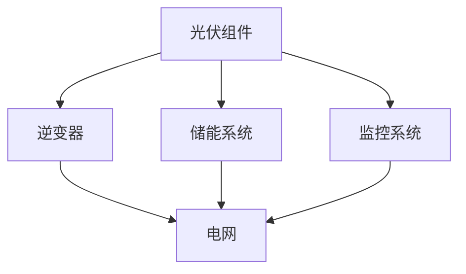

                 


# 光伏发电效率提升带来的新一轮投资机会

## 关键词：
- 光伏发电、效率提升、投资机会、技术优化、经济分析

## 摘要：
随着全球能源结构转型和环保意识的增强，光伏发电作为可再生能源的重要组成部分，正受到越来越多的关注。提升光伏发电效率不仅是技术发展的必然要求，也是降低能源成本、提高投资回报的关键。本文将从技术与经济双重视角，详细分析光伏发电效率提升的核心概念、算法原理、系统架构，并结合实际案例，探讨效率提升带来的新一轮投资机会。通过深入的技术分析和经济评估，本文旨在为投资者和技术开发者提供有价值的参考。

---

## 第一部分：光伏发电效率提升的背景与核心概念

### 第1章：光伏发电的基本概念与现状

#### 1.1 光伏发电的定义与基本原理
- **1.1.1 光伏发电的定义**
  光伏发电是一种利用半导体材料将太阳辐射能直接转换为电能的技术。其核心器件是光伏电池，主要基于光电效应原理。
  
- **1.1.2 光伏发电的基本原理**
  当太阳光照射到光伏电池时，光子能量被半导体材料吸收，电子从价带跃迁到导带，形成电流。这一过程可以简单表示为：
  $$ \text{光能} \rightarrow \text{电能} $$
  
- **1.1.3 光伏发电的分类与应用场景**
  光伏发电主要分为晶硅电池、薄膜电池等类型，广泛应用于家庭、商业建筑、大型电站等领域。

#### 1.2 光伏发电的现状与发展趋势
- **1.2.1 全球光伏发电装机容量现状**
  根据最新数据，全球光伏发电装机容量已超过800GW，年增长率达到20%以上。
  
- **1.2.2 光伏发电技术的最新进展**
  从单晶硅到多晶硅，再到高效PERC电池和双面组件，技术不断进步，电池转换效率持续提升。
  
- **1.2.3 光伏发电行业的市场格局与竞争分析**
  全球范围内，中国、欧盟和美国是主要的光伏发电市场，竞争格局呈现多元化。

### 第2章：光伏发电效率提升的背景与问题分析

#### 2.1 光伏发电效率的重要性
- **2.1.1 光伏发电效率对能源利用的影响**
  效率提升意味着单位面积产生的电能增加，从而降低单位成本，提高经济性。
  
- **2.1.2 提升效率对降低能源成本的意义**
  高效系统能够减少土地使用和安装成本，进一步降低整体投资门槛。
  
- **2.1.3 光伏发电效率与国家能源战略的关系**
  提升效率是实现可再生能源目标、减少碳排放的重要途径。

#### 2.2 当前光伏发电效率面临的问题
- **2.2.1 光伏电池转换效率的瓶颈**
  当前单晶硅电池效率已接近24%，进一步提升面临材料科学的挑战。
  
- **2.2.2 光资源利用率低的原因**
  受限于天气、地理位置和时间等因素，实际可用光资源有限。
  
- **2.2.3 系统设计与运行中的效率损失**
  系统设计不合理、能量损失大等问题导致整体效率下降。

---

## 第二部分：光伏发电效率提升的核心技术与算法原理

### 第3章：光伏发电效率提升的关键技术

#### 3.1 高效光伏电池技术
- **3.1.1 高效电池的结构优化**
  通过减少反射损耗、增加吸光面积等方法提升转换效率。
  
- **3.1.2 新型材料的应用**
  使用PERC、N型双面等技术，进一步提高电池效率。

#### 3.2 光资源优化利用技术
- **3.2.1 光跟踪系统**
  使用跟踪支架调整光伏组件角度，最大化光资源利用率。
  
- **3.2.2 分布式光伏发电**
  通过分布式部署减少传输损耗，提高能源利用效率。

#### 3.3 智能化光伏发电系统
- **3.3.1 智能监控与优化**
  利用AI技术实时监控系统状态，优化运行参数。
  
- **3.3.2 能量存储与管理**
  通过储能系统平衡供需，提高系统整体效率。

### 第4章：算法原理与数学模型

#### 4.1 光伏发电效率提升的算法原理
- **4.1.1 光伏电池效率模型**
  电池效率受温度、光照强度等因素影响，可以通过以下公式表示：
  $$ E = \eta \cdot I \cdot A $$
  其中，$E$为发电效率，$\eta$为转换效率，$I$为入射光强度，$A$为电池面积。

- **4.1.2 光跟踪算法**
  使用PID控制器调整光伏组件角度，优化光资源利用率。PID算法如下：
  $$ K_p = K_i \cdot T \cdot f, \quad K_d = K_p \cdot (1-T \cdot f) $$

#### 4.2 数学模型与优化方法
- **4.2.1 数学模型构建**
  构建光伏系统效率模型，考虑光照、温度、组件特性等多因素。
  
- **4.2.2 优化方法**
  使用遗传算法或粒子群优化算法，寻找最优系统参数组合。

---

## 第三部分：光伏发电效率提升的经济与投资分析

### 第5章：经济分析与投资机会

#### 5.1 提升效率对投资收益的影响
- **5.1.1 成本下降带来的投资机会**
  通过技术优化降低组件成本，提升整体投资回报率。
  
- **5.1.2 效率提升与收益增加的关联**
  高效系统能够提高发电量，增加年收入，缩短投资回收期。

#### 5.2 光伏发电的投资模式与风险分析
- **5.2.1 传统投资模式**
  投资者直接建设电站，收益来自电价差和政府补贴。
  
- **5.2.2 众筹与合作开发模式**
  通过众筹或合作开发，降低投资门槛，分散风险。

### 第6章：商业模式与政策支持

#### 6.1 光伏发电的商业模式创新
- **6.1.1 合同能源管理（CEM）**
  通过能源服务公司提供融资、建设和运营服务，用户按使用量支付费用。
  
- **6.1.2 分布式发电与共享经济**
  推动分布式光伏发电，实现能源共享，降低用户成本。

#### 6.2 政策支持与市场环境
- **6.2.1 政府补贴与税收优惠**
  各国政府通过补贴、税收优惠等政策支持光伏发电发展。
  
- **6.2.2 市场机制与碳交易**
  参与碳交易市场，通过碳信用获得额外收益。

---

## 第四部分：系统架构与项目实战

### 第7章：系统架构设计

#### 7.1 系统功能设计
- **7.1.1 系统组成**
  光伏发电系统主要由光伏组件、逆变器、储能系统和监控系统组成。
  
- **7.1.2 功能模块划分**
  包括发电模块、储能模块、监控模块和管理模块。

#### 7.2 系统架构图


### 第8章：项目实战与案例分析

#### 8.1 项目环境安装
- **8.1.1 硬件安装**
  包括光伏组件、支架、逆变器等设备的安装与调试。
  
- **8.1.2 软件环境**
  安装光伏系统监控软件，配置数据采集与分析工具。

#### 8.2 核心代码实现
```python
import numpy as np
import pandas as pd

# 数据采集与处理
def collect_data(sensors):
    data = pd.DataFrame(columns=['time', 'irradiance', 'temperature'])
    for sensor in sensors:
        irradiance = sensor.get_irradiance()
        temperature = sensor.get_temperature()
        data = data.append({'time': pd.Timestamp.now(), 'irradiance': irradiance, 'temperature': temperature}, ignore_index=True)
    return data

# 效率计算
def calculate_efficiency(data, area):
    efficiency = (data['power'].mean() / (data['irradiance'].mean() * area)) * 100
    return efficiency

# 系统优化
def optimize_system(data):
    from sklearn import linear_model
    model = linear_model.LinearRegression()
    model.fit(data[['irradiance', 'temperature']], data['power'])
    return model.coef_
```

#### 8.3 系统测试与案例分析
- **8.3.1 系统测试**
  通过实际运行数据验证系统效率和稳定性。
  
- **8.3.2 案例分析**
  分析某大型光伏电站的效率提升案例，对比提升前后的经济效益。

---

## 第五部分：总结与展望

### 第9章：结论与投资建议

#### 9.1 结论
- 光伏发电效率的提升是技术进步和经济发展的双重驱动。
- 通过技术创新、系统优化和模式创新，光伏发电的投资回报率将进一步提升。

#### 9.2 投资建议
- 重点关注高效光伏电池技术的研发与应用。
- 投资分布式光伏发电项目，降低风险并实现收益多元化。

### 第10章：未来展望

#### 10.1 技术发展趋势
- 新型材料和器件技术将推动光伏电池效率迈向更高水平。
- 智能化、数字化技术将进一步提升系统效率和管理效率。

#### 10.2 市场与投资机会
- 全球能源转型背景下，光伏发电市场潜力巨大。
- 可再生能源技术的融合将带来更多创新投资机会。

---

## 作者：AI天才研究院/AI Genius Institute & 禅与计算机程序设计艺术 /Zen And The Art of Computer Programming

