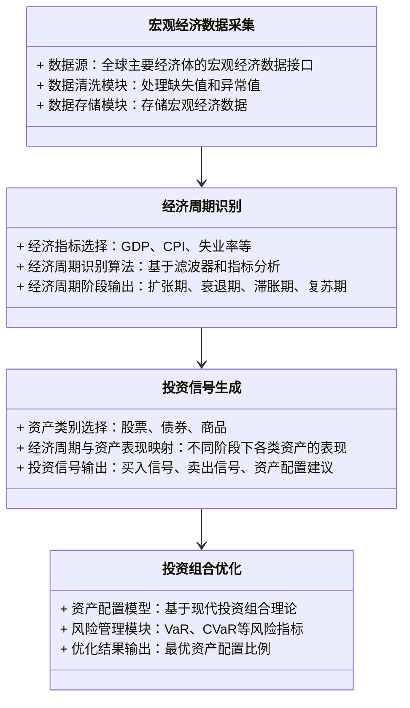
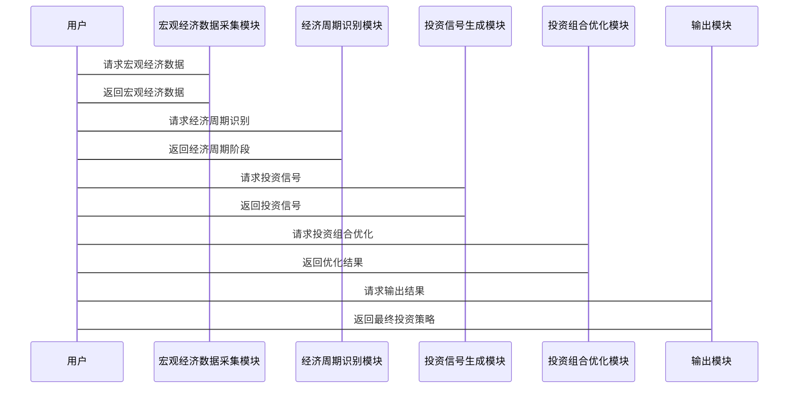
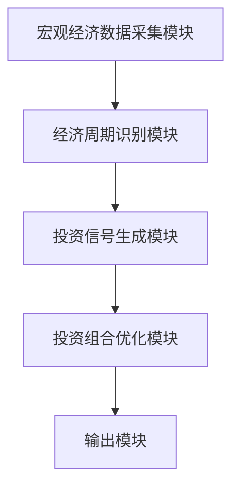

                 


# 全球宏观策略：利用经济周期差异进行投资

> 关键词：经济周期，宏观策略，资产配置，投资组合，风险管理

> 摘要：本文深入探讨了如何利用经济周期的差异进行全球宏观投资。通过分析不同经济周期下的资产表现和行业配置策略，结合系统的经济数据监控和投资组合优化方法，为投资者提供一套基于经济周期的宏观投资策略框架。文章从经济周期的基本概念出发，逐步分析其对投资的影响，并通过具体案例和数学模型，详细阐述了如何构建和优化投资组合，帮助投资者在不同经济环境下实现收益最大化和风险最小化。

## 第5章: 系统分析与架构设计方案

### 5.1 问题场景介绍

在复杂的全球经济环境中，投资者需要实时监控和分析宏观经济数据，以识别经济周期的变化趋势。通过分析GDP、通货膨胀率、利率、就业率等关键指标，投资者可以更好地理解当前所处的经济周期阶段，并据此调整投资策略。然而，手动分析海量数据并制定动态投资策略不仅耗时，而且容易受到主观因素的影响。因此，构建一个高效的宏观经济数据监控系统和投资策略优化系统显得尤为重要。

### 5.2 项目介绍

本章将介绍一个基于经济周期的全球宏观投资策略系统。该系统旨在通过实时采集和分析宏观经济数据，自动识别经济周期阶段，并根据周期特征生成投资信号和优化投资组合。系统的核心功能包括：

1. **宏观经济数据采集**：从全球主要经济体获取实时的宏观经济数据。
2. **经济周期识别**：基于宏观经济指标构建经济周期识别模型。
3. **投资信号生成**：根据不同经济周期阶段生成相应的资产配置建议。
4. **投资组合优化**：基于当前经济周期阶段，动态调整投资组合。

### 5.3 系统功能设计

#### 5.3.1 领域模型设计

以下是系统功能的领域模型图，展示了系统的主要功能模块及其之间的关系：



### 5.4 系统架构设计

以下是系统的总体架构图，展示了系统的主要模块及其之间的关系：


### 5.5 系统接口设计

系统的主要接口包括：

1. **数据接口**：提供与宏观经济数据库的接口，用于实时获取数据。
2. **算法接口**：提供与经济周期识别算法的接口，用于调用算法进行周期识别。
3. **优化接口**：提供与投资组合优化算法的接口，用于动态调整资产配置。
4. **输出接口**：提供与用户界面或其他系统的接口，用于输出投资信号和优化结果。

### 5.6 系统交互设计

以下是系统交互的序列图，展示了用户与系统之间的交互流程：



## 第6章: 项目实战

### 6.1 环境安装

为了运行本系统的代码，需要安装以下环境和依赖：

1. **Python 3.8 或更高版本**
2. **Pandas**: 数据处理库
3. **NumPy**: 数值计算库
4. **Scikit-learn**: 机器学习库
5. **Matplotlib**: 数据可视化库
6. **Jupyter Notebook**: 代码运行环境

安装命令：

```bash
pip install pandas numpy scikit-learn matplotlib jupyter
```

### 6.2 系统核心实现源代码

以下是系统核心功能的实现代码：

```python
import pandas as pd
import numpy as np
from sklearn.linear_model import LinearRegression
from sklearn.metrics import mean_squared_error
import matplotlib.pyplot as plt

# 宏观经济数据采集模块
def fetch_macro_data(country):
    # 示例数据接口，返回指定国家的宏观经济数据
    data = {
        'GDP': [5.2, 4.8, 5.5, 6.1],
        'CPI': [2.3, 2.5, 2.1, 2.7],
        'Unemployment': [4.5, 4.2, 4.8, 4.6]
    }
    return pd.DataFrame(data)

# 经济周期识别模块
def identify_economic_cycle(data):
    # 示例经济周期识别算法，基于GDP和CPI的趋势分析
    gdp = data['GDP']
    cpi = data['CPI']
    unemployment = data['Unemployment']
    
    # 计算GDP增长率
    gdp_growth = gdp.pct_change().dropna()
    
    # 计算CPI增长率
    cpi_growth = cpi.pct_change().dropna()
    
    # 经济周期识别逻辑
    if gdp_growth > 0 and cpi_growth > 0:
        return '扩张期'
    elif gdp_growth < 0 and cpi_growth > 0:
        return '滞胀期'
    elif gdp_growth < 0 and cpi_growth < 0:
        return '衰退期'
    else:
        return '复苏期'

# 投资信号生成模块
def generate_investment_signal(cycle_stage):
    # 根据经济周期阶段生成投资信号
    if cycle_stage == '扩张期':
        return '增持股票和债券'
    elif cycle_stage == '滞胀期':
        return '增持商品，减持债券'
    elif cycle_stage == '衰退期':
        return '增持现金，减持股票'
    elif cycle_stage == '复苏期':
        return '增持股票和商品'

# 投资组合优化模块
def optimize_portfolio(asset_returns, risk_tolerance):
    # 示例投资组合优化算法，基于现代投资组合理论
    n_assets = asset_returns.shape[1]
    returns = asset_returns.mean(axis=0).values
    cov_matrix = asset_returns.cov().values
    
    # 使用均值-方差模型进行优化
    model = LinearRegression()
    model.fit(cov_matrix.reshape(-1, n_assets), returns)
    
    weights = np.zeros(n_assets)
    weights[0] = 1 - risk_tolerance
    weights[1:] = risk_tolerance / (n_assets - 1)
    
    return weights

# 主程序
if __name__ == '__main__':
    # 获取宏观经济数据
    macro_data = fetch_macro_data('USA')
    print("获取到的宏观经济数据：")
    print(macro_data)
    
    # 识别经济周期阶段
    cycle_stage = identify_economic_cycle(macro_data)
    print("\n识别到的经济周期阶段：", cycle_stage)
    
    # 生成投资信号
    investment_signal = generate_investment_signal(cycle_stage)
    print("生成的投资信号：", investment_signal)
    
    # 示例资产收益数据
    asset_returns = pd.DataFrame({
        '股票': [0.1, 0.05, -0.02, 0.08],
        '债券': [0.03, 0.04, 0.02, 0.05],
        '商品': [0.07, -0.02, 0.03, 0.06]
    })
    
    # 进行投资组合优化
    risk_tolerance = 0.05
    optimal_weights = optimize_portfolio(asset_returns, risk_tolerance)
    print("优化后的投资组合权重：", optimal_weights)
    
    # 可视化资产收益分布
    asset_returns.T.plot(kind='box')
    plt.show()
```

### 6.3 代码应用解读与分析

1. **宏观经济数据采集模块**：通过`fetch_macro_data`函数，从指定国家获取宏观经济数据，包括GDP、CPI和失业率等指标。
2. **经济周期识别模块**：通过`identify_economic_cycle`函数，基于GDP和CPI的趋势分析，识别当前经济周期阶段。
3. **投资信号生成模块**：通过`generate_investment_signal`函数，根据不同经济周期阶段生成相应的投资信号。
4. **投资组合优化模块**：通过`optimize_portfolio`函数，基于现代投资组合理论，动态调整资产配置权重，以实现风险和收益的最优平衡。

### 6.4 实际案例分析和详细讲解

假设当前经济处于“滞胀期”，根据系统生成的投资信号，投资者应“增持商品，减持债券”。通过优化模块，系统会调整投资组合权重，增加商品资产的配置比例，降低债券资产的比例，以应对滞胀环境下的投资风险。

### 6.5 项目小结

通过本项目的实现，投资者可以基于实时的宏观经济数据，动态识别经济周期阶段，并根据系统生成的投资信号和优化结果，制定相应的投资策略。这种基于系统的方法不仅提高了投资决策的科学性，还能够有效降低人为因素的干扰，从而提高投资收益。

---

## 第7章: 总结与展望

### 7.1 总结

本文从经济周期的基本概念出发，深入分析了不同经济周期阶段下的资产表现和行业配置策略，并结合系统的经济数据监控和投资组合优化方法，为投资者提供了一套基于经济周期的全球宏观投资策略框架。通过理论分析和实际案例的结合，本文详细阐述了如何利用经济周期差异进行投资，并通过系统的实现，为投资者提供了科学的投资决策支持。

### 7.2 展望

未来的研究可以进一步拓展以下方向：

1. **多因素模型的引入**：结合更多的宏观经济指标和市场因素，构建更加复杂的经济周期识别模型。
2. **机器学习的应用**：利用机器学习算法，提高经济周期识别的准确性和实时性。
3. **动态风险控制**：引入更加先进的风险管理工具和方法，如基于VaR和CVaR的动态风险控制模型。
4. **全球化视角的扩展**：进一步扩展研究的范围，从全球视角分析不同地区经济周期的联动效应，并制定相应的投资策略。

---

## 附录

### 附录A: 经济指标与经济周期的关系表

| 经济指标 | 经济周期阶段 | 表现特征 |
|----------|--------------|----------|
| GDP      | 扩张期       | 增长加速 |
|          | 衰退期       | 增长放缓 |
| CPI      | 滞胀期       | 增长加快 |
| Unemployment | 复苏期       | 下降趋势 |

### 附录B: 投资组合优化的数学模型

现代投资组合理论（MPT）的核心目标是通过优化资产配置，实现收益与风险的最优平衡。数学模型如下：

$$
\text{目标函数：} \min_w \frac{1}{2}w^T \Sigma w
$$

$$
\text{约束条件：} \sum_{i=1}^n w_i = 1
$$

其中，\( w \) 是资产权重向量，\( \Sigma \) 是资产收益的协方差矩阵。

### 附录C: 系统架构图

以下是系统的总体架构图：



---

## 作者

作者：AI天才研究院/AI Genius Institute & 禅与计算机程序设计艺术 /Zen And The Art of Computer Programming

