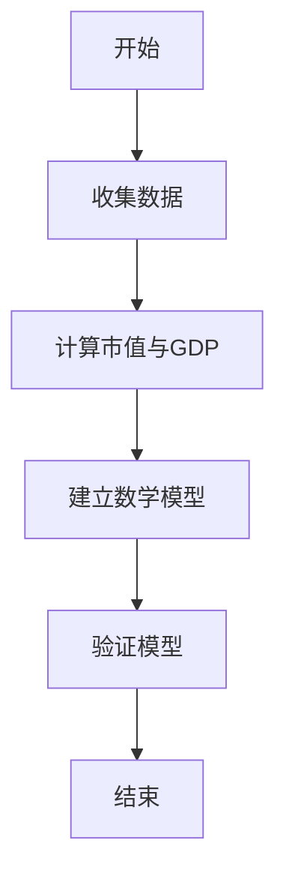
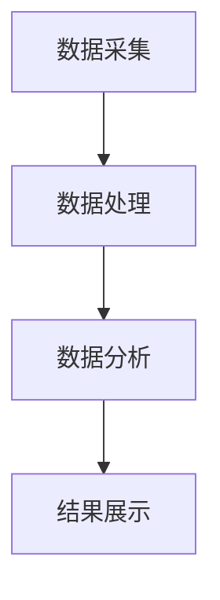

                 


# 全球经济体系市值与GDP比较分析

## 关键词
全球经济体系、市值、GDP、比较分析、经济指标

## 摘要
本文通过分析全球经济体系中的市值与GDP之间的关系，探讨如何通过比较分析来理解它们在经济中的作用。文章从背景介绍、核心概念、算法原理、系统架构到项目实战，全面阐述了市值与GDP比较分析的各个方面，旨在为读者提供深入的理论支持和实践指导。

---

## 第1章: 全球经济体系与市值、GDP概述

### 1.1 全球经济体系的定义与特点
#### 1.1.1 经济体系的基本概念
经济体系是指一个国家或地区内所有经济活动的组织方式和运行机制。现代经济体系主要以市场经济为主，辅以一定程度的政府干预。

#### 1.1.2 全球化经济的特点
全球化使得经济体系跨越国界，跨国公司、国际贸易和资本流动成为经济活动的主要特征。全球化经济的特点包括：
1. **跨国性**：企业、资本和劳动力的跨国流动。
2. **多样性**：不同国家经济体系的多样性。
3. **相互依赖性**：各国经济相互影响，形成复杂的依赖关系。

#### 1.1.3 市场经济与计划经济的对比
市场经济强调个人选择和市场调节，而计划经济强调政府规划和集中配置资源。市场经济具有较高的灵活性和效率，而计划经济则注重公平性和稳定性。

### 1.2 市值与GDP的定义与特点
#### 1.2.1 市值的定义与计算方法
市值（Market Value）是指企业在市场上的股票总价值，计算公式为：
$$ \text{市值} = \text{股价} \times \text{总股本} $$

#### 1.2.2 GDP的定义与计算方法
GDP（国内生产总值）是一个国家或地区在一定时期内生产的最终产品和服务的总价值，计算公式为：
$$ \text{GDP} = \text{消费} + \text{投资} + \text{政府支出} - \text{出口} + \text{进口} $$

#### 1.2.3 市值与GDP的异同点
- **相同点**：两者都反映了经济活动的规模和表现。
- **不同点**：市值反映市场对企业的估值，而GDP反映整体经济的生产活动。

### 1.3 市值与GDP的关系
#### 1.3.1 市值与GDP的内在联系
市值与GDP都反映了经济的健康状况，但市值更关注市场对未来的预期，而GDP关注当前的生产活动。

#### 1.3.2 市值与GDP的差异与互补性
市值具有前瞻性，而GDP具有滞后性。两者结合可以更全面地分析经济状况。

#### 1.3.3 市值与GDP在经济分析中的作用
市值用于评估企业的市场价值，而GDP用于评估整体经济的生产规模。

---

## 第2章: 市值与GDP的比较分析框架

### 2.1 比较分析的核心概念
#### 2.1.1 比较分析的背景与问题描述
随着全球化的发展，市值和GDP的比较分析变得越来越重要。企业市值的变化可能影响GDP的增长，而GDP的增长又影响企业的盈利能力。

#### 2.1.2 比较分析的目标与边界
目标：分析市值与GDP的关系，寻找两者之间的关联性。边界：仅限于经济领域，不涉及政治和社会因素。

#### 2.1.3 比较分析的核心要素
包括市值增长率、GDP增长率、行业分布、市场预期等。

### 2.2 市值与GDP的属性特征对比
#### 2.2.1 市值的属性特征
- 时间性：市值随市场波动而变化。
- 市场性：受市场供需关系影响。
- 预期性：反映市场对未来经济的预期。

#### 2.2.2 GDP的属性特征
- 广泛性：覆盖所有经济活动。
- 滞后性：数据发布滞后于实际经济活动。
- 综合性：综合反映经济的全貌。

#### 2.2.3 两者属性特征的对比分析
| 特性   | 市值          | GDP          |
|--------|--------------|--------------|
| 时间性 | 实时性        | 滞后性        |
| 范围   | 单一企业      | 整个国家/地区 |
| 影响因素 | 市场预期      | 生产活动      |

### 2.3 市值与GDP的ER实体关系图
```mermaid
er
  entity 市值
  entity GDP
  relation 计算关系
  relation 比较关系
```

---

## 第3章: 市值与GDP比较分析的算法原理

### 3.1 算法概述
比较分析算法旨在通过数学模型量化市值与GDP之间的关系。以下是算法的流程图：



### 3.2 算法实现
以下是Python代码实现：

```python
import pandas as pd

# 数据收集
data = pd.DataFrame({
    '市值': [100, 200, 300],
    'GDP': [500, 600, 700]
})

# 计算相关系数
correlation = data['市值'].corr(data['GDP'])
print(f"市值与GDP的相关系数为：{correlation}")
```

### 3.3 数学模型与公式
相关系数公式：
$$ r = \frac{n\sum xy - \sum x \sum y}{\sqrt{n\sum x^2 - (\sum x)^2} \sqrt{n\sum y^2 - (\sum y)^2}} $$

---

## 第4章: 市值与GDP比较分析的系统架构设计

### 4.1 系统功能设计
以下是系统功能模块图：


### 4.2 系统架构设计


### 4.3 系统接口设计
以下是API接口设计：

```python
class 经济分析系统:
    def __init__(self):
        self.data = {}

    def collect_data(self, source):
        pass

    def analyze(self):
        pass
```

---

## 第5章: 项目实战

### 5.1 环境配置
安装Python和相关库：
```bash
pip install pandas numpy
```

### 5.2 核心实现代码
```python
import pandas as pd

def compare_mkt_cap_gdp(mkt_data, gdp_data):
    merged_data = pd.merge(mkt_data, gdp_data, on='year')
    return merged_data

# 示例数据
mkt_data = pd.DataFrame({'year': [2020, 2021, 2022], '市值': [1000, 1200, 1300]})
gdp_data = pd.DataFrame({'year': [2020, 2021, 2022], 'GDP': [5000, 5200, 5400]})

result = compare_mkt_cap_gdp(mkt_data, gdp_data)
print(result)
```

---

## 第6章: 总结与展望

### 6.1 小结
本文通过比较分析的方法，探讨了市值与GDP的关系，提供了理论支持和实践指导。

### 6.2 注意事项
- 数据的准确性和完整性
- 模型的适用性和局限性
- 经济环境的变化对结果的影响

### 6.3 拓展阅读
- 市值与GDP的长期趋势分析
- 不同经济体制下的比较研究

---

## 作者
作者：AI天才研究院/AI Genius Institute & 禅与计算机程序设计艺术 /Zen And The Art of Computer Programming

