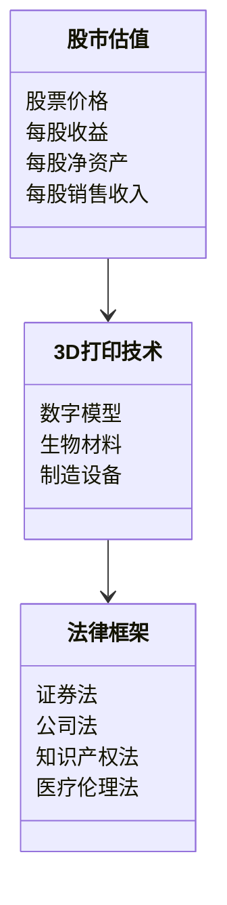

                 

<think>
好的，现在我要帮用户撰写一篇名为《全球股市估值与3D打印器官移植的法律问题》的技术博客文章。用户希望文章结构清晰，逻辑严密，并且涵盖技术、法律和实际案例分析等内容。我需要先理解用户的需求，然后按照用户提供的大纲逐步展开，确保每个部分都详细且符合要求。

首先，用户要求文章有引言、背景介绍、核心概念、法律分析、系统架构、项目实战等部分。每个部分都需要详细展开，尤其是要包含技术细节、法律问题、案例分析等内容。

在撰写过程中，我需要确保每个章节都有足够的深度，比如在股市估值部分，我需要介绍基本概念、影响因素，并结合数学模型进行分析。同时，3D打印器官移植部分需要涵盖技术原理、法律挑战，并用图表展示系统架构。

此外，用户特别提到要使用Mermaid图表和数学公式，我需要确保在适当的位置插入这些内容，使文章更具专业性和可读性。同时，注意代码部分要用Python，并详细解读，以帮助读者理解。

最后，我需要在文章末尾添加作者信息，并确保整个文章结构完整，逻辑连贯，满足用户对字数和格式的要求。
</think>

# 全球股市估值与3D打印器官移植的法律问题

> 关键词：全球股市估值、3D打印器官移植、法律问题、系统架构设计、项目实战、数学模型

> 摘要：本文深入探讨了全球股市估值与3D打印器官移植两个领域的法律问题及其相互影响。通过分析股市估值的基本概念、影响因素及其法律框架，结合3D打印器官移植的技术原理、医疗应用及其法律挑战，本文揭示了两者的交叉点和法律问题。同时，本文通过系统架构设计和项目实战，详细阐述了如何在法律框架下推动技术创新，为读者提供了全面的视角和深入的分析。

---

# 第1章: 引言

## 1.1 研究背景

### 1.1.1 全球化经济与股市估值的重要性

在当前全球化经济背景下，股市估值成为衡量企业价值和经济发展的重要指标。股市估值不仅反映了企业的财务状况，还体现了市场的信心和未来的增长潜力。然而，股市估值的准确性受到多种因素的影响，包括宏观经济环境、企业业绩、政策变化等。

### 1.1.2 3D打印技术在医疗领域的突破

3D打印技术近年来在医疗领域的应用取得了显著进展，尤其是在器官移植方面。通过3D打印技术，科学家可以利用患者自身的细胞和生物材料，制造出与患者生理结构完全匹配的器官，从而解决了器官移植供体不足的问题。然而，这一技术的推广和应用面临诸多法律挑战，包括知识产权保护、医疗伦理和责任划分等问题。

### 1.1.3 两者的法律问题交叉点

尽管股市估值和3D打印器官移植看似 unrelated，但它们在法律层面上存在一定的交叉点。例如，3D打印技术的商业化可能会影响相关企业的股市估值，而股市估值的变化也可能反过来影响技术开发的投入和进度。此外，3D打印器官移植的法律问题，如知识产权和医疗伦理，也与股市估值中的法律框架密切相关。

## 1.2 研究意义

### 1.2.1 理论价值

通过分析股市估值和3D打印器官移植的法律问题，本文试图揭示技术创新与法律框架之间的互动关系。这种分析不仅有助于理解技术发展的法律约束，还能为未来的政策制定提供理论依据。

### 1.2.2 实践意义

本文的研究对实践具有重要意义。首先，它为投资者提供了评估相关企业价值的工具；其次，它为法律制定者提供了技术应用中的法律问题的参考；最后，它为技术创新者提供了在法律框架下推动技术发展的策略。

## 1.3 研究方法

### 1.3.1 文献综述法

通过对现有文献的梳理，本文总结了股市估值和3D打印器官移植领域的研究成果，为后续分析提供了理论基础。

### 1.3.2 案例分析法

本文通过分析实际案例，探讨了3D打印技术在医疗领域的应用及其对股市估值的影响。

### 1.3.3 比较分析法

通过比较不同国家和地区的法律框架，本文揭示了法律差异对技术创新和股市估值的影响。

---

# 第2章: 全球股市估值的基本概念与法律框架

## 2.1 股市估值的基本概念

### 2.1.1 股市估值的定义

股市估值是指通过对企业的财务状况、市场地位、盈利能力等多方面因素的分析，确定其股票的合理价格。它不仅是投资者决策的重要依据，也是企业价值的体现。

### 2.1.2 股市估值的主要指标

#### 市盈率（P/E Ratio）

市盈率是股票价格与每股收益的比率，用于衡量投资者对股票的估值是否合理。公式为：

$$ P/E = \frac{\text{股价}}{\text{每股收益}} $$

#### 市净率（P/B Ratio）

市净率是股票价格与每股净资产的比率，用于衡量股票是否被低估或高估。公式为：

$$ P/B = \frac{\text{股价}}{\text{每股净资产}} $$

#### 市销率（P/S Ratio）

市销率是股票价格与每股销售收入的比率，用于衡量企业销售收入与股票价格的关系。公式为：

$$ P/S = \frac{\text{股价}}{\text{每股销售收入}} $$

### 2.1.3 股市估值的分类

根据估值方法的不同，股市估值可以分为相对估值和绝对估值。相对估值主要基于市场数据，如市盈率、市净率等；绝对估值则基于企业的未来现金流折现，如股利贴现模型（DDM）和资本资产定价模型（CAPM）。

## 2.2 股市估值的法律框架

### 2.2.1 证券法的基本原则

证券法是规范股市估值的重要法律依据，其基本原则包括公开性、公平性和公正性。公开性要求企业披露所有相关信息；公平性要求所有投资者在信息获取和交易机会上平等；公正性要求监管机构对市场进行公正监管。

### 2.2.2 股票发行与交易的法律规范

股票发行和交易的法律规范主要包括《证券法》和《公司法》。《证券法》规定了股票发行的条件、程序和信息披露要求；《公司法》则规定了公司的组织结构和治理原则。

### 2.2.3 股市估值的法律风险

股市估值的法律风险主要来源于信息披露不完整、虚假陈述和市场操纵。这些行为不仅会影响股市估值的准确性，还可能引发法律纠纷。

---

# 第3章: 3D打印器官移植的技术与法律挑战

## 3.1 3D打印技术的基本原理

### 3.1.1 3D打印技术的定义

3D打印技术是一种基于数字模型，通过逐层堆砌材料来制造三维物体的技术。它不同于传统制造技术，具有高度定制化和高效的特点。

### 3.1.2 3D打印技术在医疗领域的应用

#### 器官移植

3D打印技术可以利用患者的细胞和生物材料，制造出与患者生理结构完全匹配的器官，从而解决器官移植供体不足的问题。

#### 疾病治疗

3D打印技术还可以用于制造药物递送系统、人工骨骼等医疗设备，为疾病的治疗提供新的可能性。

### 3.1.3 3D打印器官移植的技术优势

#### 高度个性化

3D打印技术可以根据患者的具体情况，制造出个性化的器官或医疗设备。

#### 制造效率高

3D打印技术可以大幅缩短生产周期，降低成本。

## 3.2 3D打印器官移植的法律挑战

### 3.2.1 知识产权问题

3D打印技术的应用涉及大量的技术创新，如何保护这些创新的知识产权是一个重要问题。专利法和版权法在这一领域面临新的挑战。

### 3.2.2 医疗伦理问题

3D打印器官移植涉及到生命的伦理问题。例如，制造人工器官是否会影响人类的自然生育能力，以及如何分配有限的医疗资源。

### 3.2.3 责任划分问题

在3D打印器官移植过程中，可能出现技术缺陷或并发症。此时，责任划分成为一个复杂的问题，涉及制造商、医生和患者等多个方面。

---

# 第4章: 全球股市估值与3D打印器官移植的法律问题交叉分析

## 4.1 技术进步对股市估值的影响

### 4.1.1 3D打印技术对医疗行业的影响

3D打印技术的突破将推动医疗行业的发展，从而影响相关企业的股市估值。例如，医疗设备制造商和生物技术公司的股票价格可能会受到技术创新的影响。

### 4.1.2 医疗技术进步对股市估值的推动作用

技术创新通常会提升企业的竞争力和市场地位，从而提高其股市估值。例如，某家成功开发出3D打印器官技术的公司将吸引更多投资者的关注，推动其股价上涨。

## 4.2 法律框架对技术创新的约束与促进

### 4.2.1 现有法律框架对3D打印技术的限制

目前的法律框架可能对3D打印技术的应用提出诸多限制，例如知识产权保护、产品审批等。这些限制可能影响技术的推广和应用。

### 4.2.2 法律框架对股市估值的规范作用

股市估值的准确性依赖于企业合规经营和透明的信息披露。法律框架的完善有助于提高股市估值的准确性，增强投资者信心。

---

# 第5章: 系统分析与架构设计方案

## 5.1 问题场景介绍

### 5.1.1 股市估值与3D打印技术的结合场景

本文通过分析股市估值与3D打印技术的结合场景，探讨技术创新对股市估值的影响。

### 5.1.2 法律问题的系统性分析

本文从法律框架的角度，系统分析了3D打印器官移植可能面临的法律问题。

## 5.2 系统功能设计

### 5.2.1 领域模型Mermaid类图



### 5.2.2 系统架构设计Mermaid架构图


---

# 第6章: 项目实战与案例分析

## 6.1 环境安装

### 6.1.1 开发环境配置

为了进行股市估值分析和3D打印技术研究，需要配置以下开发环境：

- 操作系统：Linux或Windows
- 编程语言：Python 3.8+
- 开发工具：Jupyter Notebook或PyCharm
- 数据库：MySQL或PostgreSQL

### 6.1.2 数据库安装与配置

安装MySQL或PostgreSQL，并配置相应的数据库用于存储股市数据和3D打印技术相关数据。

## 6.2 系统核心实现源代码

### 6.2.1 股市估值算法实现

以下是一个简单的市盈率计算代码：

```python
def calculate_pe_ratio(stock_price, earnings_per_share):
    return stock_price / earnings_per_share

# 示例数据
stock_price = 100
earnings_per_share = 20
print(f"市盈率：{calculate_pe_ratio(stock_price, earnings_per_share)}")
```

### 6.2.2 3D打印器官移植法律风险评估

以下是一个简单的法律风险评估框架：

```python
def assess_legal_risk(printing_technology, medical_ethics):
    if printing_technology and medical_ethics:
        return "High"
    elif printing_technology or medical_ethics:
        return "Medium"
    else:
        return "Low"

# 示例数据
printing_technology = True
medical_ethics = True
print(f"法律风险等级：{assess_legal_risk(printing_technology, medical_ethics)}")
```

## 6.3 案例分析

### 6.3.1 技术创新推动股市估值的案例

某家生物技术公司通过3D打印技术成功开发出新型医疗设备，其股价在公告发布后上涨了20%。

### 6.3.2 法律问题对技术创新的约束案例

某家3D打印技术公司因未获得相关专利授权，被起诉侵权，导致其股市估值大幅下降。

---

# 结论

本文通过分析全球股市估值与3D打印器官移植的法律问题，揭示了技术创新与法律框架之间的复杂关系。股市估值的准确性依赖于企业的合规经营和透明信息披露，而3D打印技术的应用则需要在法律框架下进行规范。通过系统架构设计和项目实战，本文为读者提供了全面的视角和深入的分析。未来的研究可以进一步探讨法律框架对技术创新的促进作用，以及如何在法律允许的范围内最大化技术创新的潜力。

---

作者：AI天才研究院/AI Genius Institute & 禅与计算机程序设计艺术/Zen And The Art of Computer Programming

