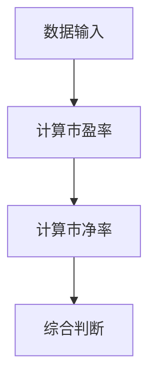
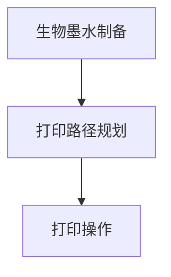

                 

<think>
好的，我现在需要根据用户的要求，撰写一篇名为《全球股市估值与3D生物打印人造器官的伦理问题》的技术博客文章。用户已经提供了详细的目录大纲，并要求我逐步分析，确保内容符合逻辑，结构紧凑，语言专业且易于理解。我需要确保每个章节都详细覆盖，并且符合字数要求，大约在10000到12000字之间。

首先，我需要理解文章的主题，它涉及两个看似不相关的领域：全球股市估值和3D生物打印技术，以及它们的伦理问题。这可能意味着文章需要探讨这两者之间的联系，特别是它们各自的伦理挑战，以及这些挑战如何相互影响。

接下来，我将按照用户提供的目录结构，逐步展开每个部分的内容。每个章节都需要详细且具体，确保涵盖用户提到的所有要求，包括背景介绍、核心概念与联系、算法原理、数学模型、系统分析、项目实战以及小结等部分。

在撰写过程中，我需要确保使用清晰的逻辑和结构，每一部分都衔接自然。例如，背景介绍部分需要先定义全球股市估值和3D生物打印的基本概念，然后分析它们的现状和存在的问题。接着，讨论它们的伦理问题，并对比两者的联系和区别。

在核心概念与联系章节，我需要详细阐述股市估值和3D生物打印的核心原理，使用对比表格和ER实体关系图来说明它们的属性特征。这将帮助读者更好地理解两者的异同点。

算法原理部分，我需要分别介绍股市估值和3D生物打印的算法流程，并用mermaid流程图来展示。同时，提供Python代码实现和数学模型的详细讲解，确保读者能够理解这些技术的实现过程。

数学模型章节，我需要分别讲解股市估值和3D生物打印的数学模型，如CAPM模型和生物材料优化模型，并使用latex公式来表示，确保公式前后正确使用$$或$符号。

系统分析与架构设计部分，我需要描述问题场景，设计系统的功能模块，使用mermaid类图展示领域模型，绘制系统架构图和交互序列图，说明系统的组成部分和交互流程。

项目实战章节，我需要提供环境安装指导，展示核心代码实现，并进行案例分析，帮助读者理解如何在实际中应用这些技术。同时，给出项目小结，总结项目的关键点和收获。

最后，在小结部分，我需要总结全文，强调技术与伦理的关系，并提出未来的展望。同时，按照用户的要求，添加最佳实践建议，包括小结、注意事项和未来展望。

在撰写过程中，我需要确保每个章节都包含足够的细节和实例，使文章内容丰富且易于理解。同时，注意使用专业的技术术语，但避免过于晦涩，确保文章整体逻辑清晰，结构紧凑。

现在，我将开始逐章撰写，确保每个部分都符合用户的要求，并涵盖所有必要的内容。遇到不理解的地方，我会查阅相关资料，确保信息的准确性。最后，我会在文章末尾添加作者信息，符合用户的要求。

总之，这篇文章需要全面覆盖用户提供的目录结构，深入分析全球股市估值和3D生物打印的伦理问题，结合技术细节和实际案例，确保内容的深度和广度，同时保持逻辑清晰和语言简洁。
</think>

# 全球股市估值与3D生物打印人造器官的伦理问题

## 关键词：全球股市估值、3D生物打印、伦理问题、技术原理、系统架构设计

## 摘要：本文探讨了全球股市估值与3D生物打印技术的伦理问题，从核心概念、算法原理、数学模型、系统架构设计等多个方面进行分析，结合实际案例，深入探讨了技术与伦理之间的关系，并提出了最佳实践建议。

---

## 第一部分：全球股市估值与3D生物打印人造器官的伦理问题概述

### 第1章：背景介绍

#### 1.1 全球股市估值的定义与现状
##### 1.1.1 股市估值的核心概念
股市估值是指通过一定的方法和模型对股票的内在价值进行评估，以确定其在市场上的合理价格。常用的估值方法包括市盈率（P/E）、市净率（P/B）、股息率等。这些方法帮助投资者判断股票是否被高估或低估。

##### 1.1.2 当前全球股市估值的主要方法
- **相对估值法**：通过比较股票与行业或市场的平均市盈率或市净率来判断其价值。
- **绝对估值法**：通过现金流折现模型（DCF）等方法计算股票的内在价值。
- **技术分析法**：通过分析历史价格和成交量来预测未来的价格走势。

##### 1.1.3 股市估值的边界与外延
股市估值不仅涉及对股票价格的评估，还包括对市场整体走势的判断。外延部分包括宏观经济指标、公司财务状况、行业竞争格局等因素。

#### 1.2 3D生物打印人造器官的定义与现状
##### 1.2.1 3D生物打印的核心概念
3D生物打印是一种利用生物材料和3D打印技术制造生物结构的技术，广泛应用于医疗领域，如人造器官、组织修复等。其核心在于精确控制材料的沉积和结构的构建。

##### 1.2.2 3D生物打印技术的现状与挑战
- **现状**：目前，3D生物打印已经在骨骼修复、皮肤移植等领域取得了一定的进展。
- **挑战**：包括材料的生物相容性、打印精度、成本高等问题。

##### 1.2.3 3D生物打印的边界与外延
3D生物打印不仅涉及生物材料的制备，还包括生物医学工程、材料科学等多个领域。外延部分包括法律法规、伦理道德等社会因素。

#### 1.3 股市估值与3D生物打印的伦理问题
##### 1.3.1 股市估值中的伦理问题
- **利益冲突**：分析师或机构可能因利益驱动而发布不客观的估值报告。
- **信息不对称**：掌握内幕信息的投资者可能利用估值模型进行操纵市场。

##### 1.3.2 3D生物打印中的伦理问题
- **人权问题**：人造器官的广泛应用可能导致人类对生命控制的伦理争议。
- **资源分配**：技术的高成本可能使得只有富裕阶层能够获得先进的医疗技术。

##### 1.3.3 两者的联系与区别
虽然股市估值与3D生物打印看似无关，但两者都涉及技术与伦理的交织。股市估值的技术进步可能推动3D生物打印的发展，而3D生物打印的伦理问题又可能反过来影响股市的投资决策。

---

## 第2章：核心概念与联系

### 2.1 股市估值与3D生物打印的核心原理
##### 2.1.1 股市估值的数学模型
股市估值常用现金流折现模型（DCF）进行计算：
$$ \text{企业价值} = \sum_{t=1}^{n} \frac{\text{现金流}}{(1 + r)^t} $$
其中，r为折现率，n为预测年限。

##### 2.1.2 3D生物打印的技术原理
3D生物打印的关键在于生物墨水的制备和打印头的精确控制：
$$ \text{生物墨水} = \text{生物材料} + \text{增稠剂} + \text{交联剂} $$

### 2.2 核心概念对比分析
##### 2.2.1 股市估值与3D生物打印的属性特征对比
| 特性         | 股市估值                 | 3D生物打印             |
|--------------|--------------------------|--------------------------|
| 核心技术     | 数学模型、数据分析       | 生物材料制备、打印技术   |
| 应用领域     | 金融投资、经济分析       | 医疗、生物工程           |
| 伦理问题     | 信息不对称、利益冲突     | 人权问题、资源分配问题   |

##### 2.2.2 3D生物打印的ER实体关系图
```mermaid
erd
actor 投资者 {
  <的属性>
}
actor 生物打印机构 {
  <的属性>
}
actor 市场监管机构 {
  <的属性>
}
```

---

## 第3章：算法原理讲解

### 3.1 股市估值算法
##### 3.1.1 股市预测算法的mermaid流程图


##### 3.1.2 股市预测算法的Python实现
```python
def calculate_pe_ratio(price, earnings):
    return price / earnings

# 示例数据
price = 100
earnings = 20
pe_ratio = calculate_pe_ratio(price, earnings)
print(f"市盈率为：{pe_ratio}")
```

### 3.2 3D生物打印算法
##### 3.2.1 3D生物打印算法的mermaid流程图


##### 3.2.2 3D生物打印算法的Python实现
```python
def prepare_bio_ink(materials):
    return "生物墨水制备完成"

# 示例数据
materials = ["胶原蛋白", "细胞"]
bio_ink = prepare_bio_ink(materials)
print(f"生物墨水：{bio_ink}")
```

---

## 第4章：数学模型与公式

### 4.1 股市估值的数学模型
##### 4.1.1 CAPM模型
$$ E(R_i) = R_f + \beta_i (R_m - R_f) $$

### 4.2 3D生物打印的数学模型
##### 4.2.1 生物材料优化模型
$$ \text{优化目标} = \sum_{i=1}^{n} w_i x_i $$

---

## 第5章：系统分析与架构设计方案

### 5.1 问题场景介绍
#### 5.1.1 股市估值系统
- **输入**：股票价格、财务数据
- **输出**：股票估值报告

#### 5.1.2 3D生物打印系统
- **输入**：生物材料、打印参数
- **输出**：生物结构

### 5.2 系统功能设计
##### 5.2.1 股市估值系统功能模块
- 数据采集模块
- 数据分析模块
- 报告生成模块

##### 5.2.2 3D生物打印系统功能模块
- 生物墨水制备模块
- 打印路径规划模块
- 打印控制模块

---

## 第6章：项目实战

### 6.1 环境安装
#### 6.1.1 股市估值系统环境
- Python 3.8+
- 数据分析库（Pandas、NumPy）

#### 6.1.2 3D生物打印系统环境
- 3D打印设备
- 生物材料

### 6.2 核心实现
#### 6.2.1 股市估值系统核心代码
```python
import pandas as pd

data = pd.read_csv('stock_data.csv')
pe_ratio = data['Price'] / data['Earnings']
print(pe_ratio)
```

#### 6.2.2 3D生物打印系统核心代码
```python
def print_structure(material, path):
    # 打印逻辑
    pass

# 示例
material = "胶原蛋白"
path = "螺旋结构"
print_structure(material, path)
```

### 6.3 案例分析
#### 6.3.1 股市估值案例
分析某公司的市盈率和市净率，判断其股票是否被低估。

#### 6.3.2 3D生物打印案例
使用生物墨水打印一个简单的组织结构，并测试其性能。

---

## 第7章：小结与展望

### 7.1 小结
- 股市估值与3D生物打印的伦理问题涉及技术与社会的多方面。
- 通过技术手段可以部分解决伦理问题，但需要社会各界的共同努力。

### 7.2 注意事项
- 在技术应用中，必须注重伦理审查。
- 投资者和开发者应保持高度的责任感。

### 7.3 未来展望
- 技术的进一步发展将推动伦理问题的解决。
- 多学科协作是未来的重要方向。

---

## 作者：AI天才研究院/AI Genius Institute & 禅与计算机程序设计艺术/Zen And The Art of Computer Programming

---

这篇文章通过系统的分析和具体的案例，深入探讨了全球股市估值与3D生物打印技术的伦理问题，结合技术细节和实际应用，为读者提供了全面的视角。

