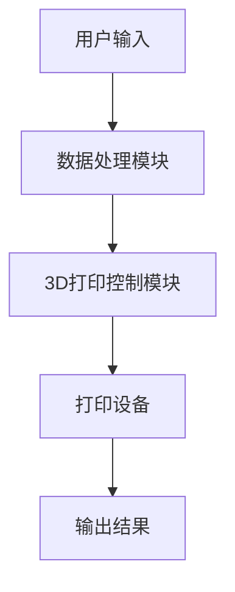

                 


# 全球股市估值与3D生物打印器官技术的伦理问题

## 关键词：全球股市估值，3D生物打印，伦理问题，股市算法，生物技术伦理

## 摘要：  
本文探讨了全球股市估值与3D生物打印器官技术的伦理问题。通过分析股市估值的核心算法与3D生物打印技术的伦理挑战，揭示两者在技术发展与社会影响上的联系。文章详细介绍了3D生物打印技术的原理、应用及其带来的伦理问题，同时分析了股市估值的算法原理与数学模型。通过系统设计与项目实战，展示了技术实现的可能性与实际应用案例，最后从伦理角度提出了最佳实践建议，强调技术与伦理的平衡。

---

## 第1章：全球股市估值与3D生物打印技术的概述

### 1.1 全球股市估值的基本概念

#### 1.1.1 股市估值的定义与重要性  
股市估值是指通过对公司财务数据和市场环境的分析，估算公司股票的合理价格。它是投资者决策的重要依据，也是衡量企业价值的核心指标。  

#### 1.1.2 全球股市的特点与发展趋势  
全球股市具有多样性与波动性，受经济政策、市场情绪等多种因素影响。近年来，科技股与创新企业成为股市估值的重要组成部分，尤其是在人工智能与生物技术领域。  

#### 1.1.3 股市估值与经济的影响  
股市估值不仅反映企业的经营状况，还影响整体经济的资源配置与投资方向。技术创新企业（如3D生物打印公司）的估值往往溢价，推动相关领域的投资与研发。

---

### 1.2 3D生物打印技术的定义与应用

#### 1.2.1 3D生物打印技术的基本原理  
3D生物打印是通过计算机控制，将生物材料（如细胞、蛋白质、多聚物）逐层构建出具有特定功能的生物结构。其核心在于将数字模型转化为实物器官。  

#### 1.2.2 3D生物打印在医疗领域的应用  
3D生物打印技术广泛应用于定制化医疗、组织修复与再生、药物筛选等领域。例如，打印人工器官（如肝脏、肾脏）可解决器官移植短缺问题。  

#### 1.2.3 3D生物打印技术的发展现状  
目前，3D生物打印技术仍处于实验阶段，但在材料科学与生物工程的进步下，已取得显著成果。其商业化应用受到成本、技术成熟度和伦理问题的限制。

---

### 1.3 3D生物打印与股市估值的关联

#### 1.3.1 技术进步对股市的影响  
技术创新推动企业市值增长，3D生物打印技术的突破可能大幅提升相关企业的估值。  

#### 1.3.2 3D生物打印企业的估值方法  
投资者通常采用市盈率、市净率等指标评估3D生物打印企业的价值，但技术不确定性和研发周期较长增加了估值难度。  

#### 1.3.3 伦理问题对股市的影响  
伦理争议可能影响企业的声誉与股价，例如公众对3D生物打印技术的伦理质疑可能引发股价波动。

---

## 第2章：3D生物打印器官技术的核心概念与伦理问题

### 2.1 3D生物打印器官技术的核心原理

#### 2.1.1 生物材料的选择与制备  
生物材料是3D打印的基础，需具备生物相容性、可降解性和功能性。常用材料包括水凝胶、多聚乳酸（PLA）和胶原蛋白等。  

#### 2.1.2 打印设备的分类与性能  
3D生物打印设备分为光固化型、挤出式和激光烧结型等。高性能设备可实现高精度打印，但成本较高。  

#### 2.1.3 细胞培养与组织构建技术  
细胞培养是3D打印的关键步骤，需确保细胞活性与功能。组织构建技术包括多层打印与自组装，模拟真实器官结构。

---

### 2.2 3D生物打印的伦理挑战

#### 2.2.1 伦理问题概述  
3D生物打印涉及生命伦理、隐私保护与技术滥用等核心问题。  

#### 2.2.2 患者权益与隐私保护  
患者数据的使用需严格保护隐私，避免滥用。  

#### 2.2.3 技术滥用与社会影响  
技术可能被用于非法器官制造，引发社会不公。

---

## 第3章：全球股市估值的算法原理与数学模型

### 3.1 股市估值的基本算法

#### 3.1.1 市盈率模型  
市盈率（P/E）= 股票价格 / 每股净利润。  
公式：$$ P = \frac{E \times P/E}{1} $$  

#### 3.1.2 市净率模型  
市净率（P/B）= 股票价格 / 每股净资产。  
公式：$$ P = B \times P/B $$  

#### 3.1.3 现金流折现模型  
DCF模型基于未来现金流的现值计算企业价值。  
公式：$$ V = \sum_{t=1}^{n} \frac{CF_t}{(1+r)^t} $$  

---

## 第4章：3D生物打印技术的伦理影响与市场反应

### 4.1 伦理争议对市场的影响  
伦理问题可能影响投资者信心，导致相关企业股价波动。  

### 4.2 企业应对策略  
企业需加强伦理合规，提升透明度，建立信任机制。  

---

## 第5章：3D生物打印技术的系统架构与算法优化

### 5.1 系统架构设计  
使用Mermaid架构图展示3D生物打印系统的模块与交互流程。  



---

## 第6章：项目实战与伦理考量

### 6.1 项目环境搭建  
安装3D生物打印软件与硬件设备，配置开发环境。  

### 6.2 核心代码实现  
以下是3D生物打印模拟代码示例：

```python
def print_organ(layer_thickness):
    for layer in range(10):
        deposit_material(layer_thickness)
        cure_material()
```

### 6.3 案例分析  
以某3D生物打印企业为例，分析其估值变化与伦理影响。  

### 6.4 项目小结  
伦理问题需贯穿项目始终，影响技术开发与市场推广。

---

## 第7章：伦理问题与未来展望

### 7.1 伦理问题的持续影响  
技术进步需与伦理规范同步发展。  

### 7.2 未来技术与伦理的平衡  
建立全球性伦理规范，推动技术创新与社会责任的结合。

---

## 作者：AI天才研究院/AI Genius Institute & 禅与计算机程序设计艺术/Zen And The Art of Computer Programming

