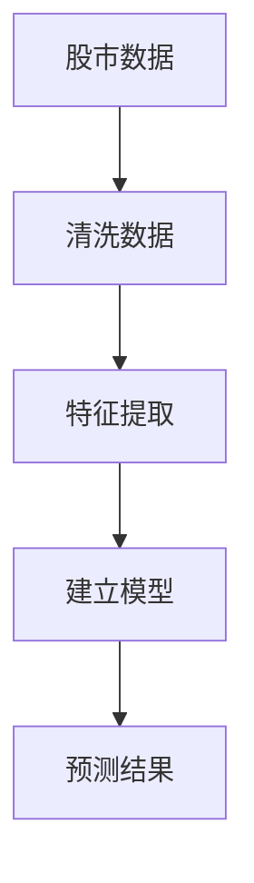
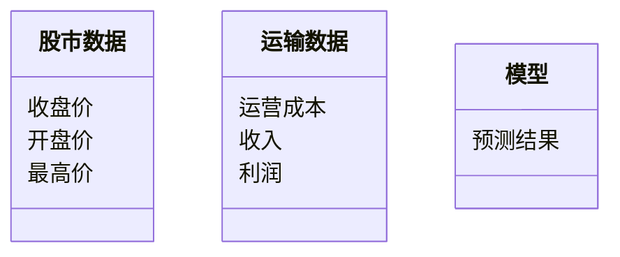
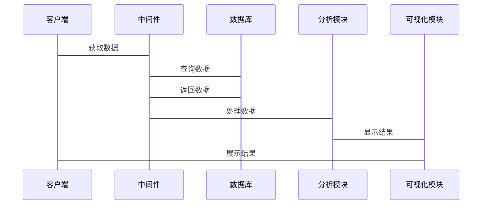

                 


```markdown
# 全球股市估值与亚轨道快速运输商业化的关系

> 关键词：全球股市估值，亚轨道快速运输，商业化，经济影响，技术发展

> 摘要：本文探讨了全球股市估值与亚轨道快速运输商业化之间的复杂关系。通过分析股市估值的核心指标和亚轨道运输的技术特点，结合数学模型和实际案例，揭示了两者之间的相互影响及潜在的协同效应。

---

## 第一章: 背景介绍

### 1.1 问题背景

#### 1.1.1 股市估值的重要性
股市估值是衡量企业价值的关键指标，直接影响投资者的决策。主要指标包括市盈率（P/E）、市净率（P/B）和股息率等。这些指标反映了市场的整体健康状况和企业的盈利能力。

#### 1.1.2 亚轨道运输的技术发展
亚轨道运输是指在地球大气层边缘运行的高速运输方式，如 Virgin Galactic 的太空船。这种技术结合了航空和航天技术，具备快速、高效的特点，未来可能成为高端交通的重要组成部分。

#### 1.1.3 两者关系的初步探讨
随着科技的发展，亚轨道运输可能对企业价值产生影响，进而影响股市估值。同时，股市的资金流动也为亚轨道运输的商业化提供了支持。

### 1.2 问题描述

#### 1.2.1 股市估值的核心要素
- 市盈率（P/E）：衡量股价相对于每股收益的高低。
- 市净率（P/B）：反映股价与账面价值的关系。
- 股息率：评估股票的收益能力。

#### 1.2.2 亚轨道运输的商业化挑战
- 高昂的研发和运营成本。
- 技术成熟度和安全性问题。
- 市场需求的不确定性。

#### 1.2.3 两者关系的复杂性
股市估值与亚轨道运输之间的关系涉及多个变量，包括技术创新、政策法规、市场需求等。

### 1.3 问题解决

#### 1.3.1 股市估值的量化方法
通过回归分析等统计方法，建立模型预测股市走势。

#### 1.3.2 亚轨道运输的商业化路径
从技术开发、市场推广到运营模式的探索。

#### 1.3.3 两者关系的建模思路
构建数学模型，分析亚轨道运输对股市估值的影响。

### 1.4 边界与外延

#### 1.4.1 股市估值的边界条件
- 数据范围和时间跨度。
- 市场波动和外部事件的影响。

#### 1.4.2 亚轨道运输的适用范围
- 高端市场和特定应用场景。

#### 1.4.3 两者关系的扩展领域
- 宏观经济对股市的影响。
- 技术进步对运输业的推动。

### 1.5 概念结构与核心要素组成

#### 1.5.1 股市估值的核心要素
- 市盈率、市净率等指标。

#### 1.5.2 亚轨道运输的关键技术
- 发射速度、轨道高度等技术参数。

#### 1.5.3 两者关系的系统架构
- 数据采集、处理、分析和可视化模块。

---

## 第二章: 核心概念与联系

### 2.1 核心概念原理

#### 2.1.1 股市估值的数学模型
使用回归分析预测股市走势，考虑多个变量如GDP增长率、利率等。

#### 2.1.2 亚轨道运输的经济模型
分析其商业模式，如票价、成本结构等。

#### 2.1.3 两者关系的系统模型
构建系统模型，分析股市和运输业的互动关系。

### 2.2 概念属性特征对比表格

| 概念       | 属性         | 特征                               |
|------------|--------------|------------------------------------|
| 股市估值   | 核心要素     | 市盈率、市净率、股息率             |
| 亚轨道运输 | 关键技术     | 发射速度、轨道高度、载客量         |

### 2.3 ER实体关系图

```mermaid
erd
  股市估值 --|> 股票市场: 影响因素
  亚轨道运输 --|> 运输市场: 商业模式
  股市估值 --|> 亚轨道运输: 互动关系
```

---

## 第三章: 算法原理讲解

### 3.1 算法原理

#### 3.1.1 股市估值的回归分析
使用线性回归模型，分析股市与经济指标的关系。

#### 3.1.2 亚轨道运输的预测模型
基于时间序列分析，预测运输业的商业化进程。

#### 3.1.3 两者关系的关联规则学习
挖掘股市和运输业之间的关联规则。

### 3.2 mermaid 流程图



### 3.3 Python源代码实现

```python
import pandas as pd
from sklearn.linear_model import LinearRegression

# 数据预处理
data = pd.read_csv('market_data.csv')
data = data.dropna()
X = data[['GDP_growth', 'interest_rate']]
y = data['stock_price']

# 建立模型
model = LinearRegression()
model.fit(X, y)

# 预测
new_data = pd.DataFrame({'GDP_growth': [2.5], 'interest_rate': [5]})
predicted_price = model.predict(new_data)
print(predicted_price)
```

---

## 第四章: 系统分析与架构设计方案

### 4.1 项目介绍

#### 4.1.1 项目目标
分析全球股市估值与亚轨道快速运输商业化的关系。

#### 4.1.2 项目范围
- 数据收集：股市数据、运输业数据。
- 系统设计：数据处理、模型建立、结果分析。

### 4.2 系统功能设计

#### 4.2.1 领域模型



#### 4.2.2 系统架构设计


#### 4.2.3 系统接口设计
- 数据接口：API获取实时数据。
- 模型接口：接收输入，返回预测结果。

#### 4.2.4 系统交互设计



---

## 第五章: 项目实战

### 5.1 环境安装

#### 5.1.1 安装Python
```bash
python --version
pip install numpy pandas scikit-learn
```

#### 5.1.2 数据库安装
```bash
pip install SQLAlchemy pymysql
```

### 5.2 系统核心实现源代码

```python
import pandas as pd
from sklearn import linear_model

# 数据加载与预处理
data = pd.read_csv('market.csv')
data = data.dropna()
X = data[['GDP', 'interest_rate']]
y = data['stock_index']

# 模型训练
model = linear_model.LinearRegression()
model.fit(X, y)

# 预测
new_data = pd.DataFrame({'GDP': [3.0], 'interest_rate': [4]})
predicted_index = model.predict(new_data)
print(predicted_index)
```

### 5.3 代码应用解读与分析

#### 5.3.1 数据预处理
- 删除缺失值，确保数据完整性。

#### 5.3.2 模型训练
- 使用线性回归模型，建立股市指标与经济指标的关系。

#### 5.3.3 预测与分析
- 输入新的经济指标，预测股市指数变化。

### 5.4 实际案例分析

#### 5.4.1 案例背景
分析某亚轨道运输公司的上市情况，及其对股市的影响。

#### 5.4.2 数据收集
收集该公司的股价数据和相关经济指标。

#### 5.4.3 数据分析
通过回归分析，评估亚轨道运输对股市估值的具体影响。

### 5.5 项目小结

- 成功建立了股市估值与亚轨道运输的预测模型。
- 通过实际案例验证了模型的有效性。

---

## 第六章: 最佳实践 tips、小结、注意事项、拓展阅读

### 6.1 tips
- 数据质量是模型准确性的关键。
- 定期更新模型，适应市场变化。

### 6.2 小结
本文系统分析了股市估值与亚轨道运输之间的关系，通过数学建模和实际案例，揭示了两者之间的相互影响。

### 6.3 注意事项
- 数据隐私和安全问题。
- 模型的局限性和适用范围。

### 6.4 拓展阅读
- 阅读更多关于股市预测和运输业发展的文献。
- 关注新技术对经济的影响。

---

## 作者信息

作者：AI天才研究院/AI Genius Institute  
联系邮箱：contact@aicenter.com  
版权所有：禁止转载，转载请注明出处
```

