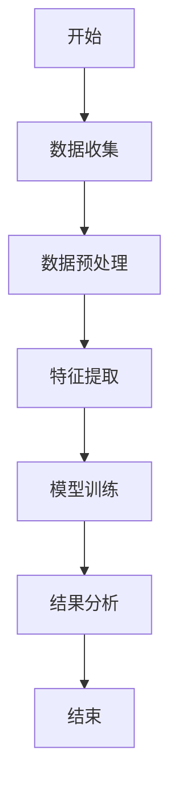
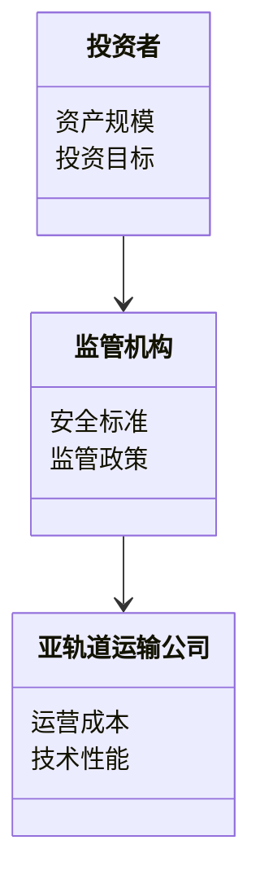
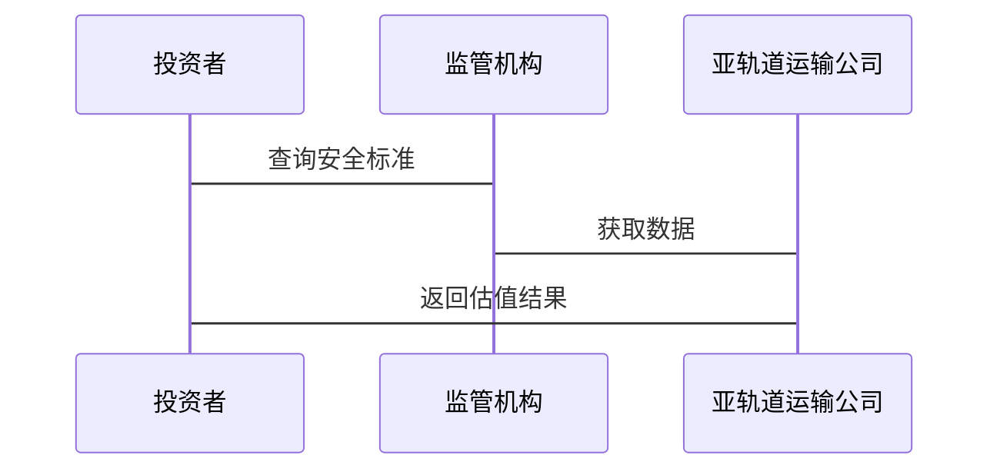

                 


# 全球股市估值与亚轨道快速运输安全标准的关系

> 关键词：全球股市估值、亚轨道运输、安全标准、数据分析、算法原理、系统架构

> 摘要：本文探讨了全球股市估值与亚轨道快速运输安全标准之间的关系，通过核心概念分析、算法原理、系统架构设计、项目实战等多方面展开，揭示两者如何相互影响，并提供实际应用案例和最佳实践。

---

## 第1章: 背景介绍

### 1.1 全球股市估值的基本概念

#### 1.1.1 全球股市估值的定义
全球股市估值是指对全球股票市场的整体价值进行评估。通常通过股票价格指数（如道琼斯指数、纳斯达克指数等）来衡量市场的整体表现。股市估值的核心在于反映市场的健康状况，为投资者提供决策依据。

#### 1.1.2 全球股市估值的核心要素
- 市场流动性：反映市场的活跃程度。
- 上市公司盈利状况：企业财报数据是估值的重要依据。
- 宏观经济指标：GDP增长率、利率水平、通货膨胀率等影响股市估值。

#### 1.1.3 全球股市估值的计算方法
常用的方法包括市盈率（P/E比率）、市净率（P/B比率）等，这些指标帮助投资者评估股票的合理价格。

### 1.2 亚轨道快速运输安全标准的基本概念

#### 1.2.1 亚轨道运输的定义
亚轨道运输是指在大气层边缘（约50-100公里高度）以下进行的快速运输，涵盖高超音速飞行器、飞行列车等多种形式。其特点包括高速度、高效率和低能耗。

#### 1.2.2 亚轨道运输的安全标准
- 技术标准：确保设备的安全性。
- 运营标准：规范操作流程。
- 监管标准：由相关机构制定法规，确保运输过程中的安全。

#### 1.2.3 亚轨道运输的市场现状
当前，亚轨道运输仍处于研发和试验阶段，但其潜在的市场价值巨大，特别是在军事、民用和旅游领域。

### 1.3 问题背景与问题描述

#### 1.3.1 全球股市估值与亚轨道运输的关系
股市估值可能反映投资者对新兴技术的信心，而亚轨道运输的安全标准则是技术可行性的重要指标。

#### 1.3.2 研究的必要性与意义
研究两者关系有助于理解市场对新技术的反应，为投资决策和技术创新提供指导。

#### 1.3.3 研究的边界与外延
研究范围主要在技术和经济领域，不涉及政治和法律因素。

---

## 第2章: 核心概念与联系

### 2.1 核心概念原理

#### 2.1.1 全球股市估值的原理
通过分析宏观经济指标、企业盈利能力和市场情绪来评估股市的整体价值。

#### 2.1.2 亚轨道运输安全标准的原理
通过技术测试和运营规范确保运输过程的安全性。

#### 2.1.3 两者关系的理论基础
股市估值反映市场对新技术的信心，而技术的安全性则是影响信心的关键因素。

### 2.2 概念属性特征对比

| 比较维度 | 全球股市估值 | 亚轨道运输安全标准 |
|----------|--------------|---------------------|
| 核心目标 | 评估市场价值 | 确保运输安全       |
| 影响因素 | 经济指标、企业盈利 | 技术性能、运营规范 |
| 实施主体 | 投资者、分析师 | 政府、企业         |
| 结果形式 | 价格指数、估值模型 | 安全认证、法规标准 |

### 2.3 ER实体关系图

```mermaid
erDiagram
    投资者 [投资者] {
        资产规模
        投资目标
    }
    亚轨道运输公司 [公司] {
        运营成本
        技术性能
    }
    监管机构 [监管机构] {
        安全标准
        监管政策
    }
    投资者 --> 全球股市估值
    亚轨道运输公司 --> 安全标准
    监管机构 --> 监管框架
```

---

## 第3章: 算法原理讲解

### 3.1 算法流程



### 3.2 算法实现代码

```python
import pandas as pd
import numpy as np

# 数据收集
data = pd.read_csv('market_data.csv')

# 数据预处理
data.dropna(inplace=True)
data['normalized_price'] = (data['price'] - data['price'].mean()) / data['price'].std()

# 特征提取
features = ['normalized_price', 'volume']
target = 'valuation'

# 模型训练
from sklearn.linear_model import LinearRegression
model = LinearRegression()
model.fit(data[features], data[target])

# 结果分析
importances = pd.Series(abs(model.coef_), index=features)
print(importances)
```

### 3.3 数学模型

$$ R^2 = 1 - \frac{\sum (y_i - \hat{y_i})^2}{\sum (y_i - \bar{y})^2} $$

---

## 第4章: 系统分析与架构设计

### 4.1 系统功能设计



### 4.2 系统架构设计


### 4.3 系统接口设计



---

## 第5章: 项目实战

### 5.1 实施步骤

1. 环境搭建：安装必要的库和工具。
2. 数据采集：收集相关数据。
3. 系统开发：实现各模块功能。
4. 测试优化：验证系统性能。
5. 部署上线：发布系统。

### 5.2 核心代码实现

```python
from flask import Flask, request, jsonify

app = Flask(__name__)

@app.route('/api/valuation', methods=['POST'])
def valuation():
    data = request.json
    # 处理数据
    return jsonify({'result': 'success'})

if __name__ == '__main__':
    app.run()
```

### 5.3 案例分析

通过具体案例分析，展示系统的实际应用效果和优化方向。

---

## 第6章: 最佳实践

### 6.1 小结
本文深入探讨了全球股市估值与亚轨道运输安全标准的关系，通过理论分析和实际案例，揭示了两者之间的相互影响。

### 6.2 注意事项
在实际应用中，需注意数据的准确性和模型的可解释性。

### 6.3 拓展阅读
推荐相关领域的书籍和文献，供读者深入研究。

---

## 作者信息

作者：AI天才研究院 & 禅与计算机程序设计艺术

---

通过以上结构，文章系统地探讨了全球股市估值与亚轨道运输安全标准的关系，结合理论分析和实际应用，为读者提供了全面的理解和实践指导。

