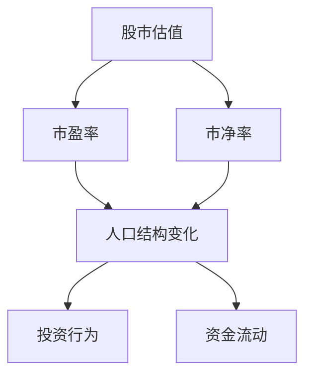
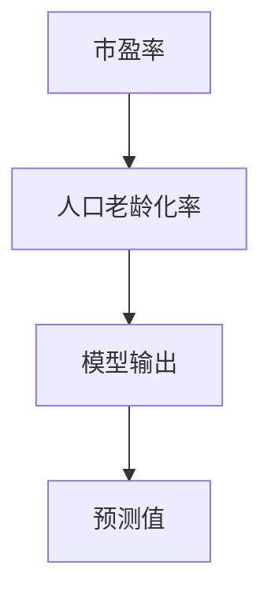
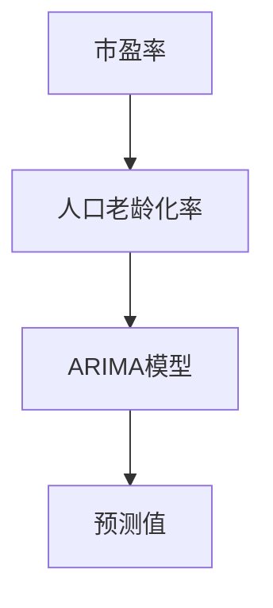
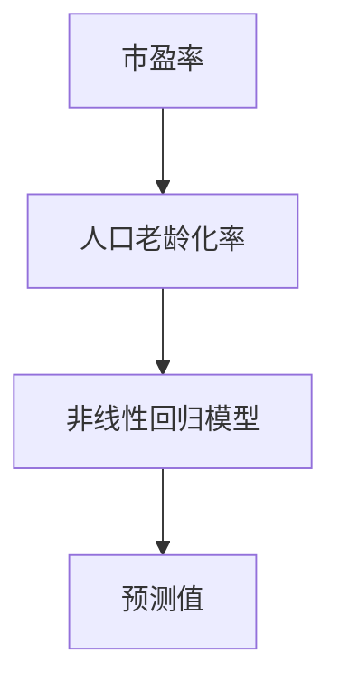
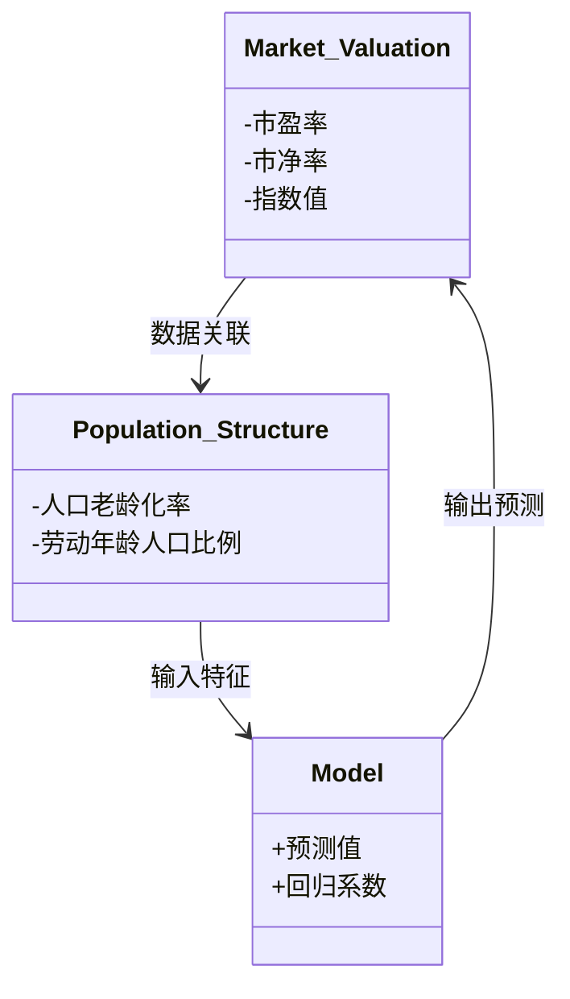

                 


# 全球股市估值与人口结构变化的关系

> 关键词：全球股市估值，人口结构变化，投资行为，数学模型，实证分析

> 摘要：本文探讨全球股市估值与人口结构变化之间的关系。通过分析不同年龄段人口的投资行为、主要经济体的案例以及数学模型的应用，揭示人口结构变化对股市估值的影响机制。文章结合理论分析与实证研究，提供深入的见解和实践指导。

---

## 第1章: 背景介绍与核心概念

### 1.1 问题背景与问题描述

#### 1.1.1 全球股市估值的波动性分析
股市估值的波动性是投资者和经济学家关注的核心问题之一。股市估值受多种因素影响，包括经济指标、政策变化、企业盈利能力和市场情绪等。然而，近年来，人口结构的变化逐渐成为影响股市估值的重要因素。

#### 1.1.2 人口结构变化的全球趋势
全球人口结构正在经历显著变化。发达国家的老龄化问题日益严重，而发展中国家则面临人口红利逐渐消失的挑战。这些变化不仅影响社会经济结构，也对金融市场产生深远影响。

#### 1.1.3 问题解决：股市估值与人口结构变化的关系
本文旨在探讨人口结构变化如何影响股市估值。通过分析不同年龄段人口的投资行为、资金流动趋势以及对经济政策的影响，揭示人口结构与股市估值之间的内在联系。

#### 1.1.4 问题的边界与外延
本文的研究范围限定在宏观层面，重点关注人口结构变化对股市整体估值的影响，不涉及微观层面的个体投资决策。同时，本文主要分析发达国家和发展中国家的案例，不涵盖所有国家和地区。

#### 1.1.5 核心概念结构与组成要素
- 股市估值：反映市场整体价值的指标，如市盈率、市净率等。
- 人口结构变化：指人口年龄分布的变化，包括劳动年龄人口比例的变化、老龄化程度的变化等。
- 投资行为：不同年龄段人口在金融市场中的投资偏好和行为模式。

### 1.2 核心概念与联系

#### 1.2.1 股市估值的核心原理
股市估值是市场参与者对上市公司价值的集体判断。市盈率（P/E）和市净率（P/B）是常用的估值指标，反映了市场对未来的预期和风险偏好。

#### 1.2.2 人口结构变化的驱动因素
- 自然因素：出生率、死亡率和平均寿命的变化。
- 经济因素：经济发展水平、就业机会和收入水平影响人口结构。
- 政策因素：人口政策、退休政策和社保制度对人口结构有重要影响。

#### 1.2.3 股市估值与人口结构变化的关系模型
通过构建概念模型，将人口结构变化与股市估值的关键指标联系起来。图1展示了核心概念之间的关系。



#### 1.2.4 核心概念属性特征对比表

| 概念       | 特性         | 描述                                                                 |
|------------|--------------|----------------------------------------------------------------------|
| 股市估值    | 波动性       | 易受市场情绪、政策变化等因素影响                                         |
| 人口结构变化| 长期性       | 受出生率、死亡率和经济发展水平长期影响                                   |
| 投资行为    | 多样性       | 不同年龄段人口的投资行为差异较大                                         |

#### 1.2.5 ER实体关系图（Mermaid流程图）

```mermaid
erd
    A[股市估值] -[market_valuation]>-> B[市盈率]
    B -[influence]>-> C[人口结构变化]
    C -[age_distribution]>-> D[投资行为]
    D -[investment_patterns]>-> E[资金流动]
```

---

## 第2章: 人口结构变化与投资行为分析

### 2.1 不同年龄段人口的投资行为差异

#### 2.1.1 青年群体的投资偏好
年轻人通常风险承受能力较强，倾向于投资高增长的股票或新兴行业。然而，由于缺乏投资经验，他们的决策可能受市场情绪影响较大。

#### 2.1.2 中年群体的投资策略
中年人通常更加保守，倾向于稳健的投资方式，如指数基金或蓝筹股。他们注重资产配置和风险分散，以实现长期财务目标。

#### 2.1.3 老年群体的投资倾向
老年人通常风险厌恶，倾向于低风险、高流动性资产，如债券、货币市场基金。他们的投资行为受到退休计划和生活支出需求的影响。

### 2.2 人口结构变化对股市资金流动的影响

#### 2.2.1 劳动力人口与股市资金供给
劳动年龄人口比例的变化直接影响股市的资金供给。随着劳动人口比例下降，可投资资金减少，可能导致股市估值下降。

#### 2.2.2 老龄化对股市资金需求的影响
老龄化社会中，老年人口比例增加，他们对资金的需求上升，可能减少可用于投资的资金，进一步压低股市估值。

#### 2.2.3 人口红利消失对股市的长期影响
人口红利消失意味着劳动年龄人口比例下降，这可能导致股市整体资金供给减少，从而影响股市估值。

---

## 第3章: 全球主要经济体的案例分析

### 3.1 美国：老龄化与股市估值的关系

#### 3.1.1 美国人口结构现状
美国正面临老龄化问题，65岁以上人口比例持续上升。这一趋势影响了股市的资金供给和需求。

#### 3.1.2 美国股市估值的历史波动
标普500指数的历史波动显示，老龄化对股市估值的影响复杂。尽管老龄化可能导致资金供给减少，但技术创新和企业盈利仍支撑股市表现。

#### 3.1.3 人口老龄化对美国股市的影响
老龄化可能导致长期资金供给减少，但短期来看，技术创新和政策支持仍能维持股市估值的稳定。

### 3.2 日本：老龄化对股市的长期抑制效应

#### 3.2.1 日本人口结构特征
日本是全球老龄化最严重的国家之一，劳动年龄人口比例持续下降。

#### 3.2.2 日本股市估值的历史表现
日本股市长期低迷，部分原因在于老龄化导致的资金供给减少和投资者信心下降。

#### 3.2.3 人口结构对日本股市的特殊影响
老龄化导致的低增长预期和资金短缺，对日本股市估值形成长期抑制效应。

### 3.3 中国：人口红利与股市估值的双重影响

#### 3.3.1 中国人口结构现状
中国正经历人口红利逐渐消失的过程，劳动年龄人口比例开始下降。

#### 3.3.2 中国股市估值的区域差异
中国股市表现受政策、经济结构和区域发展不平衡的影响，不同地区的股市估值差异显著。

#### 3.3.3 人口结构变化对中国经济转型的影响
人口红利消失促使中国经济向高质量发展转型，技术创新和产业升级成为经济增长的新动力，这对股市估值产生深远影响。

---

## 第4章: 数学模型与实证分析

### 4.1 数据收集与处理

#### 4.1.1 数据来源与清洗
数据来源包括全球股市指数、各国人口统计数据、宏观经济指标等。清洗过程包括去除缺失值、异常值和重复数据。

#### 4.1.2 数据标准化与特征提取
对数据进行标准化处理，提取关键特征，如市盈率、人口老龄化率、GDP增长率等。

#### 4.1.3 数据集划分与验证
将数据划分为训练集和验证集，采用交叉验证方法评估模型性能。

### 4.2 模型建立与验证

#### 4.2.1 线性回归模型（Mermaid流程图）



#### 4.2.2 时间序列模型（Mermaid流程图）



#### 4.2.3 非线性回归模型（Mermaid流程图）



### 4.3 模型实现与代码示例

#### 4.3.1 Python代码实现

```python
import pandas as pd
import numpy as np
from sklearn.linear_model import LinearRegression
from sklearn.metrics import mean_squared_error

# 数据加载
data = pd.read_csv('market_valuation.csv')

# 特征提取
X = data[['population_aging_rate', 'GDP_growth_rate']]
y = data['P/E_ratio']

# 模型训练
model = LinearRegression()
model.fit(X, y)

# 预测与评估
y_pred = model.predict(X)
print('均方误差:', mean_squared_error(y, y_pred))
print('回归系数:', model.coef_)
```

#### 4.3.2 数据分析与结果解读
通过回归分析，我们发现人口老龄化率与市盈率呈现显著负相关关系。即，老龄化程度越高，市盈率越低。

#### 4.3.3 模型优缺点分析
线性回归模型简单易懂，但可能无法捕捉非线性关系。非线性回归模型或时间序列模型在复杂场景下表现更好。

---

## 第5章: 实证分析与结果解读

### 5.1 模型在不同国家的适用性分析

#### 5.1.1 美国：模型表现较好，解释了部分股市波动
#### 5.1.2 日本：模型解释力较弱，可能与经济结构特殊性有关
#### 5.1.3 中国：模型在区域层面表现较好，但全国层面解释力有限

### 5.2 模型改进与优化

#### 5.2.1 引入更多特征变量
考虑引入更多变量，如技术创新指数、政策支持力度等，以提高模型解释力。

#### 5.2.2 采用更复杂的模型
尝试使用随机森林、神经网络等机器学习模型，以捕捉复杂关系。

#### 5.2.3 动态调整模型参数
根据市场变化动态调整模型参数，提高预测精度。

### 5.3 结果解读与实际应用

#### 5.3.1 投资者决策支持
模型可以帮助投资者预测未来股市走势，优化投资组合。

#### 5.3.2 政策制定参考
政府可以根据模型结果制定人口政策和经济政策，缓解老龄化带来的负面影响。

---

## 第6章: 系统分析与架构设计

### 6.1 问题场景介绍

#### 6.1.1 数据收集与处理
- 数据来源：全球股市数据、人口统计数据
- 数据清洗：去除缺失值、异常值
- 数据预处理：标准化、特征提取

#### 6.1.2 系统功能设计



#### 6.1.3 系统架构设计

```mermaid
container 系统架构 {
    component 数据采集模块 {
        -数据接口
        -数据清洗
    }
    component 模型构建模块 {
        -特征提取
        -模型训练
    }
    component 结果展示模块 {
        -可视化界面
        -结果解读
    }
}
```

### 6.2 项目实战

#### 6.2.1 环境安装

```bash
pip install pandas numpy scikit-learn
```

#### 6.2.2 核心实现代码

```python
import pandas as pd
import numpy as np
from sklearn.linear_model import LinearRegression
from sklearn.metrics import mean_squared_error

# 数据加载
data = pd.read_csv('market_valuation.csv')

# 特征提取
X = data[['population_aging_rate', 'GDP_growth_rate']]
y = data['P/E_ratio']

# 模型训练
model = LinearRegression()
model.fit(X, y)

# 预测与评估
y_pred = model.predict(X)
print('均方误差:', mean_squared_error(y, y_pred))
print('回归系数:', model.coef_)
```

---

## 第7章: 总结与展望

### 7.1 关键点总结

- 人口结构变化是影响股市估值的重要因素。
- 不同年龄段人口的投资行为差异显著，需综合考虑。
- 数学模型在实证分析中具有重要作用，但需动态调整。

### 7.2 最佳实践 Tips

- 投资者应关注人口结构变化，优化投资组合。
- 政府需制定有效政策，应对老龄化挑战。
- 模型需结合实际情况，动态调整参数。

### 7.3 展望与建议

- 进一步研究更多变量对股市估值的影响。
- 开发更复杂的模型，捕捉非线性关系。
- 提高数据质量，优化模型性能。

---

## 作者：AI天才研究院/AI Genius Institute & 禅与计算机程序设计艺术 /Zen And The Art of Computer Programming

---

**本文由AI天才研究院原创，转载请注明出处。**

