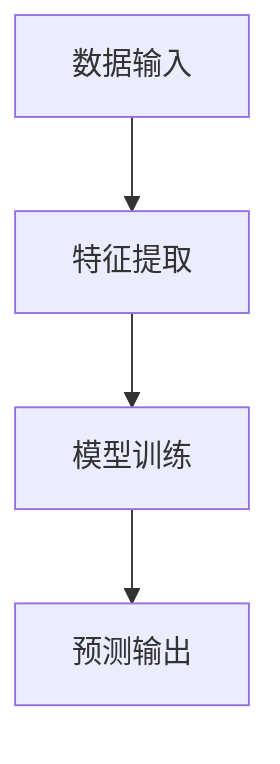
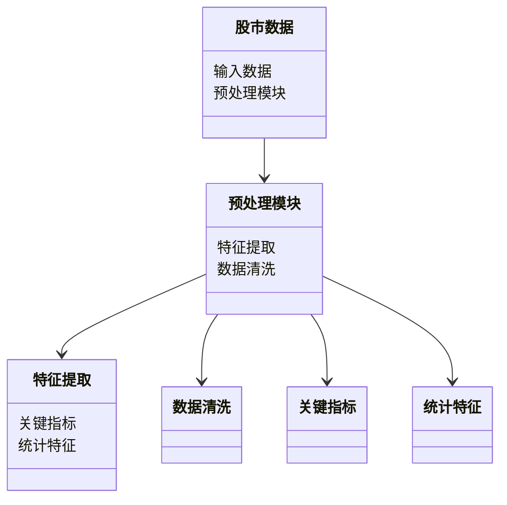
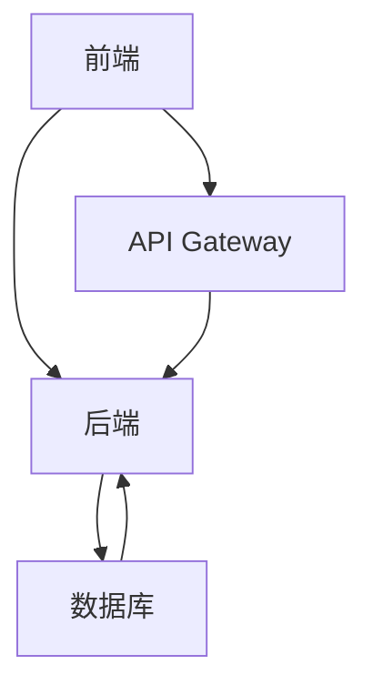
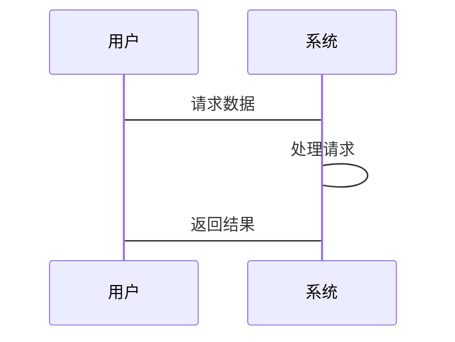

                 


# 全球股市估值与人工智能决策透明度的关联

## 关键词：全球股市估值，人工智能，决策透明度，机器学习，股票分析

## 摘要：本文探讨了人工智能在股市估值中的应用，以及决策透明度对投资决策的影响。通过分析机器学习算法、自然语言处理和强化学习等技术，本文揭示了如何提高AI在金融领域的透明度，从而增强投资者信心和决策能力。

## 第3章: 人工智能算法原理与数学模型

### 3.1 机器学习算法与股市估值

#### 3.1.1 线性回归模型
$$ y = \beta_0 + \beta_1x + \epsilon $$
线性回归是最简单的机器学习模型，用于预测股票价格的线性趋势。通过最小二乘法优化参数，可以得到最佳拟合直线。

#### 3.1.2 支持向量机
支持向量机通过构建超平面将数据点分类，应用于股票涨跌预测。通过拉格朗日乘数法优化目标函数，最大化分类间隔。

#### 3.1.3 随机森林
随机森林通过集成多个决策树模型，提高预测准确性和鲁棒性。特征重要性分析帮助识别影响股价的关键因素。

### 3.2 神经网络与深度学习

#### 3.2.1 多层感知机
$$ a^{(l+1)} = \sigma(w^{(l)}a^{(l)} + b^{(l)}) $$
多层感知机通过非线性激活函数，能够捕捉复杂的市场模式和非线性关系。

#### 3.2.2 卷积神经网络
CNN用于时间序列分析，提取股票价格的局部特征和时间依赖性，应用于趋势预测和市场波动分析。

### 3.3 算法流程图



### 3.4 数学模型与公式

#### 3.4.1 线性回归
股票价格预测公式：
$$ \hat{y} = \beta_0 + \beta_1x $$

#### 3.4.2 神经网络
损失函数：
$$ L = \frac{1}{n}\sum_{i=1}^{n}(y_i - \hat{y}_i)^2 $$
优化目标：
$$ \min_{\theta} L(\theta) $$

## 第4章: 系统分析与架构设计方案

### 4.1 问题场景介绍

#### 4.1.1 股市数据获取与预处理
从多个数据源获取股票数据，清洗缺失值，标准化处理，特征工程提取关键指标。

#### 4.1.2 模型训练与部署
构建机器学习模型，训练参数，部署到生产环境，实时接收数据并输出预测结果。

#### 4.1.3 透明度验证与优化
通过可解释性技术分析模型决策过程，优化模型结构，提升决策透明度。

### 4.2 系统功能设计



### 4.3 系统架构设计



### 4.4 接口设计与交互流程



## 4.5 项目实战

### 4.5.1 环境搭建

```bash
pip install numpy pandas scikit-learn
```

### 4.5.2 核心实现

```python
from sklearn.model import LinearRegression
import pandas as pd

data = pd.read_csv('stock_data.csv')
X = data[['开盘价', '收盘价', '最高价', '最低价']]
y = data['预测价格']
model = LinearRegression()
model.fit(X, y)
print(model.score(X, y))
```

### 4.5.3 实例分析

通过数据预处理和特征工程，提取关键市场指标，构建预测模型，分析模型的预测准确性和可解释性，优化模型结构，提升透明度。

### 4.5.4 项目小结

通过系统化的方法和工具，实现高效的股市估值模型，提升决策透明度，增强投资者信心。

## 4.6 最佳实践

### 4.6.1 Tips

- 定期更新模型参数，确保模型的有效性。
- 通过可视化工具分析数据分布和模型性能。
- 采用可解释性技术，如SHAP值，分析模型决策过程。

### 4.6.2 小结

本文详细介绍了人工智能在股市估值中的应用，通过分析算法原理和系统设计，揭示了如何提高决策透明度。未来将继续探索更复杂的模型结构，如图神经网络和强化学习，进一步提升股市估值的准确性。

### 4.6.3 注意事项

- 数据隐私和安全问题需要严格控制。
- 模型的可解释性需要与准确性相结合。
- 定期监控模型性能，及时优化和调整。

### 4.6.4 拓展阅读

建议阅读相关技术文献，深入理解可解释性AI（XAI）方法，探索在金融领域的更多应用场景。

## 作者：AI天才研究院/AI Genius Institute & 禅与计算机程序设计艺术 /Zen And The Art of Computer Programming

