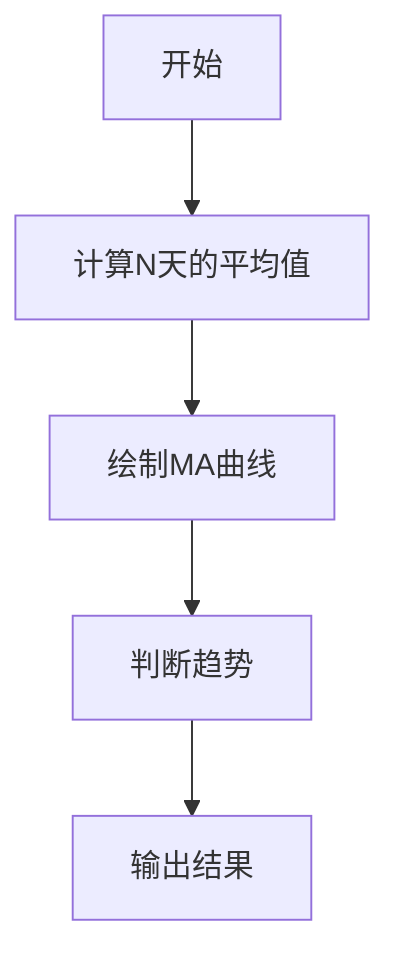
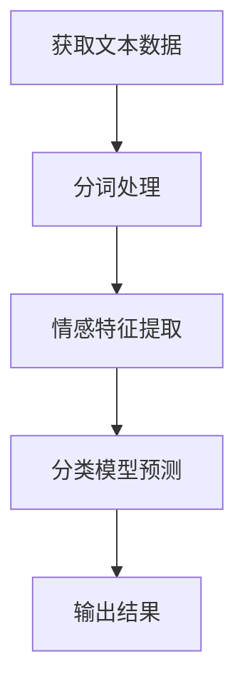
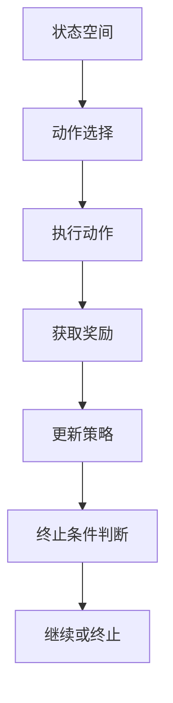
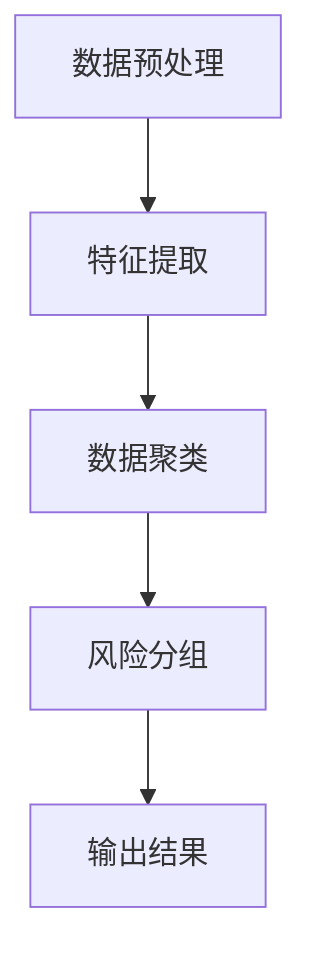
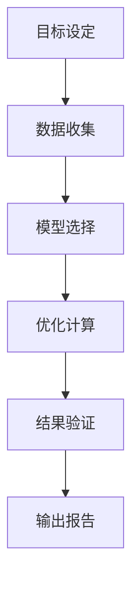
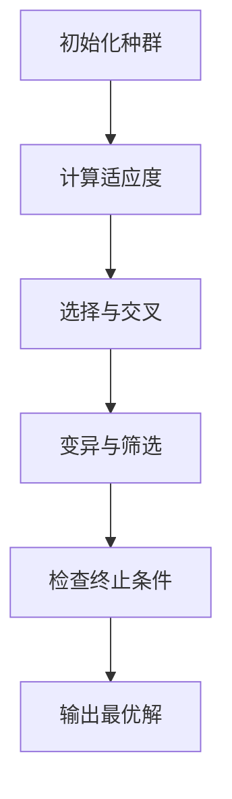
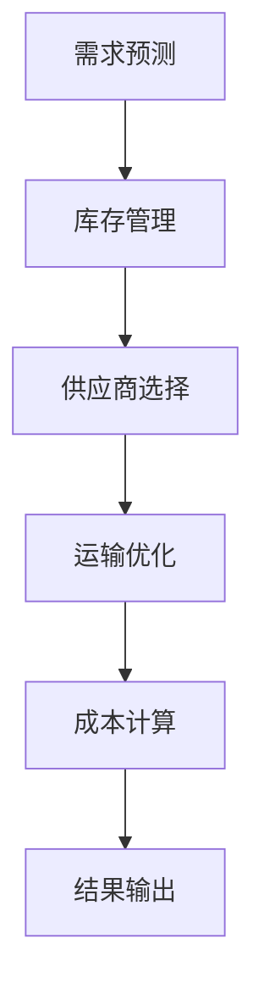

                 


# 全球股市估值与人工智能在供应链优化中的应用

## 关键词：全球股市估值，人工智能，供应链优化，机器学习，数学模型，系统架构，项目实战

## 摘要

在全球金融市场中，股市估值是投资者和分析师关注的核心问题之一。随着人工智能技术的飞速发展，其在股市估值和供应链优化中的应用越来越广泛。本文旨在探讨人工智能如何通过机器学习、自然语言处理和强化学习等技术，提升股市估值的准确性和效率，同时分析人工智能在供应链优化中的应用，如需求预测、库存管理和路径优化。通过结合实际案例和系统架构设计，本文将深入解析人工智能在这些领域的核心原理和最佳实践，为读者提供理论与实践相结合的深度分析。

---

## 第1章：全球股市估值的背景与基础

### 1.1 股市估值的基本概念

股市估值是通过对公司财务数据和市场环境的分析，评估其股票的内在价值。其核心目标是帮助投资者做出科学的投资决策。股市估值的基本要素包括公司财务状况、行业地位、市场环境和宏观经济因素等。

#### 核心概念对比

| 概念 | 定义 | 作用 |
|------|------|------|
| 市盈率（P/E） | 每股市价 / 每股收益 | 评估股票价格是否合理 |
| 市净率（P/B） | 每股市价 / 每股净资产 | 评估股票相对于账面价值的高低 |
| 股息率 | 每股股息 / 每股市价 | 评估股票的分红能力 |

### 1.2 股市估值的关键指标

#### 移动平均线（MA）的技术分析



### 1.3 股市估值的技术分析基础

技术分析通过研究历史价格数据，预测未来的价格走势。常用的技术指标包括移动平均线（MA）和相对强弱指数（RSI）。

#### 相对强弱指数（RSI）的计算

$$ RSI = \frac{\sum_{i=1}^{n} \text{上涨天数的收益}}{\sum_{i=1}^{n} (\text{上涨天数的收益} + \text{下跌天数的收益})} \times 100 $$

---

## 第2章：人工智能在股市估值中的应用

### 2.1 人工智能在股市预测中的应用

#### 机器学习模型实现

```python
import pandas as pd
from sklearn.linear_model import LinearRegression

# 示例数据
data = pd.DataFrame({
    'price': [10, 15, 20, 25, 30],
    'volume': [100, 200, 300, 400, 500]
})

# 训练模型
model = LinearRegression()
model.fit(data[['volume']], data['price'])

# 预测
predicted_price = model.predict([[600]])
print(predicted_price)
```

### 2.2 基于NLP的情感分析

#### 情感分析流程图



### 2.3 强化学习在股市交易中的应用

#### 强化学习流程图



---

## 第3章：人工智能在风险评估与投资组合优化中的应用

### 3.1 风险评估的基本原理

#### 风险评估模型对比

| 指标 | 定义 | 应用 |
|------|------|------|
| VaR | 在一定置信水平下，可能的损失 | 评估投资组合的风险 |
| CVaR | 在VaR基础上的平均损失 | 更加稳健的风险度量 |

### 3.2 基于机器学习的风险评估模型

#### 聚类分析流程图



### 3.3 投资组合优化的理论与实践

#### 投资组合优化流程图



---

## 第4章：人工智能在供应链优化中的应用

### 4.1 供应链优化的背景与基础

#### 供应链优化的目标

- **降低成本**：优化库存、运输和生产成本。
- **提高效率**：缩短交货时间，提高资源利用率。
- **增强灵活性**：适应市场变化和客户需求。

### 4.2 供应链优化的数学模型

#### 线性规划模型

$$ \text{目标函数} = \sum_{i=1}^{n} c_i x_i $$
$$ \text{约束条件} = \sum_{i=1}^{n} a_i x_i \leq b $$

### 4.3 人工智能在供应链优化中的应用

#### 遗传算法优化流程图



---

## 第5章：综合分析与项目实战

### 5.1 综合分析

#### 数据融合与跨领域优化

- **数据融合**：整合股市数据和供应链数据，构建综合分析模型。
- **跨领域优化**：通过协同优化，提升整体效率和风险控制能力。

### 5.2 项目实战

#### 供应链优化系统架构



---

## 第6章：总结与展望

### 6.1 总结

人工智能在股市估值和供应链优化中的应用，不仅提高了效率，还提升了决策的准确性。通过机器学习、NLP和强化学习等技术，投资者和企业能够更好地应对复杂市场环境中的挑战。

### 6.2 展望

未来，随着AI技术的不断进步，其在金融和供应链领域的应用将更加广泛和深入。结合大数据和云计算，人工智能将为投资者和企业提供更强大的工具和解决方案。

---

## 作者：AI天才研究院 & 禅与计算机程序设计艺术

---

通过本文的系统分析和详细讲解，读者可以深入了解人工智能在全球股市估值和供应链优化中的应用，并通过实际案例和系统架构设计，掌握相关技术的核心原理和最佳实践。

