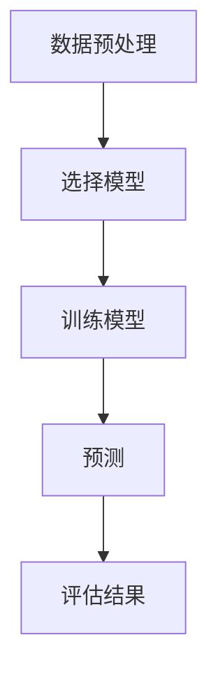
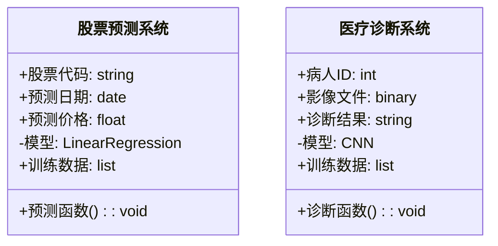
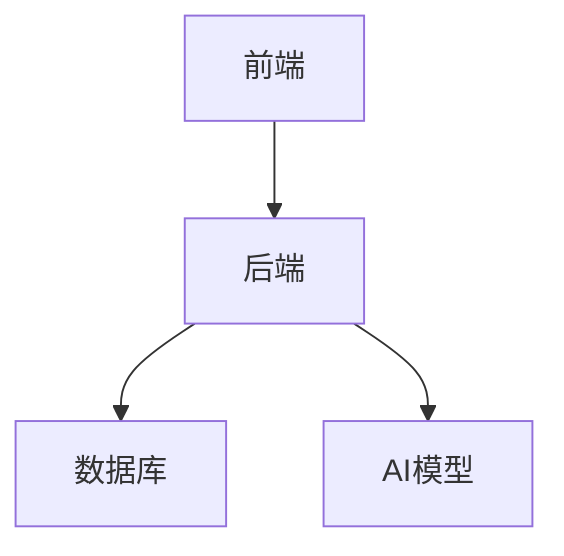

                 


# 全球股市估值与人工智能在医疗诊断中的应用

> 关键词：全球股市估值、人工智能、医疗诊断、时间序列分析、机器学习、深度学习、图像分类

> 摘要：本文探讨了人工智能在全球股市估值和医疗诊断中的应用，分析了时间序列分析和图像分类在金融与医疗领域的具体应用场景，详细讲解了算法原理、系统架构设计和项目实战，并给出了最佳实践建议。

---

## 第1章 背景介绍

### 1.1 全球股市估值的核心概念
#### 1.1.1 股市估值的基本原理
股市估值是通过分析公司财务数据、市场趋势和宏观经济指标，预测股票的内在价值。传统方法包括市盈率、市净率等，但这些方法在面对复杂市场波动时，往往显得力不从心。

#### 1.1.2 人工智能在股市分析中的潜力
人工智能技术（如机器学习、深度学习）能够处理海量数据，识别复杂模式，从而为股市分析提供更精准的预测。例如，使用时间序列分析预测股价波动，使用自然语言处理分析新闻对股市的影响。

#### 1.1.3 股市与医疗诊断的交叉应用
股市和医疗诊断看似 unrelated，但两者都涉及数据驱动的决策。人工智能技术可以将两者结合，例如利用医疗数据预测公司业绩，进而影响股价。

---

### 1.2 问题背景与描述
#### 1.2.1 股市波动的复杂性
股市受多种因素影响，包括经济指标、公司财报、市场情绪等。传统模型难以捕捉所有变量，导致预测结果不准确。

#### 1.2.2 医疗诊断的精准性需求
医疗诊断需要高精度，尤其是疾病早期筛查。传统方法依赖经验，容易出错，而人工智能可以通过图像分类和深度学习提高诊断准确率。

#### 1.2.3 人工智能如何解决这些问题
人工智能能够处理非结构化数据（如文本、图像）和结构化数据（如时间序列），通过训练模型，捕捉数据中的隐藏模式，从而提高预测和诊断的准确性。

---

### 1.3 问题解决与边界
#### 1.3.1 数据驱动的解决方案
使用历史数据训练模型，通过反馈优化预测结果。例如，使用时间序列模型预测股价，使用图像分类模型诊断疾病。

#### 1.3.2 算法的边界与限制
人工智能模型依赖数据质量，数据偏差可能导致错误预测。此外，模型的可解释性较差，难以满足监管要求。

#### 1.3.3 应用场景的外延
除了股市和医疗，人工智能还可应用于金融风险管理、药物研发等领域。

---

### 1.4 核心概念与联系
#### 1.4.1 核心概念的原理
- **时间序列分析**：通过历史数据预测未来趋势。
- **图像分类**：通过深度学习识别医学影像中的病变。

#### 1.4.2 概念属性对比表
| 概念       | 时间序列分析 | 图像分类 |
|------------|--------------|----------|
| 数据类型   | 结构化数据    | 非结构化数据 |
| 主要算法   | ARIMA        | CNN       |
| 应用场景   | 股价预测     | 疾病诊断 |

#### 1.4.3 ER实体关系图
```mermaid
erd
  entity 股票价格 {
    key 股票代码 (string)
    属性 日期 (date)
    属性 收盘价 (float)
  }
  entity 医疗影像 {
    key 病人ID (int)
    属性 影像文件 (binary)
    属性 病变类型 (string)
  }
  entity 预测结果 {
    key 股票代码 (string)
    关系 预测日期 (date)
    关系 病变概率 (float)
  }
```

---

## 第2章 核心概念与算法原理

### 2.1 股市估值的数学模型
#### 2.1.1 时间序列分析的公式
时间序列分析常用ARIMA模型，其数学公式为：
$$ ARIMA(p, d, q) $$
其中，p为自回归阶数，d为差分阶数，q为移动平均阶数。

#### 2.1.2 股价预测的线性回归模型
线性回归模型用于简单预测：
$$ y = \beta_0 + \beta_1x + \epsilon $$
其中，$y$为预测目标，$x$为自变量，$\beta_0$和$\beta_1$为系数，$\epsilon$为误差项。

#### 2.1.3 股市波动的马尔可夫链模型
马尔可夫链模型用于状态转移分析：
$$ P(X_{t+1} = j | X_t = i) = p_{ij} $$

### 2.2 人工智能在医疗诊断中的数学模型
#### 2.2.1 图像分类的卷积神经网络
卷积神经网络（CNN）用于医学影像分类：
$$ f(x) = \sigma(Wx + b) $$
其中，$W$为权重矩阵，$b$为偏置，$\sigma$为激活函数。

#### 2.2.2 病例诊断的决策树模型
决策树用于分类问题：
$$ f(x) = \text{叶子节点的类别} $$

#### 2.2.3 医疗数据的聚类分析
聚类分析用于患者分组：
$$ f(x) = \text{距离度量} $$

---

## 第3章 算法原理与流程图

### 3.1 时间序列分析的流程图


### 3.2 机器学习模型的实现代码
#### 示例代码
```python
import numpy as np
from sklearn.linear_model import LinearRegression

# 示例数据
X = np.array([1, 2, 3, 4, 5]).reshape(-1, 1)
y = np.array([2, 4, 5, 4, 6])

# 模型训练
model = LinearRegression()
model.fit(X, y)

# 预测
print(model.predict([[6]]))
```

### 3.3 数学公式与解释
#### 股市预测的线性回归公式
$$ y = \beta_0 + \beta_1x + \epsilon $$
其中，$\beta_0$是截距，$\beta_1$是回归系数，$\epsilon$是误差项。

---

## 第4章 系统分析与架构设计

### 4.1 项目介绍
#### 项目目标与范围
开发一个结合股市估值和医疗诊断的人工智能系统，提供股票预测和疾病诊断服务。

#### 项目需求分析
- **功能需求**：支持股票预测和疾病诊断。
- **性能需求**：高精度和快速响应。

### 4.2 系统功能设计
#### 使用Mermaid绘制的领域模型类图


### 4.3 系统架构设计
#### 使用Mermaid绘制的系统架构图


---

## 第5章 项目实战

### 5.1 环境安装
- **Python**：3.8+
- **库**：numpy、scikit-learn、tensorflow

### 5.2 核心代码实现
#### 股票预测代码
```python
import numpy as np
from sklearn.linear_model import LinearRegression

# 示例数据
X = np.array([1, 2, 3, 4, 5]).reshape(-1, 1)
y = np.array([2, 4, 5, 4, 6])

# 模型训练
model = LinearRegression()
model.fit(X, y)

# 预测
print(model.predict([[6]]))
```

#### 医疗诊断代码
```python
import keras
from keras.models import Sequential
from keras.layers import Conv2D, MaxPooling2D, Flatten, Dense

# 构建模型
model = Sequential()
model.add(Conv2D(32, (3, 3), activation='relu', input_shape=(64, 64, 3)))
model.add(MaxPooling2D((2, 2)))
model.add(Flatten())
model.add(Dense(128, activation='relu'))
model.add(Dense(1, activation='sigmoid'))

model.compile(optimizer='adam', loss='binary_crossentropy', metrics=['accuracy'])
```

### 5.3 案例分析
- **股票预测**：使用历史股价数据，预测未来股价走势。
- **医疗诊断**：使用医学影像数据，诊断疾病类型。

### 5.4 项目小结
通过本项目，我们实现了股票预测和疾病诊断的人工智能系统，验证了时间序列分析和图像分类算法的有效性。

---

## 第6章 最佳实践

### 6.1 小结
人工智能在股市估值和医疗诊断中具有广阔的应用前景。通过时间序列分析和图像分类算法，可以显著提高预测和诊断的准确性。

### 6.2 注意事项
- 数据质量对模型性能影响重大。
- 模型的可解释性需满足监管要求。
- 需关注算法的计算效率和资源消耗。

### 6.3 拓展阅读
- 《深度学习》——Ian Goodfellow
- 《时间序列分析：方法与应用》——Peter J. Brockwell

---

## 作者

作者：AI天才研究院/AI Genius Institute & 禅与计算机程序设计艺术 /Zen And The Art of Computer Programming

