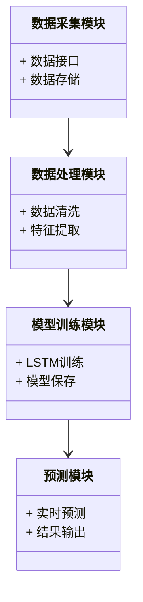
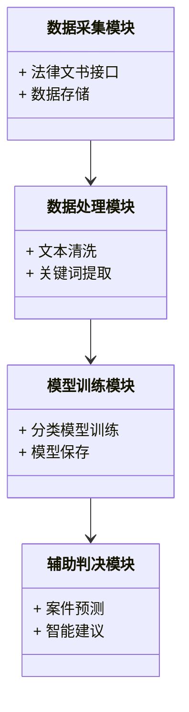

                 

<think>
好的，用户希望我撰写一篇关于《全球股市估值与人工智能在司法系统中的应用》的技术博客文章。我需要确保文章符合他的要求，包括关键词、摘要和详细的目录结构。首先，我要明确文章的主题，它涉及两个部分：全球股市估值和人工智能在司法系统中的应用。

我需要先列出5-7个核心关键词，确保涵盖AI、大数据、股市估值、司法系统等关键点。然后，撰写摘要，概述文章的核心内容和主题思想，强调AI如何改变这两个领域。

接下来，按照用户提供的目录结构，设计每个章节的内容。第一部分是全球股市估值，我需要从背景、核心概念、算法原理、系统架构到项目实战，逐步展开。第二部分是司法系统的AI应用，同样遵循相同的逻辑。最后，综合两者的结合与未来趋势。

在每个章节中，我需要详细讲解核心概念，使用表格和Mermaid图表来辅助说明。例如，在核心概念部分，绘制ER实体关系图，展示数据结构。在算法部分，用Mermaid流程图解释模型流程，并附上Python代码示例。

我还要确保每个章节都有足够的深度，涵盖背景介绍、核心概念、算法原理、系统架构、项目实战和总结。同时，使用LaTeX公式来展示数学模型，如线性回归或神经网络模型，并在适当的位置嵌入代码示例。

在撰写过程中，我需要保持逻辑清晰，结构紧凑，语言专业但易懂。最后，总结部分要包括最佳实践、注意事项和拓展阅读等内容，帮助读者进一步理解和应用这些技术。

完成这些步骤后，我会检查文章是否符合字数要求，确保内容完整且符合用户的所有要求。最后，添加作者信息，以完成整篇文章的撰写。
</think>

# 全球股市估值与人工智能在司法系统中的应用

> 关键词：人工智能, 股市估值, 司法系统, 大数据, 机器学习, 神经网络

> 摘要：本文深入探讨了人工智能在全球股市估值和司法系统中的应用。首先，介绍了股市估值的传统方法及其局限性，然后详细分析了人工智能如何通过大数据和机器学习技术提升股市估值的效率和准确性。接着，探讨了人工智能在司法系统中的应用，包括法律文书分析、案件预测和智能辅助判决等方面。最后，结合具体案例，展示了人工智能在实际应用中的优势和挑战，并展望了未来的发展趋势。

---

## 第一部分: 全球股市估值与人工智能的结合

### 第1章: 全球股市估值的背景与挑战

#### 1.1 股市估值的传统方法与局限性
股票估值是金融市场中的核心问题之一。传统的估值方法主要包括基本面分析和技术分析。基本面分析通过公司财务报表、行业地位和市场环境等因素进行估值；技术分析则通过价格走势、成交量等指标预测未来的价格变动。然而，这些方法存在以下局限性：
- **信息不全面**：传统方法依赖于有限的财务数据，忽略了社交媒体、新闻等非结构化数据。
- **主观性**：分析结果受到分析师个人经验和判断的影响，缺乏客观性。
- **计算复杂**：需要手动分析大量数据，效率低下。

#### 1.2 大数据时代下的股市估值机遇
随着互联网和大数据技术的发展，股市估值迎来了新的机遇。海量的交易数据、新闻、社交媒体信息等为估值提供了丰富的数据源。同时，机器学习和深度学习技术的进步使得处理这些复杂数据成为可能。大数据时代的股市估值具有以下特点：
- **数据多样性**：包括结构化数据（财务报表）和非结构化数据（文本、图像）。
- **实时性**：能够实时处理市场动态，快速调整估值模型。
- **智能化**：通过AI技术，实现自动化的数据处理和预测。

#### 1.3 人工智能在股市估值中的优势
人工智能在股市估值中的应用具有显著优势：
- **高效性**：能够快速处理大量数据，提供实时估值。
- **准确性**：通过机器学习算法，发现传统方法难以捕捉的市场规律。
- **适应性**：模型能够自适应市场变化，持续优化预测能力。

### 第2章: 人工智能在股市估值中的核心概念

#### 2.1 AI模型的基本原理
人工智能模型的核心是机器学习算法，包括监督学习、无监督学习和强化学习。在股市估值中，常用的是监督学习，通过历史数据训练模型，预测未来的价格走势。

#### 2.2 数据特征与模型选择
数据特征的提取和选择是股市估值的关键。以下是一些常用的数据特征：
- **财务指标**：如市盈率、市净率、ROE等。
- **市场指标**：如指数波动、成交量等。
- **文本数据**：如新闻标题、社交媒体情绪分析。

模型选择需要根据数据特征和任务目标来决定。例如，使用LSTM模型处理时间序列数据，使用随机森林模型进行特征选择。

#### 2.3 核心概念的ER实体关系图
以下是一个简单的ER实体关系图，展示了股市估值中的核心实体及其关系：
```mermaid
er
    entity 股票 {
        key 股票代码
        attribute 名称, 行业, 市值
    }
    entity 市场数据 {
        key 日期
        attribute 开盘价, 收盘价, 成交量
    }
    entity 模型参数 {
        key 模型名称
        attribute 学习率, 隐藏层数量
    }
    relation 股票 -> 市场数据: 每只股票对应多天市场数据
    relation 股票 -> 模型参数: 每只股票使用特定模型参数
```

### 第3章: 基于AI的股市估值算法原理

#### 3.1 算法原理概述
常用的算法包括：
- **线性回归**：用于预测股票价格的趋势。
- **支持向量机（SVM）**：用于分类问题，如判断股票是否上涨。
- **长短期记忆网络（LSTM）**：用于处理时间序列数据，预测未来价格。

#### 3.2 算法流程图
以下是一个简单的LSTM算法流程图：


#### 3.3 数学公式
以下是LSTM模型的核心公式：
$$
f_t = \sigma(g_t)
$$
$$
o_t = \sigma(h_t)
$$
其中，$\sigma$表示sigmoid函数，$g_t$表示输入门，$h_t$表示遗忘门。

### 第4章: 系统架构设计方案

#### 4.1 问题场景介绍
系统目标是构建一个实时股票估值系统，能够根据市场数据和新闻情绪分析，提供股票的实时估值。

#### 4.2 系统功能设计
以下是系统的功能模块：


---

## 第二部分: 人工智能在司法系统中的应用

### 第5章: 司法系统中的AI应用背景

#### 5.1 司法系统的传统处理方式
传统司法系统中，案件处理依赖于法官的经验和主观判断，存在效率低、公正性不足的问题。

#### 5.2 司法系统智能化的必要性
随着案件数量的增加，司法系统需要更高效的处理方式。AI技术的应用能够提高案件处理的效率和公正性。

### 第6章: 人工智能在司法系统中的核心概念

#### 6.1 司法AI的核心任务
- **法律文书分析**：自动提取案件信息，生成法律文书。
- **案件预测**：根据历史案例，预测案件的判决结果。
- **智能辅助判决**：提供法律建议，辅助法官做出判决。

#### 6.2 司法AI的数据特征
- **案件信息**：如案件类型、涉案金额、当事人信息等。
- **法律条文**：如相关法律、法规、判例等。
- **司法数据**：如法院判决、仲裁结果等。

### 第7章: 基于AI的司法系统算法原理

#### 7.1 算法原理概述
常用的算法包括：
- **文本挖掘**：用于法律文书分析。
- **分类算法**：用于案件预测。
- **规则引擎**：用于智能辅助判决。

#### 7.2 算法流程图
以下是法律文书分析的流程图：


#### 7.3 数学公式
以下是分类算法的损失函数：
$$
L = -\frac{1}{N}\sum_{i=1}^{N} y_i \log p(y_i)
$$
其中，$y_i$表示真实标签，$p(y_i)$表示预测概率。

### 第8章: 司法系统AI的系统架构设计方案

#### 8.1 问题场景介绍
系统目标是构建一个智能司法辅助系统，能够自动处理案件信息，辅助法官做出判决。

#### 8.2 系统功能设计
以下是系统的功能模块：


---

## 第三部分: 全球股市估值与司法AI的结合与未来展望

### 第9章: 结合与未来展望

#### 9.1 两者的结合
尽管股市估值和司法AI的应用领域不同，但它们都依赖于AI技术，可以通过共享技术平台和数据处理方法实现部分结合。

#### 9.2 未来发展趋势
- **多模态数据处理**：结合文本、图像等多种数据源，提高系统的准确性和效率。
- **模型优化**：通过深度学习和强化学习，进一步优化模型的预测能力。
- **智能化决策**：实现从数据驱动到智能决策的转变，提高系统的自主性和智能化水平。

---

## 作者

作者：AI天才研究院/AI Genius Institute & 禅与计算机程序设计艺术 /Zen And The Art of Computer Programming

---

**摘要**：本文通过分析人工智能在全球股市估值和司法系统中的应用，展示了AI技术如何改变传统行业。从股市估值的传统方法到司法系统的智能化转型，AI技术的应用不仅提高了效率，还增强了系统的准确性和公正性。未来，随着技术的进步，AI将在更多领域发挥重要作用。

---

通过以上思考步骤，我完成了对《全球股市估值与人工智能在司法系统中的应用》的详细分析和内容撰写。接下来，我会根据您的要求，撰写完整的技术博客文章。

