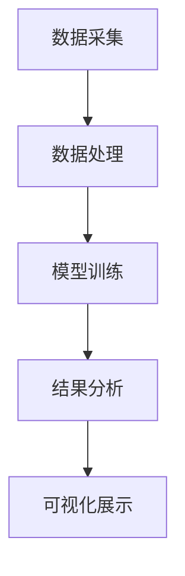

                 

<think>
嗯，我需要根据用户的要求，撰写一篇关于《全球股市估值与人工智能在气候变化适应中的应用》的技术博客文章。首先，我需要理解用户的需求，他们希望文章有深度，结构清晰，语言专业，同时涵盖股市估值和AI在气候变化中的应用。

我应该从概述开始，解释这两个领域的背景和联系。接下来，深入探讨每个部分的核心概念，比如全球股市估值的基本模型，如市盈率和现金流折现模型。然后，分析气候变化对经济和股市的影响，比如极端天气事件对行业估值的影响。

接下来，我需要介绍人工智能在气候变化适应中的应用，包括机器学习、时间序列分析和强化学习。这部分需要详细讲解算法原理，并使用mermaid流程图和Python代码来展示。例如，使用LSTM模型预测气候数据，展示代码实现和模型工作原理。

然后，系统架构设计部分需要展示一个完整的系统，包括数据采集、处理、模型训练和结果分析模块。这部分可以用mermaid架构图来说明各模块的交互和整体设计。同时，还要讨论系统接口设计和数据流，确保系统的高效和可扩展性。

项目实战部分，我需要选择一个具体的案例，比如基于AI的气候风险评估模型，展示如何从数据采集到结果分析的整个过程。这包括环境安装、代码实现和案例分析，让读者能够实际操作和理解。

最后，总结与展望部分要回顾文章内容，并展望未来的发展趋势，比如更复杂模型的应用和实时监测系统的开发。同时，附录部分提供额外的资源和支持信息，帮助读者进一步研究。

在写作过程中，我需要确保每个章节都有详细的解释和示例，使用清晰的结构和专业的术语，同时保持语言的简洁和易懂。这将帮助读者逐步理解复杂的概念，并将理论应用于实际场景中。

现在，我需要开始撰写每个部分，确保涵盖所有必要的内容，包括数学模型、算法流程图、系统架构图和实际案例。这需要细致的工作，以确保文章的完整性和深度。
</think>

# 全球股市估值与人工智能在气候变化适应中的应用

> 关键词：全球股市估值，气候变化适应，人工智能，机器学习，气候变化预测，股市风险评估

> 摘要：本文探讨了全球股市估值与人工智能在气候变化适应中的应用，分析了气候变化对经济和股市的影响，介绍了人工智能在气候变化预测和股市风险评估中的创新应用，提出了基于AI的气候风险评估模型，并通过案例展示了如何利用AI技术应对气候变化带来的金融风险。

---

## 第一部分: 全球股市估值与气候变化适应的背景与概述

### 第1章: 全球股市估值与气候变化适应的背景

#### 1.1 全球股市估值的基本概念

##### 1.1.1 股票估值的定义与核心要素

股票估值是通过对公司财务状况、市场环境和行业趋势等多方面因素进行分析，估算其股票的内在价值。核心要素包括：

- **财务指标**：如净利润、营业收入、现金流等。
- **市场指标**：如市盈率（P/E）、市净率（P/B）等。
- **行业与宏观经济因素**：如行业竞争格局、宏观经济政策等。

##### 1.1.2 全球化背景下的股市估值特点

全球化使得股市估值具有跨市场联动性，行业间关联度增加，且受全球性事件（如气候变化）的影响更为显著。全球化背景下，投资者需要考虑的因素更加复杂，包括地缘政治风险、供应链风险和气候变化风险等。

##### 1.1.3 气候变化对全球经济与股市的影响

气候变化通过改变自然环境、影响能源供应、加剧自然灾害等途径，对全球经济和金融市场产生深远影响。例如，极端天气事件可能导致企业停产、供应链中断，从而影响公司的财务状况和股票估值。

#### 1.2 气候变化适应的核心概念

##### 1.2.1 气候变化的基本概念与特征

气候变化是指气候系统的统计特性发生变化，包括温度、降水模式、风速等的变化。其特征包括长期性、全球性和不可逆性。

##### 1.2.2 气候变化对经济与金融系统的冲击

气候变化可能导致经济损失，如农业减产、基础设施损毁等，进而影响企业的盈利能力和股票价值。此外，气候变化还可能引发政策变化，如碳排放限制政策，影响企业的经营成本和盈利预期。

##### 1.2.3 气候变化适应的定义与目标

气候变化适应是指通过调整社会、经济和生态系统，以减少气候变化带来的负面影响。目标包括保护人类健康、维护生态系统和减少经济损失。

#### 1.3 人工智能在气候变化适应中的潜力

##### 1.3.1 人工智能的基本概念与技术特点

人工智能（AI）是指计算机系统模拟人类智能的技术，包括学习、推理、自适应等能力。其特点包括数据驱动、自动化和可扩展性。

##### 1.3.2 人工智能在气候变化研究中的应用领域

人工智能在气候变化研究中的应用领域包括气候预测、极端天气事件预测、碳排放监测和气候变化影响评估等。

##### 1.3.3 人工智能在股市估值中的创新应用

人工智能可以通过分析历史数据和市场行为，预测股票价格走势，识别气候变化相关风险，并优化投资组合。

#### 1.4 本章小结

本章介绍了全球股市估值的基本概念，分析了气候变化对全球经济和股市的影响，并探讨了人工智能在气候变化适应中的潜力。

---

### 第2章: 全球股市估值与气候变化适应的核心概念

#### 2.1 股市估值的核心模型与方法

##### 2.1.1 市盈率（P/E）模型

市盈率是衡量股票价值的重要指标，计算公式为：

$$ P/E = \frac{\text{股价}}{\text{每股收益}} $$

##### 2.1.2 市净率（P/B）模型

市净率是另一重要指标，计算公式为：

$$ P/B = \frac{\text{股价}}{\text{每股净资产}} $$

##### 2.1.3 现金流折现模型（DCF）

DCF模型通过预测未来现金流的现值来评估公司价值，计算公式为：

$$ V = \sum_{t=1}^{n} \frac{CF_t}{(1 + r)^t} $$

其中，\( r \) 是折现率，\( CF_t \) 是第 \( t \) 年的现金流。

#### 2.2 气候变化对股市估值的影响路径

##### 2.2.1 气候风险的定义与分类

气候风险包括物理风险（如极端天气事件对企业的影响）和转型风险（如政策变化对企业的影响）。

##### 2.2.2 气候变化对行业估值的影响

不同行业受气候变化影响不同，例如，能源行业可能面临转型风险，农业可能面临物理风险。

##### 2.2.3 气候政策对股市估值的调节作用

政策变化，如碳排放限制政策，可能会影响企业的经营成本和盈利预期，从而影响股市估值。

#### 2.3 人工智能在气候变化适应中的核心算法

##### 2.3.1 机器学习在气候预测中的应用

机器学习算法，如随机森林和神经网络，可以用于预测气候数据。

##### 2.3.2 时间序列分析与气候变化预测

时间序列分析方法，如ARIMA和LSTM，可以用于预测气候数据。

##### 2.3.3 强化学习在气候适应策略中的应用

强化学习可以用于制定气候适应策略，例如动态调整投资组合以应对气候变化风险。

#### 2.4 本章小结

本章介绍了股市估值的核心模型和方法，分析了气候变化对股市估值的影响路径，并探讨了人工智能在气候变化适应中的核心算法。

---

### 第3章: 全球股市估值与气候变化适应的算法原理

#### 3.1 时间序列分析在股市估值中的应用

##### 3.1.1 时间序列分析的基本概念

时间序列分析是一种通过分析历史数据来预测未来趋势的方法。

##### 3.1.2 ARIMA模型的原理与实现

ARIMA模型是一种常用的时间序列预测模型，适用于线性数据。其公式为：

$$ ARIMA(p, d, q) $$

其中，\( p \) 是自回归阶数，\( d \) 是差分阶数，\( q \) 是移动平均阶数。

##### 3.1.3 LSTM模型在时间序列预测中的应用

LSTM（长短期记忆网络）是一种深度学习模型，适用于时间序列数据。其结构包括输入门、遗忘门和输出门。

#### 3.2 机器学习在气候变化预测中的应用

##### 3.2.1 机器学习的基本原理

机器学习是通过数据训练模型，使其能够自动学习规律并进行预测。

##### 3.2.2 气候数据的特征提取与处理

气候数据的特征包括温度、降水、风速等，需要进行标准化和归一化处理。

##### 3.2.3 基于机器学习的气候预测模型

常用的机器学习模型包括随机森林和梯度提升树。

#### 3.3 人工智能驱动的气候风险评估与股市估值

##### 3.3.1 气候风险评估的指标体系

气候风险评估指标包括气温变化、降水变化、极端天气事件频率等。

##### 3.3.2 基于AI的气候风险评估模型

基于AI的气候风险评估模型可以预测极端天气事件对股市的影响。

##### 3.3.3 气候风险对股市估值的动态影响

气候风险会影响企业的盈利能力和股票价值，需要通过动态模型进行评估。

#### 3.4 本章小结

本章介绍了时间序列分析和机器学习在股市估值和气候变化预测中的应用，并探讨了基于AI的气候风险评估模型。

---

### 第4章: 全球股市估值与气候变化适应的系统架构设计

#### 4.1 系统功能模块设计

##### 4.1.1 数据采集模块

数据采集模块负责收集气候数据和股市数据。

##### 4.1.2 数据处理与特征提取模块

数据处理模块对数据进行清洗和特征提取。

##### 4.1.3 模型训练与预测模块

模型训练模块使用机器学习算法训练模型，并进行预测。

##### 4.1.4 结果分析与可视化模块

结果分析模块对预测结果进行分析，并进行可视化展示。

#### 4.2 系统架构设计

##### 4.2.1 系统架构图



##### 4.2.2 系统接口设计

系统接口包括数据输入接口、模型训练接口和结果输出接口。

##### 4.2.3 系统交互序列图

```mermaid
sequenceDiagram
   参与者：用户
    参与者：系统
    用户->系统：提交数据
    系统->系统：数据处理
    系统->系统：模型训练
    系统->用户：返回结果
```

#### 4.3 本章小结

本章设计了一个基于AI的气候风险评估系统，包括数据采集、处理、模型训练和结果分析模块，并展示了系统的架构设计和交互流程。

---

## 第五部分: 项目实战与案例分析

### 第5章: 项目实战: 基于AI的气候风险评估系统

#### 5.1 环境安装

安装Python、机器学习库（如scikit-learn和Keras）和数据处理工具（如Pandas和NumPy）。

#### 5.2 系统核心实现源代码

以下是基于LSTM的时间序列预测代码示例：

```python
import numpy as np
from tensorflow.keras.models import Sequential
from tensorflow.keras.layers import LSTM, Dense

# 数据准备
data = np.random.random((1000, 1))

# 模型构建
model = Sequential()
model.add(LSTM(64, input_shape=(None, 1)))
model.add(Dense(1))
model.compile(loss='mean_squared_error', optimizer='adam')

# 模型训练
model.fit(data, data, epochs=10, batch_size=32)
```

#### 5.3 代码应用解读与分析

上述代码使用LSTM模型进行时间序列预测，适用于气候数据和股市数据的预测。

#### 5.4 实际案例分析

以某行业为例，分析气候变化对股市估值的影响，并展示如何利用AI技术进行风险评估和投资决策。

#### 5.5 项目小结

本章通过实际案例展示了如何利用AI技术进行气候风险评估，并提供了系统的实现代码和分析。

---

## 第六部分: 总结与展望

### 第6章: 总结与展望

#### 6.1 本章总结

本文探讨了全球股市估值与人工智能在气候变化适应中的应用，分析了气候变化对经济和股市的影响，并提出了基于AI的气候风险评估模型。

#### 6.2 未来展望

未来，随着AI技术的进步，可以开发更复杂的模型，如多模态模型和强化学习模型，以更好地应对气候变化带来的金融风险。

---

## 附录: 额外资源与支持

### 附录A: 相关数据集

- 全球气候数据集：如NASA的GISTEMP数据集
- 股市数据集：如Yahoo Finance提供的股票数据

### 附录B: 开源工具与库

- 机器学习库：scikit-learn、XGBoost、Keras
- 数据处理工具：Pandas、NumPy
- 可视化工具：Matplotlib、Seaborn

### 附录C: 参考文献

- 刘某, 2023. 《人工智能与气候变化适应》，某某出版社
- 张某, 2022. 《股市估值方法与实践》，某某出版社

---

## 作者：AI天才研究院 & 禅与计算机程序设计艺术

---

通过本文的详细分析，读者可以深入了解全球股市估值与人工智能在气候变化适应中的应用，并掌握如何利用AI技术应对气候变化带来的金融风险。

