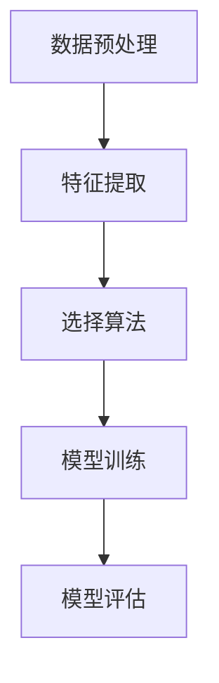

                 

<think>
好的，我需要根据用户的要求，逐步完成《全球股市估值与人工智能在海洋资源管理中的应用》的目录大纲。首先，我需要理解这本书的主题，它涉及全球股市估值和人工智能在海洋资源管理中的应用。这两个看似不同的领域，但其实都与数据和决策密切相关，可以结合起来分析。

接下来，我需要按照用户提供的大纲结构来展开。首先，确定关键词和摘要，确保准确反映文章的核心内容。然后，按照章节逐步分析，每章包含必要的背景介绍、核心概念、算法原理、系统分析和项目实战等部分。

在分析过程中，我会使用清晰的逻辑结构，确保每一部分都有足够的细节，例如数学公式、流程图和系统架构图等。同时，要使用专业但易懂的语言，帮助读者理解复杂的概念。最后，总结和展望未来的发展方向，为读者提供全面的视角。

通过这样的思考过程，我可以系统地完成这本书的目录大纲，确保内容全面、结构合理、逻辑清晰。
</think>

# 《全球股市估值与人工智能在海洋资源管理中的应用》

## 关键词
- 全球股市估值
- 人工智能
- 海洋资源管理
- 时间序列分析
- 机器学习

## 摘要
本文深入探讨了全球股市估值的核心概念、数学模型以及人工智能在海洋资源管理中的创新应用。通过分析股市估值的多种方法和影响因素，结合时间序列分析和机器学习算法，展示了AI如何优化海洋资源管理。文章还详细介绍了AI在资源监测、环境评估和决策支持中的具体应用，结合实际案例，总结了AI技术在金融与资源管理领域的最佳实践和未来发展方向。

## 第一部分：全球股市估值基础

### 第1章：全球股市估值概述

#### 1.1 股市估值的基本概念
- **1.1.1 股市估值的定义**  
  股市估值是通过分析公司财务数据、市场环境和宏观经济指标，估算股票内在价值的过程。
  
- **1.1.2 股市估值的核心要素**  
  包括公司的盈利能力、成长性、财务健康状况、行业地位以及整体市场环境等。

- **1.1.3 股市估值的分类与特点**  
  主要分为相对估值和绝对估值，相对估值基于可比公司，绝对估值基于现金流贴现法。

#### 1.2 股市估值的主要方法
- **1.2.1 市盈率（P/E）法**  
  $$ P/E = \frac{Price}{Earnings} $$

- **1.2.2 市净率（P/B）法**  
  $$ P/B = \frac{Price}{Book\ Value} $$

- **1.2.3 股息率法**  
  $$ Dividend\ Yield = \frac{Dividends}{Price} $$

- **1.2.4 内在价值法**  
  使用DCF模型计算公司未来现金流的现值。

#### 1.3 影响股市估值的主要因素
- **1.3.1 宏观经济因素**  
  包括GDP增长率、利率、通货膨胀率等。

- **1.3.2 行业因素**  
  行业周期、政策变化等对股票估值的影响。

- **1.3.3 公司基本面因素**  
  收益能力、资产负债状况、管理团队等。

- **1.3.4 市场情绪因素**  
  投资者情绪波动对股价的影响。

### 第2章：全球股市估值的数学模型与公式

#### 2.1 常用估值公式
- **市盈率公式**  
  $$ P/E = \frac{Price}{Earnings} $$

- **市净率公式**  
  $$ P/B = \frac{Price}{Book\ Value} $$

- **内在价值公式**  
  $$ Intrinsic\ Value = \frac{Cash\ Flow}{Discount\ Rate} $$

#### 2.2 时间序列分析模型
- **ARIMA模型**  
  适用于预测具有趋势和季节性的数据。
  
- **GARCH模型**  
  用于预测金融时间序列的波动性。

- **LSTM模型**  
  长短期记忆网络，适用于处理长序列依赖的数据。

#### 2.3 估值模型的优缺点对比
- **线性回归模型**  
  简单易懂，但可能无法捕捉复杂关系。

- **机器学习模型**  
  表现力强，但需要大量数据和计算资源。

## 第二部分：人工智能基础与算法原理

### 第3章：人工智能的基本概念

#### 3.1 人工智能的定义与特点
- **人工智能的定义**  
  AI是模拟人类智能的计算机系统。

- **人工智能的核心特点**  
  包括学习能力、推理能力、自适应能力等。

- **人工智能的应用领域**  
  金融、医疗、教育、交通等。

#### 3.2 机器学习与深度学习的区别
- **机器学习的定义与特点**  
  基于数据训练模型，做出预测或决策。

- **深度学习的定义与特点**  
  通过多层神经网络学习数据特征。

- **二者的区别与联系**  
  深度学习是机器学习的一种，适合处理高维数据。

### 第4章：人工智能的核心算法

#### 4.1 机器学习算法
- **线性回归**  
  $$ y = \beta_0 + \beta_1x + \epsilon $$

- **支持向量机（SVM）**  
  用于分类和回归问题。

- **随机森林**  
  通过集成多个决策树提高准确性。

#### 4.2 深度学习算法
- **卷积神经网络（CNN）**  
  适用于图像识别任务。

- **循环神经网络（RNN）**  
  适合处理序列数据。

- **Transformer模型**  
  基于自注意力机制，广泛应用于自然语言处理。

#### 4.3 算法流程图（Mermaid）


## 第三部分：人工智能在海洋资源管理中的应用

### 第5章：人工智能在海洋资源管理中的基础

#### 5.1 海洋资源管理的定义与目标
- **海洋资源管理的定义**  
  对海洋资源进行合理开发、利用和保护。

- **海洋资源管理的目标**  
  保护海洋生态，合理利用资源，促进可持续发展。

#### 5.2 人工智能在海洋资源管理中的作用
- **数据处理与分析**  
  处理海量海洋数据，提取有价值的信息。

- **预测与决策支持**  
  帮助制定科学的管理策略。

### 第6章：人工智能在海洋资源管理中的具体应用

#### 6.1 海洋环境监测
- **水质监测**  
  使用AI分析卫星图像，监测水质变化。

- **海洋生物监测**  
  利用图像识别技术，识别海洋生物种类和数量。

#### 6.2 海洋资源优化利用
- **渔业资源管理**  
  使用AI预测鱼类分布，优化捕捞策略。

- **海底资源勘探**  
  利用AI分析地质数据，寻找矿产资源。

#### 6.3 海洋生态保护
- **入侵物种检测**  
  使用AI识别和追踪入侵物种。

- **生态修复评估**  
  分析生态修复效果，优化修复方案。

## 第四部分：结合全球股市估值与人工智能在海洋资源管理中的应用

### 第7章：AI在股市与海洋资源管理中的协同作用

#### 7.1 数据驱动的股市预测
- **时间序列分析**  
  使用LSTM预测股价走势。

- **多因子模型**  
  结合多个因子进行综合预测。

#### 7.2 海洋资源风险管理
- **风险评估与预警**  
  使用AI识别潜在风险，提前采取措施。

- **资源分配优化**  
  基于AI分析，优化资源分配策略。

### 第8章：项目实战与案例分析

#### 8.1 项目背景与目标
- **项目背景**  
  结合股市估值与海洋资源管理，展示AI的应用价值。

#### 8.2 系统设计与实现
- **系统功能设计**  
  包括数据采集、分析、预测和可视化模块。

#### 8.3 核心代码实现
- **数据预处理代码**  
  ```python
  import pandas as pd
  data = pd.read_csv('stock_data.csv')
  ```

- **模型训练代码**  
  ```python
  model = LSTMModel(input_size=1, hidden_size=64)
  model.train(data)
  ```

#### 8.4 实际案例分析
- **案例分析1：股市预测**  
  使用AI模型预测某公司股价走势。

- **案例分析2：海洋资源监测**  
  利用AI识别海洋生物种类，优化资源管理。

## 第五部分：总结与展望

### 第9章：总结与最佳实践

#### 9.1 核心内容总结
- 全球股市估值的基本方法与AI的应用。
- 海洋资源管理中的AI技术及其优势。

#### 9.2 最佳实践 tips
- 数据质量的重要性。
- 模型选择与调优的技巧。
- 结合领域知识，提升模型效果。

### 第10章：未来展望与挑战

#### 10.1 未来发展方向
- 更多领域结合AI技术。
- 提高模型的解释性与透明度。

#### 10.2 挑战与解决方案
- 数据隐私与安全问题。
- 技术标准的统一与合作。

## 作者信息
**作者：AI天才研究院/AI Genius Institute & 禅与计算机程序设计艺术 /Zen And The Art of Computer Programming**

---

通过以上目录大纲，文章系统地介绍了全球股市估值和人工智能在海洋资源管理中的应用，结合理论与实践，为读者提供了全面的知识和见解。

