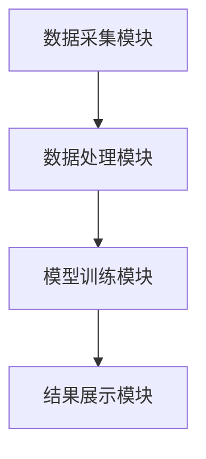

                 

# 全球股市估值与人工智能在环境监测中的应用

> 关键词：全球股市估值、人工智能、环境监测、机器学习、数据融合

> 摘要：本文将深入探讨全球股市估值的核心概念、影响因素及常用模型，结合人工智能技术在环境监测中的应用，分析两者之间的关联性。通过系统架构设计与项目实战，展示如何利用人工智能技术提升股市估值的准确性和效率，同时为环境监测提供新的解决方案。本文旨在为读者提供全面的技术视角，帮助其理解并应用这些技术。

---

## 第一部分：全球股市估值概述

### 第1章：股市估值的基本概念与方法

#### 1.1 股市估值的背景与意义
- 1.1.1 股市估值的基本概念
  - 股票的内在价值与市场价值
  - 估值的重要性：帮助投资者做出决策
- 1.1.2 股市估值的应用场景
  - 个人投资、机构投资、金融分析
- 1.1.3 股市估值的边界与外延
  - 估值的局限性与适用范围

#### 1.2 股市估值的核心要素与模型
- 1.2.1 股票内在价值的定义
  - 现金流折现模型（DCF）：企业未来现金流的现值
- 1.2.2 常用股票估值模型对比
  - 市盈率（P/E）模型 vs. 市净率（P/B）模型
  - **对比表格：**
    | 模型 | 定义 | 适用场景 | 优缺点 |
    |------|------|----------|--------|
    | P/E  | 价格/每股收益 | 利润稳定的公司 | 简单易用，但受利润波动影响 |
    | P/B  | 价格/每股净资产 | 资产密集型行业 | 更适合评估资产价值 |

- 1.2.3 股市估值的核心要素分析
  - 利率、经济增长、行业趋势、公司基本面

### 第2章：股市估值的关键影响因素

#### 2.1 宏观经济因素对股市的影响
- 2.1.1 经济周期对股市的影响
  - 股市与GDP增长的关系
- 2.1.2 利率政策对股市的影响
  - 利率上升对股市的抑制作用
- 2.1.3 通货膨胀对股市的影响
  - 通胀对企业盈利和股价的影响

#### 2.2 行业与公司基本面因素
- 2.2.1 行业发展趋势对股市的影响
  - 新兴行业 vs. 成熟行业
- 2.2.2 公司财务状况对估值的影响
  - 资产负债表分析
- 2.2.3 公司治理结构对估值的影响
  - 高管团队稳定性与公司价值

### 第3章：常用的股票估值模型与方法

#### 3.1 市盈率（P/E）模型
- 3.1.1 定义与计算公式
  - P/E = 股价 / 每股收益
- 3.1.2 优缺点分析
  - 优点：简单易用
  - 缺点：受公司利润波动影响较大
- 3.1.3 实际应用案例
  - 某公司案例分析：通过P/E模型评估其市场地位

#### 3.2 市净率（P/B）模型
- 3.2.1 定义与计算公式
  - P/B = 股价 / 每股净资产
- 3.2.2 优缺点分析
  - 优点：适合资产密集型行业
  - 缺点：忽视了盈利能力
- 3.2.3 实际应用案例
  - 某银行案例分析：通过P/B模型评估其资产价值

#### 3.3 现金流折现模型（DCF）
- 3.3.1 基本原理
  - 通过预测未来现金流，折现到现值
- 3.3.2 计算步骤
  - 1. 预测自由现金流
  - 2. 确定折现率
  - 3. 计算现值
- 3.3.3 实际应用案例
  - 某科技公司案例分析：DCF模型在估值中的应用

### 第4章：股票数据的采集与预处理

#### 4.1 股票数据的来源与分类
- 4.1.1 数据来源渠道
  - 财务报表、新闻报道、市场数据
- 4.1.2 数据分类
  - 时间序列数据、结构化数据、非结构化数据

#### 4.2 数据清洗与预处理
- 4.2.1 数据清洗步骤
  - 去除缺失值、处理异常值
- 4.2.2 数据标准化与归一化
  - 标准差标准化、最小-最大归一化
- 4.2.3 数据特征提取
  - 技术指标（如RSI、MACD）与基本面指标

---

## 第二部分：人工智能在环境监测中的应用

### 第4章：人工智能在环境监测中的应用概述

#### 4.1 环境监测的基本概念与挑战
- 4.1.1 环境监测的定义与目标
  - 监测环境质量，评估污染程度
- 4.1.2 环境监测的主要挑战
  - 数据量大、实时性要求高、数据异构性

#### 4.2 人工智能在环境监测中的优势
- 4.2.1 数据处理能力
  - 处理海量数据，提取特征
- 4.2.2 实时性与准确性
  - 提供实时预测，减少误差
- 4.2.3 自适应能力
  - 根据数据变化自动调整模型

### 第5章：基于机器学习的环境监测算法

#### 5.1 机器学习在环境监测中的应用
- 5.1.1 监督学习
  - 回归：预测污染物浓度
  - 分类：判断环境状态（如是否超标）
- 5.1.2 无监督学习
  - 聚类：识别污染源
  - 异常检测：发现异常排放

#### 5.2 常用算法与实现
- 5.2.1 线性回归
  - 简单线性回归与多元线性回归
  - 实现步骤：数据预处理、模型训练、评估与优化
- 5.2.2 支持向量机（SVM）
  - 分类与回归应用
  - 核函数的选择与影响
- 5.2.3 随机森林
  - 集成学习的优势
  - 超参数调优

#### 5.3 环境监测中的深度学习应用
- 5.3.1 神经网络在环境监测中的应用
  - CNN在图像处理中的应用：卫星图像分析
  - RNN在时间序列数据中的应用：空气质量预测
- 5.3.2 深度学习的优势
  - 高维数据处理能力
  - 自动特征提取

### 第6章：环境监测系统的架构设计

#### 6.1 系统功能设计
- 6.1.1 数据采集模块
  - 传感器数据采集与传输
- 6.1.2 数据处理模块
  - 数据清洗、特征提取、模型训练
- 6.1.3 结果展示模块
  - 可视化界面、实时报警

#### 6.2 系统架构设计
- 6.2.1 分层架构
  - 数据层、业务逻辑层、表现层
- 6.2.2 微服务架构
  - 各模块独立部署，便于扩展
- 6.2.3 混合架构
  - 结合分层与微服务的优点

#### 6.3 系统接口设计
- 6.3.1 数据接口
  - RESTful API：数据采集与传输
- 6.3.2 用户接口
  - Web界面：数据可视化与报警

### 第7章：项目实战

#### 7.1 环境监测系统的实现
- 7.1.1 环境监测系统开发步骤
  - 需求分析、系统设计、开发、测试、部署
- 7.1.2 核心代码实现
  - 数据采集与处理、模型训练与预测、结果展示

#### 7.2 环境监测系统的案例分析
- 7.2.1 某城市空气质量监测案例
  - 数据来源、模型选择、结果分析
- 7.2.2 某工业园区污染监测案例
  - 数据融合、模型优化、实际效果

---

## 第三部分：全球股市估值与人工智能的结合与案例分析

### 第8章：数据融合与联合建模

#### 8.1 数据融合的意义
- 8.1.1 数据融合的定义
  - 将不同来源的数据进行整合
- 8.1.2 数据融合的优势
  - 提高数据的准确性和全面性

#### 8.2 数据融合的实现
- 8.2.1 数据清洗与预处理
  - 处理缺失值、异常值
- 8.2.2 数据特征提取
  - 经济指标、行业趋势、公司基本面
- 8.2.3 数据融合方法
  - 主成分分析（PCA）、因子分析

### 第9章：联合建模与案例分析

#### 9.1 联合建模的意义
- 9.1.1 提高估值的准确性
  - 结合宏观经济、行业趋势、公司基本面
- 9.1.2 提高模型的泛化能力
  - 处理复杂场景

#### 9.2 联合建模的实现
- 9.2.1 模型选择
  - 线性回归、随机森林、神经网络
- 9.2.2 模型优化
  - 超参数调优、特征选择
- 9.2.3 模型评估
  - 准确率、召回率、F1值

#### 9.3 案例分析
- 9.3.1 某行业的联合建模案例
  - 数据来源、模型选择、结果分析
- 9.3.2 某公司的联合建模案例
  - 数据融合、模型优化、实际效果

---

## 第四部分：总结与展望

### 第10章：总结与展望

#### 10.1 全球股市估值与人工智能的结合
- 10.1.1 当前的技术水平
  - 人工智能在股市估值中的应用现状
- 10.1.2 未来的发展方向
  - 更智能的算法、更高效的数据处理方法

#### 10.2 环境监测中的AI应用
- 10.2.1 当前的技术水平
  - 深度学习在环境监测中的应用
- 10.2.2 未来的发展方向
  - 更精准的预测、更智能的决策支持

#### 10.3 未来的研究方向
- 10.3.1 数据融合与联合建模
  - 更高效的数据融合方法
- 10.3.2 智能化与自动化
  - 自动化监测系统、自适应模型

---

## 附录

### 附录A：常用股票估值公式

$$
\text{市盈率} = \frac{\text{股价}}{\text{每股收益}}
$$

$$
\text{市净率} = \frac{\text{股价}}{\text{每股净资产}}
$$

$$
\text{现金流折现模型} = \sum_{t=1}^{n} \frac{\text{现金流}}{(1 + r)^t}
$$

### 附录B：环境监测中的常见算法

- 线性回归
- 支持向量机（SVM）
- 随机森林
- 神经网络

### 附录C：系统架构设计示意图

---

## 作者：AI天才研究院 & 禅与计算机程序设计艺术

---

**本文旨在为读者提供全面的技术视角，帮助其理解并应用这些技术。**

