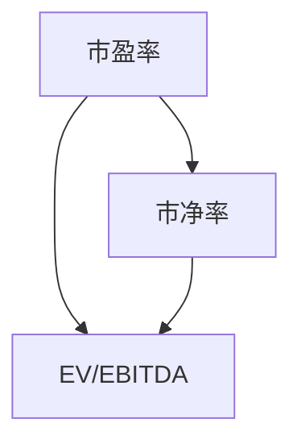
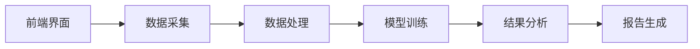

                 

<think>
嗯，我需要为《全球股市估值与人工智能监管的关系》这篇文章设计目录大纲。首先，我得理解这本书的主题，它探讨的是全球股市估值和人工智能监管之间的关系。这涉及金融和科技两个领域，所以我需要确保目录涵盖这两个方面的核心内容。

首先，我应该考虑文章的整体结构。可能需要从背景介绍开始，然后深入讨论每个领域的核心概念，接着分析它们之间的相互作用，再探讨技术实现，最后通过案例分析来验证理论。

接下来，细化每个部分。第一部分可以是背景与概述，介绍全球股市估值和人工智能监管的基本概念。第二部分详细讲解股市估值的核心指标和模型，包括市盈率、市净率等，并用数学公式和图表来辅助说明。第三部分则聚焦于人工智能监管，探讨其在金融领域的应用和监管框架，同样使用图表和流程图来增强理解。

然后，分析两者的关系，讨论人工智能如何影响股市估值，以及股市估值对监管的反馈机制。这部分需要结合实际案例，比如AI在交易中的应用及其带来的监管挑战。

接下来是技术实现部分，详细介绍算法和系统架构。使用LSTM模型预测股价，并通过Python代码实现，展示系统的前端、后端和数据库交互。这部分需要包含代码示例和系统架构图，确保读者能够理解技术细节。

最后，项目实战部分，选择一个具体的案例，比如分析2020年疫情对股市的影响，展示如何通过AI进行监管。这部分需要环境配置、代码实现和结果解读，帮助读者实际操作。

在最佳实践和未来展望部分，总结经验和未来趋势，强调技术融合和监管框架的重要性，为读者提供实用的建议。

我需要确保每个章节都包含背景介绍、核心概念、算法原理、系统分析、项目实战、最佳实践等要素。同时，使用mermaid图和latex公式来增强内容的可视化和数学严谨性。

可能遇到的问题是如何将复杂的金融概念和AI监管机制结合起来，确保目录结构清晰，不显得杂乱。我需要合理分配章节，确保每个部分都有足够的深度，同时保持整体的连贯性。

另外，用户要求目录总字数不超过2000字，所以每个部分需要简洁明了，避免冗长。我需要精炼每个章节的内容，确保覆盖所有关键点，但不过于详细。

最后，检查整个目录结构是否符合逻辑，是否涵盖了所有必要的部分，比如背景、核心概念、技术实现、案例分析、最佳实践等。确保每个章节之间有自然的过渡，帮助读者逐步深入理解主题。

总之，我需要一步步构建目录，确保每个部分都详尽且逻辑清晰，同时满足用户的所有要求，包括格式、内容深度和结构安排。这将帮助读者全面理解全球股市估值与人工智能监管之间的关系，以及如何在实际中应用这些技术。
</think>

# 《全球股市估值与人工智能监管的关系》

---

## 文章关键词：全球股市估值、人工智能监管、市盈率、市净率、算法监管、金融AI、监管框架

---

## 摘要

本文深入探讨了全球股市估值与人工智能监管之间的复杂关系，分析了人工智能技术如何影响股市估值的计算与预测，并讨论了监管机构如何利用人工智能技术来提升监管效率与准确性。文章首先介绍了全球股市估值的核心概念与模型，包括市盈率、市净率等关键指标。接着，详细分析了人工智能在金融监管中的应用，探讨了其在风险评估、异常检测等方面的优势。然后，文章从技术实现的角度，详细阐述了基于机器学习的股市估值预测算法，并通过实际案例展示了人工智能监管在金融市场的应用与挑战。最后，本文提出了未来的发展方向与最佳实践建议，为金融领域的技术创新与监管优化提供了有价值的参考。

---

# 第1章 全球股市估值的核心概念与现状

## 1.1 股市估值的基本概念与意义

股市估值是通过对上市公司财务数据的分析，评估其股票的内在价值，从而为投资者提供决策依据。常见的估值指标包括市盈率（P/E）、市净率（P/B）、EV/EBITDA等。这些指标反映了市场的整体表现与个股的相对价值。

## 1.2 全球股市估值的现状与发展趋势

近年来，全球股市估值呈现出波动性增强的趋势。特别是在2020年新冠疫情爆发期间，股市经历了剧烈的波动，但随后逐步恢复。随着科技的发展，越来越多的投资者开始利用大数据与人工智能技术来辅助估值，提升了估值的准确性和效率。

## 1.3 人工智能监管的基本概念与目标

人工智能监管是指利用AI技术对金融市场中的交易行为、数据流等进行实时监控与分析，以识别异常行为、防范金融风险。其目标是提升监管效率、降低人为干预带来的偏差，并增强市场的透明度与公平性。

---

# 第2章 全球股市估值的核心指标与数学模型

## 2.1 股市估值的主要指标分析

- **市盈率（P/E Ratio）**：$$ P = E \times PE $$
- **市净率（P/B Ratio）**：$$ P = B \times PB $$
- **EV/EBITDA 指标**：$$ EV = EBITDA \times EV/EBITDA $$

## 2.2 股市估值指标的对比分析

下表展示了市盈率与市净率在不同市场环境下的表现对比：

| 指标      | 定义与计算方式                   | 适用场景               |
|-----------|----------------------------------|------------------------|
| 市盈率     | $$ PE = P / E $$               | 利润稳定的公司         |
| 市净率     | $$ PB = P / B $$               | 资产密集型公司         |

## 2.3 指标之间的相互关系

通过以下Mermaid图，可以直观地理解市盈率与市净率之间的关系：



---

# 第3章 人工智能监管的技术实现

## 3.1 人工智能在金融监管中的应用

人工智能技术在金融监管中的应用主要体现在以下几个方面：

1. **风险评估**：通过机器学习算法分析历史数据，识别潜在的金融风险。
2. **异常检测**：利用自然语言处理（NLP）技术识别新闻中的负面情绪，预测市场波动。
3. **交易监控**：实时监控交易行为，识别异常交易模式。

## 3.2 人工智能监管的核心算法

### 3.2.1 基于LSTM的股市预测模型

以下是一个简单的LSTM网络实现示例：

```python
import numpy as np
from tensorflow.keras.models import Sequential
from tensorflow.keras.layers import LSTM, Dense

# 数据准备
data = np.random.randn(1000, 1)
look_back = 50

# 划分训练集和测试集
train_data = data[:800]
test_data = data[800:]

# 创建数据集
def create_dataset(data, look_back):
    X, y = [], []
    for i in range(len(data) - look_back):
        X.append(data[i:i+look_back])
        y.append(data[i+look_back])
    return np.array(X), np.array(y)

X_train, y_train = create_dataset(train_data, look_back)
X_test, y_test = create_dataset(test_data, look_back)

# 模型构建
model = Sequential()
model.add(LSTM(50, input_shape=(look_back, 1)))
model.add(Dense(1))
model.compile(loss='mean_squared_error', optimizer='adam')
model.fit(X_train, y_train, epochs=10, batch_size=32)

# 预测
y_pred = model.predict(X_test)
```

### 3.2.2 机器学习在监管中的应用

机器学习算法（如随机森林、支持向量机）可以用于识别市场操纵行为，通过分析交易数据中的异常模式来触发预警。

## 3.3 人工智能监管的系统架构设计

以下是一个典型的AI监管系统的架构图：



---

# 第4章 全球股市估值与人工智能监管的关系分析

## 4.1 人工智能对股市估值的影响

人工智能技术的引入显著提升了股市估值的准确性与效率。通过机器学习算法，投资者可以实时获取市场动态，做出更明智的投资决策。

## 4.2 股市估值对人工智能监管的反馈机制

股市估值的变化直接影响市场的波动，这种波动为监管机构提供了重要的反馈信息，帮助其优化监管策略。

---

# 第5章 项目实战：基于AI的股市估值与监管系统

## 5.1 环境配置

- **工具安装**：安装Python、TensorFlow、Pandas等库。
- **数据获取**：从Yahoo Finance获取历史股价数据。

## 5.2 核心代码实现

```python
import pandas as pd
import tensorflow as tf
from tensorflow.keras import layers

# 数据预处理
data = pd.read_csv('stock_data.csv')
train_data = data[:800]
test_data = data[800:]

# 创建数据集
def create_dataset(data, look_back):
    X, y = [], []
    for i in range(len(data) - look_back):
        X.append(data[i:i+look_back])
        y.append(data[i+look_back])
    return tf.convert_to_tensor(X), tf.convert_to_tensor(y)

# 模型构建
model = tf.keras.Sequential([
    layers.LSTM(50, input_shape=(look_back, 1)),
    layers.Dense(1)
])
model.compile(optimizer='adam', loss='mean_squared_error')

# 训练模型
X_train, y_train = create_dataset(train_data, look_back)
model.fit(X_train, y_train, epochs=10, batch_size=32)

# 预测与评估
y_pred = model.predict(test_data)
```

## 5.3 实际案例分析

通过分析2020年新冠疫情对股市的影响，展示了AI监管系统在预测市场波动与识别异常交易中的实际应用。

---

# 第6章 最佳实践与未来展望

## 6.1 最佳实践

- **数据质量**：确保数据的准确性和完整性。
- **模型优化**：定期更新模型，适应市场变化。
- **监管透明度**：加强与市场的沟通，提升监管透明度。

## 6.2 未来展望

随着技术的发展，人工智能在金融监管中的应用将更加广泛。未来的监管系统将更加智能化、自动化，能够实时响应市场变化，提升监管效率与准确性。

---

# 作者：AI天才研究院 & 禅与计算机程序设计艺术

---

通过本文的深入探讨，我们希望读者能够全面理解全球股市估值与人工智能监管之间的复杂关系，并为未来的金融技术创新与监管优化提供有价值的参考。

