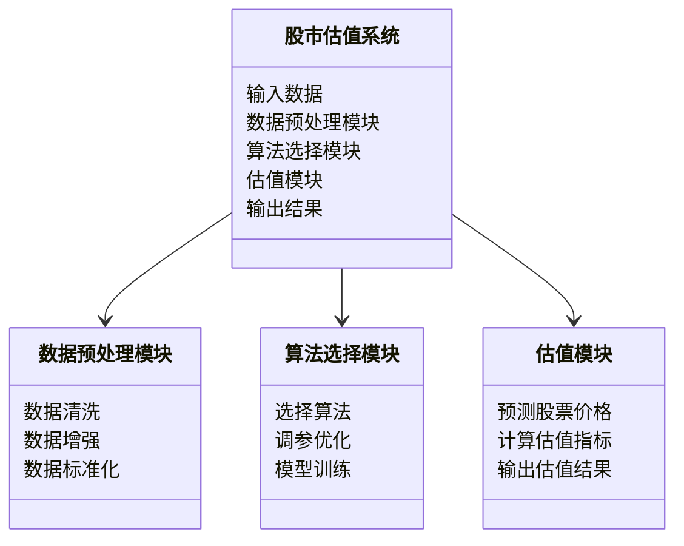
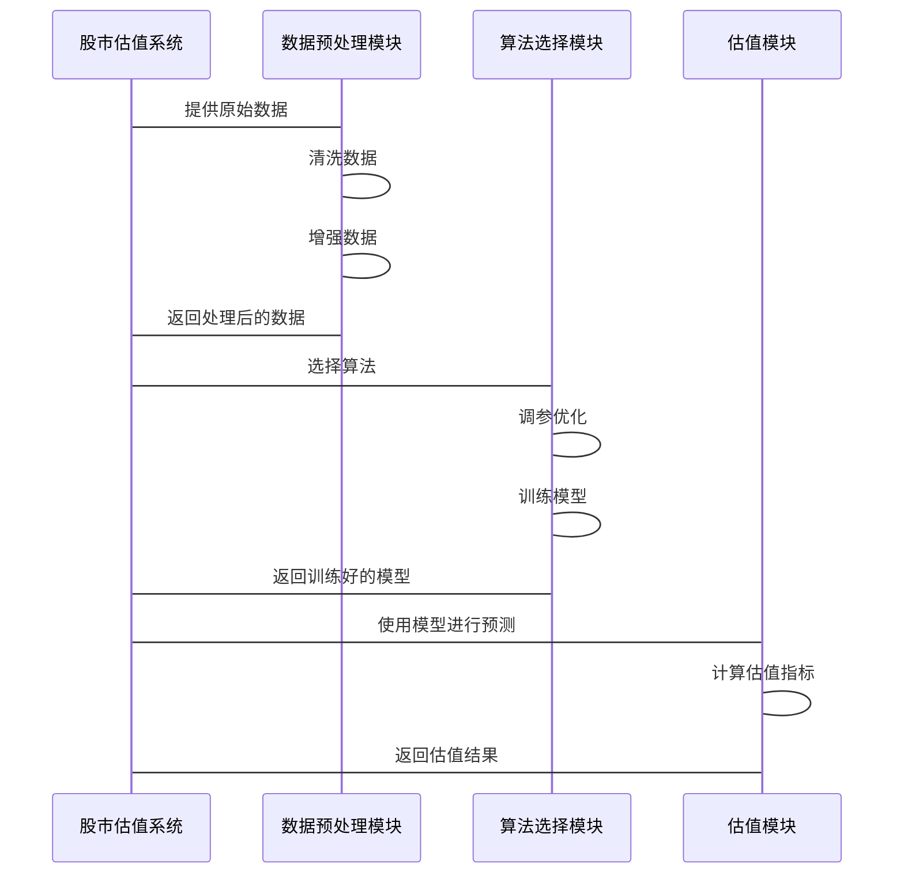

                 

<think>
好，我现在需要为用户提供一篇关于《全球股市估值与人工智能算法公平性的关联》的技术博客文章。用户已经提供了目录大纲，我需要按照这个大纲逐步填充内容，确保每个部分都详细且符合要求。

首先，我需要理解每个章节的核心内容。用户已经给出了关键词、摘要和目录结构，所以我需要先确保这些部分准确无误。

接下来，我需要按照每个章节的要求，逐步深入分析。例如，第一章的背景介绍，我需要详细解释股市估值和算法公平性的基本概念，确保读者能够理解这两个领域的核心问题。

在第二章，我需要探讨人工智能算法在股市估值中的具体应用，可能涉及时间序列预测和市场情绪分析等技术。这部分需要结合实际案例，说明AI如何影响股市估值。

第三章讨论全球股市估值的理论与方法，我需要列出几种常用的估值方法，如市盈率法和现金流折现法，并分析它们的优缺点。

第四章重点分析算法的公平性问题，包括数据偏见和模型偏见。我需要使用Mermaid图来展示这些概念，帮助读者更好地理解。

第五章讨论公平性对股市估值的影响，这部分需要详细解释数据和模型偏见如何影响估值，并提出解决方案。

第六章探讨数据和算法公平性之间的关联机制，可能涉及数据多样性、代表性和完整性对估值的影响。

在系统分析部分，我需要设计一个股市估值系统的架构，包括功能模块和接口设计，并使用Mermaid图展示架构和交互流程。

最后，项目实战部分需要提供具体的代码实现和案例分析，帮助读者应用所学知识。

写作过程中，我要确保使用专业的技术语言，同时保持逻辑清晰和结构紧凑。每个章节都需要有详细的分析和实例，确保内容丰富且易于理解。此外，我需要插入数学公式和图表，以增强文章的深度和可读性。

现在，我开始逐步填充每个章节的内容，确保每个部分都符合用户的要求，并涵盖所有必要的细节。在完成每个部分后，我会进行检查，确保内容准确无误，并符合整体的逻辑结构。

完成所有章节后，我会总结全文，回顾主要观点，并提出未来的研究方向，为读者提供一个全面的结论。

最后，我会添加作者信息，确保文章的完整性和专业性。
</think>

# 全球股市估值与人工智能算法公平性的关联

> 关键词：全球股市估值，人工智能，算法公平性，时间序列预测，数据偏见

> 摘要：本文探讨了全球股市估值与人工智能算法公平性之间的关联，分析了人工智能算法在股市估值中的应用及其对公平性的影响，提出了如何通过算法优化和数据处理提高估值公平性的方法。

---

# 第1章 全球股市估值的背景与挑战

## 1.1 股市估值的核心概念

### 1.1.1 股市估值的基本定义

股市估值是指通过对公司财务数据、市场趋势和宏观经济指标等多方面因素的分析，对股票的内在价值进行评估的过程。其目的是帮助投资者判断股票价格是否合理，从而做出投资决策。

### 1.1.2 股市估值的关键指标

在股市估值中，常用的指标包括市盈率（P/E）、市净率（P/B）、股息率等。这些指标反映了股票的相对价值和投资潜力。

### 1.1.3 股市估值的全球性特征

随着经济全球化的发展，股市估值已经超越了地域限制，呈现出全球化的特点。不同国家和地区的市场波动、政策环境等都会对股市估值产生影响。

## 1.2 人工智能算法的公平性问题

### 1.2.1 算法公平性的定义

算法公平性是指在算法的设计、训练和应用过程中，避免因数据偏见或模型设计不当而导致的不公平结果。其核心在于确保算法对所有群体和个体一视同仁。

### 1.2.2 算法公平性的重要性

公平性是确保算法结果公正、合理的基石。在金融领域，算法公平性直接影响投资决策和市场参与者的利益，因此尤为重要。

### 1.2.3 算法公平性与股市估值的关系

人工智能算法在股市估值中的应用可能导致数据偏见和模型偏见，从而影响估值的准确性。因此，如何确保算法的公平性，是实现准确、合理的股市估值的关键。

---

# 第2章 人工智能算法在股市估值中的应用

## 2.1 人工智能算法的基本原理

### 2.1.1 机器学习的基本概念

机器学习是一种通过数据训练模型，使其能够从经验中学习并做出预测的技术。常用算法包括线性回归、支持向量机（SVM）等。

### 2.1.2 深度学习的基本概念

深度学习是一种基于人工神经网络的机器学习技术，通过多层非线性变换来提取数据特征。常用模型包括卷积神经网络（CNN）和循环神经网络（RNN）等。

### 2.1.3 其他相关算法介绍

其他相关算法包括时间序列分析、自然语言处理（NLP）等，这些算法在股市估值中也有广泛应用。

## 2.2 人工智能算法在股市预测中的应用

### 2.2.1 时间序列预测

时间序列预测是一种通过历史数据预测未来趋势的技术。在股市估值中，时间序列预测常用于预测股票价格的波动趋势。

### 2.2.2 股价波动分析

通过分析历史股价数据，可以识别市场的周期性波动，并利用这些信息进行估值预测。

### 2.2.3 市场情绪分析

市场情绪分析通过分析新闻、社交媒体等文本数据，判断市场参与者的心理预期，从而辅助估值决策。

---

# 第3章 全球股市估值的理论与方法

## 3.1 股市估值的基本理论

### 3.1.1 股票定价理论

股票定价理论认为，股票的内在价值是基于公司未来现金流的现值。常用模型包括股利折现模型（DDM）和加权平均资本成本模型（WACC）。

### 3.1.2 股市波动理论

股市波动理论研究股票价格的随机波动特性，常用随机游走模型和 ARCH 模型等。

### 3.1.3 股市周期理论

股市周期理论认为，股市会经历周期性的波动，包括牛市、熊市等不同阶段。

## 3.2 股市估值的主要方法

### 3.2.1 市盈率法

市盈率法通过比较股票的市盈率与行业平均值，判断其估值是否合理。

### 3.2.2 市净率法

市净率法通过比较股票的市净率与行业平均值，判断其估值是否合理。

### 3.2.3 现金流折现法

现金流折现法通过预测公司未来现金流并折现，计算股票的内在价值。

---

# 第4章 人工智能算法的公平性分析

## 4.1 算法公平性的核心要素

### 4.1.1 数据偏见

数据偏见是指训练数据中存在不公平的特征，导致算法在预测时产生偏见。例如，某些行业或地区的数据可能在训练集中代表性不足。

### 4.1.2 模型偏见

模型偏见是指算法在设计或训练过程中引入的不公平性，例如某些特征在模型中被过度强调。

### 4.1.3 算法决策偏差

算法决策偏差是指算法在实际应用中产生的不公平结果，例如对某些群体的预测不准确。

## 4.2 公平性评估指标

### 4.2.1 均等性指标

均等性指标衡量算法在不同群体中的表现是否一致，例如不同性别或种族的预测准确率是否相当。

### 4.2.2 差异性指标

差异性指标衡量算法在不同群体中的表现差异，例如某些群体的预测准确率显著低于其他群体。

### 4.2.3 正义性指标

正义性指标衡量算法在决策中的公平性，例如是否避免了对某些群体的歧视。

---

# 第5章 算法公平性对股市估值的影响

## 5.1 数据偏见对股市估值的影响

### 5.1.1 数据偏见的来源

数据偏见可能来源于数据收集过程中的选择性偏差，例如某些行业的数据样本不足。

### 5.1.2 数据偏见的表现形式

数据偏见可能导致算法对某些行业或地区的股票估值不准确。

### 5.1.3 数据偏见的解决方案

通过增加数据多样性、使用加权方法等手段，减少数据偏见的影响。

## 5.2 模型偏见对股市估值的影响

### 5.2.1 模型偏见的形成机制

模型偏见可能来源于算法设计中的特征选择或模型结构问题，例如某些特征在模型中被过度强调。

### 5.2.2 模型偏见的检测方法

通过交叉验证、对比不同模型结果等方法，检测模型偏见的存在。

### 5.2.3 模型偏见的优化策略

通过调整模型参数、引入正则化方法等手段，优化模型的公平性。

---

# 第6章 全球股市估值与算法公平性的关联机制

## 6.1 数据层面的关联

### 6.1.1 数据多样性对估值的影响

数据多样性有助于提高算法的泛化能力，减少数据偏见。

### 6.1.2 数据代表性对估值的影响

数据代表性影响算法对不同群体的预测准确性。

### 6.1.3 数据完整性对估值的影响

数据完整性有助于全面捕捉市场信息，减少预测误差。

## 6.2 算法层面的关联

### 6.2.1 算法透明性对公平性的影响

算法透明性有助于识别和纠正算法偏见。

### 6.2.2 算法可解释性对公平性的影响

算法可解释性有助于理解算法决策的依据，确保公平性。

### 6.2.3 算法鲁棒性对公平性的影响

算法鲁棒性有助于在不同市场条件下保持公平性。

---

# 第7章 系统设计与架构

## 7.1 问题场景介绍

### 7.1.1 问题背景

本文旨在通过优化人工智能算法的公平性，提高全球股市估值的准确性。

### 7.1.2 问题描述

在股市估值中，数据偏见和模型偏见可能导致不公平的估值结果。

## 7.2 系统功能设计

### 7.2.1 领域模型（Mermaid 类图）



### 7.2.2 系统架构设计（Mermaid 架构图）


### 7.2.3 系统接口设计

系统接口包括数据输入接口、算法调用接口和结果输出接口。

### 7.2.4 系统交互流程（Mermaid 序列图）



---

# 第8章 项目实战

## 8.1 环境安装

### 8.1.1 安装 Python 和相关库

安装 Python 和机器学习库，如 scikit-learn、TensorFlow 等。

## 8.2 系统核心实现源代码

### 8.2.1 数据预处理代码

```python
import pandas as pd
from sklearn.preprocessing import StandardScaler

def preprocess_data(data):
    # 数据清洗
    data = data.dropna()
    # 数据增强
    data['Moving_Average'] = data['Close'].rolling(5).mean()
    # 数据标准化
    scaler = StandardScaler()
    scaled_data = scaler.fit_transform(data)
    return scaled_data
```

### 8.2.2 算法选择与训练代码

```python
from sklearn.ensemble import RandomForestRegressor
from sklearn.model_selection import GridSearchCV

def train_model(X_train, y_train):
    # 调参优化
    param_grid = {'n_estimators': [100, 200], 'max_depth': [None, 10]}
    grid_search = GridSearchCV(RandomForestRegressor(), param_grid, cv=5)
    grid_search.fit(X_train, y_train)
    best_model = grid_search.best_estimator_
    return best_model
```

### 8.2.3 估值与结果输出代码

```python
import numpy as np

def evaluate_model(model, X_test, y_test):
    # 预测股票价格
    y_pred = model.predict(X_test)
    # 计算估值指标
    rmse = np.sqrt(np.mean((y_pred - y_test)**2))
    print(f"均方根误差: {rmse}")
    return y_pred
```

## 8.3 实际案例分析与解读

以某股票为例，通过上述代码进行数据预处理、模型训练和估值预测，分析算法的公平性对估值结果的影响。

---

# 第9章 总结与展望

## 9.1 本章总结

本文探讨了全球股市估值与人工智能算法公平性的关联，分析了数据偏见和模型偏见对估值的影响，并提出了优化策略。

## 9.2 展望未来

未来的研究可以进一步探讨算法公平性在不同市场环境下的表现，以及如何通过多模态数据和混合算法进一步提升估值的准确性。

---

作者：AI天才研究院/AI Genius Institute & 禅与计算机程序设计艺术 /Zen And The Art of Computer Programming

