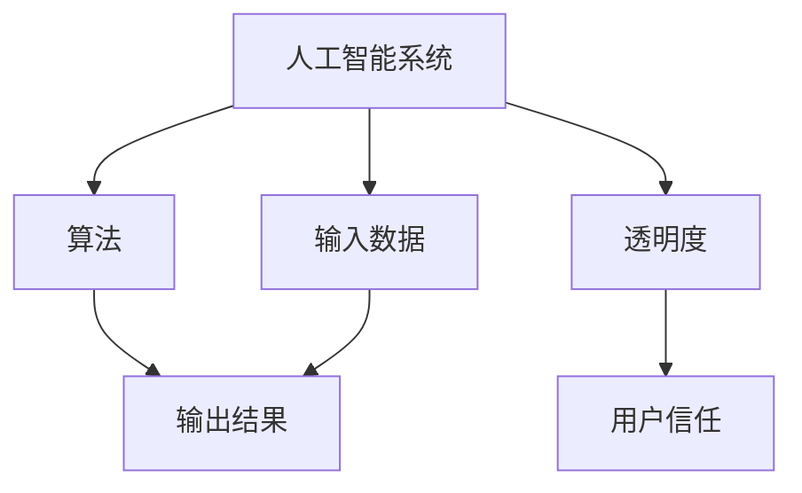

                 

# 全球股市估值与人工智能透明度的关联

> 关键词：全球股市估值，人工智能透明度，算法可解释性，关联性分析，风险管理

> 摘要：本文探讨了全球股市估值与人工智能透明度之间的关联性。通过分析股市估值的核心要素、人工智能透明度的定义与属性，以及两者之间的关系，本文揭示了透明度对股市估值的影响，尤其是在风险管理与算法可解释性方面的关键作用。文章还结合实际案例，分析了透明度缺失可能带来的风险，并提出了提高透明度的具体建议。

---

# 第1章: 全球股市估值的现状与挑战

## 1.1 全球股市估值的定义与意义

### 1.1.1 股市估值的基本概念
股市估值是指通过对公司财务数据、市场环境和宏观经济指标的分析，对股票的内在价值进行评估的过程。常见的估值指标包括市盈率（P/E）、市净率（P/B）、股息率（Dividend Yield）等。

### 1.1.2 全球股市估值的重要性
股市估值是投资者做出投资决策的重要依据，也是企业融资和资本配置的关键参考。准确的估值能够帮助投资者识别高成长性企业，避免市场泡沫的形成。

### 1.1.3 当前股市估值的主要挑战
- 数据量爆炸：金融市场数据复杂且多样化，传统的估值模型难以处理。
- 黑箱算法：部分人工智能算法缺乏可解释性，导致透明度不足。
- 市场波动性：全球经济不确定性增加，使得股市估值更加复杂。

---

## 1.2 人工智能在金融领域的应用背景

### 1.2.1 人工智能技术的发展与现状
人工智能技术（AI）在金融领域的应用日益广泛，尤其是在高频交易、风险管理、客户画像等领域。AI能够处理海量数据，发现复杂模式，提供实时决策支持。

### 1.2.2 人工智能在金融领域的应用现状
- 自动化交易：利用算法进行高频交易，提高交易效率。
- 风险管理：通过机器学习模型预测市场波动，优化投资组合。
- 客户服务：利用自然语言处理技术提供智能投顾服务。

### 1.2.3 人工智能在股市估值中的潜力与局限性
人工智能能够通过海量数据分析，发现传统方法难以察觉的市场规律。然而，部分AI算法的“黑箱”特性使其难以解释，影响了其在金融领域的广泛应用。

---

## 1.3 透明度在金融领域的核心地位

### 1.3.1 透明度的定义与属性
透明度是指信息的公开性、可访问性和可理解性。在金融领域，透明度是信任的基础，也是风险管理的关键。

### 1.3.2 透明度对金融市场的意义
- 增加市场参与者的信任。
- 提高市场的公平性和效率。
- 降低系统性风险。

### 1.3.3 透明度与风险管理的关系
透明度越高，市场参与者越能够准确评估风险，制定合理的投资策略。

---

## 1.4 本章小结

- 全球股市估值是金融市场的重要组成部分，但面临着数据复杂性和市场波动性的挑战。
- 人工智能在金融领域的应用潜力巨大，但透明度不足限制了其广泛应用。
- 透明度是金融市场信任和风险管理的核心要素。

---

# 第2章: 全球股市估值与人工智能透明度的关联性分析

## 2.1 股市估值的核心要素

### 2.1.1 市盈率与市净率的定义与计算
- 市盈率（P/E）= 股价 / 每股净利润。
- 市净率（P/B）= 股价 / 每股净资产。

### 2.1.2 股息率与股息支付率的分析
- 股息率 = 每股股息 / 股价。
- 股息支付率 = 股息支付总额 / 净利润。

### 2.1.3 资产负债率与财务健康度评估
- 资产负债率 = 总负债 / 总资产。
- 低负债率通常意味着企业财务更加稳健。

---

## 2.2 人工智能透明度的核心概念

### 2.2.1 人工智能算法的可解释性
可解释性是指人类能够理解算法的决策过程。例如，线性回归模型的可解释性较强，而深度学习模型的可解释性较弱。

### 2.2.2 人工智能决策的透明性要求
透明性要求算法的决策过程必须清晰、可追溯，避免“黑箱”操作。

### 2.2.3 人工智能系统的可信度评估
可信度评估是通过多种指标和方法，评估人工智能系统的可靠性和稳定性。

---

## 2.3 股市估值与人工智能透明度的关联性分析

### 2.3.1 数据驱动的股市估值模型
基于机器学习的估值模型能够处理海量数据，发现传统方法难以察觉的市场规律。

### 2.3.2 人工智能透明度对股市估值的影响
- 透明度越高，投资者越能够信任算法的决策。
- 透明度不足可能导致算法决策的不一致性和不可预测性。

### 2.3.3 透明度缺失对股市估值的潜在风险
- 透明度缺失可能导致市场参与者对算法决策的误解。
- 透明度缺失可能引发市场恐慌，加剧市场波动。

---

## 2.4 本章小结

- 股市估值的核心要素包括市盈率、市净率、股息率等。
- 人工智能透明度的核心概念包括可解释性、透明性要求和可信度评估。
- 透明度对股市估值的影响是双向的，透明度越高，股市估值越准确，反之则可能导致市场不稳定。

---

# 第3章: 人工智能透明度的核心概念与原理

## 3.1 人工智能透明度的定义与属性

### 3.1.1 人工智能透明度的定义
人工智能透明度是指算法的决策过程能够被人类理解和解释。

### 3.1.2 人工智能透明度的属性特征对比表
| 属性 | 特征 |
|------|------|
| 可解释性 | 高或低 |
| 可追溯性 | 易或难 |
| 可预测性 | 稳定或不稳定 |

---

## 3.2 人工智能透明度的实体关系图

---

## 3.3 人工智能透明度的实现原理

### 3.3.1 基于规则的透明度实现
基于规则的透明度实现通过明确的规则和逻辑，确保算法的可解释性。例如，决策树算法可以通过树状结构展示决策过程。

### 3.3.2 基于解释的透明度实现
基于解释的透明度实现通过生成中间结果和解释性文本，帮助用户理解算法的决策过程。

### 3.3.3 基于可解释性模型的透明度实现
基于可解释性模型的透明度实现选择本身就具有可解释性的模型，例如线性回归模型。

---

## 3.4 本章小结

- 人工智能透明度的定义与属性是理解其核心概念的关键。
- 通过实体关系图可以看出，透明度是连接人工智能系统与用户信任的桥梁。
- 透明度的实现原理多种多样，需要根据具体场景选择合适的方法。

---

# 作者：AI天才研究院/AI Genius Institute & 禅与计算机程序设计艺术 /Zen And The Art of Computer Programming

