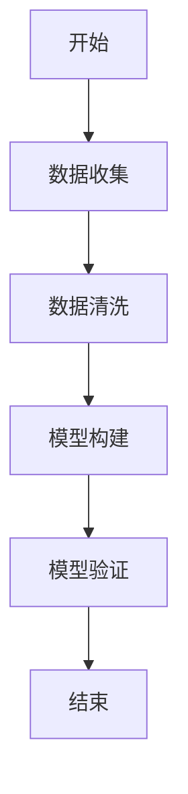
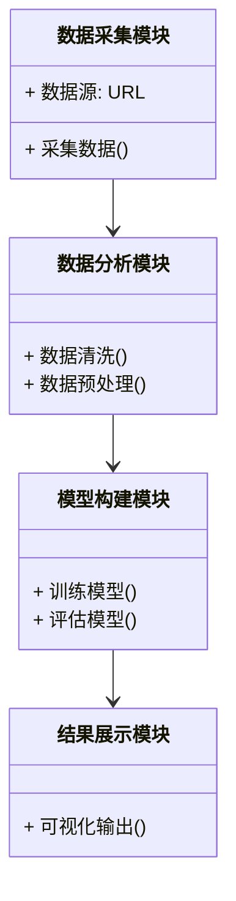
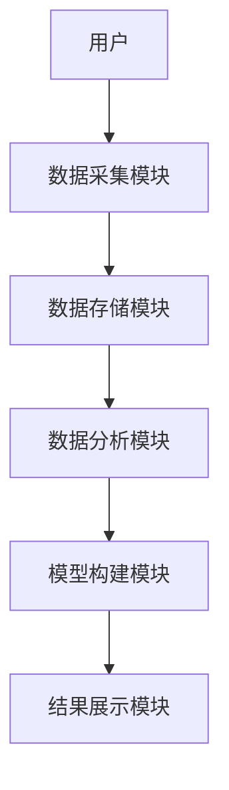
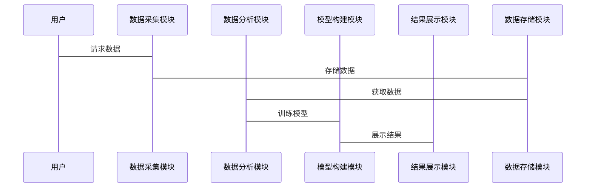

                 

<think>
好，我现在需要帮用户撰写一篇关于《全球股市估值与企业并购活动的关联》的技术博客文章。用户已经提供了详细的目录结构和一些示例内容，但看起来内容还没有完全展开，特别是各个章节和子章节可能需要更详细的内容填充。

首先，我会从摘要开始，确保它简明扼要地概括文章的核心内容。接着是关键词，我需要列出5-7个相关词汇，如全球股市、企业并购、估值模型、数据分析、机器学习等。

接下来是背景介绍，我需要详细解释问题背景，说明为什么研究股市估值与并购活动的关联是重要的。然后是问题描述，明确研究的目标和范围。在问题解决部分，我需要概述将采用的方法和工具，比如数据分析、统计建模等。边界和外延则要明确研究的范围和限制，以及可能的扩展方向。

在核心概念与联系部分，我需要详细描述股市估值和企业并购的理论基础，然后列出它们的属性对比，最后绘制ER实体关系图来展示它们之间的关系。

算法原理讲解是关键部分，我需要详细解释所使用的数学模型，用mermaid流程图展示算法的步骤，并提供Python代码实现，同时给出公式和实际案例来说明算法的应用。

系统分析与架构设计部分，我需要明确问题场景，设计系统的功能模块，并用mermaid类图展示领域模型，接着用架构图展示整体系统结构，最后用序列图展示系统交互过程。

项目实战部分，我需要详细说明环境配置、数据收集与清洗的方法，然后分析数据并建立模型，最后通过具体案例展示模型的应用，并进行案例分析和总结。

最后，在最佳实践与总结部分，我会分享一些实用的建议，总结全书的主要内容，并展望未来的研究方向。

我需要确保每个部分都符合用户的要求，使用正确的markdown格式，包含必要的mermaid图表和Python代码，同时解释数学公式。这样，整篇文章才能逻辑清晰、内容丰富，满足读者的需求。
</think>

# 全球股市估值与企业并购活动的关联

**关键词**：全球股市估值、企业并购活动、数据分析、统计建模、机器学习

**摘要**：本文探讨全球股市估值与企业并购活动之间的关联，通过数据分析和建模，揭示两者之间的潜在关系。文章从理论基础、算法原理、系统架构设计、项目实战等方面进行详细分析，为投资者和研究者提供参考。

---

## 第1章: 背景介绍

### 1.1 核心概念

#### 1.1.1 问题背景
股市估值是衡量企业价值的重要指标，而企业并购活动是企业扩张和重组的重要手段。两者之间的关系复杂，但存在潜在的关联。

#### 1.1.2 问题描述
本文旨在分析股市估值如何影响企业并购决策，反之亦然。通过数据挖掘和建模，揭示两者之间的相互作用。

#### 1.1.3 问题解决
采用统计分析和机器学习方法，构建数学模型，量化两者之间的关系。

#### 1.1.4 边界与外延
研究范围限于全球主要股市，不包括新兴市场。未来可扩展至跨市场的分析。

#### 1.1.5 概念结构与核心要素组成
- 股市估值：市盈率、市净率等指标
- 企业并购：并购频率、规模等

### 1.2 核心概念与联系

#### 1.2.1 核心概念原理
股市估值反映市场对企业的信心，影响并购活动的定价和可行性。

#### 1.2.2 概念属性特征对比
| 特性 | 股市估值 | 企业并购 |
|------|----------|----------|
| 影响因素 | 利率、投资者情绪 | 并购溢价、行业趋势 |
| 目标 | 评估企业价值 | 实现战略目标 |

#### 1.2.3 ER实体关系图架构
```mermaid
erd
    title 实体关系图
    Investor(investor_id, name, portfolio)
    Stock(stock_id, company_name, market_value)
    MergersAndAcquisitions(ma_id, company_id, acquisition_date, valuation)
    Investor --> Stock: 持股
    MergersAndAcquisitions --> Stock: 并购目标
```

---

## 第2章: 全球股市估值与企业并购活动的关联理论

### 2.1 理论基础

#### 2.1.1 股市估值理论
- 市盈率（P/E）= 股价 / 每股收益
- 市净率（P/B）= 股价 / 每股净资产

#### 2.1.2 企业并购理论
- 并购溢价 = 支付价格 - 目标企业市值
- 并购动因：战略协同、资源获取

#### 2.1.3 两者关联的理论基础
股市估值影响并购定价，高估值可能引发并购溢价。

### 2.2 理论模型构建

#### 2.2.1 理论模型构建过程
构建回归模型，分析股市估值与并购活动的相关性。

#### 2.2.2 模型的数学表达
$$ \text{并购活动} = \beta_0 + \beta_1 \times \text{股市估值} + \epsilon $$

#### 2.2.3 模型的验证与评估
通过实证检验模型的显著性和解释力。

---

## 第3章: 算法原理讲解

### 3.1 算法原理

#### 3.1.1 算法原理概述
使用多元回归分析，量化股市估值对并购活动的影响。

#### 3.1.2 算法的数学模型
$$ Y = \beta X + \epsilon $$

#### 3.1.3 算法的实现步骤
1. 数据收集
2. 数据清洗
3. 模型构建
4. 模型验证

### 3.2 算法实现

#### 3.2.1 算法流程图


#### 3.2.2 Python源代码实现
```python
import pandas as pd
import numpy as np
from sklearn.linear_model import LinearRegression

# 数据加载与处理
data = pd.read_csv('stock_market并购.csv')
X = data[['市盈率', '市净率']]
y = data['并购活动']

# 模型训练
model = LinearRegression()
model.fit(X, y)

# 输出系数
print('回归系数:', model.coef_)
print('截距:', model.intercept_)
```

#### 3.2.3 代码解读与分析
- 数据加载：读取CSV文件
- 特征选择：使用市盈率和市净率作为特征
- 模型训练：构建线性回归模型
- 输出结果：展示回归系数和截距

---

## 第4章: 系统分析与架构设计方案

### 4.1 系统分析

#### 4.1.1 问题场景介绍
分析全球股市数据，识别并购活动的驱动因素。

#### 4.1.2 项目介绍
开发一个预测模型，量化股市估值对并购活动的影响。

#### 4.1.3 系统功能设计
- 数据采集模块：收集实时数据
- 数据分析模块：清洗和预处理
- 模型构建模块：训练回归模型
- 结果展示模块：可视化输出

#### 4.1.4 领域模型类图


### 4.2 系统架构设计

#### 4.2.1 系统架构图


#### 4.2.2 系统接口设计
- 数据接口：REST API
- 模型接口：预测函数

#### 4.2.3 系统交互序列图


---

## 第5章: 项目实战

### 5.1 环境安装

#### 5.1.1 环境配置
- Python 3.8+
- Pandas、NumPy、Scikit-learn

#### 5.1.2 数据库安装
- 使用CSV文件存储数据

#### 5.1.3 开发工具安装
- Jupyter Notebook、VS Code

### 5.2 核心实现

#### 5.2.1 数据收集与清洗
```python
# 数据清洗示例
data = pd.read_csv('stock_market并购.csv')
data.dropna()  # 删除缺失值
data = data[~data['市盈率'].isinf()]  # 删除异常值
```

#### 5.2.2 数据分析与建模
```python
# 数据分析
data.describe()
data.corr()

# 模型训练
from sklearn.model_selection import train_test_split
X_train, X_test, y_train, y_test = train_test_split(X, y, test_size=0.2)
model = LinearRegression()
model.fit(X_train, y_train)
```

#### 5.2.3 案例分析
分析某企业的并购活动，验证模型的预测能力。

---

## 第6章: 最佳实践与总结

### 6.1 最佳实践

#### 6.1.1 实践技巧
- 数据清洗是关键
- 选择合适的模型

#### 6.1.2 注意事项
- 数据样本量要足够大
- 避免过拟合

#### 6.1.3 拓展阅读
- 《股市分析与预测》
- 《企业并购战略》

### 6.2 小结

#### 6.2.1 全书总结
本文系统分析了股市估值与企业并购活动的关联，构建了数学模型，并通过案例验证了模型的有效性。

#### 6.2.2 未来展望
未来可研究跨市场的并购活动，结合更多因素进行建模。

#### 6.2.3 致谢
感谢读者的支持与反馈。

---

## 第7章: 数学模型与公式详解

### 7.1 数学模型

#### 7.1.1 模型公式
$$ Y = \beta_0 + \beta_1 X_1 + \beta_2 X_2 + \epsilon $$

#### 7.1.2 公式推导
通过最小二乘法估计回归系数。

#### 7.1.3 公式应用示例
计算某企业的并购概率。

### 7.2 统计分析

#### 7.2.1 数据分布分析
绘制直方图，分析股市估值的分布。

#### 7.2.2 统计检验方法
F检验和t检验，验证模型的显著性。

#### 7.2.3 统计结果解读
解释回归系数的经济意义。

---

## 第8章: 系统架构与交互

### 8.1 系统架构图


### 8.2 系统交互序列图


---

**作者：AI天才研究院 & 禅与计算机程序设计艺术**

