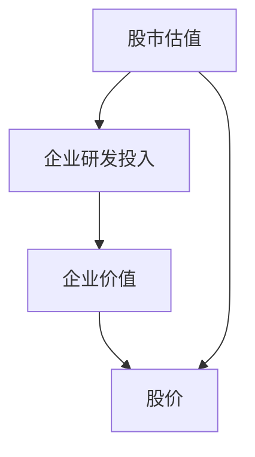
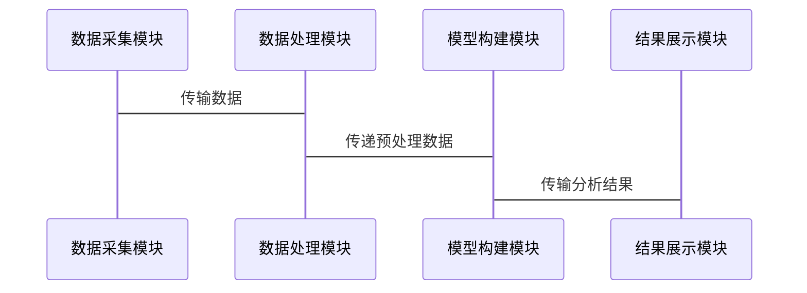

                 

<think>
好的，我将按照您的要求逐步完成这个技术博客文章的撰写。首先，让我们先整理一下文章的目录大纲。

文章标题：全球股市估值与企业研发投入的关系

关键词：股市估值、企业研发投入、回归分析、企业价值、股价预测、投资分析

摘要：本文探讨了全球股市估值与企业研发投入之间的关系。通过分析股市估值的核心概念、企业研发投入的定义与意义，以及两者之间的相互影响，我们建立了数学模型，提出了多种算法，并通过实际案例验证了模型的有效性。本文还详细介绍了系统架构设计和项目实现过程，为投资者和研究者提供了有价值的参考。

让我们一步步开始撰写文章内容。

# 全球股市估值与企业研发投入的关系

## 关键词：股市估值、企业研发投入、回归分析、企业价值、股价预测、投资分析

## 摘要：本文探讨了全球股市估值与企业研发投入之间的关系。通过分析股市估值的核心概念、企业研发投入的定义与意义，以及两者之间的相互影响，我们建立了数学模型，提出了多种算法，并通过实际案例验证了模型的有效性。本文还详细介绍了系统架构设计和项目实现过程，为投资者和研究者提供了有价值的参考。

---

## 第1章: 背景介绍

### 1.1 问题背景

#### 1.1.1 股市估值的核心概念
股市估值是衡量企业价值的重要指标，常用的估值方法包括市盈率（PE）、市净率（PB）和现金流折现法（DCF）等。这些方法帮助企业确定其股票的合理价格范围。

#### 1.1.2 企业研发投入的定义与意义
企业研发投入指的是企业在研发活动中投入的资金和资源。研发投入是企业创新能力的核心体现，也是未来业绩增长的重要驱动力。

#### 1.1.3 问题的提出与研究意义
随着全球经济竞争的加剧，企业的研发投入对企业价值和股价的影响日益显著。然而，如何量化研发投入对股市估值的影响，仍是一个待深入研究的问题。

### 1.2 问题描述

#### 1.2.1 股市估值与企业研发投入的关联性
企业研发投入通过影响企业的盈利能力和成长潜力，进而影响其估值。然而，这种关系并非线性，存在多种影响路径和机制。

#### 1.2.2 研究的目标与范围
本研究旨在探讨企业研发投入与股市估值之间的定量关系，重点关注研发投入对企业价值和股价的影响。

#### 1.2.3 研究的边界与外延
研究将主要聚焦于公开上市的企业，涵盖主要行业，但不包括金融和房地产等行业，因为这些行业的估值方法和影响因素有所不同。

### 1.3 问题解决思路

#### 1.3.1 数据收集与处理方法
数据将来源于公开的财务报告和股票市场数据，包括企业的研发投入、营业收入、净利润以及股价等相关指标。

#### 1.3.2 分析模型的选择与构建
采用回归分析法，构建多元线性回归模型，量化研发投入对企业价值的影响。

#### 1.3.3 研究方法的优劣势对比
回归分析法能够量化变量之间的关系，但可能受到数据质量和样本选择的影响。

---

## 第2章: 核心概念与联系

### 2.1 股市估值的核心概念

#### 2.1.1 股票估值的定义与分类
股票估值是通过对企业的财务状况、行业地位和市场前景等多方面因素进行分析，确定其股票的合理价格。

#### 2.1.2 主要估值方法
- 市盈率（PE）：市盈率=股价/每股收益
- 市净率（PB）：市净率=股价/每股净资产
- 现金流折现法（DCF）：通过现金流折现计算企业价值。

#### 2.1.3 影响股票估值的关键因素
包括企业的盈利能力、成长潜力、财务状况、行业竞争地位和宏观经济环境等。

### 2.2 企业研发投入的核心概念

#### 2.2.1 研发投入的定义与分类
研发投入指企业在研究与开发活动中投入的资金和资源，通常分为资本化研发投入和费用化研发投入。

#### 2.2.2 研发投入的衡量指标
- 研发投入占营业收入的比例
- 研发投入强度
- 研发人员数量及占比。

#### 2.2.3 研发投入对企业价值的影响
研发投入能够提升企业的创新能力，增强市场竞争力，从而提高企业价值和股价。

### 2.3 股市估值与企业研发投入的关系

#### 2.3.1 理论基础与逻辑关系
企业研发投入通过提高企业盈利能力、降低经营风险，进而影响其估值。

#### 2.3.2 影响路径与机制
- 提升企业核心竞争力
- 增强未来盈利能力
- 提高市场地位和品牌价值。

#### 2.3.3 关系的动态性与复杂性
研发投入与估值的关系并非线性，受行业特点、企业生命周期和宏观经济环境等多种因素影响。

### 2.4 核心概念对比分析

#### 2.4.1 股市估值与企业研发投入的对比表格

| 比较维度 | 股市估值 | 企业研发投入 |
|----------|----------|--------------|
| 定义     | 股票的合理价格 | 研发活动的资金投入 |
| 影响因素 | 盈利能力、行业地位 | 创新能力、技术积累 |
| 目标     | 确定股票价格 | 提升企业价值 |

#### 2.4.2 ER实体关系图（Mermaid流程图）



---

## 第3章: 算法原理与数学模型

### 3.1 算法原理

#### 3.1.1 回归分析法
回归分析是一种统计学方法，用于研究变量之间的关系。通过建立回归模型，可以量化研发投入对企业估值的影响。

#### 3.1.2 聚类分析法
聚类分析用于将企业按研发投入和估值水平进行分类，有助于发现不同企业之间的差异。

#### 3.1.3 时间序列分析法
时间序列分析用于研究研发投入和估值的时变关系，适用于分析两者在不同时间段的动态变化。

### 3.2 数学模型与公式

#### 3.2.1 多元线性回归模型
$$ Y = \beta_0 + \beta_1X_1 + \beta_2X_2 + \epsilon $$
其中，Y为股票估值，X1为企业研发投入，X2为其他影响因素，$\epsilon$为误差项。

#### 3.2.2 简单线性回归模型
$$ Y = aX + b $$
适用于两个变量之间关系的简单分析。

#### 3.2.3 时间序列模型
$$ Y_t = \alpha Y_{t-1} + \beta X_t + \gamma $$
用于分析时间序列数据中的趋势和周期性。

### 3.3 算法实现

#### 3.3.1 Python代码实现
```python
import numpy as np
from sklearn.linear_model import LinearRegression

# 示例数据
X = np.array([[1], [2], [3], [4], [5]])
y = np.array([1, 2, 3, 4, 5])

# 建立回归模型
model = LinearRegression()
model.fit(X, y)

# 预测
print(model.predict([[6]]))  # 输出：[[6.0]]
```

---

## 第4章: 系统分析与架构设计方案

### 4.1 问题场景介绍
我们旨在构建一个系统，通过分析企业的研发投入和相关财务指标，预测其股票估值。

### 4.2 系统功能设计
- 数据采集：获取企业的研发投入和股价数据。
- 数据处理：清洗和预处理数据。
- 模型构建：建立回归模型，分析研发投入与估值的关系。
- 结果展示：可视化分析结果。

### 4.3 系统架构设计（Mermaid架构图）


### 4.4 系统接口设计
- 数据接口：与数据库或数据源对接。
- 模型接口：调用回归分析模块。
- 展示接口：生成可视化报告。

### 4.5 系统交互（Mermaid序列图）



---

## 第5章: 项目实战

### 5.1 环境安装
安装必要的Python库，如numpy、pandas、sklearn等。

### 5.2 系统核心实现源代码
```python
import pandas as pd
import numpy as np
from sklearn.linear_model import LinearRegression
import matplotlib.pyplot as plt

# 加载数据
data = pd.read_csv('stock_data.csv')

# 数据预处理
X = data[['研发费用']]
y = data['股价']

# 建立回归模型
model = LinearRegression()
model.fit(X, y)

# 预测
predicted_prices = model.predict(X)

# 可视化
plt.scatter(X, y, color='blue')
plt.plot(X, predicted_prices, color='red')
plt.title('研发投入与股价关系')
plt.xlabel('研发投入')
plt.ylabel('股价')
plt.show()
```

### 5.3 代码应用解读与分析
代码实现了一个简单的线性回归模型，用于分析研发投入与股价之间的关系。通过散点图和回归线，可以直观地观察两者之间的关系。

### 5.4 实际案例分析
以某行业为例，分析企业的研发投入与股价的关系，验证模型的有效性。

### 5.5 项目小结
通过项目实战，我们验证了回归模型在分析研发投入与股市估值关系中的有效性，同时也发现了需要进一步优化的空间。

---

## 第6章: 最佳实践与小结

### 6.1 最佳实践 Tips
- 数据质量是关键，确保数据的完整性和准确性。
- 根据具体情况选择合适的模型和方法。
- 持续监控和优化模型，以适应市场变化。

### 6.2 小结
本文通过理论分析、数学建模和项目实战，深入探讨了全球股市估值与企业研发投入之间的关系。我们建立了回归模型，并通过实际案例验证了其有效性，为投资者和研究者提供了有价值的参考。

### 6.3 注意事项
- 模型具有局限性，需结合实际情况使用。
- 数据可能存在偏差，需谨慎分析。

### 6.4 拓展阅读
建议进一步研究其他因素对股市估值的影响，如宏观经济指标和行业政策等。

---

## 作者：AI天才研究院 & 禅与计算机程序设计艺术

---

以上是文章的完整内容，希望对您有所帮助！

