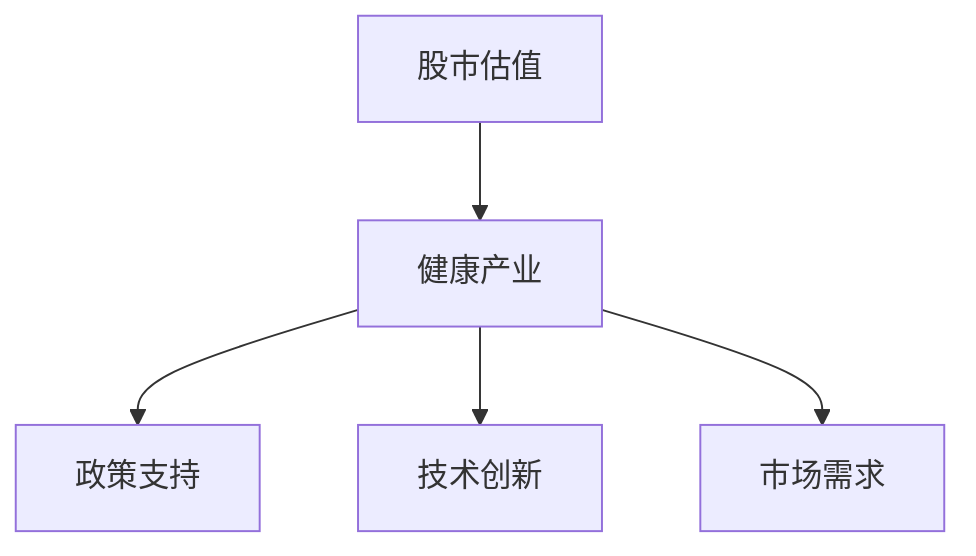
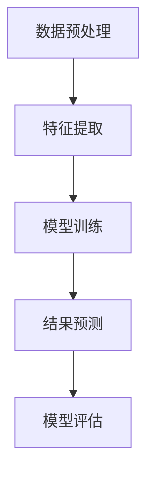
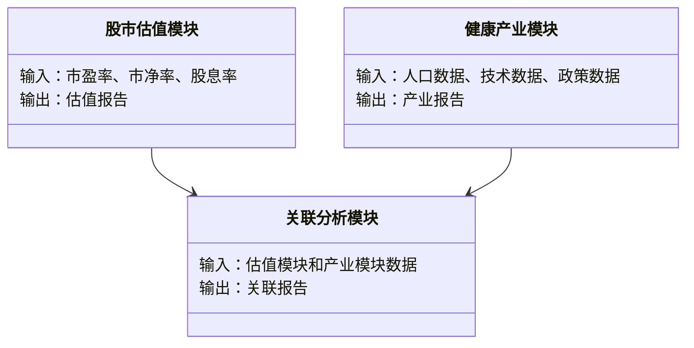
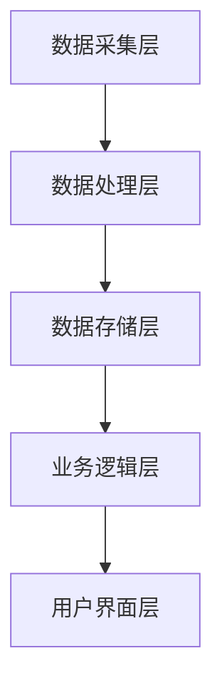

                 


# 全球股市估值与健康产业发展的关系

## 关键词：
全球股市估值, 健康产业发展, 股市与健康关联性, 投资策略, 数据分析

## 摘要：
本文探讨了全球股市估值与健康产业发展的相互关系，通过分析股市估值的核心指标（如市盈率、市净率、股息率）与健康产业发展的驱动因素（如人口老龄化、技术创新、政策支持）之间的联系，构建了理论模型并提出了实际的投资策略。文章从背景介绍、核心概念、算法原理、系统架构设计、项目实战和最佳实践等多维度展开，为投资者和研究者提供了深度的理论支持和实践指导。

---

## 第一部分：背景介绍

### 第1章：全球股市估值与健康产业发展的背景

#### 1.1 问题背景

全球股市估值是衡量市场健康程度的重要指标，而健康产业作为经济发展的重要组成部分，其发展与股市估值密切相关。随着全球人口老龄化加剧、医疗技术进步和政策支持加强，健康产业呈现快速增长趋势，这为股市估值提供了新的增长点。

#### 1.2 问题描述

本文旨在研究股市估值与健康产业发展的关系，重点关注以下问题：
- 股市估值的核心指标如何反映健康产业的发展状况？
- 健康产业的驱动因素如何影响股市估值？
- 如何构建量化模型，预测健康产业对股市估值的影响？

#### 1.3 问题解决

通过数据挖掘、统计分析和机器学习等技术，结合实际案例，构建量化模型，分析健康产业对股市估值的影响路径。

#### 1.4 边界与外延

- 研究范围：全球主要股市（如美股、港股、A股）和健康产业（医疗、制药、保健品等）。
- 研究局限：未考虑地缘政治和全球经济波动的极端影响。

---

## 第二部分：核心概念与联系

### 第2章：核心概念原理

#### 2.1 股市估值的原理

- **市盈率（P/E Ratio）**：衡量股票价格与每股收益的比例关系，公式为：
  $$ P/E = \frac{股票价格}{每股收益} $$
- **市净率（P/B Ratio）**：衡量股票价格与每股净资产的比例关系，公式为：
  $$ P/B = \frac{股票价格}{每股净资产} $$
- **股息率（Dividend Yield）**：衡量股票分红能力，公式为：
  $$ 股息率 = \frac{每股股息}{股票价格} \times 100\% $$

#### 2.2 健康产业发展的驱动因素

- **人口老龄化**：老年人口比例增加，对医疗健康服务需求上升。
- **技术创新**：生物技术、人工智能等推动健康产业升级。
- **政策支持**：政府出台的医疗政策和补贴对产业发展有重要影响。

#### 2.3 两者关系的理论模型

- **模型构建**：通过回归分析，将健康产业的驱动因素与股市估值指标进行关联。
- **模型验证**：使用历史数据验证模型的准确性。

#### 2.4 核心概念属性对比表

| 概念 | 属性 | 描述 |
|------|------|------|
| 股市估值 | 核心指标 | 市盈率、市净率、股息率 |
| 健康产业 | 驱动因素 | 人口老龄化、技术创新、政策支持 |

#### 2.5 ER实体关系图



---

## 第三部分：算法原理讲解

### 第3章：相关算法与模型

#### 3.1 回归分析

- **线性回归模型**：
  $$ y = \beta_0 + \beta_1x + \epsilon $$
  其中，$y$为股市估值指标，$x$为健康产业驱动因素，$\epsilon$为误差项。

- **多元回归分析**：
  $$ y = \beta_0 + \beta_1x_1 + \beta_2x_2 + \beta_3x_3 + \epsilon $$

#### 3.2 时间序列分析

- **ARIMA模型**：
  $$ ARIMA(p, d, q) $$
  其中，$p$为自回归阶数，$d$为差分阶数，$q$为移动平均阶数。

#### 3.3 机器学习算法

- **支持向量回归（SVR）**：
  使用最大-margin原理进行回归预测。

- **随机森林回归**：
  通过集成学习提高模型鲁棒性。

#### 3.4 算法流程图



---

## 第四部分：系统分析与架构设计

### 第4章：系统设计

#### 4.1 问题场景介绍

- **项目目标**：分析健康产业对股市估值的影响，构建预测模型。
- **用户需求**：投资者需要量化工具辅助决策。

#### 4.2 系统功能设计



#### 4.3 系统架构设计



---

## 第五部分：项目实战

### 第5章：项目实现

#### 5.1 环境安装

- Python 3.8+
- Jupyter Notebook
- NumPy、Pandas、Scikit-learn

#### 5.2 核心代码实现

```python
import pandas as pd
from sklearn.linear_model import LinearRegression

# 数据预处理
data = pd.read_csv('health_stock.csv')
X = data[['age', 'tech', 'policy']]
y = data['PE']

# 模型训练
model = LinearRegression()
model.fit(X, y)

# 预测结果
predictions = model.predict(X)
print('预测结果:', predictions)
```

#### 5.3 案例分析

- **案例1**：假设某国人口老龄化加剧，预测其健康产业板块的市盈率变化。
- **案例2**：分析技术创新对医疗板块市净率的影响。

---

## 第六部分：最佳实践

### 第6章：总结与建议

#### 6.1 小结

本文通过理论分析和实证研究，揭示了全球股市估值与健康产业发展的内在联系，为投资者提供了科学的决策依据。

#### 6.2 注意事项

- 数据质量：确保数据的准确性和完整性。
- 模型选择：根据实际情况选择合适的算法。
- 风险控制：关注外部风险因素的影响。

#### 6.3 拓展阅读

- 推荐阅读相关领域的经典文献，深入研究股市估值与健康产业的互动机制。

---

## 结语

本文从多个维度深入分析了全球股市估值与健康产业发展的关系，通过理论与实践相结合，为投资者和研究者提供了有价值的参考。未来，可以进一步研究其他经济指标对股市估值的影响。

---

## 作者

作者：AI天才研究院/AI Genius Institute & 禅与计算机程序设计艺术 /Zen And The Art of Computer Programming

