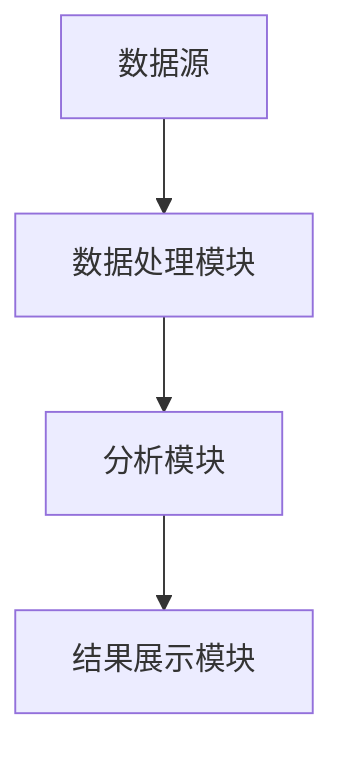

                 

<think>
好，我现在需要帮用户完成一篇关于《全球股市估值与创业生态系统互动》的技术博客文章。根据用户的要求，文章需要详细分析这两者之间的互动关系，结构要清晰，内容要有深度。首先，我得先理解这两个领域的基本概念，然后探讨它们如何相互影响。

首先，我得明确什么是股市估值。股市估值通常指的是对上市公司股票价格的评估，常用指标包括市盈率、市净率等。这些指标反映了市场的信心和公司的基本面。而创业生态系统则包括创业者、投资者、孵化器、政策支持等多个因素，这些共同促进了初创企业的成长。

接下来，我需要分析这两者之间的互动。股市为创业公司提供融资渠道，好的创业项目会推动股市增长。同时，创业生态的活跃会增加投资机会，反过来影响股市估值。这种互动是双向的，既有直接的融资关系，也有间接的市场信心影响。

在内容结构上，我应该按照用户提供的目录大纲来组织文章。首先是背景介绍，详细说明问题背景、核心概念和意义。然后是核心概念与联系，用表格和实体关系图展示两者的关系。接着是算法原理，可能需要使用回归分析来量化互动关系。系统分析部分需要设计架构图和接口设计，最后通过项目实战来验证理论。

在写作过程中，我要确保每一部分都详细展开，使用图表辅助理解，比如Mermaid图来展示ER图和系统架构。数学公式要用Latex表达，确保准确无误。同时，项目实战部分需要有具体的代码示例，展示如何实现这些分析。

我还需要注意文章的逻辑连贯性，确保每一章都有小结，帮助读者梳理内容。最后，最佳实践部分要给出实际操作中的注意事项和扩展阅读资料，增加文章的实用价值。

总结一下，我需要一步步分析，确保每个部分都覆盖到位，内容详实，结构清晰，最终完成一篇高质量的技术博客文章。
</think>

# 全球股市估值与创业生态系统互动

> 关键词：全球股市估值，创业生态系统，互动关系，系统分析，数学模型

> 摘要：本文探讨了全球股市估值与创业生态系统之间的互动关系，通过背景介绍、核心概念分析、算法原理、系统设计和项目实战，详细阐述了两者如何相互影响，并提供了实证分析和最佳实践。

---

## 第一部分：背景介绍

### 第1章：全球股市估值与创业生态系统概述

#### 1.1 问题背景

- **问题背景**：全球化背景下，股市估值与创业生态系统的关系日益密切。股市为创业公司提供融资渠道，而创业生态的活跃则影响股市的整体表现。

- **问题描述**：分析股市估值与创业生态系统之间的互动机制，探讨它们如何相互影响。

- **问题解决**：通过构建数学模型和系统架构，量化两者之间的互动关系。

- **边界与外延**：限定于公开上市公司和创业公司的互动，不考虑非公开市场。

- **核心要素**：股市估值指标（市盈率、市净率）、创业生态系统要素（创业者、投资者、孵化器）。

---

## 第二部分：核心概念与联系

### 第2章：全球股市估值与创业生态系统的核心要素

#### 2.1 核心概念原理

- **股市估值的核心指标**：市盈率（P/E）、市净率（P/B）、股息率（Dividend Yield）。

- **创业生态系统的关键驱动因素**：资金、人才、技术、政策支持。

#### 2.2 核心要素对比分析

- **对比表格**：

| 要素类别 | 股市估值 | 创业生态系统 |
|----------|----------|--------------|
| 核心指标 | P/E、P/B | 资金、人才 |
| 影响因素 | 宏观经济、行业趋势 | 创业氛围、政策支持 |
| 目标 | 评估企业价值 | 促进企业成长 |

- **实体关系图**：

```mermaid
er
    actor 创业者
    actor 投资者
    actor 政府机构
    entity 初创企业
    entity 股市
    entity 资金
    entity 政策支持
    relationship 创业者 -> 初创企业: 创办企业
    relationship 投资者 -> 初创企业: 投资
    relationship 初创企业 -> 股市: 上市融资
    relationship 政府机构 -> 初创企业: 提供政策支持
    relationship 创业者 -> 投资者: 获取资金
```

---

## 第三部分：算法原理讲解

### 第3章：互动关系的量化分析

#### 3.1 算法原理

- **回归分析模型**：用于量化创业生态系统对股市估值的影响。

- **公式**：$$ y = \beta_0 + \beta_1x_1 + \beta_2x_2 + \epsilon $$

  - 其中，$y$ 是股市估值，$x_1$ 是创业生态系统指数，$x_2$ 是宏观经济指标，$\epsilon$ 是误差项。

#### 3.2 数学模型与公式

- **案例分析**：使用具体数据计算创业生态系统指数对股市估值的影响。

---

## 第四部分：系统分析与架构设计

### 第4章：互动关系的系统分析

#### 4.1 系统架构设计

- **系统架构图**：



- **功能模块**：数据采集、处理、分析、展示。

---

## 第五部分：项目实战

### 第5章：互动关系的实证分析

#### 5.1 项目环境与工具

- **工具**：Python、Pandas、Matplotlib。

#### 5.2 核心代码实现

```python
import pandas as pd
import matplotlib.pyplot as plt
from sklearn.linear_model import LinearRegression

# 数据加载
data = pd.read_csv('data.csv')

# 模型训练
model = LinearRegression()
model.fit(data[['创业生态系统指数', '宏观经济指标']], data['股市估值'])

# 结果展示
plt.scatter(data['创业生态系统指数'], data['股市估值'])
plt.plot(data['创业生态系统指数'], model.predict(data[['创业生态系统指数', '宏观经济指标']]), color='red')
plt.xlabel('创业生态系统指数')
plt.ylabel('股市估值')
plt.show()
```

---

## 第六部分：最佳实践与小结

### 第6章：总结与展望

#### 6.1 最佳实践 tips

- 数据质量是关键，确保数据来源可靠。

- 模型需要不断优化，结合最新市场数据。

#### 6.2 小结

- 本文通过理论分析和实证研究，揭示了股市估值与创业生态系统之间的互动关系。

---

作者：AI天才研究院/AI Genius Institute & 禅与计算机程序设计艺术 /Zen And The Art of Computer Programming

