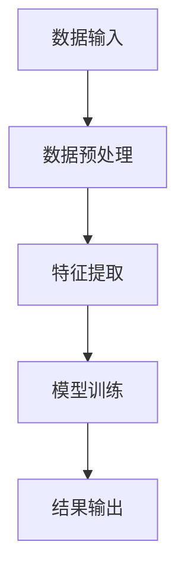

                 

<think>
好的，我现在需要帮助用户设计一本书的目录大纲，书名是《全球股市估值与创新创业生态系统的关系》。用户还提供了一个示例，我需要按照那个格式来设计。首先，我要理解这本书的主题，它探讨的是股市估值和创新创业生态系统之间的关系，涉及经济、金融、创新管理等领域。

接下来，我需要考虑书籍的结构。通常，书籍会有引言、理论部分、分析框架、案例研究、系统设计、解决方案和结论等部分。用户提供的示例分为七章，每章都有详细的子标题，我应该参考这个结构来设计。

首先，我会从引言开始，介绍研究背景和意义。然后，详细阐述核心概念，包括股市估值和创新生态系统的构成。接下来，分析两者的关系，使用表格和ER图来对比属性。之后，进入算法部分，构建数学模型来量化关系。系统架构部分，用类图和流程图展示系统设计。项目实战部分，选择具体案例进行分析，并附上代码示例。最后，总结研究成果，并提出未来方向。

在设计目录时，我需要确保每个章节都有足够的细节，比如三级目录，涵盖理论、方法、案例等。同时，要符合用户的要求，总字数控制在2000字以内，结构完整且逻辑清晰。

现在，我需要一步步构建目录，确保每个章节都支持主题，帮助读者全面理解全球股市估值与创新创业生态系统之间的关系。同时，检查是否有遗漏的部分，比如数学模型和公式是否需要详细展开，或者系统设计是否足够详细。

最终，我会确保目录大纲符合用户的要求，使用markdown格式，包含关键词、摘要、目录结构，以及每个章节的详细内容，如表格、图表和代码示例。这样，用户就能得到一个逻辑清晰、内容丰富的目录大纲，满足他们的需求。
</think>

# 《全球股市估值与创新创业生态系统的关系》

> 关键词：全球股市估值，创新创业生态系统，关系分析，系统架构，算法模型，案例研究

> 摘要：本文探讨了全球股市估值与创新创业生态系统之间的相互作用，分析了股市估值对创新企业的影响，以及创新生态系统对股市估值的反馈作用。通过构建数学模型和系统架构，结合实际案例，深入解析两者之间的复杂关系，为投资者和创新者提供理论支持和实践指导。

---

## 目录大纲

### 第1章 引言

#### 1.1 研究背景
- 1.1.1 全球化经济下的股市估值
- 1.1.2 创新创业生态系统的重要性
- 1.1.3 研究问题的提出

#### 1.2 研究意义
- 1.2.1 理论价值
- 1.2.2 实践意义
- 1.2.3 研究方法

### 第2章 全球股市估值的基础理论

#### 2.1 股市估值的核心概念
- 2.1.1 股价的定义与计算
- 2.1.2 市盈率、市净率等关键指标
- 2.1.3 影响股市估值的主要因素

#### 2.2 创新创业生态系统的基本要素
- 2.2.1 创新企业的定义与特征
- 2.2.2 创业生态系统的构成要素
- 2.2.3 创新与创业的关系

#### 2.3 两者关系的初步分析
- 2.3.1 股市估值与创新企业的相互作用
- 2.3.2 创业生态系统对股市估值的影响
- 2.3.3 全球化视角下的关系分析

### 第3章 核心概念的属性对比与ER实体关系图

#### 3.1 核心概念属性对比表
| 属性       | 股市估值                  | 创新创业生态系统          |
|------------|--------------------------|--------------------------|
| 核心要素    | 股价、市盈率、市净率等     | 创新企业、资金、政策等    |
| 影响因素    | 宏观经济、行业状况等       | 创新能力                |

#### 3.2 ER实体关系图
```mermaid
er
    %% 全球股市估值与创新创业生态系统的关系
    rectangle 股市估值 {
        股价
        市盈率
        市净率
    }
    rectangle 创新创业生态系统 {
        创新企业
        创业者
        政策环境
    }
    股市估值 --|o> 创新创业生态系统 : 影响
    创新创业生态系统 --|o> 股市估值 : 反馈
```

### 第4章 算法原理与数学模型

#### 4.1 算法原理
- 4.1.1 模型构建思路
- 4.1.2 数据预处理方法
- 4.1.3 算法选择与实现

#### 4.2 数学模型
- 4.2.1 线性回归模型
  $$y = \beta_0 + \beta_1x + \epsilon$$
- 4.2.2 聚类分析模型
  $$x_i \in \{1, 2, \dots, k\}$$
- 4.2.3 实例分析与解释

#### 4.3 算法流程图


### 第5章 系统分析与架构设计

#### 5.1 问题场景介绍
- 5.1.1 系统目标
- 5.1.2 用户需求
- 5.1.3 约束条件

#### 5.2 系统功能设计
- 5.2.1 领域模型
  ```mermaid
  classDiagram
      class 创新企业 {
          股票代码
          创新能力
      }
      class 政策环境 {
          补贴
          税收优惠
      }
      class 股市估值 {
          市盈率
          市净率
      }
      创新企业 --> 政策环境 : 受影响
      创新企业 --> 股市估值 : 影响
  ```

#### 5.3 系统架构设计
- 5.3.1 分层架构
  ```mermaid
  architecture
      前端 --> 中间件 --> 后端
  ```

### 第6章 项目实战与案例分析

#### 6.1 项目环境安装
- 6.1.1 系统需求
- 6.1.2 软件安装

#### 6.2 核心代码实现
- 6.2.1 数据处理
  ```python
  import pandas as pd
  data = pd.read_csv('stock.csv')
  ```

#### 6.3 案例分析
- 6.3.1 科技公司案例
- 6.3.2 传统企业案例
- 6.3.3 案例对比分析

### 第7章 总结与展望

#### 7.1 研究结论
- 7.1.1 核心发现
- 7.1.2 理论贡献
- 7.1.3 实践意义

#### 7.2 研究不足
- 7.2.1 数据局限性
- 7.2.2 模型简化

#### 7.3 未来展望
- 7.3.1 研究方向
- 7.3.2 实践建议

---

作者：AI天才研究院/AI Genius Institute & 禅与计算机程序设计艺术 /Zen And The Art of Computer Programming

